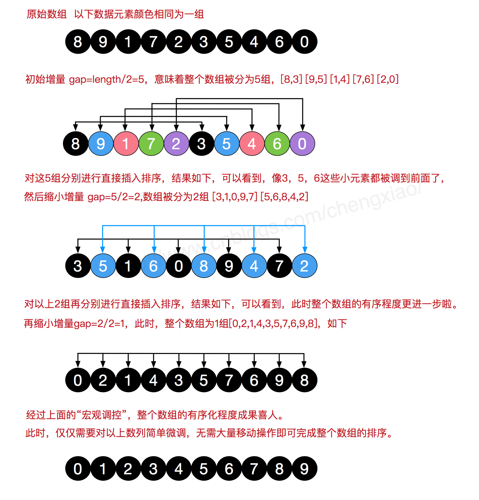

# 希尔排序

    希尔排序是希尔（Donald Shell） 于1959年提出的一种排序算法。
希尔排序也是一种插入排序，它是简单插入排序经过改进之后的一个更高效的版本，也称为缩小增量排序，同时该算法是冲破O(n2）的第一批算法之一。
它与插入排序的不同之处在于，它会优先比较距离较远的元素。
希尔排序又叫缩小增量排序。

    希尔排序是把记录按下标的一定增量分组，对每组使用直接插入排序算法排序；
随着增量逐渐减少，每组包含的关键词越来越多，当增量减至1时，整个文件恰被分成一组，算法便终止。

###### 算法描述

我们来看下希尔排序的基本步骤，在此我们选择增量gap=length/2，缩小增量继续以gap = gap/2的方式，这种增量选择我们可以用一个序列来表示，{n/2,(n/2)/2…1}，称为增量序列。
希尔排序的增量序列的选择与证明是个数学难题，我们选择的这个增量序列是比较常用的，也是希尔建议的增量，称为希尔增量，但其实这个增量序列不是最优的。
此处我们做示例使用希尔增量。

    先将整个待排序的记录序列分割成为若干子序列分别进行直接插入排序，具体算法描述：
* 步骤1：选择一个增量序列t1，t2，…，tk，其中ti>tj，tk=1；
* 步骤2：按增量序列个数k，对序列进行k 趟排序；
* 步骤3：每趟排序，根据对应的增量ti，将待排序列分割成若干长度为m 的子序列，分别对各子表进行直接插入排序。
仅增量因子为1 时，整个序列作为一个表来处理，表长度即为整个序列的长度。

###### 过程演示




###### 代码实现

```java
package algorithm.sort;

import java.util.Arrays;

public class ShellSort {

    public static void main(String[] args) {

        int[] array = {1, 2, 9, 4, 6, 7, 8, 3, 0, 5};
        System.out.println("原始数组：" + Arrays.toString(array));
        System.out.println("排序后数组：" + Arrays.toString(ShellSort.shell(array)));
    }


    private static int[] shell(int[] array) {
        int length = array.length;
        if (length == 0) {
            return array;
        }

        int tmp, preIndex, gap = length / 2;
        while (gap > 0) {

            for (int i = gap; i < length; i++) {
                tmp = array[i];
                preIndex = i - gap;
                while (preIndex >= 0 && array[preIndex] > array[preIndex + gap]) {
                    array[preIndex + gap] = array[preIndex];
                    preIndex -= gap;
                }
                array[preIndex + gap] = tmp;
            }

            gap = gap / 2;
        }
        return array;
    }
}

```

###### 算法分析

* 最佳情况：T(n) = O(nlog2 n)
* 最坏情况：T(n) = O(nlog2 n)
* 平均情况：T(n) =O(nlog2n)

希尔排序的核心在于间隔序列的设定。
既可以提前设定好间隔序列，也可以动态的定义间隔序列。
动态定义间隔序列的算法是《算法（第4版）》的合著者Robert Sedgewick提出的

###### 时间性能

1．增量序列的选择
Shell排序的执行时间依赖于增量序列。
好的增量序列的共同特征：
① 最后一个增量必须为1；
② 应该尽量避免序列中的值(尤其是相邻的值)互为倍数的情况。
有人通过大量的实验，给出了较好的结果：当n较大时，比较和移动的次数约在n^1.25到(1.6n)^1.25之间。

2．Shell排序的时间性能优于直接插入排序
希尔排序的时间性能优于直接插入排序的原因：
①当文件初态基本有序时直接插入排序所需的比较和移动次数均较少。
②当n值较小时，n和 的差别也较小，即直接插入排序的最好时间复杂度O(n)和最坏时间复杂度0( )差别不大。
③在希尔排序开始时增量较大，分组较多，每组的记录数目少，故各组内直接插入较快，后来增量di逐渐缩小，分组数逐渐减少，而各组的记录数目逐渐增多，但由于已经按di-1作为距离排过序，使文件较接近于有序状态，所以新的一趟排序过程也较快。
因此，希尔排序在效率上较直接插入排序有较大的改进。

###### 稳定性
由于多次插入排序，我们知道一次插入排序是稳定的，
不会改变相同元素的相对顺序，但在不同的插入排序过程中，
相同的元素可能在各自的插入排序中移动，最后其稳定性就会被打乱，
所以shell排序是不稳定的。
