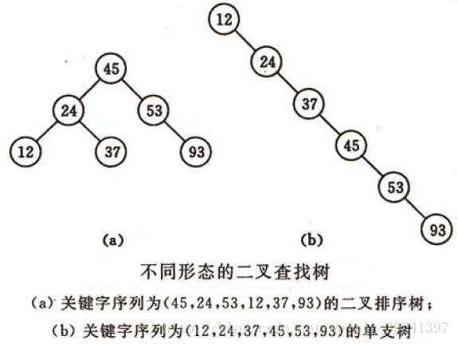
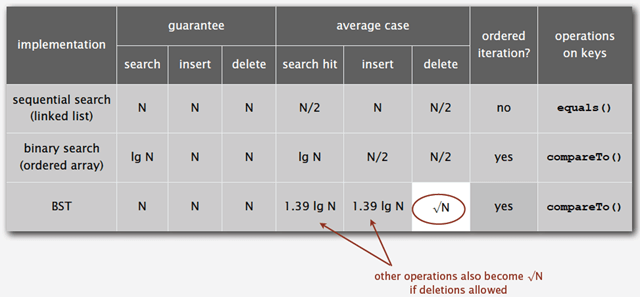
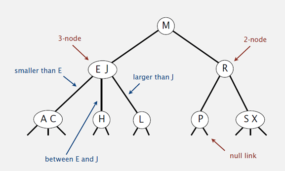
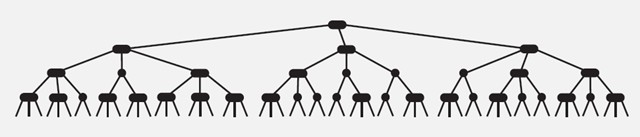

# 树表查找

最简单的树表查找算法——二叉树查找算法。

### 基本思想

二叉查找树是先对待查找的数据进行生成树，确保树的左分支的值小于右分支的值，
然后在就行和每个节点的父节点比较大小，查找最适合的范围。
这个算法的查找效率很高，但是如果使用这种查找方法要首先创建树。 

### 二叉查找树

BinarySearch Tree，也叫二叉搜索树，或称二叉排序树Binary Sort Tree。
或者是一棵空树，或者是具有下列性质的二叉树：

1. 若任意节点的左子树不空，则左子树上所有结点的值均小于它的根结点的值；
2. 若任意节点的右子树不空，则右子树上所有结点的值均大于它的根结点的值；
3. 任意节点的左、右子树也分别为二叉查找树。

### 二叉查找树性质

对二叉查找树进行中序遍历，即可得到有序的数列。

不同形态的二叉查找树如下图所示：

### 复杂度分析

它和二分查找一样，插入和查找的时间复杂度均为O(logn)，
但是在最坏的情况下仍然会有O(n)的时间复杂度。
原因在于插入和删除元素的时候，
树没有保持平衡（比如，我们查找上图（b）中的“93”，我们需要进行n次查找操作）。
我们追求的是在最坏的情况下仍然有较好的时间复杂度，
这就是平衡查找树设计的初衷。

下图为二叉树查找和顺序查找以及二分查找性能的对比图：

基于二叉查找树进行优化，进而可以得到其他的树表查找算法，如平衡树、红黑树等高效算法

### 平衡查找树之2-3查找树（2-3 Tree）

##### 2-3查找树定义

和二叉树不一样，2-3树运行每个节点保存1个或者两个的值。
对于普通的2节点(2-node)，他保存1个key和左右两个自己点。
对应3节点(3-node)，保存两个Key，2-3查找树的定义如下：

1. 要么为空
2. 对于2节点，该节点保存一个key及对应value，以及两个指向左右节点的节点，左节点也是一个2-3节点，所有的值都比key要小，右节点也是一个2-3节点，所有的值比key要大。
3. 对于3节点，该节点保存两个key及对应value，以及三个指向左中右的节点。左节点也是一个2-3节点，所有的值均比两个key中的最小的key还要小；中间节点也是一个2-3节点，
中间节点的key值在两个跟节点key值之间；右节点也是一个2-3节点，节点的所有key值比两个key中的最大的key还要大。

##### 2-3查找树的性质

1. 如果中序遍历2-3查找树，就可以得到排好序的序列；
2. 在一个完全平衡的2-3查找树中，根节点到每一个为空节点的距离都相同。（这也是平衡树中“平衡”一词的概念，根节点到叶节点的最长距离对应于查找算法的最坏情况，而平衡树中根节点到叶节点的距离都一样，最坏情况也具有对数复杂度。）

##### 复杂度分析

2-3树的查找效率与树的高度是息息相关的。

* 在最坏的情况下，也就是所有的节点都是2-node节点，查找效率为lgN
* 在最好的情况下，所有的节点都是3-node节点，查找效率为log3N约等于0.631lgN

距离来说，对于1百万个节点的2-3树，树的高度为12-20之间，对于10亿个节点的2-3树，树的高度为18-30之间。

对于插入来说，只需要常数次操作即可完成，因为他只需要修改与该节点关联的节点即可，不需要检查其他节点，所以效率和查找类似。

##### 下面是2-3查找树的效率

### 平衡查找树之红黑树（Red-Black Tree）

2-3查找树能保证在插入元素之后能保持树的平衡状态，最坏情况下即所有的子节点都是2-node，树的高度为lgn，从而保证了最坏情况下的时间复杂度。但是2-3树实现起来比较复杂，于是就有了一种简单实现2-3树的数据结构，即红黑树（Red-Black Tree）。

##### 基本思想

红黑树的思想就是对2-3查找树进行编码，
尤其是对2-3查找树中的3-nodes节点添加额外的信息。
红黑树中将节点之间的链接分为两种不同类型，红色链接，
他用来链接两个2-nodes节点来表示一个3-nodes节点。
黑色链接用来链接普通的2-3节点。特别的，
使用红色链接的两个2-nodes来表示一个3-nodes节点，并且向左倾斜，
即一个2-node是另一个2-node的左子节点。
这种做法的好处是查找的时候不用做任何修改，
和普通的二叉查找树相同。

下图是红黑树在各种情况下的时间复杂度，可以看出红黑树是2-3查找树的一种实现，它能保证最坏情况下仍然具有对数的时间复杂度。

### B树和B+树（B Tree/B+ Tree）

平衡查找树中的2-3树以及其实现红黑树。
2-3树种，一个节点最多有2个key，而红黑树则使用染色的方式来标识这两个key。

维基百科对B树的定义为“在计算机科学中，B树（B-tree）是一种树状数据结构，
它能够存储数据、对其进行排序并允许以O(log n)的时间复杂度运行进行查找、顺序读取、插入和删除的数据结构。
B树，概括来说是一个节点可以拥有多于2个子节点的二叉查找树。
与自平衡二叉查找树不同，B树为系统最优化大块数据的读和写操作。
B-tree算法减少定位记录时所经历的中间过程，从而加快存取速度。
普遍运用在数据库和文件系统。

### 树表查找总结

二叉查找树平均查找性能不错，为O(logn)，但是最坏情况会退化为O(n)。在二叉查找树的基础上进行优化，我们可以使用平衡查找树。平衡查找树中的2-3查找树，这种数据结构在插入之后能够进行自平衡操作，从而保证了树的高度在一定的范围内进而能够保证最坏情况下的时间复杂度。但是2-3查找树实现起来比较困难，红黑树是2-3树的一种简单高效的实现，他巧妙地使用颜色标记来替代2-3树中比较难处理的3-node节点问题。红黑树是一种比较高效的平衡查找树，应用非常广泛，很多编程语言的内部实现都或多或少的采用了红黑树。

除此之外，2-3查找树的另一个扩展——B/B+平衡树，在文件系统和数据库系统中有着广泛的应用。
