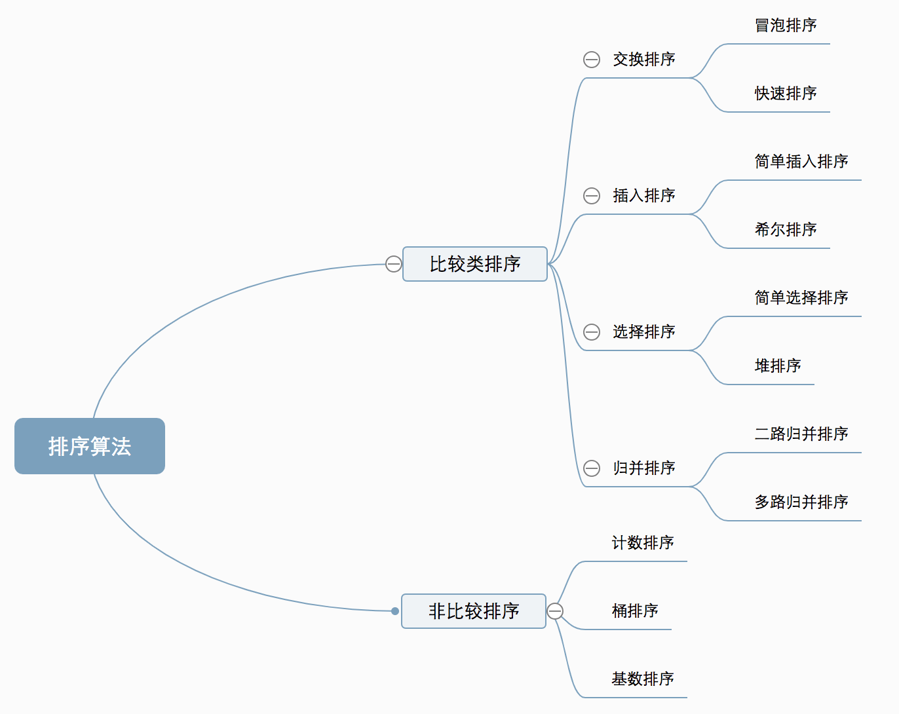
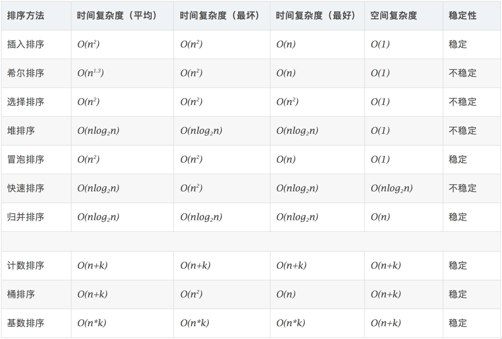
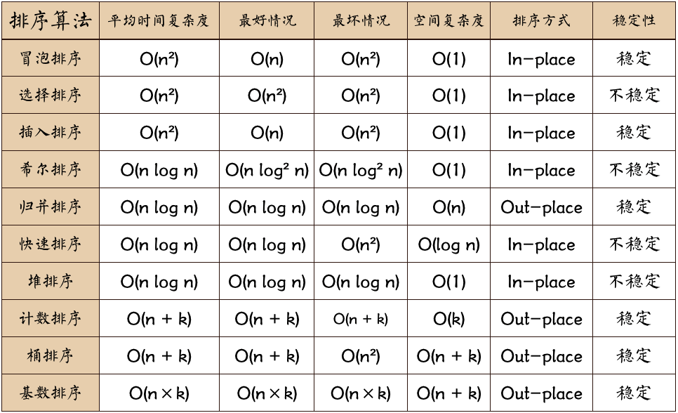

# 十大经典排序算法

#### 排序的定义

对一序列对象根据某个关键字进行排序。

###### 术语说明
* 稳定 ：如果a原本在b前面，而a=b，排序之后a仍然在b的前面；
* 不稳定 ：如果a原本在b的前面，而a=b，排序之后a可能会出现在b的后面；
* 内排序 ：所有排序操作都在内存中完成；
* 外排序 ：由于数据太大，因此把数据放在磁盘中，而排序通过磁盘和内存的数据传输才能进行；
* 时间复杂度 ： 一个算法执行所耗费的时间。
* 空间复杂度 ：运行完一个程序所需内存的大小。

#### 排序算法分类

十种常见排序算法可以分为两大类：

* 比较类排序：通过比较来决定元素间的相对次序，
由于其时间复杂度不能突破O(nlogn)，
因此也称为非线性时间比较类排序。
* 非比较类排序：不通过比较来决定元素间的相对次序，
它可以突破基于比较排序的时间下界，以线性时间运行，
因此也称为线性时间非比较类排序。 

#### 算法复杂度

###### 图片名词解释：
* n: 数据规模
* k: “桶”的个数
* In-place: 占用常数内存，不占用额外内存
* Out-place: 占用额外内存

###### 比较和非比较的区别

 常见的快速排序、归并排序、堆排序、冒泡排序 等属于比较排序 。在排序的最终结果里，元素之间的次序依赖于它们之间的比较。每个数都必须和其他数进行比较，才能确定自己的位置 。

    在冒泡排序之类的排序中，问题规模为n，又因为需要比较n次，所以平均时间复杂度为O(n²)。在归并排序、快速排序之类的排序中，问题规模通过分治法消减为logN次，所以时间复杂度平均O(nlogn)。

    比较排序的优势是，适用于各种规模的数据，也不在乎数据的分布，都能进行排序。可以说，比较排序适用于一切需要排序的情况。

    计数排序、基数排序、桶排序则属于非比较排序 。非比较排序是通过确定每个元素之前，应该有多少个元素来排序。针对数组arr，计算arr[i]之前有多少个元素，则唯一确定了arr[i]在排序后数组中的位置 。

    非比较排序只要确定每个元素之前的已有的元素个数即可，所有一次遍历即可解决。算法时间复杂度O(n)。

    非比较排序时间复杂度底，但由于非比较排序需要占用空间来确定唯一位置。所以对数据规模和数据分布有一定的要求。

