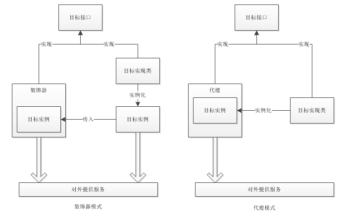

# 代理模式和装饰器模式对比

装饰器模式作用是针对目标方法进行增强，提供新的功能或者额外的功能。

不同于适配器模式和桥接模式，装饰器模式涉及的是单方，和代理模式相同，而且目标必须是抽象的。

而实际上，**装饰器模式和代理模式的实现方式基本一致，只在目标的存在上有些差别**。


### 我们需要从概念上了解代理和装饰的区别

* 代理是全权代理，目标根本不对外，全部由代理类来完成。
* 装饰是增强，是辅助，目标仍然可以自行对外提供服务，装饰器只起增强作用。

上面两点提现到代码实现中是这样的

###### 代理模式

```java
public class Proxy implements House {
    private House house;
    public Proxy(){
        this.house = new DonghaoHouse();
    }
    @Override
    public void output() {
        System.out.println("这是针对目标的前段增强");
        house.output();
        System.out.println("这是针对目标的后段增强");
    }
}
```

###### 装饰模式

```java
public class Decorator implements House {
    private House house;
    public Decorator(House house){
        this.house = house;
    }
    @Override
    public void output() {
        System.out.println("这是针对房子的前段装饰增强");
        house.output();
        System.out.println("这是针对房子的后段装饰增强");
    }
}
```

看出来了吗，装饰器中持有的目标实例是从构造器传入的，
而代理中持有的目标实例是自己创建的。

那么这里又出现一个区别，代理模式和装饰器模式虽然都依赖于目标接口，
但是代理针对的目标实现类是固定的，
而装饰器模式可以随意指定，也就是说目标是可以自有扩展的。

我们要明白代理模式和装饰器模式的区别，区分二者的使用场景，如下图：


