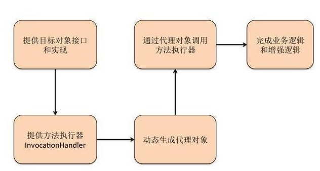

# JDK 动态代理

动态代理可以很方便地对委托类的相关方法进行统一增强处理，如添加方法调用次数、添加日志功能等等。

动态代理主要分为JDK动态代理和cglib动态代理两大类，本文主要对JDK动态代理进行探讨

## 代理模式(静态代理)

开篇来个链接 [代理模式](../Chapter04/Proxy.md) , [装饰器模式](../Chapter04/Decorato.md), [代理模式和装饰器模式对比](../Chapter04/ProxyDecorato.md)

## JDK 动态代理

与静态代理类对照的是动态代理类，动态代理类的字节码在程序运行时由Java反射机制动态生成，无需程序员手工编写它的源代码。
动态代理类不仅简化了编程工作，而且提高了软件系统的可扩展性，因为Java 反射机制可以生成任意类型的动态代理类。 
java.lang.reflect 包中的Proxy类和 InvocationHandler 接口提供了生成动态代理类的能力。




1. 实现动态代理的关键技术是反射；
2. 代理对象是对目标对象的增强，以便对消息进行预处理和后处理；
3. InvocationHandler中的invoke()方法是代理类完整逻辑的集中体现，包括要切入的增强逻辑和进行反射执行的真实业务逻辑；
4. 使用JDK动态代理机制为某一真实业务对象生成代理，只需要指定目标接口、目标接口的类加载器以及具体的InvocationHandler即可。
5. JDK动态代理的典型应用包括但不仅限于AOP、RPC、Struts2、Spring等重要经典框架。


## JDK动态代理到底是怎么实现的呢

动态代码涉及了一个非常重要的类 Proxy 。正是通过 Proxy 的静态方法 newProxyInstance才会动态创建代理。具体怎么去创建代理类就不分析了,感兴趣的可以去看下源码。我们直接看下生成的代理类。 如何查看生成的代理类？ 在生成代理类之前加上以下代码(我用的jdk1.8)：

```java
//新版本 jdk产生代理类   
 System.getProperties().put("jdk.proxy.ProxyGenerator.saveGeneratedFiles", "true");
```

如果上述代码加上不生效可以考虑加下下面的代码：
```java
// 老版本jdk
System.getProperties().put("sun.misc.ProxyGenerator.saveGeneratedFiles", "true");
//  该设置用于输出cglib动态代理产生的类
System.setProperty(DebuggingClassWriter.DEBUG_LOCATION_PROPERTY, "C:\\class"); 
```

代码如下：
```java

```

```java

```
## 写在最后

JDK动态代理实际上是在运行时通过反射的方式来实现的，将代理的方法调用转到到目标对象上，最终将目标对象生成的任何结果返回给调用方。由于这是个链式调用，所以很方便代理在目标对象方法调用前后增加处理逻辑。根据这种思路可以在多种设计模式中使用JDK的动态代理比如代理模式、Facade、Decorator等。

在面向方面编程(AOP)也应用广泛，如事务管理、日志记录、数据校验等，主要是将横切关注点从业务逻辑中分离出来，所以一通百通。

> 补充一点，由于JDK的不断优化，到JDK8的时候JDK的动态代理不比CGLIB效率低，大家可以做些实验。
