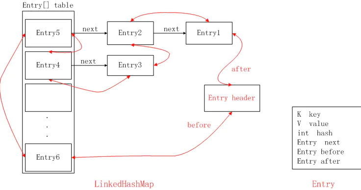

# LinkedHashMap原理

先来一张LinkedHashMap的结构图，不要虚，看完文章再来看这个图，就秒懂了，先混个面熟：



## 应用场景

HashMap是无序的，当我们希望有顺序地去存储key-value时，就需要使用LinkedHashMap了。

```
        Map<String, String> hashMap = new HashMap<String, String>();
        hashMap.put("name1", "josan1");
        hashMap.put("name2", "josan2");
        hashMap.put("name3", "josan3");
        Set<Entry<String, String>> set = hashMap.entrySet();
        Iterator<Entry<String, String>> iterator = set.iterator();
        while(iterator.hasNext()) {
            Entry entry = iterator.next();
            String key = (String) entry.getKey();
            String value = (String) entry.getValue();
            System.out.println("key:" + key + ",value:" + value);
        }
```

> key:name3,value:josan3<br>
> key:name2,value:josan2<br>
> key:name1,value:josan1<br>


输出结果并不是按照插入顺序的。

同样的数据，我们再试试LinkedHashMap

```
Map<String, String> linkedHashMap = new LinkedHashMap<>();
        linkedHashMap.put("name2", "josan2");
        linkedHashMap.put("name1", "josan1");
        linkedHashMap.put("name3", "josan3");
        Set<Map.Entry<String, String>> set1 = linkedHashMap.entrySet();
        Iterator<Map.Entry<String, String>> iterator1 = set1.iterator();
        while(iterator1.hasNext()) {
            Map.Entry entry = iterator1.next();
            String key = (String) entry.getKey();
            String value = (String) entry.getValue();
            System.out.println("key:" + key + ",value:" + value);
        }
```

> key:name2,value:josan2<br>
  key:name1,value:josan1<br>
  key:name3,value:josan3<br>

结果可知，LinkedHashMap是有序的，且默认为插入顺序。

## 定义

LinkedHashMap继承了HashMap，所以它们有很多相似的地方。

```
public class LinkedHashMap<K,V>
    extends HashMap<K,V>
    implements Map<K,V>
{
```
## 构造方法

LinkedHashMap提供了多个构造方法，我们先看空参的构造方法。

```
    public LinkedHashMap() {
        // 调用HashMap的构造方法，其实就是初始化Entry[] table
        super();
        // 这里是指是否基于访问排序，默认为false
        accessOrder = false;
    }
```

首先使用super调用了父类HashMap的构造方法，其实就是根据初始容量、负载因子去初始化Entry[] table。

然后把accessOrder设置为false，这就跟存储的顺序有关了，LinkedHashMap存储数据是有序的，而且分为两种：插入顺序和访问顺序。

这里accessOrder设置为false，表示不是访问顺序而是插入顺序存储的，这也是默认值，表示LinkedHashMap中存储的顺序是按照调用put方法插入的顺序进行排序的。LinkedHashMap也提供了可以设置accessOrder的构造方法，我们来看看这种模式下，它的顺序有什么特点？

```
        Map<String, String> linkedHashMap = new LinkedHashMap<>(10, 1, true);
        linkedHashMap.put("name2", "josan2");
        linkedHashMap.put("name1", "josan1");
        linkedHashMap.put("name3", "josan3");
        Set<Map.Entry<String, String>> set1 = linkedHashMap.entrySet();
        Iterator<Map.Entry<String, String>> iterator1 = set1.iterator();
        while(iterator1.hasNext()) {
            Map.Entry entry = iterator1.next();
            String key = (String) entry.getKey();
            String value = (String) entry.getValue();
            System.out.println("key:" + key + ",value:" + value);
        }

        System.out.println(">>>>>>>>>>>>>>");
        linkedHashMap.get("name1");
        //System.out.println("通过get方法，导致key为name1对应的Entry到表尾");

        Set<Map.Entry<String, String>> set2 = linkedHashMap.entrySet();
        Iterator<Map.Entry<String, String>> iterator2 = set2.iterator();
        while(iterator2.hasNext()) {
            Map.Entry entry = iterator2.next();
            String key = (String) entry.getKey();
            String value = (String) entry.getValue();
            System.out.println("key:" + key + ",value:" + value);
        }
```

> key:name2,value:josan2<br>
  key:name1,value:josan1<br>
  key:name3,value:josan3<br>

> key:name2,value:josan2<br>
  key:name3,value:josan3<br>
  key:name1,value:josan1<br>

因为调用了get("name1")导致了name1对应的Entry移动到了最后，这里只要知道LinkedHashMap有插入顺序和访问顺序两种就可以，后面会详细讲原理。

我们知道1.8之后，map的初始化是在put里做的

```
    final V putVal(int hash, K key, V value, boolean onlyIfAbsent,
                   boolean evict) {
        Node<K,V>[] tab; Node<K,V> p; int n, i;
        if ((tab = table) == null || (n = tab.length) == 0)
            n = (tab = resize()).length;
        if ((p = tab[i = (n - 1) & hash]) == null)
            tab[i] = newNode(hash, key, value, null);
        else {
            Node<K,V> e; K k;
            if (p.hash == hash &&
                ((k = p.key) == key || (key != null && key.equals(k))))
                e = p;
            else if (p instanceof TreeNode)
                e = ((TreeNode<K,V>)p).putTreeVal(this, tab, hash, key, value);
            else {
                for (int binCount = 0; ; ++binCount) {
                    if ((e = p.next) == null) {
                        p.next = newNode(hash, key, value, null);
                        if (binCount >= TREEIFY_THRESHOLD - 1) // -1 for 1st
                            treeifyBin(tab, hash);
                        break;
                    }
                    if (e.hash == hash &&
                        ((k = e.key) == key || (key != null && key.equals(k))))
                        break;
                    p = e;
                }
            }
            if (e != null) { // existing mapping for key
                V oldValue = e.value;
                if (!onlyIfAbsent || oldValue == null)
                    e.value = value;
                afterNodeAccess(e);
                return oldValue;
            }
        }
        ++modCount;
        if (++size > threshold)
            resize();
        afterNodeInsertion(evict);
        return null;
    }
```

其中HashMap中有三个方法，被LinkedHashMap重写

```
    // Callbacks to allow LinkedHashMap post-actions
    void afterNodeAccess(Node<K,V> p) { }
    void afterNodeInsertion(boolean evict) { }
    void afterNodeRemoval(Node<K,V> p) { }
```

```
    void afterNodeAccess(Node<K,V> e) { // move node to last
        LinkedHashMap.Entry<K,V> last;
        if (accessOrder && (last = tail) != e) {
            LinkedHashMap.Entry<K,V> p =
                (LinkedHashMap.Entry<K,V>)e, b = p.before, a = p.after;
            p.after = null;
            if (b == null)
                head = a;
            else
                b.after = a;
            if (a != null)
                a.before = b;
            else
                last = b;
            if (last == null)
                head = p;
            else {
                p.before = last;
                last.after = p;
            }
            tail = p;
            ++modCount;
        }
    }
```