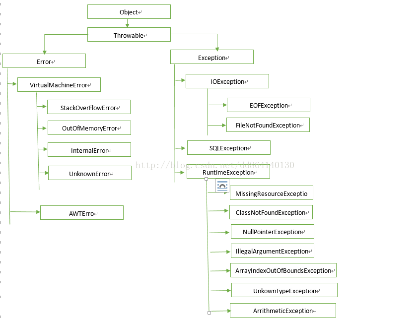

# 深入理解Java中异常体系

## 异常体系简介

异常是指由于各种不期而至的情况，导致程序中断运行的一种指令流,如：文件找不到、非法参数、网络超时等。为了保证正序正常运行，
在设计程序时必须考虑到各种异常情况，并正确的对异常进行处理。异常也是一种对象，java当中定义了许多异常类，
并且定义了基类java.lang.Throwable作为所有异常的超类。Java语言设计者将异常划分为两类：Error和Exception，其体系结构大致如下图所示：

Throwable：有两个重要的子类：Exception（异常）和Error（错误），两者都包含了大量的异常处理类。

#### Error（错误）

是程序中无法处理的错误，表示运行应用程序中出现了严重的错误。此类错误一般表示代码运行时JVM出现问题。通常有Virtual MachineError（虚拟机运行错误）、NoClassDefFoundError（类定义错误）等。比如说当jvm耗完可用内存时，将出现OutOfMemoryError。此类错误发生时，JVM将终止线程。

这些错误是不可查的，非代码性错误。因此，当此类错误发生时，应用不应该去处理此类错误。

#### Exception（异常）

程序本身可以捕获并且可以处理的异常。

Exception这种异常又分为两类：运行时异常和编译异常。

* 运行时异常(不受检异常)：RuntimeException类极其子类表示JVM在运行期间可能出现的错误。比如说试图使用空值对象的引用（NullPointerException）、数组下标越界（ArrayIndexOutBoundException）。此类异常属于不可查异常，一般是由程序逻辑错误引起的，在程序中可以选择捕获处理，也可以不处理。
* 编译异常(受检异常)：Exception中除RuntimeException极其子类之外的异常。如果程序中出现此类异常，比如说IOException，必须对该异常进行处理，否则编译不通过。在程序中，通常不会自定义该类异常，而是直接使用系统提供的异常类。

可查异常与不可查异常：java的所有异常可以分为可查异常（checked exception）和不可查异常（unchecked exception）。

* 可查异常：编译器要求必须处理的异常。正确的程序在运行过程中，经常容易出现的、符合预期的异常情况。
一旦发生此类异常，就必须采用某种方式进行处理。除RuntimeException及其子类外，其他的Exception异常都属于可查异常。
编译器会检查此类异常，也就是说当编译器检查到应用中的某处可能会此类异常时，将会提示你处理本异常——要么使用try-catch捕获，
要么使用throws语句抛出，否则编译不通过。

* 不可查异常：编译器不会进行检查并且不要求必须处理的异常，也就说当程序中出现此类异常时，即使我们没有try-catch捕获它，
也没有使用throws抛出该异常，编译也会正常通过。该类异常包括运行时异常（RuntimeException极其子类）和错误（Error）。

