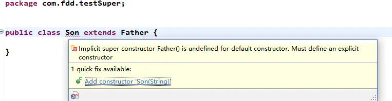
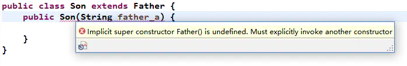
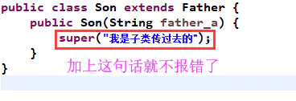

# 深入分析java中的关键字super

### 概念
    
它是一个指代变量，用于在子类中指代父类对象。

### 应用范围

super的三种使用情况：

* 访问父类的方法。
* 调用父类构造方法。
* 访问父类中的隐藏成员变量。

### 使用

##### 访问父类中的方法

第一步：定义father类

```java
public class Father {
    private String father_a;
    public Father() {
        father_a="父亲：曹操";
        System.out.println("我是，"+father_a);
    }
    void dosomething(){
        System.out.println("曹操：挟天子以令诸侯");
    }   
}
```

第二步：定义son类

```java
public class Son extends Father {
    private  String son_a;
    public Son() {
        super();
        son_a="儿子：曹冲";
        System.out.println("我是，"+son_a);
    }
    @Override
    void dosomething() {
        //访问父类中的方法
        super.dosomething();
    }
}
```

第三步：测试一下
```java
public class Test {
    public static void main(String[] args) {
        Son son=new Son();
        son.dosomething();
    }
}
//output：
//我是，父亲：曹操
//我是，儿子：曹冲
//曹操：挟天子以令诸侯
```
我们会发现调用了super.dosomething();就会执行父类的dosomething方法。

##### 重写父类变量

我们还拿上面的例子来说明一下：

第一步：定义父类

```java
public class Father {
    protected String father_a="我是父亲曹操的变量";
    void dosomething(){
        System.out.println("曹操：挟天子以令诸侯");
    }   
}
```

第二步：定义子类
```java
public class Son extends Father {
    private  String son_a="我是儿子曹冲的变量";
    @Override
    void dosomething() {
        //super.father_a可以调用父类的变量（public和protected）
        System.out.println(super.father_a);
        System.out.println(son_a);
    }
}
```
第三步：测试一下
```java
public class Test {
    public static void main(String[] args) {
        Son son=new Son();
        son.dosomething();
    }
}
//output
//我是父亲曹操的变量
//我是儿子曹冲的变量
```
##### 子类构造方法调用

第一步：定义父类

```java
public class Father {
    protected String father_a="我是父亲曹操的变量";
    //无参构造器
    public Father() {
        System.out.println("无参构造器:"+father_a);
    }
    //有参构造器
    public Father(String father_a) {
        this.father_a = father_a;
        System.out.println("有参构造器:"+father_a);
    }
}
```
第二步：定义子类
```java
public class Son extends Father {
    public Son() {
        //在子类中调用父类构造器
        //第一种：super（执行父类中的无参构造器，默认可以不写）
        //super();
        //第二种：执行父类中的有参构造器，参数写到super中就可以了
        super("子类传给父类的");
        System.out.println("子类的构造方法");
    }
}
```
第三步：测试
```java
public class Test {
    public static void main(String[] args) {
        Son son=new Son();
    }
}
//output
//有参构造器:子类传给父类的
//子类的构造方法
```

从上面我们可以看到，其实是有两种情况

第一种：直接调用super()会执行父类的无参构造方法，可以默认不写。

第二种：使用super(“父类参数”),调用父类有参构造方法，把参数传递进来就好。

这两种情况还是比较简单的，不过还有几种比较特殊的情况需要我们去注意，
网上的大神也都提到了，你可以试着去了解一下。

**注意问题一：父类只有带参构造器（无参构造器没有），子类必须有相同参数的构造方法**

我们还是使用代码去测试一下

首先我们定义一个父类：只有一个带参构造器

```java
public class Father {
    protected String father_a="我是父亲曹操的变量";
    //有参构造器
    public Father(String father_a) {
        this.father_a = father_a;
        System.out.println("有参构造器:"+father_a);
    }
}
```

下面我们看看在子类中，如果什么都没有会出现什么



意思已经很明确了，我们的子类必须要有一个显示的构造方法去匹配父类。

**注意问题二：子类必须有相同参数的构造方法，并且还需要调用super(参数)**

在注意问题一种我们知道，在子类中需要定义一个构造方法去匹配父类构造方法，
现在我们在子类中去定义一下不就解决了嘛，但随之而来由出来了个问题，我们看看。



为什么会出现犯错误呢？其实我们只是定义了Son类的无参构造器，
其默认调用super(),他只是调用了父类的无参构造器，并没有调用有参构造器，
因此需要我们再去调用一下有参的。
我们把son类中的构造方法中加上一句话就好了。


