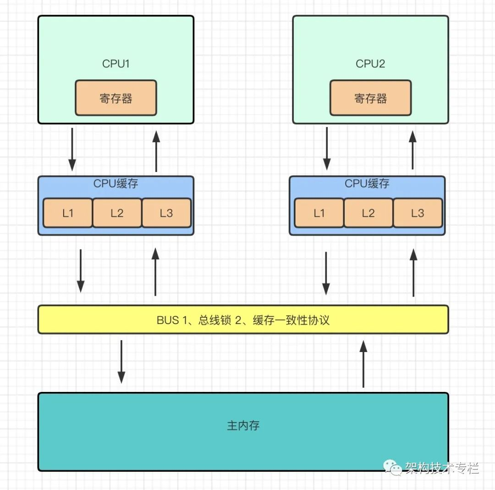

# JVM内存模型

本身随着CPU和内存的发展速度差异的问题，导致CPU的速度远快于内存，所以现在的CPU加入了高速缓存，高速缓存一般可以分为L1、L2、L3三级缓存。
基于上面的例子我们知道了这导致了缓存一致性的问题，所以加入了缓存一致性协议，同时导致了内存可见性的问题，而编译器和CPU的重排序导致了原子性和有序性的问题，JMM内存模型正是对多线程操作下的一系列规范约束，因为不可能让陈雇员的代码去兼容所有的CPU，通过JMM我们才屏蔽了不同硬件和操作系统内存的访问差异，这样保证了Java程序在不同的平台下达到一致的内存访问效果，同时也是保证在高效并发的时候程序能够正确执行。

## 说了半天，到底工作内存和主内存是什么？

主内存可以认为就是物理内存，Java内存模型中实际就是虚拟机内存的一部分。而工作内存就是CPU缓存，他有可能是寄存器也有可能是L1\L2\L3缓存，都是有可能的。

## 总线风暴

在java中使用unsafe实现cas,而其底层由cpp调用汇编指令实现的，如果是多核cpu是使用lock cmpxchg指令，单核cpu 使用compxch指令。如果在短时间内产生大量的cas操作在加上 volatile的嗅探机制则会不断地占用总线带宽，导致总线流量激增，就会产生总线风暴。 总之，就是因为volatile 和CAS 的操作导致BUS总线缓存一致性流量激增所造成的影响。

#### 总线锁
在早期处理器提供一个 LOCK# 信号，CPU1在操作共享变量的时候会预先对总线加锁，此时CPU2就不能通过总线来读取内存中的数据了，但这无疑会大大降低CPU的执行效率。

#### 缓存一致性协议
由于总线锁的效率太低所以就出现了缓存一致性协议，Intel 的MESI协议就是其中一个佼佼者。MESI协议保证了每个缓存变量中使用的共享变量的副本都是一致的。

#### MESI 的核心思想
modified（修改）、exclusive（互斥）、share（共享）、invalid（无效）

如上图，CPU1使用共享数据时会先数据拷贝到CPU1缓存中,然后置为独占状态(E)，这时CPU2也使用了共享数据，也会拷贝也到CPU2缓存中。通过总线嗅探机制，当该CPU1监听总线中其他CPU对内存进行操作，此时共享变量在CPU1和CPU2两个缓存中的状态会被标记为共享状态(S)；

若CPU1将变量通过缓存回写到主存中，需要先锁住缓存行，此时状态切换为（M），向总线发消息告诉其他在嗅探的CPU该变量已经被CPU1改变并回写到主存中。接收到消息的其他CPU会将共享变量状态从（S）改成无效状态（I），缓存行失效。若其他CPU需要再次操作共享变量则需要重新从内存读取。

缓存一致性协议失效的情况：

共享变量大于缓存行大小，MESI无法进行缓存行加锁；
CPU并不支持缓存一致性协议
#### 嗅探机制
每个处理器会通过嗅探器来监控总线上的数据来检查自己缓存内的数据是否过期，如果发现自己缓存行对应的地址被修改了，就会将此缓存行置为无效。当处理器对此数据进行操作时，就会重新从主内存中读取数据到缓存行。

#### 缓存一致性流量
通过前面都知道了缓存一致性协议，比如MESI会触发嗅探器进行数据传播。当有大量的volatile 和cas 进行数据修改的时候就会产大量嗅探消息。

## 解决办法

部分volatile和cas使用synchronize