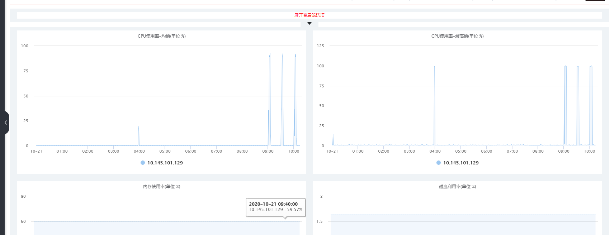

# jvm 一次优化

## 说明

这是一个springboot框架的后台任务，每半个小时运行一次。

最开始是在物理机上运行，每次启动进程，运行完进程关闭。所以并不涉及到垃圾回收的问题。

后来公司统一决策，后台任务全部接入公司的xxx-job衍生版(自己公司封装了一下)；并且放在docke容器中运行。所以每半小时运行一次后进程并不关停。

docker 容器默认是2核5G的。在项目刚迁移没多久就开始报警，cpu 内存等超限（超过设定的80%）。然后就升级为8核/10G。平稳的运行了一段时间（就是没报警）。

不过近期又开始报cpu超限。然后决定看一下。


## 现象

 

可以看到每次执行任务是cpu基本都100%了。

## 配置

top命令看一下配置。不过这个是平时（非任务运行时间段）的状态。供各位看官参考。

``` text
top - 10:42:57 up 320 days, 14:25,  1 user,  load average: 14.75, 14.96, 15.96
Tasks:  15 total,   1 running,  14 sleeping,   0 stopped,   0 zombie
%Cpu(s): 24.6 us,  5.3 sy,  0.0 ni, 68.2 id,  0.0 wa,  0.0 hi,  1.9 si,  0.0 st
KiB Mem : 26351976+total, 11896940 free, 91484688 used, 16013814+buff/cache
KiB Swap:        0 total,        0 free,        0 used. 16701171+avail Mem 

    PID USER      PR  NI    VIRT    RES    SHR S  %CPU %MEM     TIME+ COMMAND                                                                                                                                      
      1 work      20   0   49884  36300   2980 S   3.3  0.0   2518:18 sh                                                                                                                                           
 260471 root      20   0 1064896  30096   1636 S   0.7  0.0 108:16.93 mount.scffs                                                                                                                                  
   1147 work      20   0 19.093g 5.859g  10552 S   0.3  2.3  12458:37 java                                                                                                                                         
    682 root      20   0   27756   2744   2072 S   0.0  0.0   1:53.82 crond                                                                                                                                        
   1062 root      20   0  105428   2796   1820 S   0.0  0.0   0:01.06 sshd                                                                                                                                         
   1085 root      20   0  273708   4368   2916 S   0.0  0.0   1:14.98 rsyslogd                                                                                                                                     
   1124 work      20   0   19696   6136   2964 S   0.0  0.0   5:02.65 sh                                                                                                                                           
 314840 root      20   0  141532   8924   7648 S   0.0  0.0   0:00.01 sshd                                                                                                                                         
 314842 work      20   0  141532   3876   2600 S   0.0  0.0   0:00.11 sshd                                                                                                                                         
 314843 work      20   0   16888   3736   3288 S   0.0  0.0   0:00.29 bash                                                                                                                                         
 317945 work      20   0   57000   4104   3540 R   0.0  0.0   0:00.00 top                                                                                                                                          
 317950 work      20   0    9396    660    592 S   0.0  0.0   0:00.00 sleep                                                                                                                                        
 317952 work      20   0    9396    636    564 S   0.0  0.0   0:00.00 sleep                                                                                                                                        
 356861 root      20   0 1830028  15144   7620 S   0.0  0.0  16:04.52 monitor-agent                                                                                                                                
 690207 root      20   0 1667604   9280   4992 S   0.0  0.0  54:20.65 58agent 
```

## 启动参数

ps命令看一下启动参数，这里说下jdk版本是1.8。

```
 ps -ef | grep java 
work        1147       1  5 May25 ?        8-15:38:37 java -Xmx5324M -Xms5324M -Xmn2048M -XX:MaxMetaspaceSize=256M -XX:MetaspaceSize=256M -jar *.jar --spring.profiles.active=prod
work      318823  314843  0 10:56 pts/0    00:00:00 grep --color java
```

* 进程号：1147
* 堆内存：5g
* 年轻代: 2g
* 元空间：256M

其它都是默认配置了。

## 堆内存信息
jmap 看一下堆内存信息


```
jmap -heap 1147
Attaching to process ID 1147, please wait...
Debugger attached successfully.
Server compiler detected.
JVM version is 25.45-b02

using thread-local object allocation.
Parallel GC with 18 thread(s)

Heap Configuration:
   MinHeapFreeRatio         = 0
   MaxHeapFreeRatio         = 100
   MaxHeapSize              = 5582618624 (5324.0MB)
   NewSize                  = 2147483648 (2048.0MB)
   MaxNewSize               = 2147483648 (2048.0MB)
   OldSize                  = 3435134976 (3276.0MB)
   NewRatio                 = 2
   SurvivorRatio            = 8
   MetaspaceSize            = 268435456 (256.0MB)
   CompressedClassSpaceSize = 1073741824 (1024.0MB)
   MaxMetaspaceSize         = 268435456 (256.0MB)
   G1HeapRegionSize         = 0 (0.0MB)

Heap Usage:
PS Young Generation
Eden Space:
   capacity = 2107637760 (2010.0MB)
   used     = 1419086080 (1353.345947265625MB)
   free     = 688551680 (656.654052734375MB)
   67.3306441425684% used
From Space:
   capacity = 20447232 (19.5MB)
   used     = 0 (0.0MB)
   free     = 20447232 (19.5MB)
   0.0% used
To Space:
   capacity = 19398656 (18.5MB)
   used     = 0 (0.0MB)
   free     = 19398656 (18.5MB)
   0.0% used
PS Old Generation
   capacity = 3435134976 (3276.0MB)
   used     = 3434964768 (3275.837677001953MB)
   free     = 170208 (0.162322998046875MB)
   99.99504508552971% used

24442 interned Strings occupying 3001848 bytes.
```

* 垃圾回收器为jdk8的默认回收器 Parallel。
* 新生代和老年代配置分别为 2G和3G。和上面配置一样。
* 伊甸园区基本把年轻代全占了和存活区的并不符合默认配置8:1。 且存活区没有使用。
* 老年代几乎百分百。


#### 重启一台机器查看堆信息

```
$ jps
1383 jar
1609 Jps
$ jmap -heap 1383
Attaching to process ID 1383, please wait...
Debugger attached successfully.
Server compiler detected.
JVM version is 25.45-b02

using thread-local object allocation.
Parallel GC with 18 thread(s)

Heap Configuration:
   MinHeapFreeRatio         = 0
   MaxHeapFreeRatio         = 100
   MaxHeapSize              = 5582618624 (5324.0MB)
   NewSize                  = 2147483648 (2048.0MB)
   MaxNewSize               = 2147483648 (2048.0MB)
   OldSize                  = 3435134976 (3276.0MB)
   NewRatio                 = 2
   SurvivorRatio            = 8
   MetaspaceSize            = 268435456 (256.0MB)
   CompressedClassSpaceSize = 1073741824 (1024.0MB)
   MaxMetaspaceSize         = 268435456 (256.0MB)
   G1HeapRegionSize         = 0 (0.0MB)

Heap Usage:
PS Young Generation
Eden Space:
   capacity = 1610612736 (1536.0MB)
   used     = 228417520 (217.83592224121094MB)
   free     = 1382195216 (1318.164077758789MB)
   14.182026187578836% used
From Space:
   capacity = 268435456 (256.0MB)
   used     = 27291432 (26.027137756347656MB)
   free     = 241144024 (229.97286224365234MB)
   10.166850686073303% used
To Space:
   capacity = 268435456 (256.0MB)
   used     = 0 (0.0MB)
   free     = 268435456 (256.0MB)
   0.0% used
PS Old Generation
   capacity = 3435134976 (3276.0MB)
   used     = 114704 (0.1093902587890625MB)
   free     = 3435020272 (3275.890609741211MB)
   0.0033391409886771215% used

22021 interned Strings occupying 2657728 bytes.
```

初始化状态下新生代的内存占比达到默认比值数。

#### 第一次诊断分析

根据上面信息，因为存活区是0（运行好长时间了）。判断每次minor GC时。对象全部放到了老年代。

那么那些情况下对象会从年轻代到老年代呢?


## 查看垃圾回收信息

特意等到任务执行前十几秒运行jstat命令查看垃圾回收信息。没5秒打印一次GC信息。

```
$ jstat -gcutil 1147 5000
  S0     S1     E      O      M     CCS    YGC     YGCT    FGC    FGCT     GCT   
  0.00   0.00  63.71 100.00  96.39  94.62   3255   84.738  4296 82706.283 82791.022
  0.00   0.00  63.75 100.00  96.39  94.62   3255   84.738  4296 82706.283 82791.022
  0.00   0.00  63.75 100.00  96.39  94.62   3255   84.738  4296 82706.283 82791.022
  0.00   0.00  63.75 100.00  96.39  94.62   3255   84.738  4296 82706.283 82791.022
  0.00   0.00  64.62 100.00  96.39  94.62   3255   84.738  4296 82706.283 82791.022
  0.00   0.00  66.05 100.00  96.39  94.62   3255   84.738  4296 82706.283 82791.022
  0.00   0.00  72.63 100.00  96.39  94.62   3255   84.738  4296 82706.283 82791.022
  0.00   0.00  78.39 100.00  96.39  94.62   3255   84.738  4296 82706.283 82791.022
  0.00   0.00  84.68 100.00  96.39  94.62   3255   84.738  4296 82706.283 82791.022
  0.00   0.00  90.40 100.00  96.39  94.62   3255   84.738  4296 82706.283 82791.022
  0.00   0.00  95.83 100.00  96.39  94.62   3255   84.738  4296 82706.283 82791.022
  0.00   0.00  97.83 100.00  96.39  94.62   3255   84.738  4296 82706.283 82791.022
  0.00   0.00  98.40 100.00  96.39  94.62   3255   84.738  4296 82706.283 82791.022
  0.00   0.00  98.73 100.00  96.39  94.62   3255   84.738  4296 82706.283 82791.022
  0.00   0.00  98.73 100.00  96.39  94.62   3255   84.738  4296 82706.283 82791.022
  0.00   0.00  99.01 100.00  96.39  94.62   3255   84.738  4296 82706.283 82791.022
  0.00   0.00  99.30 100.00  96.39  94.62   3255   84.738  4296 82706.283 82791.022
  0.00   0.00  99.59 100.00  96.39  94.62   3255   84.738  4296 82706.283 82791.022
  0.00   0.00  99.59 100.00  96.39  94.62   3255   84.738  4296 82706.283 82791.022
  0.00   0.00 100.00 100.00  96.39  94.62   3255   84.738  4297 82706.283 82791.022
  0.00   0.00 100.00 100.00  96.39  94.62   3255   84.738  4297 82706.283 82791.022
  0.00   0.00 100.00 100.00  96.39  94.62   3255   84.738  4297 82706.283 82791.022
  0.00   0.00 100.00 100.00  96.39  94.62   3255   84.738  4297 82706.283 82791.022
  0.00   0.00  64.62 100.00  96.40  94.64   3255   84.738  4297 82726.704 82811.443
  0.00   0.00  70.94 100.00  96.40  94.64   3255   84.738  4297 82726.704 82811.443
  0.00   0.00 100.00 100.00  96.40  94.64   3255   84.738  4298 82726.704 82811.443
  0.00   0.00 100.00 100.00  96.40  94.64   3255   84.738  4298 82726.704 82811.443
  0.00   0.00 100.00 100.00  96.40  94.64   3255   84.738  4298 82726.704 82811.443
  0.00   0.00 100.00 100.00  96.40  94.64   3255   84.738  4298 82726.704 82811.443
  0.00   0.00  68.29 100.00  96.42  94.65   3255   84.738  4298 82748.130 82832.868
  0.00   0.00 100.00 100.00  96.42  94.65   3255   84.738  4299 82748.130 82832.868
  0.00   0.00 100.00 100.00  96.42  94.65   3255   84.738  4299 82748.130 82832.868
  0.00   0.00 100.00 100.00  96.42  94.65   3255   84.738  4299 82748.130 82832.868
  0.00   0.00 100.00 100.00  96.42  94.65   3255   84.738  4299 82748.130 82832.868
  0.00   0.00  83.73 100.00  96.42  94.65   3255   84.738  4299 82769.230 82853.968
  0.00   0.00 100.00 100.00  96.42  94.65   3255   84.738  4300 82769.230 82853.968
  0.00   0.00 100.00 100.00  96.42  94.65   3255   84.738  4300 82769.230 82853.968
  0.00   0.00 100.00 100.00  96.42  94.65   3255   84.738  4300 82769.230 82853.968
  0.00   0.00 100.00 100.00  96.42  94.65   3255   84.738  4300 82769.230 82853.968
  0.00   0.00 100.00 100.00  96.42  94.65   3255   84.738  4301 82790.289 82875.028
  0.00   0.00 100.00 100.00  96.42  94.65   3255   84.738  4301 82790.289 82875.028
  0.00   0.00 100.00 100.00  96.42  94.65   3255   84.738  4301 82790.289 82875.028
  0.00   0.00 100.00 100.00  96.42  94.65   3255   84.738  4301 82790.289 82875.028
  0.00   0.00 100.00 100.00  96.42  94.65   3255   84.738  4301 82790.289 82875.028
  0.00   0.00 100.00 100.00  96.42  94.65   3255   84.738  4302 82811.815 82896.554
  0.00   0.00 100.00 100.00  96.42  94.65   3255   84.738  4302 82811.815 82896.554
  0.00   0.00 100.00 100.00  96.42  94.65   3255   84.738  4302 82811.815 82896.554
  0.00   0.00 100.00 100.00  96.42  94.65   3255   84.738  4302 82811.815 82896.554
  0.00   0.00  61.63 100.00  96.42  94.65   3255   84.738  4302 82832.864 82917.602
  0.00   0.00 100.00 100.00  96.42  94.65   3255   84.738  4303 82832.864 82917.602
  0.00   0.00 100.00 100.00  96.42  94.65   3255   84.738  4303 82832.864 82917.602
  0.00   0.00 100.00 100.00  96.42  94.65   3255   84.738  4303 82832.864 82917.602
  0.00   0.00 100.00 100.00  96.42  94.65   3255   84.738  4303 82832.864 82917.602
  0.00   0.00  73.89 100.00  96.42  94.65   3255   84.738  4303 82854.499 82939.237
  0.00   0.00 100.00 100.00  96.42  94.65   3255   84.738  4304 82854.499 82939.237
  0.00   0.00 100.00 100.00  96.42  94.65   3255   84.738  4304 82854.499 82939.237
  0.00   0.00 100.00 100.00  96.42  94.65   3255   84.738  4304 82854.499 82939.237
  0.00   0.00 100.00 100.00  96.42  94.65   3255   84.738  4304 82854.499 82939.237
  0.00   0.00  94.27 100.00  96.42  94.65   3255   84.738  4304 82875.563 82960.302
  0.00   0.00 100.00 100.00  96.42  94.65   3255   84.738  4305 82875.563 82960.302
  0.00   0.00 100.00 100.00  96.42  94.65   3255   84.738  4305 82875.563 82960.302
  0.00   0.00 100.00 100.00  96.42  94.65   3255   84.738  4305 82875.563 82960.302
  0.00   0.00 100.00 100.00  96.42  94.65   3255   84.738  4305 82875.563 82960.302
  0.00   0.00  67.20 100.00  96.42  94.65   3255   84.738  4305 82896.061 82980.800
  0.00   0.00  67.24 100.00  96.42  94.65   3255   84.738  4305 82896.061 82980.800
  0.00   0.00  67.24 100.00  96.42  94.65   3255   84.738  4305 82896.061 82980.800
  0.00   0.00  67.24 100.00  96.42  94.65   3255   84.738  4305 82896.061 82980.800
  0.00   0.00  67.24 100.00  96.42  94.65   3255   84.738  4305 82896.061 82980.800
  0.00   0.00  67.24 100.00  96.42  94.65   3255   84.738  4305 82896.061 82980.800
```


