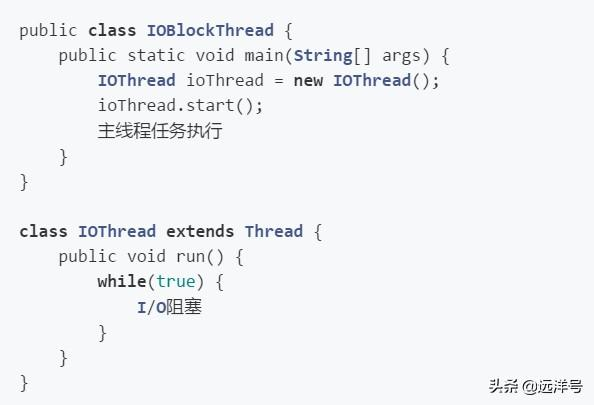

# Java线程何时放弃CPU时间片

## 关于执行时间

一个线程从启动到结束过程总，有两个时间概念我们要理解。其一是CPU时间，即线程真正执行的时间。其二是总消耗时间，即真正执行的时间加上等待的时间。如下图可以很清晰看到这两者的关系，P1得到了多个CPU执行时间，而总消耗时间则包括P1执行期间CPU分配给其它线程执行的时间，所以总消耗时间总是大于等于CPU时间。

在Java中，线程会按线程优先级来分配CPU时间片，整个过程中线程何时会放弃CPU的使用权呢？其实可以归类成以下三种情况。

## 线程死亡

线程死亡即线程运行结束，也就是运行完run()方法里面的任务后整个线程的生命周期结束。这种情况下放弃CPU就很好理解了，任务执行完了自然就放弃CPU。

## 主动放弃CPU

这种情况是运行线程主动放弃CPU的执行时间，由JVM负责放弃CPU的操作。需要注意的是，基于时间片轮转调度的JVM操作系统不会让线程永久放弃CPU，也就是说是放弃本次CPU时间片的执行权。比如当我们调用yield()方法，本来执行的线程将放弃执行，而是通知JVM线程管理器去执行线程队列里面的其他线程。

我们来看使用yield放弃CPU时的代码情况：

现在截取某段的输出，可以看到输出“主线程”比“被放弃线程”的机会更多。这是因为mt线程每次循环都把时间片让给了主线程，所以主线程执行得多。同时又因为yield操作并不会永远放弃CPU的使用，它仅仅只是放弃了此次时间片，所以它有机会在下一轮中得到执行。

## 阻塞放弃CPU

这种情况是指运行线程因为某些原因进入阻塞状态，从而放弃CPU的执行时间。进入阻塞状态的原因可能有很多种，比如当磁盘IO时、网络IO时、主动睡眠时、锁竞争时、执行等待时等等，都可能会导致阻塞状态。进入阻塞状态则意味着放弃了CPU的执行时间片。

下面举个阻塞放弃CPU的例子，为了节省代码量我们将使用伪代码表示，例子虽然简单但已能说明问题。程序包含了两条线程，其中ioThread每次遇到IO阻塞时就放弃CPU的执行时间片，而主线程则按JVM分配的时间片正常运行。

