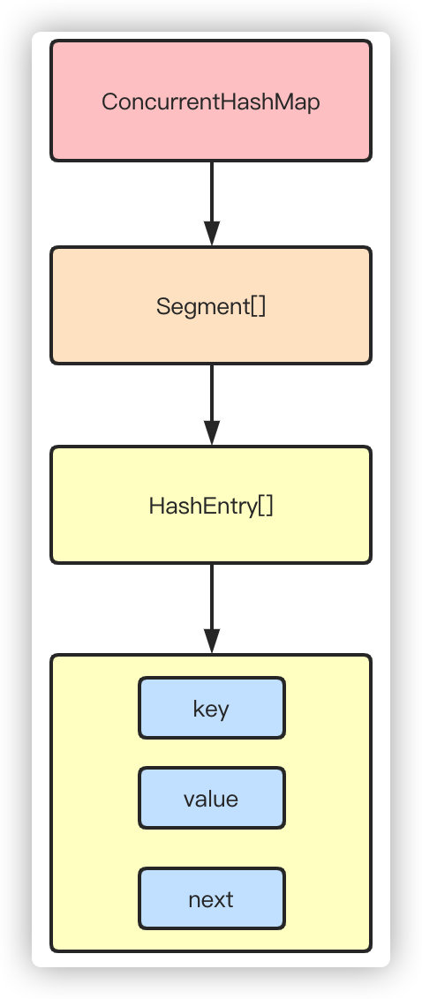
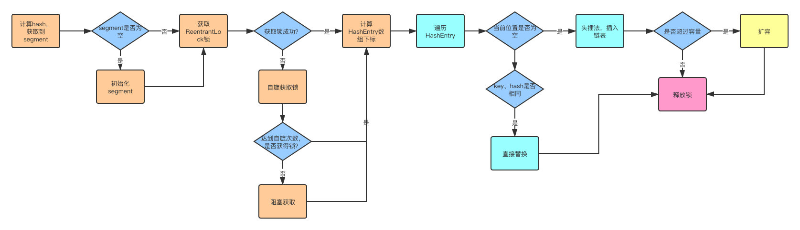
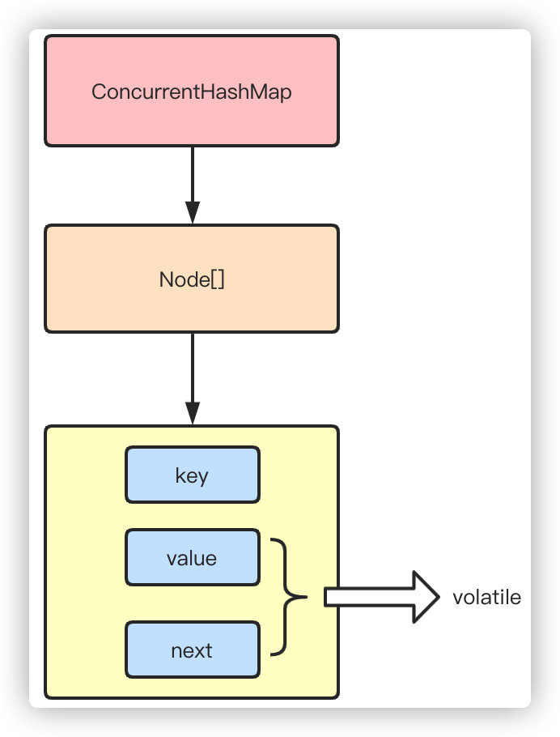
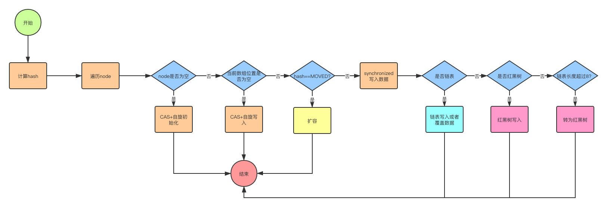

# ConcurrentHashmap

多线程环境可以使用Collections.synchronizedMap同步加锁的方式，还可以使用HashTable，但是同步的方式显然性能不达标，而ConurrentHashMap更适合高并发场景使用。

ConcurrentHashmap在JDK1.7和1.8的版本改动比较大，1.7使用Segment+HashEntry分段锁的方式实现，1.8则抛弃了Segment，改为使用CAS+synchronized+Node实现，同样也加入了红黑树，避免链表过长导致性能的问题。

## 1.7分段锁

从结构上说，1.7版本的ConcurrentHashMap采用分段锁机制，里面包含一个Segment数组，Segment继承与ReentrantLock，Segment则包含HashEntry的数组，HashEntry本身就是一个链表的结构，具有保存key、value的能力能指向下一个节点的指针。

实际上就是相当于每个Segment都是一个HashMap，默认的Segment长度是16，也就是支持16个线程的并发写，Segment之间相互不会受到影响。

put流程

其实发现整个流程和HashMap非常类似，只不过是先定位到具体的Segment，然后通过ReentrantLock去操作而已，后面的流程我就简化了，因为和HashMap基本上是一样的。

1. 计算hash，定位到segment，segment如果是空就先初始化
2. 使用ReentrantLock加锁，如果获取锁失败则尝试自旋，自旋超过次数就阻塞获取，保证一定获取锁成功
3. 遍历HashEntry，就是和HashMap一样，数组中key和hash一样就直接替换，不存在就再插入链表，链表同样

get流程

get也很简单，key通过hash定位到segment，再遍历链表定位到具体的元素上，需要注意的是value是volatile的，所以get是不需要加锁的。

## 1.8CAS+synchronized

1.8抛弃分段锁，转为用CAS+synchronized来实现，同样HashEntry改为Node，也加入了红黑树的实现。主要还是看put的流程

put流程

1. 首先计算hash，遍历node数组，如果node是空的话，就通过CAS+自旋的方式初始化
2. 如果当前数组位置是空则直接通过CAS自旋写入数据
3. 如果hash==MOVED，说明需要扩容，执行扩容
4. 如果都不满足，就使用synchronized写入数据，写入数据同样判断链表、红黑树，链表写入和HashMap的方式一样，key hash一样就覆盖，反之就尾插法，链表长度超过8就转换成红黑树

get查询

get很简单，通过key计算hash，如果key hash相同就返回，如果是红黑树按照红黑树获取，都不是就遍历链表获取

