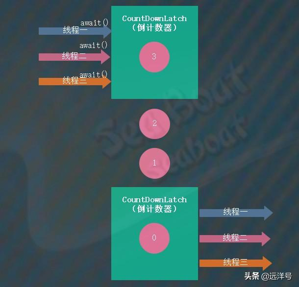
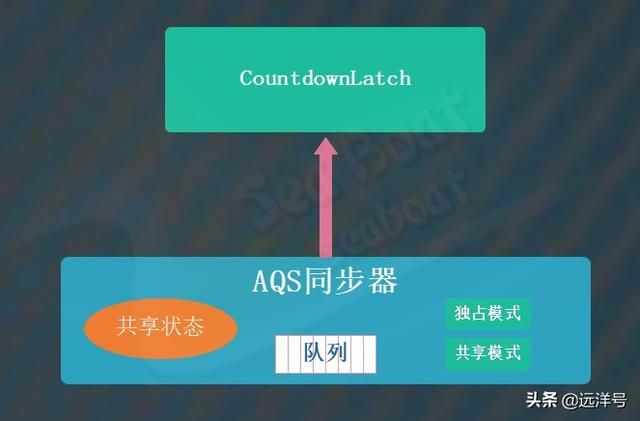
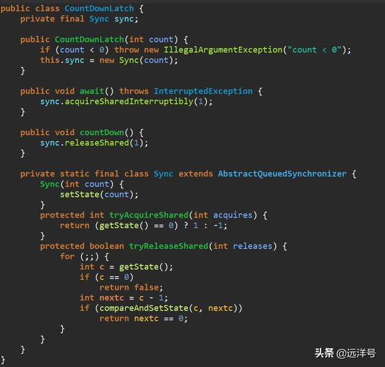
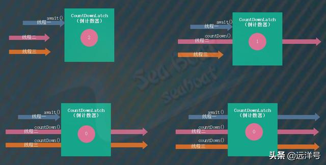

# CountDownLatch实现原理及案例

### 关于闭锁

闭锁（CountDownLatch）是Java多线程并发中的一种同步器，它是JDK内置的同步器。通过它可以定义一个倒计数器，当倒计数器的值大于0时，所有调用await方法的线程都会等待。而调用countDown方法则可以让倒计数器的值减一，当倒计数器值为0时所有等待的线程都将继续往下执行。

闭锁的主要应用场景是让某个或某些线程在某个运行节点上等待N个条件都满足后才让所有线程继续往下执行，其中倒计数器的值为N，每满足一个条件倒计数器就减一。比如下图中，倒计数器初始值为3，然后三个线程调用await方法后都在等待。随后倒计数器减一为2，再减一为1，最后减一为0，所有等待的线程都往下继续执行。

### 三要素

闭锁的三要素为：倒计数器的初始值、await方法以及countdown方法。倒计数器的初始值在构建CountDownLatch对象时指定，它表示我们需要等待的条件个数。await方法能让线程进入等待状态，等待的条件是倒计数器的值大于0。countdown方法用于将倒计数器的值减一。

### 实现原理

前面我们介绍过如何基于AQS同步器实现一个自定义同步器，实际上CountdownLatch也是基于AQS来实现的，只要使用AQS的共享模式即可以轻松实现闭锁。

下面我们看详细的实现代码，CountdownLatch类的构造函数需要传入一个整型参数，表示倒计数器的初始值，对应着AQS的state状态变量。按照官方推荐的自定义同步器的做法，将继承了AQS类的子类Sync作为CountdownLatch类的内部类，而CountdownLatch同步器中相关的操作只需代理成子类中对应的方法即可。比如await方法和countDown方法分别调用Sync子类的acquireSharedInterruptibly方法和releaseShared方法。

Sync子类中需要我们实现的两个方法是tryAcquireShared和tryReleaseShared，分别用于获取共享锁和释放共享锁。先看获取共享锁的逻辑，如果状态变量等于0则返回1，当倒计数器的值减少到0的时候全部线程都可以直接尝试得到共享锁，而当倒计数器的值为非0时使之返回-1交给AQS进行入队管理。然后看释放共享锁的逻辑，主要是通过自旋来进行减一操作，getState方法获取状态变量，将其值减一后使用compareAndSetState方法进行CAS修改状态值。

### 例子1

第一个例子是创建一个CountdownLatch对象作为倒计数器，其值为2。然后线程一调用await方法进行等待，线程二调用countDown方法将倒计数器的值减一并往下执行。线程三再调用countDown方法将倒计数器的值再减一并往下执行，此时倒计数器的值为0，线程一停止等待并往下执行。

下面的例子输出如下，thread1调用await方法后进入等待状态，thread2睡眠两秒后调用countDown方法并往下执行，thread3睡眠四秒后调用countDown方法并往下执行，最后thread1才停止等待继续往下执行。

> thread1 is waiting 
  thread2 count down 
  thread2 goes 
  thread3 count down 
  thread3 goes 
  thread1 go 
