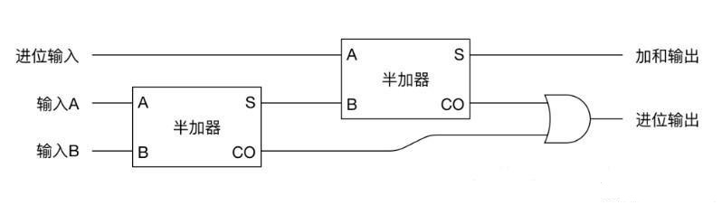

# java并发必知的计算机原理知识

### 前言

Java并发为什么有这么多难点呢？实际上并不是Java语言的问题，从本质上来说是因为并发操作本身的问题，
此外还有一些问题是由计算机的体系结构引发的。为了能更好地理解Java并发过程中的问题，我们需要对计算机组成原理有一些基础的认识。

### 逻辑门

逻辑门是计算机的基础元件，通过它可以完成逻辑运算（也称布尔运算），这类运算输入输出都只有0和1，包含与门、或门、非门等常见逻辑门。

与门，即执行“与”操作，两个输入一个输出。只有当两个输入都为1时输出才为1，其它情况都为0。


或门，即执行“或”操作，两个输入一个输出。只要两个输入的其中一个为1则输出就为1。


非门，即执行“非”操作，一个输入一个输出，该运算用于取输入信号的对立信号。


通过以上三种基本的逻辑门就能实现所有逻辑运算，计算机的本质就是由这三种基本门实现，通过成千上万个逻辑门实现计算。

### 加法操作

加法是所有一切运算的基础，我们看怎么通过前面说到的逻辑门实现加法运算。计算机与人类的计算方式不同，人类常用十进制，而计算机擅长用二进制，计算机计算时以二进制进行。

异或门(XOR)由三种最基础的门组合得到，异或门结构如下。


简记为，


组合成半加器，如下，


记为，


半加器只能处理两个二进制一位数的相加，并且不能处理前面计算的进位。为了处理进位，可以将两个半加器和一个或门连接，组成全加器，如下，



全加器只能处理三个二进制一位数（其中一位是进位输入）的相加。如果要实现n位二进制数据的相加，就需要使用n个全加器连接起来。

之所以说加法是一切运算的基础，是因为数学家已经证明了能通过加法能实现其它运算，比如乘法、除法、平方、开方、对数等等。

### 机器指令

虽说有了逻辑运算已经能帮助人类完成计算了，但是人类直接这样使用是非常不友好而且低效的。比如要做(11+22+33)+(44+55)操作时，我们需要分别先输入三个数并相加，然后自己手动记录下中间结果，类似地需要将另外一个中间结果记录下来，然后再一次输入两个数执行加法运算。

为了让上述过程能自动化，人类搞来了内存，它可以用来存放数据，可以把内存看成很多块，每块都对应有一个地址，通过地址可以对数据进行存储、读取和修改。这里把相关数据都已放到内存中。


* 读取000地址的数到加法器
* 把001地址的数加到加法器
* 把002地址的数加到加法器
* 把加法器的数保存到003地址指向位置
* 读取004地址的数到加法器
* 把005地址的数加到加法器
* 把加法器的数保存到006地址指向位置
* 读取003地址的数到加法器
* 把006地址的数加到加法器
* 停止加法器。

这个过程涉及到四个操作，读取(load)、保存(store)、加(add)和停止(halt)。并且也可以对这些操作进行编码，比如可以分别用100、101、102、103表示。上述过程可用下面指令操作。

```code
load 000
add 001
add 002
store 003
load 004
add 005
store 006
load 003
add 006
halt
```

对应指令编码为，

```code
100 000
102 001
102 002
101 003
...
103
```

有了如上指令，将它们保存到内存中，这样计算机就能够一条条往下执行，不需要人工介入，直到运行到停止指令才结束，整个过程实现自动化。

以上以加法运算过程简单介绍指令运算过程，而真正的计算机需要更多的指令集，这也需要更多的硬件来支持。对于计算机系统的指令集的设计有两种思路：①设计精简的指令集，然后复杂的计算通过编程实现。②设计复杂的指令集，直接通过硬件实现复杂的指令，这种运算速度更快，但增加了硬件的复杂度和成本。

### 寄存器

实际硬件设计中，因为计算过程中经常涉及到一些常用的数进行操作，于是专门设计了寄存器用来对需要中转的数据进行暂存，这类暂存方式速度远超内存方式，速度很快以至于能够很好匹CPU的执行。类似于前面加法器将计算结果保存在加法器中。

下面两张图第一张体现不同存储直接的速度比较，第二张是一些指令例子。


