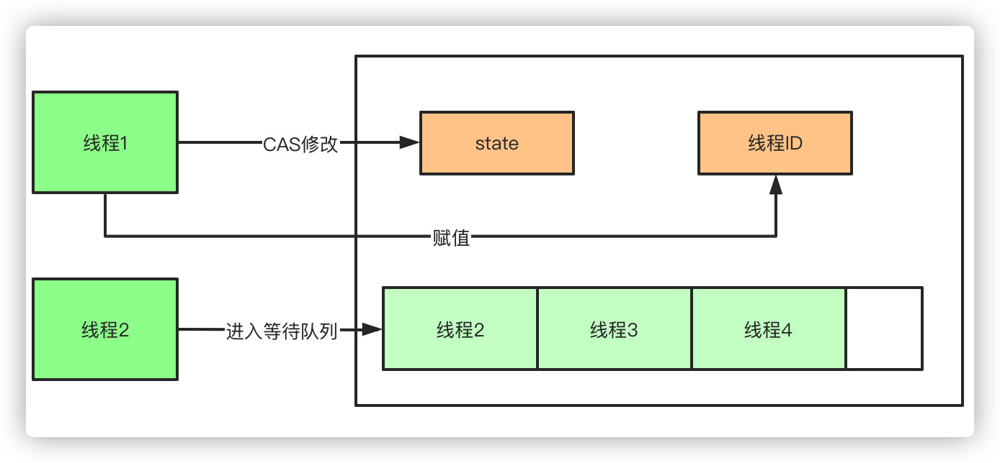
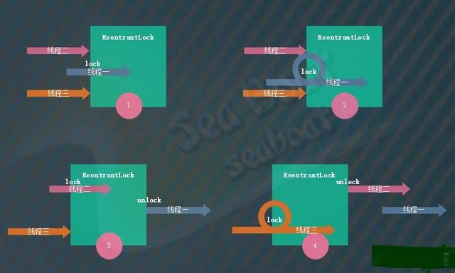
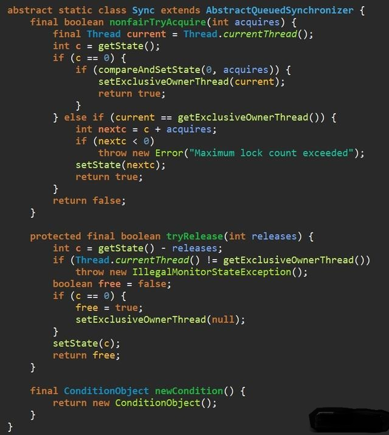
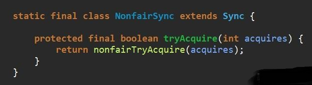
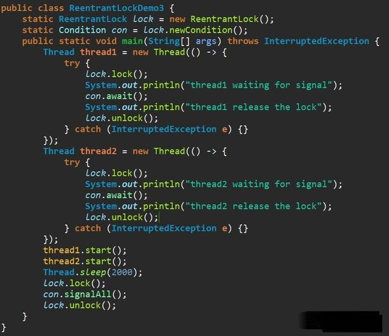

# 深入剖析可重入锁ReentrantLock

相比于synchronized，ReentrantLock需要显式的获取锁和释放锁，相对现在基本都是用JDK7和JDK8的版本，ReentrantLock的效率和synchronized区别基本可以持平了。他们的主要区别有以下几点：

* 等待可中断，当持有锁的线程长时间不释放锁的时候，等待中的线程可以选择放弃等待，转而处理其他的任务。
* 公平锁：synchronized和ReentrantLock默认都是非公平锁，但是ReentrantLock可以通过构造函数传参改变。只不过使用公平锁的话会导致性能急剧下降。
* 绑定多个条件：ReentrantLock可以同时绑定多个Condition条件对象。
* ReentrantLock基于AQS(AbstractQueuedSynchronizer 抽象队列同步器)实现。
* synchronized 是 JVM 实现的，而 ReentrantLock 是 JDK 实现的
* synchronized比较简单，ReentrantLock需要lock()和unlock()来实现，较为复杂
* 锁的细粒度和灵活度：很明显ReenTrantLock优于Synchronized


#### 性能的区别

在Synchronized优化以前，synchronized的性能是比ReenTrantLock差很多的，但是自从Synchronized引入了偏向锁，轻量级锁（自旋锁）后，两者的性能就差不多了，在两种方法都可用的情况下，官方甚至建议使用synchronized，
其实synchronized的优化我感觉就借鉴了ReenTrantLock中的CAS技术。都是试图在用户态就把加锁问题解决，避免进入内核态的线程阻塞。

AQS内部维护一个state状态位，尝试加锁的时候通过CAS(CompareAndSwap)修改值，如果成功设置为1，并且把当前线程ID赋值，
则代表加锁成功，一旦获取到锁，其他的线程将会被阻塞进入阻塞队列自旋，获得锁的线程释放锁的时候将会唤醒阻塞队列中的线程，
释放锁的时候则会把state重新置为0，同时当前线程ID置为空



AbstractOwnableSynchronizer#setExclusiveOwnerThread
```
    protected final void setExclusiveOwnerThread(Thread thread) {
        exclusiveOwnerThread = thread;
    }
```

### 可重入锁

Java中的可重入锁（ReentrantLock）是用于控制并发的一种工具，它的功能类似于Java内置的Synchronized语法。
可重入锁是指一个线程可以多次对某个锁进行加锁操作，比如程序在多层调用中多次使用锁。
而对于不可重入锁来说，进行两次以及上的加锁会导致死锁的产生。

ReentrantLock是一种独占锁，在独占模式下线程只能逐一使用锁，即任意时刻仅仅只能有一条线程持有锁。
如下图，线程一首先成功调用lock方法进行加锁操作从而持有该锁，其它两个线程只能等待线程一释放锁。
因为锁是可重入的，所以线程一可多次调用lock方法对锁进行加锁操作。
当线程一调用unlock方法释放锁后，线程二调用lock方法成功获得锁。
接着线程二也调用unlock方法释放锁，然后线程三调用lock方法成功获得锁，并且其也可以多次调用lock方法对该锁进行加锁操作。




##### 四要素

ReentrantLock类的四要素为：公平/非公平模式、lock方法、unlock方法以及newCondition方法。
公平/非公平模式表示多个线程同时去获取锁时是否按照先到先得的顺序获得锁，如果是则为公平模式，否则为非公平模式。
lock方法用于获取锁，假如锁已被其它线程占有则进入等待状态。unlock方法用于释放锁。
newCondition方法用于返回一个新创建的Condition对象，这个对象支持线程的阻塞和唤醒功能，每个Condition对象内部都有一个等待队列，具体的实现是基于AQS同步器的，我们在AQS章节会讲到具体的实现。

### 非公平模式的实现

ReentrantLock类的内部是基于AQS同步器来实现的，不管是公平模式还是非公平模式都是基于AQS的独占模式，只是在获取锁的操作逻辑上有些差异。
ReentrantLock的默认模式为非公平模式，我们先看非公平模式的实现。


ReentrantLock类的方法较多，为了能够更加清晰且更方便理解，这里我们分析主要的几个核心方法。
它提供了两个构造函数，无参的构造函数默认使用非公平模式，如果要指定模式则传入一个boolean参数，当其为true时表示公平模式。
其中NonfairSync为非公平同步器，而FairSync为公平同步器。lock方法用于加锁操作，其间接调用AQS同步器的acquire方法获取独占锁。
unlock方法用于释放锁操作，其间接调用AQS同步器的release方法释放独占锁。newCondition方法用于创建新的Condition对象并返回。


ReentrantLock类的内部Sync子类是公平模式FairSync类和非公平模式NonfairSync类的抽象父类。
因为ReentrantLock属于独占模式，所以这里提供了非公平的锁获取方法nonfairTryAcquire。tryRelease方法提供了释放锁的操作，
公平模式和非公平模式都通过该方法释放锁。newCondition方法用于创建AQS同步器的ConditionObject对象，
供ReentrantLock类的newCondition方法调用。

我们进一步分析nonfairTryAcquire方法，主要的逻辑是：获取AQS同步器的状态变量，其值只能为0或1，分别表示已被未被加锁和已被加锁。
如果状态变量为0则通过compareAndSetState方法进行CAS修改，将状态变量改为1，修改成功的话还要通过setExclusiveOwnerThread方法将当前线程设为锁持有线程。
如果状态变量为1且当前线程为锁持有线程，则表示正在进行锁重入操作，这时要将状态变量累加一，而且如果重入的次数超过int类型范围的话则抛Maximum lock count exceeded错误。

继续分析tryRelease方法，主要的逻辑为：首先得保证当前线程为锁持有线程，如果不是则抛IllegalMonitorStateException异常。
然后将AQS同步器的状态变量减一，如果状态变量为0的话则表示锁已经完全释放成功，并且通过setExclusiveOwnerThread方法将持有锁线程设为空。
如果状态变量不为0的话，那么只需要将状态变量减一即可。



非公平模式NonfairSync类仅需实现tryAcquire方法，它直接调用父类Sync的的nonfairTryAcquire方法即可。非公平就体现在这个方法中，大家还记得前面讲解的AQS同步器的实现逻辑吗？
这里的tryAcquire实际上就是使用了闯入策略，即刚准备获取锁的线程是先尝试去获取锁，失败了才会进入队列。所以这就是不公平的来源。



### 公平模式的实现

公平模式与非公平模式的主要差异就在获取锁时的机制，非公平模式通过闯入策略来打破公平，而公平模式则所有线程完全通过队列来实现公平机制。
下面看公平模式的FairSync类，它们的差异就在tryAcquire方法，实际上不同的地方就在下图中加了方框的那行代码。
它会检查是否已经存在等待队列，如果已经有等待队列则返回false，其实就是说队列已经有其它线程了，直接放弃闯入操作。返回false则表示让AQS同步器将当前线程放进等待队列中，这种放弃闯入操作的做法则意味着公平。


##### Lock接口


### 例子一

这是一个简单的例子，三个线程启动后都执行加锁操作，独占锁的特性保证了三个线程轮流进行加锁和释放锁。某个运行的输出如下面所示，线程二调用lock方法后先成功获取锁，睡眠两秒后释放锁。
接着线程一又成功获取锁，它也睡眠两秒后释放掉锁。最后线程三成功获取锁，睡眠两秒后释放锁。注意这里使用了ReentrantLock的五参数构造函数，意味着使用了非公平模式，所以三个线程在竞争锁时都使用了闯入策略。


```code
thread2 got the lock
thread2 release the lock
thread1 got the lock
thread1 release the lock
thread3 got the lock
thread3 release the lock
```

### 例子二

接着看第二个例子，这个例子是为了说明ReentrantLock的可重入性。线程一调用lock方法成功获取锁后又一次调用lock方法获取锁，这便是锁的重入操作。
此时我们调用getHoldCount方法输出该锁被加锁的次数，输出为2。睡眠两秒后调用unlock方法进行一次锁释放操作，此时再调用getHoldCount方法得知锁被加锁的次数为1。
最后再调用一次unlock方法完全释放该锁，此时锁被加锁的次数为0。


```code
thread1 got the lock
thread1 got the lock again
lock times : 2
thread1 release the lock
lock times : 1
thread1 release the lock again
lock times : 0
```

### 例子三

第三个例子主要看ReentrantLock的Condition的使用，通过ReentrantLock的newCondition方法能得到一个Condition对象，通过这个对象就能实现等待与唤醒操作。
ReentrantLock与Condition对象的await、signalAll方法，对应着Synchronized与Object对象的wait、notifyAll()方法。
这个例子中线程一和线程二都通过lock方法依次获得锁，但加锁后都调用了Condition对象的await方法进入等待。这里要注意，await方法会将锁释放掉后再进行等待，
所以两个线程都能依次获得锁。而当主线程中调用Condition对象的signalAll方法唤醒所有等待的线程时，线程一和线程二都会依次被唤醒。
唤醒后又会把原来的线程放到等待队列中，所以还需要unlock方法进行锁释放操作，该操作即将线程从等待队列中移除，最终才能往下执行。



```code
thread1 waiting for signal
thread2 waiting for signal
thread1 release the lock
thread2 release the lock
```

### 总结

本文介绍了Java中的可重入锁（ReentrantLock），包括它的核心四要素以及实现原理。ReentrantLock具有可重入性，它是一种独占锁，包括了公平模式和非公平模式。
ReentrantLock类的实现基于AQS同步器，我们对公平与非公平的实现机制都进行了深入的讲解。此外，还提供了三个例子，分别展示了ReentrantLock的普通用法、可重入性质以及Condition的使用。
