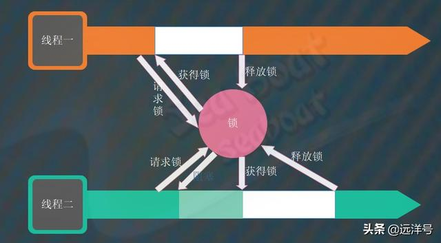
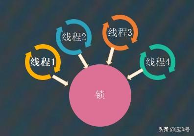
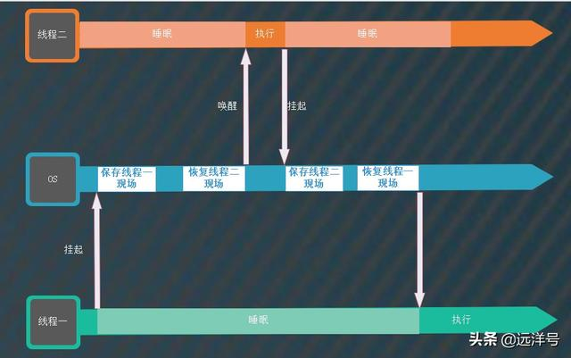

# AQS的自旋锁

### 先说互斥锁

互斥锁就是上节说到过的独占锁，一个锁一次只能由一个线程持有，其它线程则无法获得，除非已持有锁的线程释放了该锁。
这里为什么提互斥锁呢？其实互斥锁和自旋锁都是实现同步的方案，最终实现的效果都是相同的，但它们对未获得锁的线程的处理方式却是不同的。
对于互斥锁，当某个线程占有锁后，另外一个线程将进入阻塞状态。与互斥锁类似，自旋锁保证了公共数据在任意时刻最多只能由一条线程获取使用，不同的是在获取锁失败后自旋锁会采取自旋的处理方式。

### 自旋锁

自旋锁是一种非阻塞锁，它的核心机制就在自旋两个字，即用自旋操作来替代阻塞操作。某一线程尝试获取某个锁时，如果该锁已经被另一个线程占用的话，则此线程将不断循环检查该锁是否被释放，而不是让此线程挂起或睡眠。
一旦另外一个线程释放该锁后，此线程便能获得该锁。自旋是一种忙等待状态，过程中会一直消耗CPU的时间片。

### 为什么自旋

互斥锁有一个很大的缺点，即获取锁失败后线程会进入睡眠或阻塞状态，这个过程会涉及到用户态到内核态的调度，上下文切换的开销比较大。
假如某个锁的锁定时间很短，此时如果锁获取失败则让它睡眠或阻塞的话则有点得不偿失，因为这种开销可能比自旋的开销更大。
总结起来就是互斥锁更适合持有锁时间长的情况，而自旋锁更适合持有锁时间短的情况。

### 自旋锁特点

* 自旋锁的核心机制就是死等，所有想要获得锁的线程都在不停尝试去获取锁，当然这也会引来竞争问题。
* 与互斥锁一样，自旋锁也只允许一个线程获得锁。
* 自旋锁能提供中断机制，因为它并不会进入阻塞状态，所以能很好支持中断。
* 自旋锁适用于锁持有时间叫短的场景，即锁保护临界区很小的常见，这个很容易理解，如果持有锁太久，那么将可能导致大量线程都在自旋，浪费大量CPU资源。
* 自旋锁无法保证公平性，不保证先到先获得锁，这样就可能造成线程饥饿。
* 自旋锁需要保证各个本地缓存数据的一致性，在多处理器机器上，每个线程对应的处理器都对同一个变量进行读写。每次写操作都需要同步每个处理器缓存，这可能会影响性能。

### 自旋锁例子

下面看一个简单的自旋锁的实现，主要看lock和unlock两个方法，Unsafe仅仅是为操作提供了硬件级别的原子CAS操作。对于lock方法，假如有若干线程竞争，能成功通过CAS操作修改value值为newV的线程即是成功获取锁的线程。
它将顺利通过，而其它线程则不断在循环检测value值是否改回0，将value改为0的操作就是获取锁的线程执行完后对该锁进行释放。
对于unlock方法，用于释放锁，释放后若干线程又继续对该锁竞争。如此一来，没获得锁的线程也不会被挂起或阻塞，而是不断循环检查状态。

