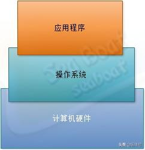
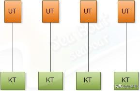
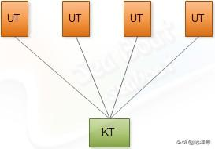
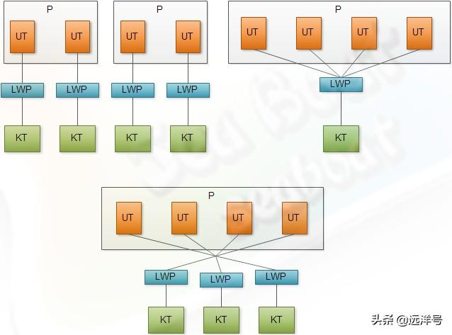

# Java线程与内核线程

### 计算机结构

正如我们熟知，现代机器可以分为硬件和软件两大块。如图所示，硬件是基础，软件提供了实现不同功能的手段。软件可以分为操作系统和应用程序，操作系统专注于对硬件的交互管理并提供一个运行环境给应用程序使用，而应用程序则是能实现若干功能的并且运行在操作系统环境中的软件。

### 线程模型

当我们谈到Java多线程时肯定就会涉及到Java多线程的模型，而且也将涉及Java线程与底层操作系统之间的关系。线程按照操作系统和应用程序两层次可以分为内核线程(Kernel Thread)和用户线程(User Thread)。

所谓内核线程就是直接由操作系统内核支持和管理的线程，线程的建立、启动、同步、销毁、切换等操作都由内核完成。基本所有的现代操作系统都支持内核线程。

用户线程指完全建立在用户空间的线程库上，由内核支持而无需内核管理，内核也无法感知用户线程的存在。线程的建立、启动、同步、销毁、切换完全在用户态完成，无需切换到内核。

可以将用户线程看成是更高层面的线程，而内核线程则是最底层的支持。这样一来他们之间必然存在着一定的映射关系，实际上一般存在三种常见的关系，下面将逐个介绍。

### 一对一模型

一对一模型可以说是最简单的映射模型。如图所示，KT为内核线程，UT为用户线程。每个用户线程都对应一个内核线程，由于每个用户线程都有各自的内核线程，所以他们互不影响。即使其中一个线程阻塞，另一个线程也可以继续执行。互不影响是该模型的优点，但同时也存在一个严重的缺陷。由于是一对一的关系，所以有多少个用户线程就必须要有多少个内核线程与之对应，这将导致内核线程的总开销大。所以，操作系统一般都会有内核线程数量的限制，因此用户线程的数量也会被限制。

### 多对一模型

第二种是多对一模型，如图所示，可以清晰看到多个用户线程映射到同一个内核线程上。从另一个角度来看的话，我们可以将其看成由一条内核线程实现若干个用户线程的并发功能。而且线程的管理在用户空间中进行，一般不需要切换到内核态，这样的效率较高。

对比于一对一模型，多对一模型支持的线程数量更大。但该模型存在一个致命的弱点，那就是如果一个线程阻塞了则将导致所有线程阻塞。此外，任意时刻只能有一个线程访问内核，而且对线程的所有操作都将由用户应用自己处理。所以一般除了在不支持多线程的操作系统被迫使用此模型外，该模型基本不被使用。

### 多对多模型

一对一模型受内核线程数的限制，而多对一模型虽然解决了内核线程数限制问题，但它存在一个线程阻塞导致所有线程阻塞的风险，同时一个内核线程只能调度一个线程也导致了并发性不强。

多对多模型的提出是为了解决前面两种模型的缺点，如图所示，多个用户线程与多个内核线程映射形成多路复用。由于多对一是多对多的子集，所以多对多具备多对一的优点，线程数不受限制。除此之外，多个内核线程可处理多个用户线程，当某个线程阻塞时，将可以调度另外一个线程执行，这从另一方面看也是增强了并发性。

### 轻量级进程

在实际程序中我们一般不直接使用内核线程，用户线程与内核线程之间需要一种中间数据结构，它由内核支持且是内核线程的高级抽象，这个高级接口被称为轻量级进程（Light Weight Process），下面简称LWP。

如下图，是三种模型增加了轻量级进程的示意图。从某种层面上看，LWP最多算是广义的用户线程，并非狭义定义的用户进程。LWP线程库以内核为基础，很多操作要进行内核调用，效率不高。如果要进行快速低消耗的操作则需要一个纯粹的用户线程，于是可以看到一个进程P里面一般包含若干个用户进程，而且用户进程以某种关系对应轻量级进程。一个内核线程堵塞将导致LWP也阻塞，与LWP相连的用户线程也将阻塞。

### Java与操作系统

最后要谈谈Java线程与底层操作系统的关系，由于Java语言通过JVM来封装底层操作系统的差异，所以Java线程也必然会将不同操作系统的线程进行封装，并提供一个统一的并发定义。

在JDK发展历史上，Java语言开发者曾经通过一类叫“绿色线程（Green Threads）”的用户线程来实现Java线程。但从JDK1.2开始，Java线程改用操作系统原生线程模型来实现，也就是说Java线程的实现是通过不同操作系统提供的线程库来分别实现的。JVM会根据不同操作系统的线程模型对Java线程进行映射，假如Java运行在windows系统上，它通常直接使用Win32 API实现多线程。假如Java运行在linux系统则直接使用Pthread线程库实现多线程。这样一来就隐藏了线程底层的实现细节，提供给开发者就是一个统一的抽象线程语义。

