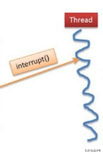
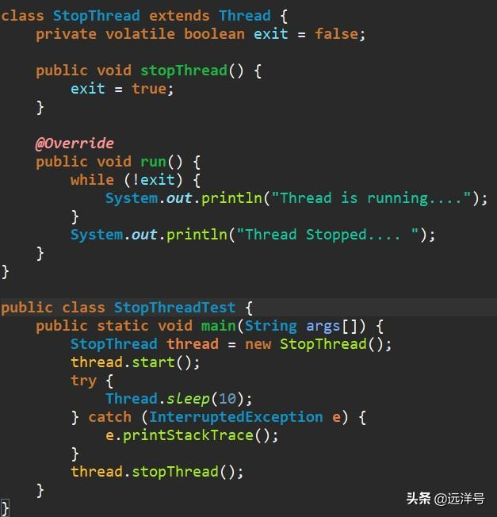
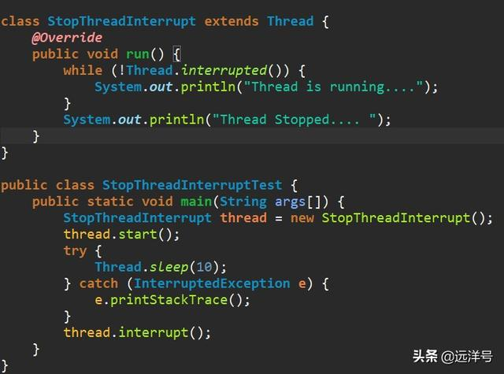

# Java中断的工作方式

### 关于中断

线程的定义为我们提供了并发地执行多个任务的解决方式，在大多数情况下我们会让每个任务都自行执行结束，这样才能保证事务的一致性。但是有时我们希望在任务执行中取消该任务，使线程停止，这时就会涉及到中断操作。在Java中要让线程安全、快速、可靠地停下来并不是一件容易的事，Java也没有提供任何可靠的方法终止线程的执行。

### 两种模式

前面我们了解了线程调度策略中有抢占式和协作式两种模式，中断机制也类似，对应着抢占模式和协作模式。抢占式中断就是直接向某个线程发起中断指令，此时不管线程处于什么状态都必须立即中断。协作式中断的核心是维护一个中断标识，当标识被标记成中断后，线程在适当的时间节点执行中断操作。本节将介绍抢占式中断。

##### 协作式中断

经历了很长时间的发展，Java最终选择用一种协作式的中断机制实现中断。协作式中断的原理很简单，其核心使用一个中断变量作为标识，即对某线程的中断标进行识位，被标记了中断位的线程在适当的时间节点会抛出异常，我们捕获异常后做相应的处理。

##### 中断标识

中断标识直接使用一个布尔变量即可，那么中断标识应该放在哪里呢？中断是针对线程实例而言，所以从Java层面上看，标识变量放到线程中肯定再合适不过了。从JDK开发者的角度看，而由于线程是由JVM维护的，所以中断标识具体可由本地方法维护。但如果从Java应用开发的角度看，也可以自定义中断标识变量。不管是哪种方式，其实本质都是一样的。

##### 自定义中断标识

下面我们看看如何实现自定义中断标识变量。我们说过中断标识应当放到线程中，所以自定义一个线程类，同时定义一个变量布尔变量exit。注意，这里为了保证变量的可见性，变量应该声明为volatile。而在run方法里面是不断检测exit变量的，一旦该变量被设为true，则停止继续执行。此外，自定义线程还提供了stopThread方法用于中断操作，其实它就是简单将exit变量设为true。以上，就实现了一个自定义的中断标识。

##### JVM中断标识

JVM为我们提供了中断的支持，它内部也使用了一个中断标识来实现中断操作。所以我们只要学会使用它就行了，下面看看如何使用。核心逻辑都一样，不断检查线程的中断标识变量，如果没有中断则一直执行。而一旦调用interrupt方法将该线程的中断标识变量设为true后，StopThreadInterrup线程则停止执行。

### 三个API

在Java层面仅仅留下几个API用于操作中断标识，如下。

> public class Thread{  
   public void interrupt() {……} 
   public Boolean isInterrupted() {……} 
   public static Boolean interrupted() {……} 
  }

上面三个方法依次用于设置线程为中断状态、判断线程状态是否中断、清除当前线程中断状态并返回它之前的值。通过interrupt()方法设置中断标识，假如在非阻塞线程则仅仅只是改变了中断状态，线程将继续往下运行。但假如在可取消阻塞线程中，如正在执行sleep()、wait()、join()等方法的线程则会因为被设置了中断状态而抛出InterruptedException异常，程序对此异常捕获处理。判断线程是否处于中断状态其实很简单，只需使用Thread.interrupted()操作，如果为true则说明线程处于中断标识，并清除中断标识。

### 总结

协作式中断我们可以在JVM层面实现，同样也可以在Java层面实现，例如JDK并发工具的中断即是在Java层面实现，不过如果继续深究则是因为Java预留了几个API供我们操作线程的中断标识位，这才使Java层面实现中断操作得以实现。

