# AQS源码分析


AQS是AbstractQueuedSynchronizer的简称，翻译过来就是【抽象队列同步】。AQS提供了一种实现阻塞锁和一系列依赖FIFO等待队列的同步器的框架，
如下图所示。AQS为一系列同步器依赖于一个单独的原子变量（state）的同步器提供了一个非常有用的基础。子类们必须定义改变state变量的protected方法，
这些方法定义了state是如何被获取或释放的。鉴于此，本类中的其他方法执行所有的排队和阻塞机制。子类也可以维护其他的state变量，
但是为了保证同步，必须原子地操作这些变量。

是用来构建锁或者其它同步器组件的重量级基础框架及整个JUC体系的基石，通过内置的CLH(FIFO)队列的变种来完成资源获取线程的排队工作,将每条将要去抢占资源的线程封装成一个Node节点来实现锁的分配，有一个int类变量表示持有锁的状态,通过CAS完成对status值的修改(0表示没有,1表示阻塞)

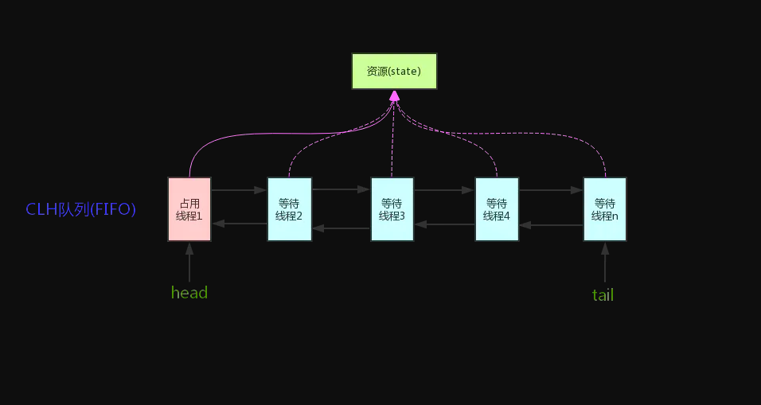

AbstractQueuedSynchronizer中对state的操作是原子的，且不能被继承。所有的同步机制的实现均依赖于对改变量的原子操作。
为了实现不同的同步机制，我们需要创建一个非共有的（non-public internal）扩展了AQS类的内部辅助类来实现相应的同步逻辑。
AbstractQueuedSynchronizer并不实现任何同步接口，它提供了一些可以被具体实现类直接调用的一些原子操作方法来重写相应的同步逻辑。
AQS同时提供了互斥模式（exclusive）和共享模式（shared）两种不同的同步逻辑。
一般情况下，子类只需要根据需求实现其中一种模式，当然也有同时实现两种模式的同步类，
如ReadWriteLock。接下来将详细介绍AbstractQueuedSynchronizer的提供的一些具体实现方法。

#### state状态

AbstractQueuedSynchronizer维护了一个volatile int类型的变量，用户表示当前同步状态。volatile虽然不能保证操作的原子性，但是保证了当前变量state的可见性。至于volatile的具体语义，可以参考相关文章。state的访问方式有三种:

* getState()
* setState()
* compareAndSetState()


这三种叫做均是原子操作，其中compareAndSetState的实现依赖于Unsafe的compareAndSwapInt()方法

#### 自定义资源共享方式

AQS定义两种资源共享方式：Exclusive（独占，只有一个线程能执行，如ReentrantLock）和Share（共享，多个线程可同时执行，如Semaphore/CountDownLatch）。

不同的自定义同步器争用共享资源的方式也不同。自定义同步器在实现时只需要实现共享资源state的获取与释放方式即可，至于具体线程等待队列的维护（如获取资源失败入队/唤醒出队等），AQS已经在顶层实现好了。自定义同步器实现时主要实现以下几种方法：

* isHeldExclusively()：该线程是否正在独占资源。只有用到condition才需要去实现它。
* tryAcquire(int)：独占方式。尝试获取资源，成功则返回true，失败则返回false。
* tryRelease(int)：独占方式。尝试释放资源，成功则返回true，失败则返回false。
* tryAcquireShared(int)：共享方式。尝试获取资源。负数表示失败；0表示成功，但没有剩余可用资源；正数表示成功，且有剩余资源。
* tryReleaseShared(int)：共享方式。尝试释放资源，如果释放后允许唤醒后续等待结点返回true，否则返回false。

## 源码实现

接下来我们开始开始讲解AQS的源码实现。依照acquire-release、acquireShared-releaseShared的次序来。
   
#### 1. acquire(int)

acquire是一种以独占方式获取资源，如果获取到资源，线程直接返回，否则进入等待队列，直到获取到资源为止，且整个过程忽略中断的影响。该方法是独占模式下线程获取共享资源的顶层入口。获取到资源后，线程就可以去执行其临界区代码了。下面是acquire()的源码：
   
```
/**
     * Acquires in exclusive mode, ignoring interrupts.  Implemented
     * by invoking at least once {@link #tryAcquire},
     * returning on success.  Otherwise the thread is queued, possibly
     * repeatedly blocking and unblocking, invoking {@link
     * #tryAcquire} until success.  This method can be used
     * to implement method {@link Lock#lock}.
     *
     * @param arg the acquire argument.  This value is conveyed to
     *        {@link #tryAcquire} but is otherwise uninterpreted and
     *        can represent anything you like.
     */
    public final void acquire(int arg) {
        if (!tryAcquire(arg) &&
            acquireQueued(addWaiter(Node.EXCLUSIVE), arg))
            selfInterrupt();
    }
```

通过注释我们知道，acquire方法是一种互斥模式，且忽略中断。该方法至少执行一次tryAcquire(int)方法，如果tryAcquire(int)方法返回true，则acquire直接返回，否则当前线程需要进入队列进行排队。函数流程如下：

## 35 张图让你深入 AQS

### AQS实现原理
AQS中 维护了一个volatile int state（代表共享资源）和一个FIFO线程等待队列（多线程争用资源被阻塞时会进入此队列）。

这里volatile能够保证多线程下的可见性，当state=1则代表当前对象锁已经被占有，其他线程来加锁时则会失败，加锁失败的线程会被放入一个FIFO的等待队列中，比列会被UNSAFE.park()操作挂起，等待其他获取锁的线程释放锁才能够被唤醒。

另外state的操作都是通过CAS来保证其并发修改的安全性。

具体原理我们可以用一张图来简单概括：


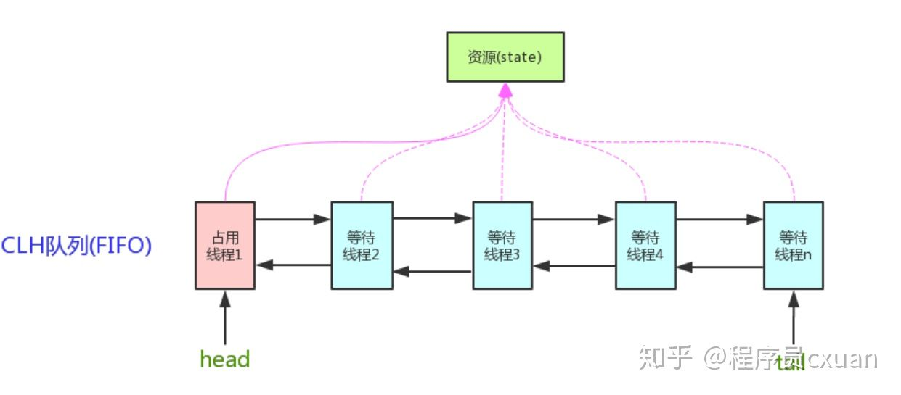

AQS 中提供了很多关于锁的实现方法，

* getState()：获取锁的标志state值
* setState()：设置锁的标志state值
* tryAcquire(int)：独占方式获取锁。尝试获取资源，成功则返回true，失败则返回false。
* tryRelease(int)：独占方式释放锁。尝试释放资源，成功则返回true，失败则返回false。

这里还有一些方法并没有列出来，接下来我们以ReentrantLock作为突破点通过源码和画图的形式一步步了解AQS内部实现原理。

### 目录结构

文章准备模拟多线程竞争锁、释放锁的场景来进行分析AQS源码：

三个线程(线程一、线程二、线程三)同时来加锁/释放锁

目录如下：

* 线程一加锁成功时AQS内部实现
* 线程二/三加锁失败时AQS中等待队列的数据模型
* 线程一释放锁及线程二获取锁实现原理
* 通过线程场景来讲解公平锁具体实现原理
* 通过线程场景来讲解Condition中await()和signal()实现原理

这里会通过画图来分析每个线程加锁、释放锁后AQS内部的数据结构和实现原理

### 场景分析

#### 线程一加锁成功

如果同时有三个线程并发抢占锁，此时线程一抢占锁成功，线程二和线程三抢占锁失败，具体执行流程如下：

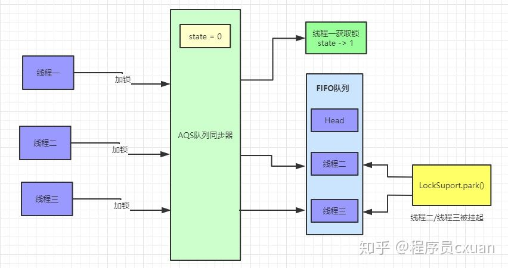


此时AQS内部数据为：

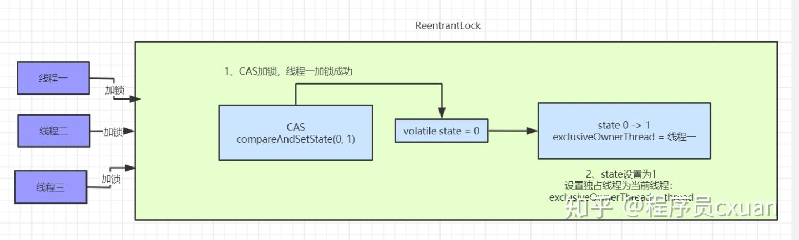

线程二、线程三加锁失败：

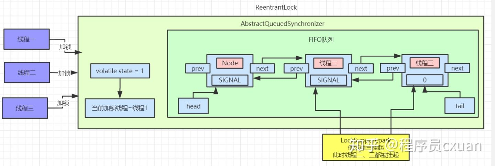

有图可以看出，等待队列中的节点Node是一个双向链表，这里SIGNAL是Node中waitStatus属性，Node中还有一个nextWaiter属性，这个并未在图中画出来，这个到后面Condition会具体讲解的。

具体看下抢占锁代码实现：

java.util.concurrent.locks.ReentrantLock .NonfairSync

```
static final class NonfairSync extends Sync {

    final void lock() {
        if (compareAndSetState(0, 1))
            setExclusiveOwnerThread(Thread.currentThread());
        else
            acquire(1);
    }

    protected final boolean tryAcquire(int acquires) {
        return nonfairTryAcquire(acquires);
    }
}
```


这里使用的ReentrantLock非公平锁，线程进来直接利用CAS尝试抢占锁，如果抢占成功state值回被改为1，且设置对象独占锁线程为当前线程。如下所示：

```
protected final boolean compareAndSetState(int expect, int update) {
    return unsafe.compareAndSwapInt(this, stateOffset, expect, update);
}

protected final void setExclusiveOwnerThread(Thread thread) {
    exclusiveOwnerThread = thread;
}
```

#### 线程二抢占锁失败

我们按照真实场景来分析，线程一抢占锁成功后，state变为1，线程二通过CAS修改state变量必然会失败。此时AQS中FIFO(First In First Out 先进先出)队列中数据如图所示：


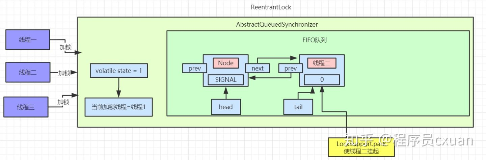

我们将线程二执行的逻辑一步步拆解来看：

java.util.concurrent.locks.AbstractQueuedSynchronizer.acquire():

```
public final void acquire(int arg) {
    if (!tryAcquire(arg) &&
        acquireQueued(addWaiter(Node.EXCLUSIVE), arg))
        selfInterrupt();
}
```

先看看tryAcquire()的具体实现：

java.util.concurrent.locks.ReentrantLock .nonfairTryAcquire():

```
final boolean nonfairTryAcquire(int acquires) {
    final Thread current = Thread.currentThread();
    int c = getState();
    if (c == 0) {
        if (compareAndSetState(0, acquires)) {
            setExclusiveOwnerThread(current);
            return true;
        }
    }
    else if (current == getExclusiveOwnerThread()) {
        int nextc = c + acquires;
        if (nextc < 0)
            throw new Error("Maximum lock count exceeded");
        setState(nextc);
        return true;
    }
    return false;
}
```

nonfairTryAcquire()方法中首先会获取state的值，如果不为0则说明当前对象的锁已经被其他线程所占有，接着判断占有锁的线程是否为当前线程，如果是则累加state值，这就是可重入锁的具体实现，累加state值，释放锁的时候也要依次递减state值。

如果state为0，则执行CAS操作，尝试更新state值为1，如果更新成功则代表当前线程加锁成功。

以线程二为例，因为线程一已经将state修改为1，所以线程二通过CAS修改state的值不会成功。加锁失败。

线程二执行tryAcquire()后会返回false，接着执行addWaiter(Node.EXCLUSIVE)逻辑，将自己加入到一个FIFO等待队列中，代码实现如下：

java.util.concurrent.locks.AbstractQueuedSynchronizer.addWaiter():

```
private Node addWaiter(Node mode) {    
    Node node = new Node(Thread.currentThread(), mode);
    Node pred = tail;
    if (pred != null) {
        node.prev = pred;
        if (compareAndSetTail(pred, node)) {
            pred.next = node;
            return node;
        }
    }
    enq(node);
    return node;
}
```

这段代码首先会创建一个和当前线程绑定的Node节点，Node为双向链表。此时等待对内中的tail指针为空，直接调用enq(node)方法将当前线程加入等待队列尾部

```
private Node enq(final Node node) {
    for (;;) {
        Node t = tail;
        if (t == null) {
            if (compareAndSetHead(new Node()))
                tail = head;
        } else {
            node.prev = t;
            if (compareAndSetTail(t, node)) {
                t.next = node;
                return t;
            }
        }
    }
}
```

第一遍循环时tail指针为空，进入if逻辑，使用CAS操作设置head指针，将head指向一个新创建的Node节点。此时AQS中数据：

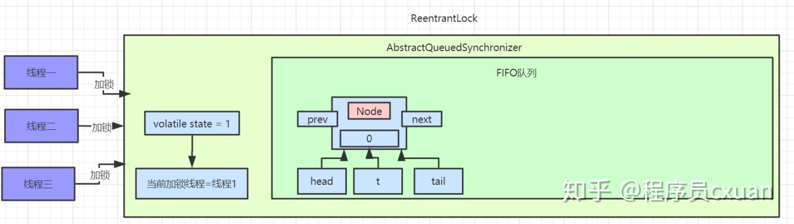

执行完成之后，head、tail、t都指向第一个Node元素。

接着执行第二遍循环，进入else逻辑，此时已经有了head节点，这里要操作的就是将线程二对应的Node节点挂到head节点后面。此时队列中就有了两个Node节点：

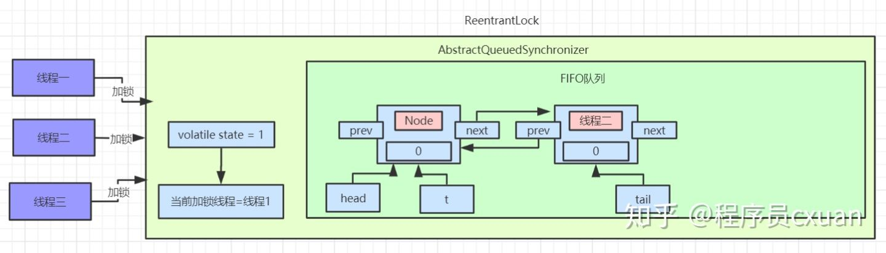

addWaiter()方法执行完后，会返回当前线程创建的节点信息。继续往后执行acquireQueued(addWaiter(Node.EXCLUSIVE), arg)
逻辑，此时传入的参数为线程二对应的Node节点信息：

java.util.concurrent.locks.AbstractQueuedSynchronizer.acquireQueued():

```
final boolean acquireQueued(final Node node, int arg) {
    boolean failed = true;
    try {
        boolean interrupted = false;
        for (;;) {
            final Node p = node.predecessor();
            if (p == head && tryAcquire(arg)) {
                setHead(node);
                p.next = null;
                failed = false;
                return interrupted;
            }
            if (shouldParkAfterFailedAcquire(p, node) &&
                parkAndChecknIterrupt())
                interrupted = true;
        }
    } finally {
        if (failed)
            cancelAcquire(node);
    }
}

private static boolean shouldParkAfterFailedAcquire(Node pred, Node node) {
    int ws = pred.waitStatus;
    if (ws == Node.SIGNAL)
        return true;
    if (ws > 0) {
        do {
            node.prev = pred = pred.prev;
        } while (pred.waitStatus > 0);
        pred.next = node;
    } else {
        compareAndSetWaitStatus(pred, ws, Node.SIGNAL);
    }
    return false;
}

private final boolean parkAndCheckInterrupt() {
    LockSupport.park(this);
    return Thread.interrupted();
}
```

acquireQueued()这个方法会先判断当前传入的Node对应的前置节点是否为head，如果是则尝试加锁。加锁成功过则将当前节点设置为head节点，然后空置之前的head节点，方便后续被垃圾回收掉。

如果加锁失败或者Node的前置节点不是head节点，就会通过shouldParkAfterFailedAcquire方法
将head节点的waitStatus变为了SIGNAL=-1，最后执行parkAndChecknIterrupt方法，调用LockSupport.park()挂起当前线程。

此时AQS中的数据如下图：

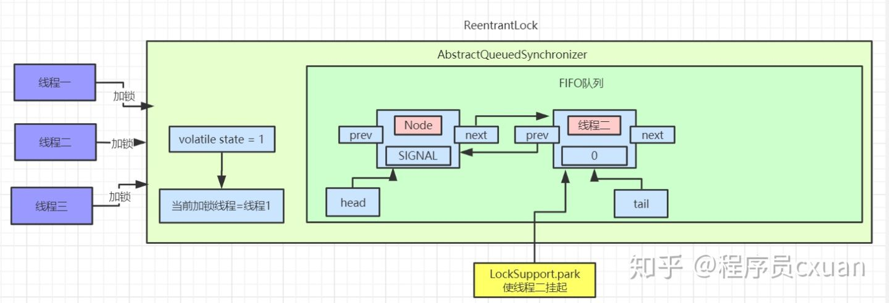

此时线程二就静静的待在AQS的等待队列里面了，等着其他线程释放锁来唤醒它。

#### 线程三抢占锁失败

看完了线程二抢占锁失败的分析，那么再来分析线程三抢占锁失败就很简单了，先看看addWaiter(Node mode)方法：

```
private Node addWaiter(Node mode) {
    Node node = new Node(Thread.currentThread(), mode);
    Node pred = tail;
    if (pred != null) {
        node.prev = pred;
        if (compareAndSetTail(pred, node)) {
            pred.next = node;
            return node;
        }
    }
    enq(node);
    return node;
}
```

此时等待队列的tail节点指向线程二，进入if逻辑后，通过CAS指令将tail节点重新指向线程三。接着线程三调用enq()方法执行入队操作，和上面线程二执行方式是一致的，入队后会修改线程二对应的Node中的waitStatus=SIGNAL。最后线程三也会被挂起。此时等待队列的数据如图：


#### 线程一释放锁

现在来分析下释放锁的过程，首先是线程一释放锁，释放锁后会唤醒head节点的后置节点，也就是我们现在的线程二，具体操作流程如下

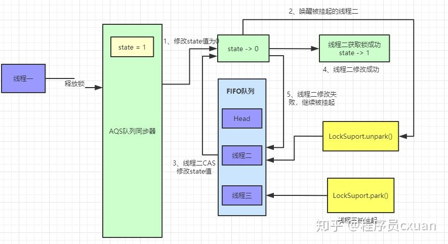

执行完后等待队列数据如下：


此时线程二已经被唤醒，继续尝试获取锁，如果获取锁失败，则会继续被挂起。如果获取锁成功，则AQS中数据如图：

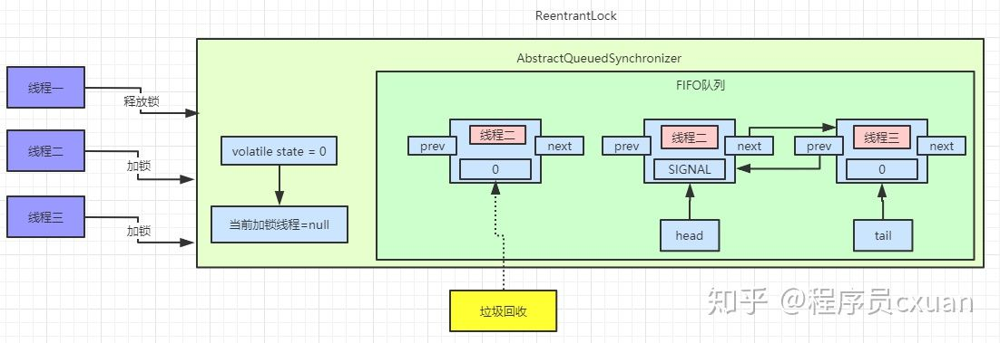

接着还是一步步拆解来看，先看看线程一释放锁的代码：

java.util.concurrent.locks.AbstractQueuedSynchronizer.release()

```
public final boolean release(int arg) {
    if (tryRelease(arg)) {
        Node h = head;
        if (h != null && h.waitStatus != 0)
            unparkSuccessor(h);
        return true;
    }
    return false;
}
```

这里首先会执行tryRelease()方法，这个方法具体实现在ReentrantLock中，如果tryRelease执行成功，则继续判断head节点的waitStatus是否为0，前面我们已经看到过，head的waitStatue为SIGNAL(-1)，这里就会执行unparkSuccessor()方法来唤醒head的后置节点，也就是我们上面图中线程二对应的Node节点。

此时看ReentrantLock.tryRelease()中的具体实现：

```
protected final boolean tryRelease(int releases) {
    int c = getState() - releases;
    if (Thread.currentThread() != getExclusiveOwnerThread())
        throw new IllegalMonitorStateException();
    boolean free = false;
    if (c == 0) {
        free = true;
        setExclusiveOwnerThread(null);
    }
    setState(c);
    return free;
}
```

执行完ReentrantLock.tryRelease()后，state被设置成0，Lock对象的独占锁被设置为null。此时看下AQS中的数据：


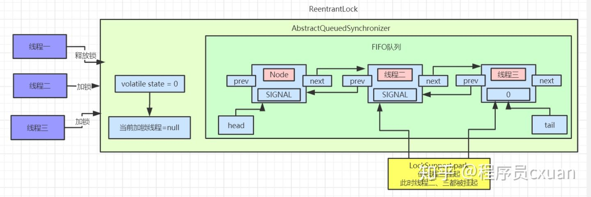

接着执行java.util.concurrent.locks.AbstractQueuedSynchronizer.unparkSuccessor()方法，唤醒head的后置节点：

```
private void unparkSuccessor(Node node) {
    int ws = node.waitStatus;
    if (ws < 0)
        compareAndSetWaitStatus(node, ws, 0);
    Node s = node.next;
    if (s == null || s.waitStatus > 0) {
        s = null;
        for (Node t = tail; t != null && t != node; t = t.prev)
            if (t.waitStatus <= 0)
                s = t;
    }
    if (s != null)
        LockSupport.unpark(s.thread);
}
```

这里主要是将head节点的waitStatus设置为0。

此时重新将head指针指向线程二对应的Node节点，且使用LockSupport.unpark方法来唤醒线程二。

被唤醒的线程二会接着尝试获取锁，用CAS指令修改state数据。

执行完成后可以查看AQS中数据：

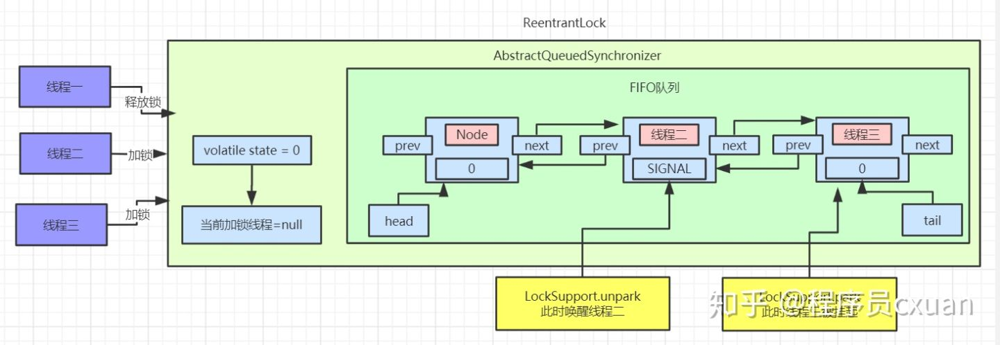

此时线程二被唤醒，线程二接着之前被park的地方继续执行，继续执行acquireQueued()方法。

#### 线程二唤醒继续加锁

```
final boolean acquireQueued(final Node node, int arg) {
    boolean failed = true;
    try {
        boolean interrupted = false;
        for (;;) {
            final Node p = node.predecessor();
            if (p == head && tryAcquire(arg)) {
                setHead(node);
                p.next = null;
                failed = false;
                return interrupted;
            }
            if (shouldParkAfterFailedAcquire(p, node) &&
                parkAndCheckInterrupt())
                interrupted = true;
        }
    } finally {
        if (failed)
            cancelAcquire(node);
    }
}
```

此时线程二被唤醒，继续执行for循环，判断线程二的前置节点是否为head，如果是则继续使用tryAcquire()方法来尝试获取锁，其实就是使用CAS操作来修改state值，如果修改成功则代表获取锁成功。接着将线程二设置为head节点，然后空置之前的head节点数据，被空置的节点数据等着被垃圾回收。

此时线程二获取锁成功，AQS中队列数据如下：

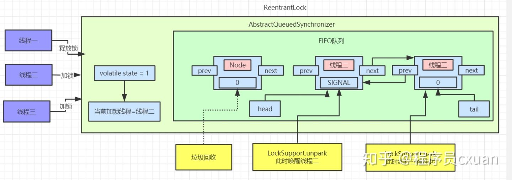

等待队列中的数据都等待着被垃圾回收。

#### 线程二释放锁/线程三加锁

当线程二释放锁时，会唤醒被挂起的线程三，流程和上面大致相同，被唤醒的线程三会再次尝试加锁，具体代码可以参考上面内容。具体流程图如下：

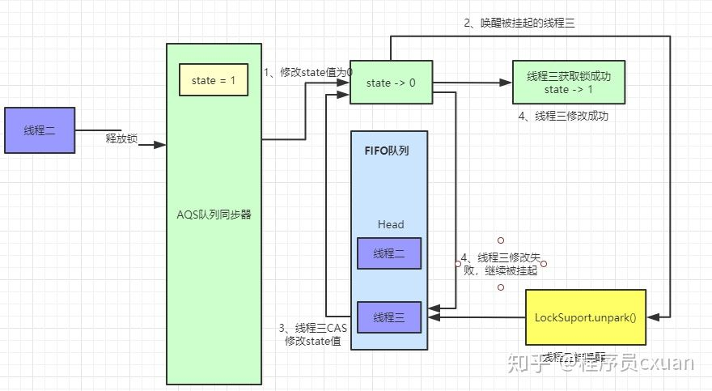

此时AQS中队列数据如图：

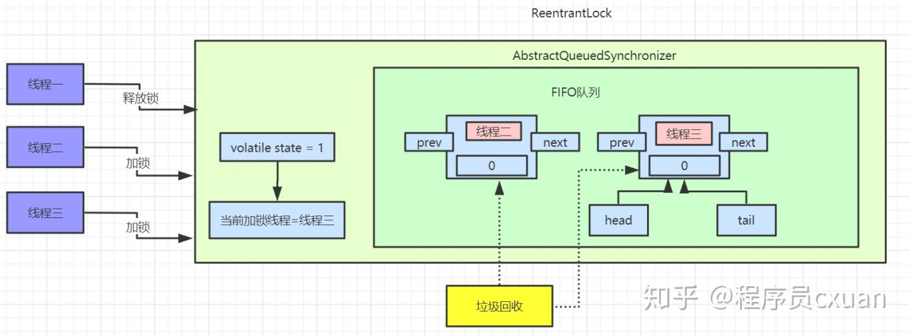

#### 公平锁实现原理

上面所有的加锁场景都是基于非公平锁来实现的，非公平锁是ReentrantLock的默认实现，那我们接着来看一下公平锁的实现原理，这里先用一张图来解释公平锁和非公平锁的区别：

非公平锁执行流程：

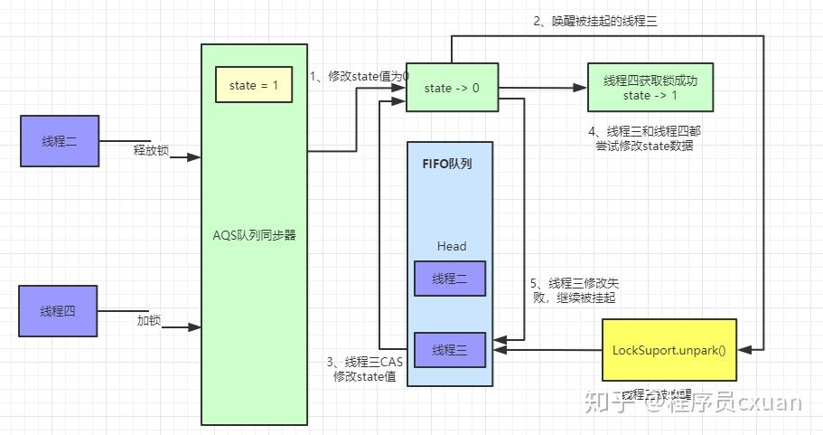

这里我们还是用之前的线程模型来举例子，当线程二释放锁的时候，唤醒被挂起的线程三，线程三执行tryAcquire()方法使用CAS操作来尝试修改state值，如果此时又来了一个线程四也来执行加锁操作，同样会执行tryAcquire()方法。

这种情况就会出现竞争，线程四如果获取锁成功，线程三仍然需要待在等待队列中被挂起。这就是所谓的非公平锁，线程三辛辛苦苦排队等到自己获取锁，却眼巴巴的看到线程四插队获取到了锁。

公平锁执行流程：

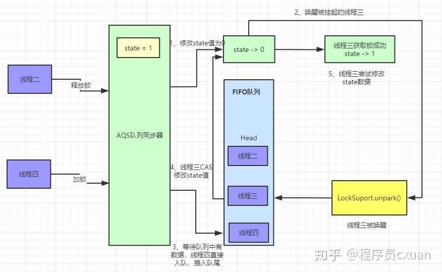

公平锁在加锁的时候，会先判断AQS等待队列中是存在节点，如果存在节点则会直接入队等待，具体代码如下.

公平锁在获取锁是也是首先会执行acquire()方法，只不过公平锁单独实现了tryAcquire()方法：

java.util.concurrent.locks.AbstractQueuedSynchronizer.acquire():

```
public final void acquire(int arg) {
    if (!tryAcquire(arg) &&
        acquireQueued(addWaiter(Node.EXCLUSIVE), arg))
        selfInterrupt();
}
```

这里会执行ReentrantLock中公平锁的tryAcquire()方法

java.util.concurrent.locks.ReentrantLock.FairSync.tryAcquire():

```
static final class FairSync extends Sync {
    protected final boolean tryAcquire(int acquires) {
        final Thread current = Thread.currentThread();
        int c = getState();
        if (c == 0) {
            if (!hasQueuedPredecessors() &&
                compareAndSetState(0, acquires)) {
                setExclusiveOwnerThread(current);
                return true;
            }
        }
        else if (current == getExclusiveOwnerThread()) {
            int nextc = c + acquires;
            if (nextc < 0)
                throw new Error("Maximum lock count exceeded");
            setState(nextc);
            return true;
        }
        return false;
    }
}
```

这里会先判断state值，如果不为0且获取锁的线程不是当前线程，直接返回false代表获取锁失败，被加入等待队列。如果是当前线程则可重入获取锁。

如果state=0则代表此时没有线程持有锁，执行hasQueuedPredecessors()判断AQS等待队列中是否有元素存在，如果存在其他等待线程，那么自己也会加入到等待队列尾部，做到真正的先来后到，有序加锁。具体代码如下：

java.util.concurrent.locks.AbstractQueuedSynchronizer.hasQueuedPredecessors():

```
public final boolean hasQueuedPredecessors() {
    Node t = tail;
    Node h = head;
    Node s;
    return h != t &&
        ((s = h.next) == null || s.thread != Thread.currentThread());
}
```

这段代码很有意思，返回false代表队列中没有节点或者仅有一个节点是当前线程创建的节点。返回true则代表队列中存在等待节点，当前线程需要入队等待。

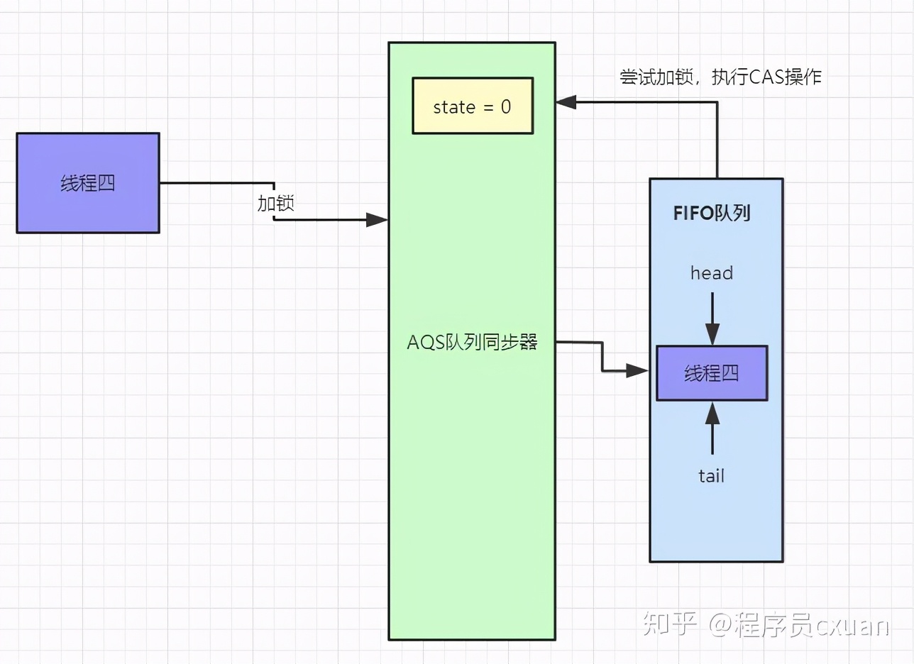

先判断head是否等于tail，如果队列中只有一个Node节点，那么head会等于tail。

接着判断(s = h.next) == null，这种属于一种极端情况，在enq()入队操作中，此时不是原子性操作，可能存在这种情况：

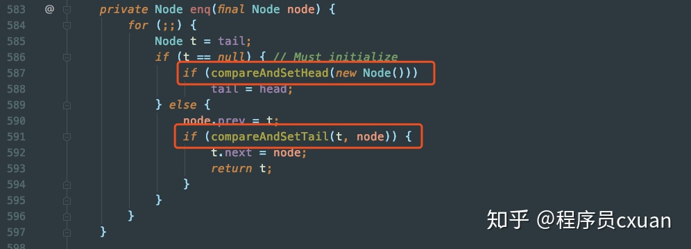

在第一个红框处，例如 线程一 执行完成，此时head已经有值，而还未执行tail=head的时候，此时 线程二 判断 head != tail成立。而接着 线程一 执行完第二个红框处，此时tail = node，但是并未将head.next指向node。而这时 线程二 就会得到head.next == null成立，直接返回true。这种情况代表有节点正在做入队操作。

如果head.next不为空，那么接着判断head.next节点是否为当前线程，如果不是则返回false。大家要记清楚，返回false代表FIFO队列中没有等待获取锁的节点，此时线程可以直接尝试获取锁，如果返回true代表有等待线程，当前线程如要入队排列，这就是体现公平锁的地方。

非公平锁和公平锁的区别：
非公平锁性能高于公平锁性能。非公平锁可以减少CPU唤醒线程的开销，整体的吞吐效率会高点，CPU也不必取唤醒所有线程，会减少唤起线程的数量

非公平锁性能虽然优于公平锁，但是会存在导致线程饥饿的情况。在最坏的情况下，可能存在某个线程一直获取不到锁。不过相比性能而言，饥饿问题可以暂时忽略，这可能就是ReentrantLock默认创建非公平锁的原因之一了。

### Condition实现原理

#### Condition简介

上面已经介绍了AQS所提供的核心功能，当然它还有很多其他的特性，这里我们来继续说下Condition这个组件。

Condition是在java 1.5中才出现的，它用来替代传统的Object的wait()、notify()实现线程间的协作，相比使用Object的wait()、notify()，使用Condition中的await()、signal()这种方式实现线程间协作更加安全和高效。因此通常来说比较推荐使用Condition

其中AbstractQueueSynchronizer中实现了Condition中的方法，主要对外提供awaite(Object.wait())和signal(Object.notify())调用。

#### Condition Demo示例

```
public class ReentrantLockDemo {
    static ReentrantLock lock = new ReentrantLock();

    public static void main(String[] args) {
        Condition condition = lock.newCondition();

        new Thread(() -> {
            lock.lock();
            try {
                System.out.println("线程一加锁成功");
                System.out.println("线程一执行await被挂起");
                condition.await();
                System.out.println("线程一被唤醒成功");
            } catch (Exception e) {
                e.printStackTrace();
            } finally {
                lock.unlock();
                System.out.println("线程一释放锁成功");
            }
        }).start();

        new Thread(() -> {
            lock.lock();
            try {
                System.out.println("线程二加锁成功");
                condition.signal();
                System.out.println("线程二唤醒线程一");
            } finally {
                lock.unlock();
                System.out.println("线程二释放锁成功");
            }
        }).start();
    }
}
```

这里线程一先获取锁，然后使用await()方法挂起当前线程并释放锁，线程二获取锁后使用signal唤醒线程一。


#### Condition实现原理图解

我们还是用上面的demo作为实例，执行的流程如下：

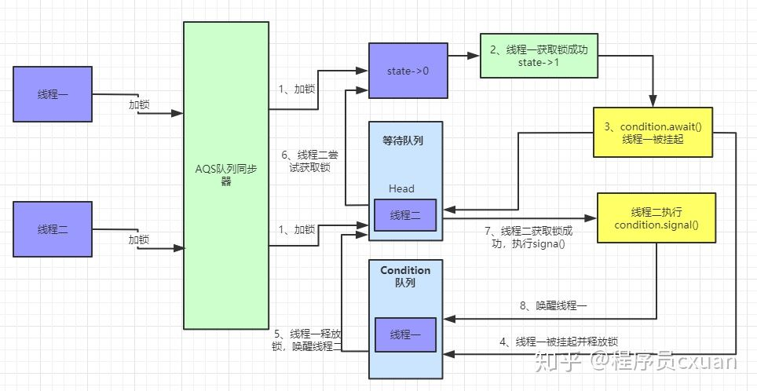


线程一执行await()方法：

先看下具体的代码实现，#java.util.concurrent.locks.AbstractQueuedSynchronizer.ConditionObject.await()：

```
public final void await() throws InterruptedException {
    if (Thread.interrupted())
        throw new InterruptedException();
    Node node = addConditionWaiter();
    int savedState = fullyRelease(node);
    int interruptMode = 0;
    while (!isOnSyncQueue(node)) {
        LockSupport.park(this);
        if ((interruptMode = checkInterruptWhileWaiting(node)) != 0)
            break;
    }
    if (acquireQueued(node, savedState) && interruptMode != THROW_IE)
        interruptMode = REINTERRUPT;
    if (node.nextWaiter != null) // clean up if cancelled
        unlinkCancelledWaiters();
    if (interruptMode != 0)
        reportInterruptAfterWait(interruptMode);
}
```

await()方法中首先调用addConditionWaiter()将当前线程加入到Condition队列中。

执行完后我们可以看下Condition队列中的数据：

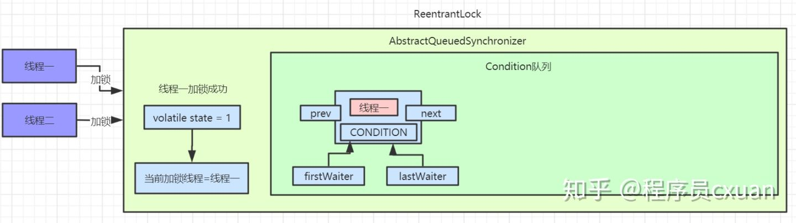

```
private Node addConditionWaiter() {
    Node t = lastWaiter;
    if (t != null && t.waitStatus != Node.CONDITION) {
        unlinkCancelledWaiters();
        t = lastWaiter;
    }
    Node node = new Node(Thread.currentThread(), Node.CONDITION);
    if (t == null)
        firstWaiter = node;
    else
        t.nextWaiter = node;
    lastWaiter = node;
    return node;
}
```

这里会用当前线程创建一个Node节点，waitStatus为CONDITION。接着会释放该节点的锁，调用之前解析过的release()方法，释放锁后此时会唤醒被挂起的线程二，线程二会继续尝试获取锁。

接着调用isOnSyncQueue()方法是判断当前的线程节点是不是在同步队列中，因为上一步已经释放了锁，也就是说此时可能有线程已经获取锁同时可能已经调用了singal()方法，如果已经唤醒，那么就不应该park了，而是退出while方法，从而继续争抢锁。

此时线程一被挂起，线程二获取锁成功。

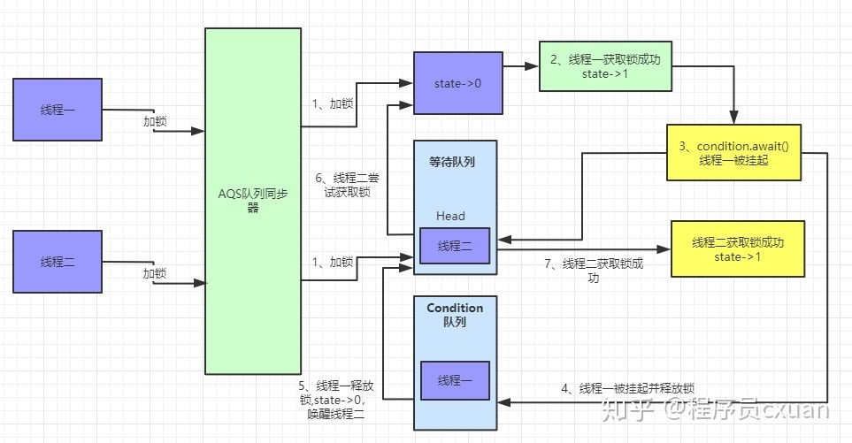

线程二执行signal()方法：

首先我们考虑下线程二已经获取到锁，此时AQS等待队列中已经没有了数据。

接着就来看看线程二唤醒线程一的具体执行流程：

```
public final void signal() {
    if (!isHeldExclusively())
        throw new IllegalMonitorStateException();
    Node first = firstWaiter;
    if (first != null)
        doSignal(first);
}
```

先判断当前线程是否为获取锁的线程，如果不是则直接抛出异常。
接着调用doSignal()方法来唤醒线程。

```
private void doSignal(Node first) {
    do {
        if ( (firstWaiter = first.nextWaiter) == null)
            lastWaiter = null;
        first.nextWaiter = null;
    } while (!transferForSignal(first) &&
             (first = firstWaiter) != null);
}

final boolean transferForSignal(Node node) {
    if (!compareAndSetWaitStatus(node, Node.CONDITION, 0))
        return false;

    Node p = enq(node);
    int ws = p.waitStatus;
    if (ws > 0 || !compareAndSetWaitStatus(p, ws, Node.SIGNAL))
        LockSupport.unpark(node.thread);
    return true;
}

/**
 * Inserts node into queue, initializing if necessary. See picture above.
 * @param node the node to insert
 * @return node's predecessor
 */
private Node enq(final Node node) {
    for (;;) {
        Node t = tail;
        if (t == null) { // Must initialize
            if (compareAndSetHead(new Node()))
                tail = head;
        } else {
            node.prev = t;
            if (compareAndSetTail(t, node)) {
                t.next = node;
                return t;
            }
        }
    }
}
```

这里先从transferForSignal()方法来看，通过上面的分析我们知道Condition队列中只有线程一创建的一个Node节点，且waitStatue为CONDITION，先通过CAS修改当前节点waitStatus为0，然后执行enq()方法将当前线程加入到等待队列中，并返回当前线程的前置节点。

加入等待队列的代码在上面也已经分析过，此时等待队列中数据如下图：

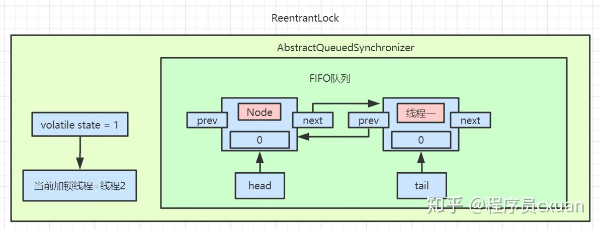

接着开始通过CAS修改当前节点的前置节点waitStatus为SIGNAL，并且唤醒当前线程。此时AQS中等待队列数据为：

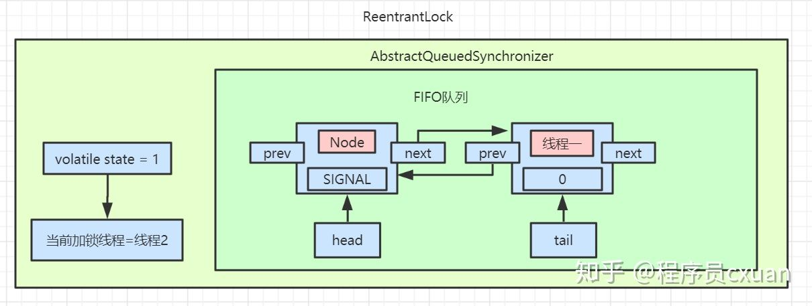

线程一被唤醒后，继续执行await()方法中的while循环。

```
public final void await() throws InterruptedException {
    if (Thread.interrupted())
        throw new InterruptedException();
    Node node = addConditionWaiter();
    int savedState = fullyRelease(node);
    int interruptMode = 0;
    while (!isOnSyncQueue(node)) {
        LockSupport.park(this);
        if ((interruptMode = checkInterruptWhileWaiting(node)) != 0)
            break;
    }
    if (acquireQueued(node, savedState) && interruptMode != THROW_IE)
        interruptMode = REINTERRUPT;
    if (node.nextWaiter != null) // clean up if cancelled
        unlinkCancelledWaiters();
    if (interruptMode != 0)
        reportInterruptAfterWait(interruptMode);
}
```

因为此时线程一的waitStatus已经被修改为0，所以执行isOnSyncQueue()方法会返回false。跳出while循环。

接着执行acquireQueued()方法，这里之前也有讲过，尝试重新获取锁，如果获取锁失败继续会被挂起。直到另外线程释放锁才被唤醒。

```
final boolean acquireQueued(final Node node, int arg) {
    boolean failed = true;
    try {
        boolean interrupted = false;
        for (;;) {
            final Node p = node.predecessor();
            if (p == head && tryAcquire(arg)) {
                setHead(node);
                p.next = null;
                failed = false;
                return interrupted;
            }
            if (shouldParkAfterFailedAcquire(p, node) &&
                parkAndCheckInterrupt())
                interrupted = true;
        }
    } finally {
        if (failed)
            cancelAcquire(node);
    }
}
```

此时线程一的流程都已经分析完了，等线程二释放锁后，线程一会继续重试获取锁，流程到此终结。

### Condition总结

我们总结下Condition和wait/notify的比较：

* Condition可以精准的对多个不同条件进行控制，wait/notify只能和synchronized关键字一起使用，并且只能唤醒一个或者全部的等待队列；
* Condition需要使用Lock进行控制，使用的时候要注意lock()后及时的unlock()，Condition有类似于await的机制，因此不会产生加锁方式而产生的死锁出现，同时底层实现的是park/unpark的机制，因此也不会产生先唤醒再挂起的死锁，一句话就是不会产生死锁，但是wait/notify会产生先唤醒再挂起的死锁。

## 通过AQS是如何设置链表尾巴的来理解AQS为什么效率这么高

我们的思路是什么呢？假如你要往一个链表上添加尾巴，尤其是好多线程都要往链表上添加尾巴，我们仔细想想看用普通的方法怎么做？第一点要加锁这一点是肯定的，因为多线程，你要保证线程安全，一般的情况下，我们会锁定整个链表(Sync)，我们的新线程来了以后，要加到尾巴上，这样很正常，但是我们锁定整个链表的话，锁的太多太大了，现在呢它用的并不是锁定整个链表的方法，而是只观测tail这一个节点就可以了，怎么做到的呢？compareAndAetTail(oldTail,node)，中oldTail是它的预期值，假如说我们想把当前线程设置为整个链表尾巴的过程中，另外一个线程来了，它插入了一个节点，那么仔细想一下Node oldTail = tail;的整个oldTail还等于整个新的Tail吗？不等于了吧，那么既然不等于了，说明中间有线程被其它线程打断了，那如果说却是还是等于原来的oldTail，这个时候就说明没有线程被打断，那我们就接着设置尾巴，只要设置成功了OK，compareAndAetTail(oldTail,node)方法中的参数node就做为新的Tail了，所以用了CAS操作就不需要把原来的整个链表上锁，这也是AQS在效率上比较高的核心。