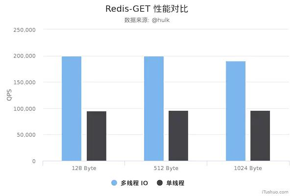
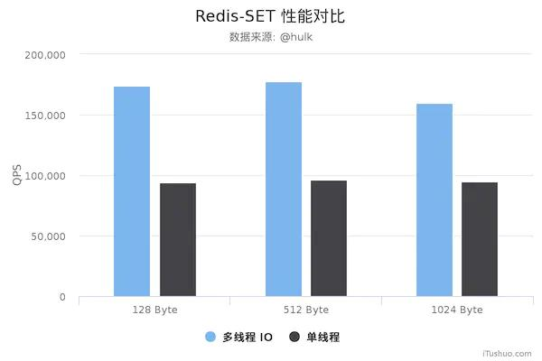
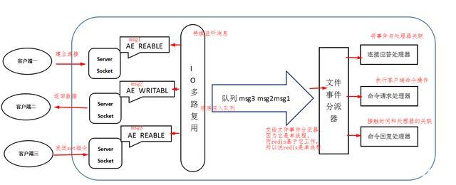
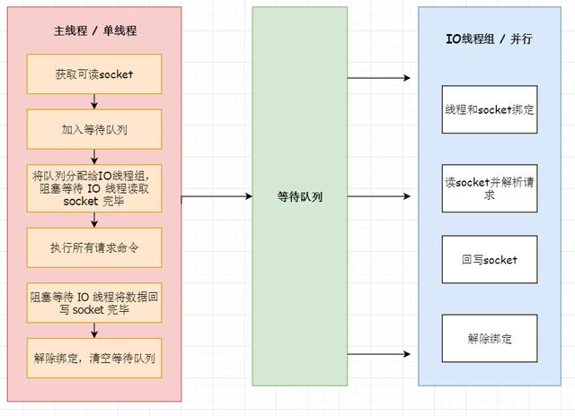
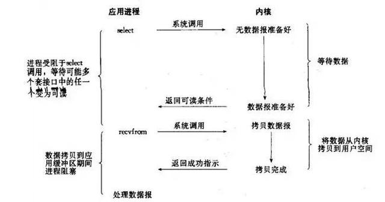

# Redis 6.0之前为什么一直不使用多线程？

Redis 6.0在5.2号这个美好的日子里悄无声息的发布了，这次发布在IT圈犹如一颗惊雷一般，因为这是redis最大的一次改版，首次加入了多线程。

作者Antirez在RC1版本发布时在他的博客写下：

the most “enterprise” Redis version to date // 最”企业级”的

the largest release of Redis ever as far as I can tell // 最大的

the one where the biggest amount of people participated // 参与人数最多的

这次改变，性能有个飞速的提升~

先po出新版和旧版性能图：

从上面可以看到 GET/SET 命令在 4 线程 IO 时性能相比单线程是几乎是翻倍了。另外，这些数据只是为了简单验证多线程 IO 是否真正带来性能优化，并没有针对严谨的延时控制和不同并发的场景进行压测。
数据仅供验证参考而不能作为线上指标，且只是目前的 unstble分支的性能，不排除后续发布的正式版本的性能会更好。

### Redis 6.0 之前的版本真的是单线程吗？

Redis基于Reactor模式开发了网络事件处理器，这个处理器被称为文件事件处理器。它的组成结构为4部分：多个套接字、IO多路复用程序、文件事件分派器、事件处理器。
因为文件事件分派器队列的消费是单线程的，所以Redis才叫单线程模型。

一般来说 Redis 的瓶颈并不在 CPU，而在内存和网络。如果要使用 CPU 多核，可以搭建多个 Redis 实例来解决。

其实，Redis 4.0 开始就有多线程的概念了，比如 Redis 通过多线程方式在后台删除对象、以及通过 Redis 模块实现的阻塞命令等。

### Redis 6.0 之前为什么一直不使用多线程？

使用了单线程后，可维护性高。多线程模型虽然在某些方面表现优异，但是它却引入了程序执行顺序的不确定性，带来了并发读写的一系列问题，增加了系统复杂度、同时可能存在线程切换、甚至加锁解锁、死锁造成的性能损耗。

Redis 通过 AE 事件模型以及 IO 多路复用等技术，处理性能非常高，因此没有必要使用多线程。

单线程机制使得 Redis 内部实现的复杂度大大降低，Hash 的惰性 Rehash、Lpush 等等 “线程不安全” 的命令都可以无锁进行。

### Redis 6.0 为什么要引入多线程呢？

之前的段落说了，Redis 的瓶颈并不在 CPU，而在内存和网络。

内存不够的话，可以加内存或者做数据结构优化和其他优化等，但网络的性能优化才是大头，网络 IO 的读写在 Redis 整个执行期间占用了大部分的 CPU 时间，如果把网络处理这部分做成多线程处理方式，那对整个 Redis 的性能会有很大的提升。

**优化方向：**

* 提高网络 IO 性能，典型的实现比如使用 DPDK 来替代内核网络栈的方式。
* 使用多线程充分利用多核，典型的实现比如 Memcached。

**所以总结起来，Redis 支持多线程主要就是两个原因：**

* 可以充分利用服务器 CPU 资源，目前主线程只能利用一个核。
* 多线程任务可以分摊 Redis 同步 IO 读写负荷。

### Redis 6.0 默认是否开启了多线程？

否，在conf文件进行配置

io-threads-do-reads yes

io-threads 线程数

官方建议：4 核的机器建议设置为 2 或 3 个线程，8 核的建议设置为 6 个线程，线程数一定要小于机器核数，尽量不超过8个。

### Redis 6.0 多线程的实现机制？

**流程简述如下：**

* 主线程负责接收建立连接请求，获取 Socket 放入全局等待读处理队列。
* 主线程处理完读事件之后，通过 RR（Round Robin）将这些连接分配给这些 IO 线程。
* 主线程阻塞等待 IO 线程读取 Socket 完毕。
* 主线程通过单线程的方式执行请求命令，请求数据读取并解析完成，但并不执行。
* 主线程阻塞等待 IO 线程将数据回写 Socket 完毕。
* 解除绑定，清空等待队列。

**该设计有如下特点：**

* IO 线程要么同时在读 Socket，要么同时在写，不会同时读或写。
* IO 线程只负责读写 Socket 解析命令，不负责命令处理。
* 开启多线程后，是否会存在线程并发安全问题？
* 不会，Redis 的多线程部分只是用来处理网络数据的读写和协议解析，执行命令仍然是单线程顺序执行。

### Redis 线程中经常提到 IO 多路复用，如何理解？

这是 IO 模型的一种，即经典的 Reactor 设计模式，有时也称为异步阻塞 IO。

多路指的是多个 Socket 连接，复用指的是复用一个线程。多路复用主要有三种技术：Select，Poll，Epoll。

epoll 是最新的也是目前最好的多路复用技术。采用多路 I/O 复用技术可以让单个线程高效的处理多个连接请求（尽量减少网络 IO 的时间消耗），且 Redis 在内存中操作数据的速度非常快（内存内的操作不会成为这里的性能瓶颈），主要以上两点造就了 Redis 具有很高的吞吐量。

