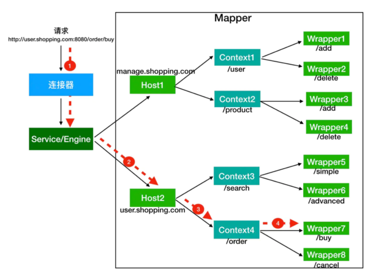

# Tomcat

在阅读tomcat源码之前，有必要了解一下tomcat的多层容器设计，这样读起来会省很多力气。


上图就是tomcat的基本结构，可以很明显的看出层层嵌套的架构设计。简易启动一个tomcat的代码如下:

```java
 public static void main(String[] args) throws LifecycleException {
        Tomcat tomcat = new Tomcat();
        //设置路径
        tomcat.setBaseDir("d:tomcat/dir");

        Connector connector = new Connector();
        //设置端口
        connector.setPort(8080);
        tomcat.getService().addConnector(connector);

        Context context = new StandardContext();
        //设置context路径
        context.setPath("");
        context.addLifecycleListener(new Tomcat.FixContextListener());
        tomcat.getHost().addChild(context);

        //添加servlet
        tomcat.addServlet("", "homeServlet", new HomeServlet());
        //设置servlet路径
        context.addServletMappingDecoded("/", "homeServlet");

        tomcat.start();
        tomcat.getServer().await();

    }

```

下面就来分析一下这段启动代码的逻辑。首先进入tomcat的start方法。

```java
    public void start() throws LifecycleException {
        getServer();
        server.start();
    }
```
可以看到先是通过getServer方法判断是否存在server容器。如果不存在则新建。server容器就是结构图的最外层容器了。随后进入server的start方法。进入之后会发现server继承了LifecycleBase这个抽象类，而LifecycleBase实现了Lifecycle接口。这个接口就是控制容器生命周期的接口。查看接口方法可以看到有init，start和stop方法。我们先看看LifecycleBase的start方法


```java
   public final synchronized void start() throws LifecycleException {
        ...
        if (state.equals(LifecycleState.NEW)) {
            init();
        }
        ...
        try {
            ...
            startInternal();
            ...
        } catch (Throwable t) {
            ...
        }
    }

```

可以看到在start方法中，根据容器的状态控制了容器的启动流程。在启动时候任一点出错的话，可以安全的退出。这样的话每个容器就只需要关注自己的init方法和startInternal方法就可以了。现在查看一下server的startInternal方法。

```java
    protected void startInternal() throws LifecycleException {

        ...
        // Start our defined Services
        synchronized (servicesLock) {
            for (int i = 0; i < services.length; i++) {
                services[i].start();
            }
        }
        ...
    }

```

可以看到server的startInternal方法主要任务就是启动service。这也正好是开始那个tomcat结构图的结构，外层控制内层容器的启动。接下来看看service容器的启动。直接查看StandardService的init方法和start方法。


```java
    protected void initInternal() throws LifecycleException {
        if (engine != null) {
            engine.init();
        }
        ...
        mapperListener.init();
        synchronized (connectorsLock) {
            for (Connector connector : connectors) {
                connector.init();
            }
        }
    }

```

在service的init方法中，首先初始化了engine，然后初始化mapper，最后初始化connector。这也很好理解，因为只有内部启动之后才能对外提供服务。

接下来先看看engine的启动，在看engine启动前，需要先了解下engine里面各层容器的作用。

Context 表示一个 Web 应用程序；Wrapper 表示一个 Servlet，一个 Web 应用程序中可能会有多个 Servlet；Host 代表的是一个虚拟主机，或者说一个站点，可以给 Tomcat 配置多个虚拟主机地址，而一个虚拟主机下可以部署多个 Web 应用程序；Engine 表示引擎，用来管理多个虚拟站点，一个 Service 最多只能有一个 Engine。

他们对外提供服务的路由是这样的。



在搞清楚这层关系之后，再看engine的启动就很简单了。engine管理的几个容器host，context和wrapper比之前多了一个继承就是 ContainerBase。他们的实现都继承了这个类。所以要研究的话直接看下这个类的实现。

```java
在ContainerBase里，子类是以map的形式存在hash表中
protected final HashMap<String, Container> children = new HashMap<>();
```

看一下ContainerBase的start方法。

```java
    protected synchronized void startInternal() throws LifecycleException {
        ...
        Container children[] = findChildren();
        List<Future<Void>> results = new ArrayList<>();
        for (int i = 0; i < children.length; i++) {
            results.add(startStopExecutor.submit(new StartChild(children[i])));
        }

        MultiThrowable multiThrowable = null;

        for (Future<Void> result : results) {
            try {
                result.get();
            } catch (Throwable e) {
                ...
            }

        }
        ...
    }

```

可以看到在父容器的启动方法中，逐个的启动了子类容器。这样的话tomcat的大体启动流程就差不多了解了。接下来要做的就是根据具体功能，分析单个组件。

## Tomcat如何接收请求

#### 创建过程

首先看一下Connector的创建过程。

```java
Connector connector = new Connector();

public Connector() {
    //默认的连接器协议是nio的http 1.1协议
    this("org.apache.coyote.http11.Http11NioProtocol");
    //创建过程只是简单调用一下构造函数
}

//所以可以直接看Http11NioProtocol的创建过程
public Http11NioProtocol() {
    super(new NioEndpoint());
}

//可以看到在Http11NioProtocol中，自己新建了一个EndPoint这也正好对应了上一节tomcat的结构图
```


#### 启动过程

创建过程看完了下面来看看启动过程，因为上一节已经说过了tomcat的容器结构，所以启动过程可以直接从Connector的init方法开始

```java
    protected void initInternal() throws LifecycleException {
        ...
        try {
            protocolHandler.init();
        } catch (Exception e) {
            ...
        }
    }
```

Connector的init方法，除了设置一些初始化值外，就是调用protocolHandler的init方法了。所以查看protocolHandler的init方法，

```java
    //查看AbstractProtocol中的init方法
    public void init() throws Exception {
        ...
        String endpointName = getName();
        endpoint.setName(endpointName.substring(1, endpointName.length()-1));
        endpoint.setDomain(domain);
        endpoint.init();
    }
```
在进行了一些初始化设置之后调用了endpoint的init方法。进入endpoint查看

```java
//进入AbstractEndpoint的init方法
    public final void init() throws Exception {
        if (bindOnInit) {
            bindWithCleanup();
            bindState = BindState.BOUND_ON_INIT;
        }
        ...
    }
    
    private void bindWithCleanup() throws Exception {
        try {
            bind();
        } catch (Throwable t) {
            ...
        }
    }
    
    public void bind() throws Exception {
        //初始化ServerSocket
        initServerSocket();
        ...
        selectorPool.open();
    }
    //这边可以看到初始化ServerSocket的方法，还有初始化了一个selector，但是这个连接器不是在接收连接时候用的，暂时先放一放
    
    protected void initServerSocket() throws Exception {
        if (!getUseInheritedChannel()) {
            //绑定端口的方法和我们平时开发都一样。
            serverSock = ServerSocketChannel.open();
            socketProperties.setProperties(serverSock.socket());
            InetSocketAddress addr = new InetSocketAddress(getAddress(), getPortWithOffset());
            serverSock.socket().bind(addr,getAcceptCount());
        } else {
            ...
        }
        serverSock.configureBlocking(true); //mimic APR behavior
    }
```

init过程到这个就结束了，这个时候端口就已经绑定了，下一步去看看接收的socket如何处理。

查看Connector的start方法。
```java
  protected void startInternal() throws LifecycleException {
        //...
        try {
            protocolHandler.start();
        } catch (Exception e) {
            ...
        }
    }
    
    public void start() throws Exception {
        //...
        endpoint.start();
        //...
    }
    
    public final void start() throws Exception {
        if (bindState == BindState.UNBOUND) {
            //刚刚init的时候已经绑定了，所以这边不会在绑定一次
            bindWithCleanup();
            bindState = BindState.BOUND_ON_START;
        }
        //直接会进入start方法
        startInternal();
    }
    
    public void startInternal() throws Exception {

        if (!running) {
            running = true;
            paused = false;
            //一些缓存类的初始化
            processorCache = new SynchronizedStack<>(SynchronizedStack.DEFAULT_SIZE,
                    socketProperties.getProcessorCache());
            eventCache = new SynchronizedStack<>(SynchronizedStack.DEFAULT_SIZE,
                            socketProperties.getEventCache());
            nioChannels = new SynchronizedStack<>(SynchronizedStack.DEFAULT_SIZE,
                    socketProperties.getBufferPool());

            // Create worker collection
            if ( getExecutor() == null ) {
                //初始化线程池，这个待会再说
                createExecutor();
            }

            initializeConnectionLatch();

            //先看一下Poller线程和Acceptor线程
            pollers = new Poller[getPollerThreadCount()];
            for (int i=0; i<pollers.length; i++) {
                pollers[i] = new Poller();
                Thread pollerThread = new Thread(pollers[i], getName() + "-ClientPoller-"+i);
                pollerThread.setPriority(threadPriority);
                pollerThread.setDaemon(true);
                pollerThread.start();
            }

            startAcceptorThreads();
        }
    }
```

在endpoint启动的过程中，我们看到他启动了两个不同名称的线程一个叫Poller，一个叫Acceptor。这两个线程从名字也可以看出，一个是接收socket的，另一个是分发任务的。分别查看他们代码。
```java
//虽然启动是先启动poller，但是我们需要先查看acceptor
public Acceptor(AbstractEndpoint<?,U> endpoint) {
    //初始化放入endpoint
    this.endpoint = endpoint;
}

    //因为继承了Runnable类，所以查看run方法
    public void run() {

        int errorDelay = 0;
        while (endpoint.isRunning()) {
            //...
            try {
                //如果达到最大连接就阻塞
                endpoint.countUpOrAwaitConnection();

                //...
                try {
                    //...
                    //接收新建立的socket
                    socket = endpoint.serverSocketAccept();
                } catch (Exception ioe) {
                    //...
                }
                //...
                if (endpoint.isRunning() && !endpoint.isPaused()) {
                    //...
                    //在set方法中新socket会被推给poller处理
                    if (!endpoint.setSocketOptions(socket)) {
                        endpoint.closeSocket(socket);
                    }
                } else {
                    endpoint.destroySocket(socket);
                }
            } catch (Throwable t) {
                ...
            }
        }
        state = AcceptorState.ENDED;
    }
```
acceptor的方法主要分为几步。

1. 判断连接数量是否超过限制
2. 新建立连接并设置相关属性
3. 将接收到的连接推给poller

下面接着看是怎么推送给poller的
```java
    protected boolean setSocketOptions(SocketChannel socket) {
        try {
            //...设置一些属性值
            //在这边会吧任务注册到poller
            getPoller0().register(channel);
        } catch (Throwable t) {
            //...
        }
        return true;
    }
    
public void register(final NioChannel socket) {
    //注册的过程也很简单，往poller的队列里添加了一个任务
    addEvent(r);
}
```

接下来就看看poller怎么处理了
```java
 //因为poller也是实现了Runnable接口，所以也直接查看run方法
    public void run() {
        // Loop until destroy() is called
        while (true) {
            boolean hasEvents = false;
            try {
                if (!close) {
                    处理任务队列的任务
                    hasEvents = events();
                    ...
                }
                if (close) {
                    ...
                }
            } catch (Throwable x) {
                ...
            }
            Iterator<SelectionKey> iterator =
                keyCount > 0 ?selector.selectedKeys().iterator() : null;
            while (iterator != null && iterator.hasNext()) {
                SelectionKey sk = iterator.next();
                NioSocketWrapper attachment = (NioSocketWrapper)sk.attachment();
                if (attachment == null) {
                    iterator.remove();
                } else {
                    iterator.remove();
                    processKey(sk, attachment);
                }
            }
            timeout(keyCount,hasEvents);
        }
        getStopLatch().countDown();
```
poller任务分两部，一是处理任务队列，二是处理注册的socket

先看处理任务队列

```java
public boolean events() {
    boolean result = false;
    PollerEvent pe = null;
    for (int i = 0, size = events.size(); i < size && (pe = events.poll()) != null; i++ ) {
        result = true;
        try {
            //处理任务队列相对简单，只是调用一下run方法
            pe.run();
            pe.reset();
            ...
        } catch ( Throwable x ) {
            ...
        }
    }
    return result;
}

public void run() {
    if (interestOps == OP_REGISTER) {
        try {
            //在run方法中，socket会将自己注册到poller的selector上
            socket.getIOChannel().register(
                    socket.getPoller().getSelector(), SelectionKey.OP_READ, socketWrapper);
        } catch (Exception x) {
            log.error(sm.getString("endpoint.nio.registerFail"), x);
        }
    } else {
        ...
    }
}
```
此时刚刚accpetor推送过来的socket已经被注册到poller上了。接下来看看poller对socket的处理

```java
protected void processKey(SelectionKey sk, NioSocketWrapper attachment) {
    try {
        if ( close ) {
            cancelledKey(sk);
        } else if ( sk.isValid() && attachment != null ) {
            if (sk.isReadable() || sk.isWritable() ) {
                if ( attachment.getSendfileData() != null ) {
                    processSendfile(sk,attachment, false);
                } else {
                    unreg(sk, attachment, sk.readyOps());
                    boolean closeSocket = false;
                    //主要看看processSocket方法
                    if (sk.isReadable()) {
                        if (!processSocket(attachment, SocketEvent.OPEN_READ, true)) {
                            closeSocket = true;
                        }
                    }
                    if (!closeSocket && sk.isWritable()) {
                        if (!processSocket(attachment, SocketEvent.OPEN_WRITE, true)) {
                            closeSocket = true;
                        }
                    }
                    if (closeSocket) {
                        cancelledKey(sk);
                    }
                }
            }
        } else {
            //invalid key
            cancelledKey(sk);
        }
    } catch ( CancelledKeyException ckx ) {
        ...
    }
}

public boolean processSocket(SocketWrapperBase<S> socketWrapper,
        SocketEvent event, boolean dispatch) {
    try {
        if (socketWrapper == null) {
            return false;
        }
        //封装了socket任务
        SocketProcessorBase<S> sc = processorCache.pop();
        if (sc == null) {
            sc = createSocketProcessor(socketWrapper, event);
        } else {
            sc.reset(socketWrapper, event);
        }
        //将socket任务丢给线程池执行。
        Executor executor = getExecutor();
        if (dispatch && executor != null) {
            executor.execute(sc);
        } else {
            sc.run();
        }
    } catch (RejectedExecutionException ree) {
        ...
    } catch (Throwable t) {
        ...
    }
    return true;
}
```
分析到这儿的话，tomcat对于接收连接的处理就差不多了。我们已经了解了acceptor和poller是如何协作的。最后在看看tomcat中线程池。

回到刚刚线程池创建的地方
```java
public void createExecutor() {
    internalExecutor = true;
    //这个队列就是对LinkedBlockingQueue的简单封装
    TaskQueue taskqueue = new TaskQueue();
    TaskThreadFactory tf = new TaskThreadFactory(getName() + "-exec-", daemon, getThreadPriority());
    //线程池也是对于jdk线程池的封装，不同的是在启动是，就已创建好了全部核心线程。
    executor = new ThreadPoolExecutor(getMinSpareThreads(), getMaxThreads(), 60, TimeUnit.SECONDS,taskqueue, tf);
    taskqueue.setParent( (ThreadPoolExecutor) executor);
}

    public void execute(Runnable command, long timeout, TimeUnit unit) {
        submittedCount.incrementAndGet();
        try {
            super.execute(command);
        } catch (RejectedExecutionException rx) {
            //在使用tomcat线程池时候执行上面有这个逻辑
            if (super.getQueue() instanceof TaskQueue) {
                final TaskQueue queue = (TaskQueue)super.getQueue();
                try {
                    //如果初次提交任务被拒绝，则会调用TaskQueue的force方法在尝试一次，如果还是失败的话才会抛出异常。
                    if (!queue.force(command, timeout, unit)) {
                        submittedCount.decrementAndGet();
                        throw new RejectedExecutionException(sm.getString("threadPoolExecutor.queueFull"));
                    }
                } catch (InterruptedException x) {
                    submittedCount.decrementAndGet();
                    throw new RejectedExecutionException(x);
                }
            } else {
                submittedCount.decrementAndGet();
                throw rx;
            }

        }
    }
```
