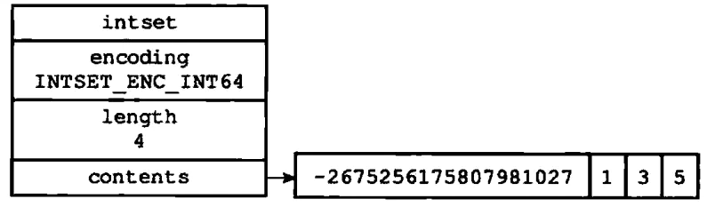

# Redis 数据结构之整数集合

整数集合（intset）是集合键的底层实现之一，当一个集合只包含整数值元素，并且这个集合的元素数量不多时，Redis 就会使用整数集合作为集合键的底层实现

## 整数集合的实现

整数集合是 Redis 用于保存整数值的集合抽象数据结构，它可以保存类型为 int16_t、int32_t 或 int64_t 的整数值，并保证集合中不会出现重复元素

contents 数组是整数集合的底层实现：整数集合的每个元素都是 contents 数组的一个数组项（item），各个项在数组中按值得大小从小到大有序排序，且数组中不包含任何重复项

虽然 intset 结构将 contents 属性声明为 int8_t 类型的数组，但实际上 contents 数组并不保存任何 int8_t 类型的值，contents 数组的真正类型取决于 encoding 属性的值

## 升级

每当要将一个新元素添加到整数集合中，并且新元素的类型比整数集合现有所有元素的类型都长时，整数集合需要先升级，然后才能将新元素添加到整数集合内

升级整数集合并添加新元素共分三步进行：

1. 根据新元素的类型，扩展整数集合底层数组的空间大小，并为新元素分配空间
2. 将底层数组现有的所有元素都转换成与新元素相同的类型，并将类型转换后的元素放置到正确的位上，而且在放置元素的过程中，需要继续维持底层数组的有序性不变
3. 将新元素添加到底层数组中

##### 升级的好处

* 提升灵活性: 因为整数集合可以通过自动升级底层数组来适应新元素，所以可以将不同类型的整数添加到集合中，而不必担心出现类型错误
* 节约内存: 升级可以让集合同时保持 int16_t、int32_t 和 int64_t 三种不同类型的值，又可以确保升级只会在有必要时进行，这可以尽量节约内存（否则就是直接使用 int64_t 类型的数组）。例如，如果一直想整数集合添加 int16_t 类型的值，那么整数集合的底层实现就会一直是 int16_t 类型的数组，只有将 int32_t 或 int64_t 类型的值添加到集合时，才会升级

## 降级

整数集合不支持降级操作，一旦对数组进行了升级，编码就会一直保持升级后的状态