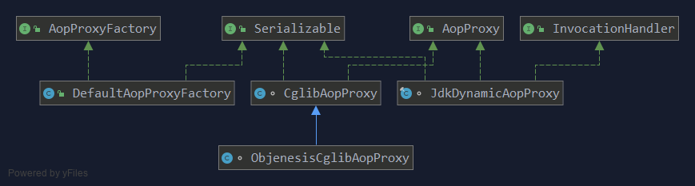

# AOP中的代理模式

AOP（面向切面编程）主要的的实现技术主要有 Spring AOP 和 AspectJ

AspectJ 的底层技术就是静态代理，用一种 AspectJ 支持的特定语言编写切面，通过一个命令来编译，生成一个新的代理类，该代理类增强了业务类，这是在编译时增强，相对于下面说的运行时增强，编译时增强的性能更好。（AspectJ 的静态代理，不像我们前边介绍的需要为每一个目标类手动编写一个代理类，AspectJ 框架可以在编译时就生成目标类的“代理类”，在这里加了个冒号，是因为实际上它并没有生成一个新的类，而是把代理逻辑直接编译到目标类里面了）

Spring AOP 采用的是动态代理，在运行期间对业务方法进行增强，所以不会生成新类，对于动态代理技术，Spring AOP 提供了对 JDK 动态代理的支持以及 CGLib 的支持。

默认情况下，Spring对实现了接口的类使用 JDK Proxy方式，否则的话使用CGLib。不过可以通过配置指定 Spring AOP 都通过 CGLib 来生成代理类。



具体逻辑在 org.springframework.aop.framework.DefaultAopProxyFactory类中，使用哪种方式生成由AopProxy 根据 AdvisedSupport 对象的配置来决定源码如下：

```text
    public AopProxy createAopProxy(AdvisedSupport config) throws AopConfigException {
        if (!config.isOptimize() && !config.isProxyTargetClass() && !this.hasNoUserSuppliedProxyInterfaces(config)) {
            return new JdkDynamicAopProxy(config);
        } else {
            Class<?> targetClass = config.getTargetClass();
            if (targetClass == null) {
                throw new AopConfigException("TargetSource cannot determine target class: Either an interface or a target is required for proxy creation.");
            } else {
                // 如果是接口用JDK 不是则用CGLIB
                return (AopProxy)(!targetClass.isInterface() && !Proxy.isProxyClass(targetClass) ? new ObjenesisCglibAopProxy(config) : new JdkDynamicAopProxy(config));
            }
        }
    }

    private boolean hasNoUserSuppliedProxyInterfaces(AdvisedSupport config) {
        Class<?>[] ifcs = config.getProxiedInterfaces();
        return ifcs.length == 0 || ifcs.length == 1 && SpringProxy.class.isAssignableFrom(ifcs[0]);
    }
```

