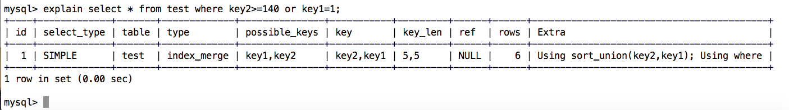

# mysql索引合并:一条sql可以使用多个索引

前言
mysql的索引合并并不是什么新特性。早在mysql5.0版本就已经实现。之所以还写这篇博文，是因为好多人还一直保留着一条sql语句只能使用一个索引的错误观念。本文会通过一些示例来说明如何使用索引合并。

## 什么是索引合并
下面我们看下mysql文档中对索引合并的说明：
> The Index Merge method is used to retrieve rows with several range scans and to merge their results into one. The merge can produce unions, intersections, or unions-of-intersections of its underlying scans. This access method merges index scans from a single table; it does not merge scans across multiple tables.

根据官方文档中的说明，我们可以了解到：
1. 索引合并是把几个索引的范围扫描合并成一个索引。
2. 索引合并的时候，会对索引进行并集，交集或者先交集再并集操作，以便合并成一个索引。
3. 这些需要合并的索引只能是一个表的。不能对多表进行索引合并。

## 使用索引合并有啥收益

简单的说，索引合并，让一条sql可以使用多个索引。对这些索引取交集，并集，或者先取交集再取并集。从而减少从数据表中取数据的次数，提高查询效率。

## 怎么确定使用了索引合并

在使用explain对sql语句进行操作时，如果使用了索引合并，那么在输出内容的type列会显示 index_merge，key列会显示出所有使用的索引。如下

在explain的extra字段中会以下几种：
* Using union 索引取并集
* Using sort_union 先对取出的数据按rowid排序，然后再取并集
* Using intersect 索引取交集

你会发现并没有 sort_intersect，因为根据目前的实现，想索引取交集，必须保证通过索引取出的数据顺序和rowid顺序是一致的。所以，也就没必要sort了。