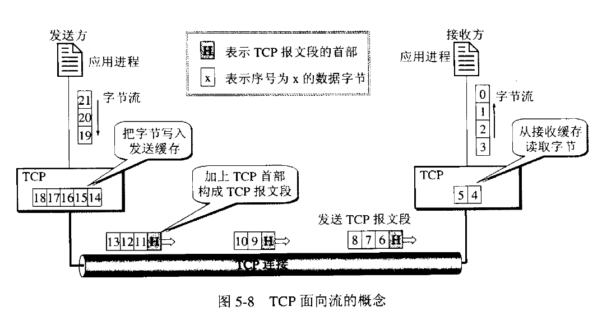

# TCP协议

### TCP协议的特点
* TCP是面向连接的运输层协议
* 每一条TCP连接只能有两个端点。TCP只能进行点对点通信
* TCP提供可靠交付的服务。通过TCP连接传输的数据，无差错、不丢失、不重复、并且按序到达
* TCP提供全双工通信。TCP允许通信双方的应用进程在任何时候都能发送数据。TCP通信的两端都设有发送缓存和接收缓存，用来临时存放双方通信的数据。
* 面向字节流。

**面向字节流的含义是：虽然应用程序和TCP的交互是一个一个的数据块，但是TCP把应用程序交下的数据看成仅仅是一串的无结构的字节流。TCP并不知道所传送的字节流的含义。TCP不保证接收方应用程序所收到的数据块和发送方应用程序所发出的数据块具有对用关系。**

TCP根据对方给出的窗口值和当前网络拥塞的程度来决定一个报文段应包含多少个字节。如果应用程序传递到TCP缓存的数据块太长，TCP可以把它划分短一些再传递。如果应用程序发来的数据块太短，TCP也可以等待积累足够多的字节后再构成报文段发送。

### 可靠传输的工作原理

##### 停止等待协议

"停止等待"：就是每发送完一个分组就停止发送，等待对方的确认。在收到确认后再发送下一个分组。

###### 无差错的情况

A发送分组M1，发送完就暂停发送，等待B确认。B收到M1后就向A发送确认。A收到对M1的确认，继续发送下一个分组。

###### 出现差错

B接收M1出现差错，就丢弃M1，其他什么也不做。A只要超过一段时间没有收到确认，就认为刚才发送的分组丢失，因此重传前面发送的分组。这就叫做超时重传.

以上应该注意一下三点：

1. A发送完一个分组后，必须暂时保留已发送的分组的副本。只有在收到相应的确认后才能清楚保留的副本。
2. 分组和确认必须进行编号。这样才能明确是哪一个发出去的分组收到了确认。
3. 超时计时器设置的重传时间应当比数据在分组传输的平均往返时间更长一些。

###### 确认丢失和确认迟到 

如上图a.B所发送的对M1的确认丢失。A在设定超时重传时间内没有收到确认，但并无法知道是自己发送的分组出错、丢失、或者B发送的确认丢失。因此A在超时计时器到期后就要重传M1.现在B需要采取如下两个动作。

1. 丢弃这个重复的分组M1，不向上层交付。
2. 向A发送确认。

如图b。传输过程没有出现差错，但B对分组M1的确认迟到。A回收到重复的确认。对重复的确认的处理很简单：收下后丢弃。B任然会收到重复的M1，并且同样丢弃重复的M1。

##### 连续ARQ协议

滑动窗口协议是TCP协议的精髓所在。

如图a发送方维持发送窗口，它的意义是：位于发送窗口内的5个分组可连续发送出去，而不需要等待对方的确认。连续的ARQ协议规定，发送当收到一个确认，就把发送窗口向前滑动一个分组的位置。接收方一般都是采用累积确认的方式。就是接收方不必对收到的分组逐个确认，而是可以收到几个分组后对按序到达的最后一个分组发送确认，这样就表示：到这个分组为止的所有分组都已经收到。

### TCP数据包格式

* 顺序号(32位)：用来标识从TCP源端向TCP目的端发送的数据字节流，它表示在这个报文段中的第一个数据字节的顺序号。如果将字节流看作在两个应用程序间的单向流动，则TCP用顺序号对每个字节进行计数。序号是32bit的无符号数，序号到达2^32－1后又从0开始。当建立一个新的连接时，SYN标志为1(该报文段不携带数据，但是要消耗一个序号)，顺序号字段包含由这个主机选择的该连接的初始顺序号ISN(Initial Sequence Number)。
* 确号(32位)：包含发送确认的一端所期望收到的下一个顺序号。因此，确认序号应当是上次已成功收到数据字节顺序号加1。只有ACK标志为1时确认序号字段才有效。TCP为应用层提供全双工服务，这意味数据能在两个方向上独立地进行传输。因此，连接的每一端必须保持每个方向上的传输数据顺序号。
* TCP报头长度(4位)：给出报头中32bit字的数目，它实际上指明数据从哪里开始。需要这个值是因为任选字段的长度是可变的。这个字段占4bit ，因此TCP最多有60字节的首部。然而，没有任选字段，正常的长度是20字节。
* 保留位(6位)：保留给将来使用，目前必须置为0。

控制位(control flags ，6位)：在TCP 报头中有6个标志比特，它们中的多个可同时被设置为 1 。依次为：　

* ACK ：为1表示确认号有效，为0表示报文中不包含确认信息，忽略确认号字段。
* PSH ：为1表示是带有PUSH标志的数据，指示接收方应该尽快将这个报文段交给应用层而不用等待缓冲区装满。
* RST :用于复位由于主机崩溃或其他原因而出现错误的连接。它还可以用于拒绝非法的报文段和拒绝连接请求。一般情况下，如果收到一个RST为1的报文，那么一定发生了某些问题。
* SYN ：同步序号，为1表示连接请求，用于建立连接和使顺序号同步。
* FIN ：用于释放连接，为1表示发送方已经没有数据发送了，即关闭本方数据流。

窗口大小(16位)：数据字节数，表示从确认号开始，本报文的源方可以接收的字节数，即源方接收窗口大小。窗口大小是一个16bit字段，因而窗口大小最大为65535字节。

校验和(16位)：此校验和是对整个的TCP报文段，包括TCP头部和TCP数据，以 16 位字进行计算所得。这是一个强制性的字段，一定是由发送端计算和存储，并由接收端进行验证。

紧急指针(16位)：只有当URG标志置1时紧急指针才有效。紧急指针是一个正的偏移量，和顺序号字段中的值相加表示紧急数据最后一个字节的序号。 TCP 的紧急方式是发送端向另一端发送紧急数据的一种方式。

选项：最常见的可选字段是最长报文大小，又称为MSS(Maximum Segment Size) 。每个连接方通常都在通信的第一个报文（为建立连接而设置 SYN 标志的那个段）中指明这个选项，它指明本端所能接收的最大长度的报文段。选项长度不一定是 32 位字的整数倍，所以要加填充位，使得报头长度成为整字数。

数据：TCP 报文段中的数据部分是可选的。在一个连接建立和一个连接终止时，双方交换的报文段仅有TCP首部。如果一方没有数据要发送，也使用没有任何数据的首部来确认收到的数据。在处理超时的许多情况中，也会发送不带任何数据的报文段。

### TCP头格式

注意以下几点：

* TCP的包是没有IP地址的，那是IP层上的事。但是有源端口和目标端口。
* 一个TCP连接需要四个元组来表示是同一个连接（src_ip, src_port, dst_ip, dst_port）准确说是五元组，还有一个是协议。但因为这里只是说TCP协议，所以，这里我只说四元组。
* 注意上图中的四个非常重要的东西：
   * Sequence Number是包的序号，用来解决网络包乱序（reordering）问题。
   * Acknowledgement Number就是ACK——用于确认收到，用来解决不丢包的问题。
   * Window又叫Advertised-Window，也就是著名的滑动窗口（Sliding Window），用于解决流控的。
   * TCP Flag，也就是包的类型，主要是用于操控TCP的状态机的。

关于其它的东西，可以参看下面的图示

### TCP三次握手（建立连接）

所谓三次握手(Three-way Handshake)，是指建立一个TCP连接时，需要客户端和服务器总共发送3个包。三次握手的目的是连接服务器指定端口，建立TCP连接,并同步连接双方的序列号和确认号并交换TCP窗口大小信息.

##### TCP连接建立的过程：

1. 服务器B的TCP进程先创建传输控制块TCB，准备接受客户进程的连接请求。然后服务器B进入LISTEN状态，等待客户端的连接请求。
2. A的TCP进程首先创建传输控制块TCB，然后向B发出连接请求报文段，这时首部中的同部位SYN=1，同时选择一个合适的初始序号seq=x。TCP规定SYN报文段不能携带数据。这时TCP客户进程进入SYN-SEND状态。
3. B接收到请求报文段后，如果同意建立连接，则向A发送确认。在报文段中把SYN位和ACK位设置为1，确认号ack=x+1，同时选择一个初始序号seq=y。这个报文段也不能携带数据，但同样要消耗一个序号。这时服务为进入SYN-RCVD状态。
4. TCP客户进程收到B的确认后，还要向B发出确认。确认报文段ACK=1，确认号ack=y+1，而自己的选号seq=x+1。TCP规定ACK报文段可以携带数据。但是如果不携带数据则不消耗序列号，在这种情况下，下一个报文段的seq=x+1。这时TCP连接已经建立，A进入ESTABLISHED阶段。
5. 当B收到A的确认后，也进入ESTABLISHED阶段。

##### SYN攻击

在三次握手过程中，服务器发送SYN-ACK之后，收到客户端的ACK之前的TCP连接称为半连接(half-open connect).此时服务器处于Syn_RECV状态.当收到ACK后，服务器转入ESTABLISHED状态.Syn攻击就是攻击客户端在短时间内伪造大量不存在的IP地址，向服务器不断地发送syn包，服务器回复确认包，并等待客户的确认，由于源地址是不存在的，服务器需要不断的重发直至超时，这些伪造的SYN包将长时间占用未连接队列，正常的SYN请求被丢弃，目标系统运行缓慢，严重者引起网络堵塞甚至系统瘫痪。

Syn攻击是一个典型的DDOS攻击。检测SYN攻击非常的方便，当你在服务器上看到大量的半连接状态时，特别是源IP地址是随机的，基本上可以断定这是一次SYN攻击.在Linux下可以如下命令检测是否被Syn攻击netstat -n -p TCP | grep SYN_RECV

一般较新的TCP/IP协议栈都对这一过程进行修正来防范Syn攻击，修改tcp协议实现。主要方法有SynAttackProtect保护机制、SYN cookies技术、增加最大半连接和缩短超时时间等.但是不能完全防范syn攻击。

### 四次挥手（关闭连接）

TCP的连接的拆除需要发送四个包，因此称为四次挥手(four-way handshake)。客户端或服务器均可主动发起挥手动作。

##### TCP释放连接的过程：

1. A的应用进程向TCP发出释放连接报文段，并停止发送数据，主动关闭TCP连接。A把释放连接报文段首部的FIN设置为1，其序列号seq=u,它等于前面已传送过的数据的最后一个字节的序号加1.这是A进入FIN-WAIT-1状态，等待B的确认。TCP规定FIN报文段即使不携带任何数据也要消耗一个序号。
2. B收到连接释放报文段后即发出确认，确认号是ack=u+1,而这个报文段自己的序号是v，v于B前面已经发送过的数据的最后一个字节的序号加1.然后B就进入CLOSE_WAIT状态。TCP进程服务器这时通知高层应用进程，因而从A到B的这个方向的连接就释放了，这时TCP连接处于半关闭(half_close)状态。即A已经没有数据要发送了，但B如有数据发送A仍可以接受。
3. A收到来自B的确认后，进入FIN-WAIT-2状态，等待B发出连接释放报文段。
4. 若B已经没有要向A发送的数据，其应用进程就通知TCP释放连接。这时B发出的连接释放报文FIN=1.现在假定序号为w（在半关闭状态B可能又发送了一些数据）。B还必须重复上次已经发送的确认号ack=u+1。这时B就进入LAST-ACK状态。
5. A在收到B的释放报文段后，发出确认。在确认报文段把ACK设置为1，确认号ack=w+1，而自己的序列号seq=u+1。然后进入TIME-WAIT状态。请注意现在连接还没有释放。必须经过时间等待计时器设置的时间2MSL后，A进入CLOSED状态。MSL（最长报文段寿命）。

   * CLOSED: 这个没什么好说的了，表示初始状态。
   * LISTEN: 这个也是非常容易理解的一个状态，表示服务器端的某个SOCKET处于监听状态，可以接受连接了。
   * SYN_RCVD: 这个状态表示接受到了SYN报文，在正常情况下，这个状态是服务器端的SOCKET在建立TCP连接时的三次握手会话过程中的一个中间状态，很短暂，基本上用netstat你是很难看到这种状态的，除非你特意写了一个客户端测试程序，故意将三次TCP握手过程中最后一个ACK报文不予发送。因此这种状态时，当收到客户端的ACK报文后，它会进入到ESTABLISHED状态。
   * SYN_SENT: 这个状态与SYN_RCVD遥想呼应，当客户端SOCKET执行CONNECT连接时，它首先发送SYN报文，因此也随即它会进入到了SYN_SENT状态，并等待服务端的发送三次握手中的第2个报文。SYN_SENT状态表示客户端已发送SYN报文。
   * ESTABLISHED：这个容易理解了，表示连接已经建立了。
   * FIN_WAIT_1: 这个状态要好好解释一下，其实FIN_WAIT_1和FIN_WAIT_2状态的真正含义都是表示等待对方的FIN报文。而这两种状态的区别是：FIN_WAIT_1状态实际上是当SOCKET在ESTABLISHED状态时，它想主动关闭连接，向对方发送了FIN报文，此时该SOCKET即进入到FIN_WAIT_1状态。而当对方回应ACK报文后，则进入到FIN_WAIT_2状态，当然在实际的正常情况下，无论对方何种情况下，都应该马上回应ACK报文，所以FIN_WAIT_1状态一般是比较难见到的，而FIN_WAIT_2状态还有时常常可以用netstat看到。
   * FIN_WAIT_2：上面已经详细解释了这种状态，实际上FIN_WAIT_2状态下的SOCKET，表示半连接，也即有一方要求close连接，但另外还告诉对方，我暂时还有点数据需要传送给你，稍后再关闭连接。
   * TIME_WAIT: 表示收到了对方的FIN报文，并发送出了ACK报文，就等2MSL后即可回到CLOSED可用状态了。如果FIN_WAIT_1状态下，收到了对方同时带 FIN标志和ACK标志的报文时，可以直接进入到TIME_WAIT状态，而无须经过FIN_WAIT_2状态。
   * CLOSING: 这种状态比较特殊，实际情况中应该是很少见，属于一种比较罕见的例外状态。正常情况下，当你发送FIN报文后，按理来说是应该先收到（或同时收到）对方的ACK报文，再收到对方的FIN报文。但是CLOSING状态表示你发送FIN报文后，并没有收到对方的ACK报文，反而却也收到了对方的FIN报文。什 么情况下会出现此种情况呢？其实细想一下，也不难得出结论：那就是如果双方几乎在同时close一个SOCKET的话，那么就出现了双方同时发送FIN报文的情况，也即会出现CLOSING状态，表示双方都正在关闭SOCKET连接。
   * CLOSE_WAIT: 这种状态的含义其实是表示在等待关闭。怎么理解呢？当对方close一个SOCKET后发送FIN报文给自己，你系统毫无疑问地会回应一个ACK报文给对方，此时则进入到CLOSE_WAIT状态。接下来呢，实际上你真正需要考虑的事情是察看你是否还有数据发送给对方，如果没有的话，那么你也就可以 close这个SOCKET，发送FIN报文给对方，也即关闭连接。所以你在CLOSE_WAIT状态下，需要完成的事情是等待你去关闭连接。
   * LAST_ACK: 这个状态还是比较容易好理解的，它是被动关闭一方在发送FIN报文后，最后等待对方的ACK报文。当收到ACK报文后，也即可以进入到CLOSED可用状态了。

##### 为什么建立连接协议是三次握手，而关闭连接却是四次握手呢？

这是因为服务端的LISTEN状态下的SOCKET当收到SYN报文的建连请求后，它可以把ACK和SYN（ACK起应答作用，而SYN起同步 作用）放在一个报文里来发送。但关闭连接时，当收到对方的FIN报文通知时，它仅仅表示对方没有数据发送给你了；但未必你所有的数据都全部发送给对方了， 所以你可以未必会马上会关闭SOCKET,也即你可能还需要发送一些数据给对方之后，再发送FIN报文给对方来表示你同意现在可以关闭连接了，所以它这里 的ACK报文和FIN报文多数情况下都是分开发送的。

##### 为什么TIME_WAIT状态还需要等2MSL后才能返回到CLOSED状态？

这是因为：虽然双方都同意关闭连接了，而且握手的4个报文也都协调和发送完毕，按理可以直接回到CLOSED状态（就好比从SYN_SEND状 态到ESTABLISH状态那样）；但是因为我们必须要假想网络是不可靠的，你无法保证你最后发送的ACK报文会一定被对方收到，因此对方处于 LAST_ACK状态下的SOCKET可能会因为超时未收到ACK报文，而重发FIN报文，所以这个TIME_WAIT状态的作用就是用来重发可能丢失的 ACK报文。

### TCP状态机

其实，网络上的传输是没有连接的，包括TCP也是一样的。而TCP所谓的“连接”，其实只不过是在通讯的双方维护一个“连接状态”，让它看上去好像有连接一样。所以，TCP的状态变换是非常重要的。下面是：“TCP协议的状态机” 和 “TCP建链接”、“TCP断链接”、“传数据” 的对照图，我把两个图并排放在一起，这样方便在你对照着看。

很多人会问，为什么建链接要3次握手，断链接需要4次挥手？

* 对于建链接的3次握手，主要是要初始化Sequence Number 的初始值。通信的双方要互相通知对方自己的初始化的Sequence Number（缩写为ISN：Inital Sequence Number）——所以叫SYN，全称Synchronize Sequence Numbers。也就上图中的 x 和 y。这个号要作为以后的数据通信的序号，以保证应用层接收到的数据不会因为网络上的传输的问题而乱序（TCP会用这个序号来拼接数据）。
* 对于4次挥手，因为TCP是全双工的，所以，发送方和接收方都需要Fin和 Ack。只不过，有一方是被动的，所以看上去就成了所谓的4次挥手。如果两边同时断连接，那就会就进入到CLOSING状态，然后到达TIME_WAIT 状态。下图是双方同时断连接的示意图（你同样可以对照着TCP状态机看）：

另外，有几个事情需要注意一下：

* 关于建连接时SYN超时。试想一下，如果server端接到了clien发的SYN后回了SYN- ACK后client掉线了，server端没有收到client回来的ACK，那么，这个连接处于一个中间状态，即没成功，也没失败。于 是，server端如果在一定时间内没有收到的TCP会重发SYN-ACK。在Linux下，默认重试次数为5次，重试的间隔时间从1s开始每次翻倍，5次的重试时间间隔为1s, 2s, 4s, 8s, 16s，总共31s，第5次发出后还要等32s就知道第5次也超时了，所以，总共需要 1s + 2s + 4s+ 8s+ 16s + 32s = 2^6 -1 = 63s，TCP才会把断开这个连接。
* 关于SYN Flood攻击。一些恶意的人就为此制造了SYN Flood攻击——给服务器发了一个SYN后，就下线了，于是服务器需要默认等63s才会断开连接，这样，攻击者就可以把服务器的syn连接的队列耗尽，让正常的连接请求不能处理。于是，Linux下给了一个叫tcp_syncookies的参数来应对这个事——当SYN队列满了后，TCP会通过源地址端口、目标地址端口和时间戳打造出一个特别的Sequence Number发回去（又叫cookie），如果是攻击者则不会有响应，如果是正常连接，则会把这个 SYN Cookie发回来，然后服务端可以通过cookie建连接（即使你不在SYN队列中）。请注意，请先千万别用tcp_syncookies来处理正常的大负载的连接的情况。 因为，synccookies是妥协版的TCP协议，并不严谨。对于正常的请求，你应该调整三个TCP参数可供你选择，第一个 是：tcp_synack_retries 可以用他来减少重试次数；第二个是：tcp_max_syn_backlog，可以增大SYN连接数；第三个 是：tcp_abort_on_overflow 处理不过来干脆就直接拒绝连接了。
* 关于ISN的初始化。ISN是不能hard code的，不然会出问题的——比如：如果连接建好后始终用1来做ISN，如果client发了30个segment过去，但是网络断了，于是 client重连，又用了1做ISN，但是之前连接的那些包到了，于是就被当成了新连接的包，此时，client的Sequence Number 可能是3，而Server端认为client端的这个号是30了。全乱了。RFC793中 说，ISN会和一个假的时钟绑在一起，这个时钟会在每4微秒对ISN做加一操作，直到超过2^32，又从0开始。这样，一个ISN的周期大约是4.55个小时。因为，我们假设我们的TCP Segment在网络上的存活时间不会超过Maximum Segment Lifetime（缩写为MSL），所以，只要MSL的值小于4.55小时，那么，我们就不会重用到ISN。
* 关于MSL和TIME_WAIT。通过上面的ISN的描述，相信你也知道MSL是怎么来的了。我们注意到，在TCP的状态图中，从TIME_WAIT状态到CLOSED状态，有一个超时设置，这个超时设置是 2*MSL（RFC793定义了MSL为2分钟，Linux设置成了30s）为什么要这有TIME_WAIT？为什么不直接给转成CLOSED状态呢？主要有两个原 因：1）TIME_WAIT确保有足够的时间让对端收到了ACK，如果被动关闭的那方没有收到Ack，就会触发被动端重发Fin，一来一去正好2个MSL，2）有足够的时间让这个连接不会跟后面的连接混在一起（你要知道，有些自做主张的路由器会缓存IP数据包，如果连接被重用了，那么这些延迟收到的包就有可能会跟新连接混在一起）。
* 关于TIME_WAIT数量太多。从上面的描述我们可以知道，TIME_WAIT是个很重要的状态，但是如果在大并发的短链接下，TIME_WAIT 就会太多，这也会消耗很多系统资源。只要搜一下，你就会发现，十有八九的处理方式都是教你设置两个参数，一个叫tcp_tw_reuse，另一个叫tcp_tw_recycle的参数，这两个参数默认值都是被关闭的，后者recyle比前者resue更为激进，resue要温柔一些。另外，如果使用tcp_tw_reuse，必需设置tcp_timestamps=1，否则无效。这里，你一定要注意，打开这两个参数会有比较大的坑——可能会让TCP连接出一些诡异的问题（因为如上述一样，如果不等待超时重用连接的话，新的连接可能会建不上。正如官方文档上说的一样“It should not be changed without advice/request of technical experts”）。
   * 关于tcp_tw_reuse。官方文档上说tcp_tw_reuse 加上tcp_timestamps（又叫PAWS, for Protection Against Wrapped Sequence Numbers）可以保证协议的角度上的安全，但是你需tcp_timestamps在两边都被打开。
   * 关于tcp_tw_recycle。如果是tcp_tw_recycle被打开了话，会假设 对端开启了tcp_timestamps，然后会去比较时间戳，如果时间戳变大了，就可以重用。但是，如果对端是一个NAT网络的话（如：一个公司只用一 个IP出公网）或是对端的IP被另一台重用了，这个事就复杂了。建链接的SYN可能就被直接丢掉了（你可能会看到connection time out的错误）。
   * 关于tcp_max_tw_buckets。这个是控制并发的TIME_WAIT的数量，默 认值是180000，如果超限，那么，系统会把多的给destory掉，然后在日志里打一个警告（如：time wait bucket table overflow），官网文档说这个参数是用来对抗DDoS攻击的。也说的默认值180000并不小。这个还是需要根据实际情况考虑。   

Again，使用tcp_tw_reuse和tcp_tw_recycle来解决TIME_WAIT的问题是非常非常危险的，因为这两个参数违反了TCP协议（RFC1122）

其实，TIME_WAIT表示的是你主动断连接，所以，这就是所谓的“不作死不会死”。试想，如果让对端断连接，那么这个破问题就是对方的了，呵呵。另外，如果你的服务器是于HTTP服务器，那么设置一个HTTP的KeepAlive有多重要（浏览器会重用一个TCP连接来处理多个HTTP请求），然后让客户端去断链接（你要小心，浏览器可能会非常贪婪，他们不到万不得已不会主动断连接）。

### 数据传输中的Sequence Number 

http://www.52im.net/thread-275-1-1.html
   
   
