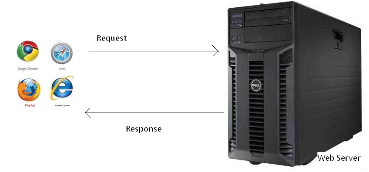
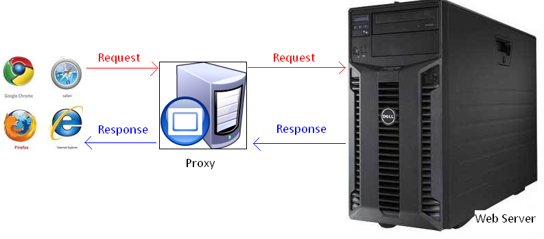

# Http协议规范

### 什么是HTTP协议

协议是指计算机通信网络中两台计算机之间进行通信所必须共同遵守的规定或规则，超文本传输协议(HTTP)是一种通信协议，它允许将超文本标记语言(HTML)文档从Web服务器传送到客户端的浏览器 。
目前我们使用的是HTTP/1.1 版本。

Http协议是无状态协议。在Http/1.1使用了继续连接。所谓的持续连接就是万维网服务器在发送响应后任然在一段时间内保持这条连接，使同一个客户和该服务器可以继续在这条连接上传送后续的HTTP请求报文和响应报文。
Http/1.1协议的持续连接有两种工作方式：非流水线方式和流水线方式。非流水线方式：是客户在收到前一个响应后才能发出下一个请求。流水线方式：是客户在收到Http的响应报文之前就能够接着发送新的请求报文。

HTTP是一个属于应用层的面向对象的协议，由于其简捷、快速的方式，适用于分布式超媒体信息系统。它于1990年提出，经过几年的使用与发展，得到不断地完善和扩展。目前在WWW中使用的是HTTP/1.0的第六版，HTTP/1.1的规范化工作正在进行之中，而且HTTP-NG(Next Generation of HTTP)的建议已经提出。

##### HTTP协议的主要特点

1. 支持客户/服务器模式。
2. 简单快速：客户向服务器请求服务时，只需传送请求方法和路径。请求方法常用的有GET、HEAD、POST。每种方法规定了客户与服务器联系的类型不同。由于HTTP协议简单，使得HTTP服务器的程序规模小，因而通信速度很快。
3. 灵活：HTTP允许传输任意类型的数据对象。正在传输的类型由Content-Type加以标记。
4. 无连接：无连接的含义是限制每次连接只处理一个请求。服务器处理完客户的请求，并收到客户的应答后，即断开连接。采用这种方式可以节省传输时间。
5. 无状态：HTTP协议是无状态协议。无状态是指协议对于事务处理没有记忆能力。缺少状态意味着如果后续处理需要前面的信息，则它必须重传，这样可能导致每次连接传送的数据量增大。另一方面，在服务器不需要先前信息时它的应答就较快。

### Web服务器，浏览器,代理服务器

当我们打开浏览器，在地址栏中输入URL，然后我们就看到了网页。 原理是怎样的呢？

实际上我们输入URL后，我们的浏览器给Web服务器发送了一个Request, Web服务器接到Request后进行处理，生成相应的Response，然后发送给浏览器， 浏览器解析Response中的HTML,这样我们就看到了网页，过程如下图所示

我们的Request 有可能是经过了代理服务器，最后才到达Web服务器的。过程如下图所示

代理服务器就是网络信息的中转站，有什么功能呢？

1. 提高访问速度， 大多数的代理服务器都有缓存功能。
2. 突破限制， 也就是FQ了
3. 隐藏身份。

### HTTP协议详解之*URL*

http（超文本传输协议）是一个基于请求与响应模式的、无状态的、应用层的协议，常基于TCP的连接方式，HTTP1.1版本中给出一种持续连接的机制，绝大多数的Web开发，都是构建在HTTP协议之上的Web应用。

HTTP URL (URL是一种特殊类型的URI，包含了用于查找某个资源的足够的信息)的格式如下：

URL(Uniform Resource Locator) 地址用于描述一个网络上的资源,  基本格式如下

      schema://host[:port#]/path/.../[?query-string][#anchor]
 
* scheme: 指定低层使用的协议(例如：http, https, ftp)
* host: HTTP服务器的IP地址或者域名
* port#: HTTP服务器的默认端口是80，这种情况下端口号可以省略。如果使用了别的端口，必须指明，例如 http://www.cnblogs.com:8080/
* path: 访问资源的路径
* query-string: 发送给http服务器的数据
* anchor-: 锚

### HTTP协议详解之请求

http请求由三部分组成，分别是：请求行、消息报头、请求正文

1、请求行以一个方法符号开头，以空格分开，后面跟着请求的URI和协议的版本，格式如下：Method Request-URI HTTP-Version CRLF

其中 Method表示请求方法；Request-URI是一个统一资源标识符；HTTP-Version表示请求的HTTP协议版本；
CRLF表示回车和换行（除了作为结尾的CRLF外，不允许出现单独的CR或LF字符）。

请求方法（所有方法全为大写）有多种，各个方法的解释如下：

* GET 请求获取Request-URI所标识的资源
* POST 在Request-URI所标识的资源后附加新的数据
* HEAD 请求获取由Request-URI所标识的资源的响应消息报头
* PUT 请求服务器存储一个资源，并用Request-URI作为其标识
* DELETE 请求服务器删除Request-URI所标识的资源
* TRACE 请求服务器回送收到的请求信息，主要用于测试或诊断
* CONNECT 保留将来使用
* OPTIONS 请求查询服务器的性能，或者查询与资源相关的选项和需求

##### Get和Post方法的区别

Http协议定义了很多与服务器交互的方法，最基本的有4种，分别是GET,POST,PUT,DELETE. 一个URL地址用于描述一个网络上的资源，而HTTP中的GET, POST, PUT, DELETE就对应着对这个资源的查，改，增，删4个操作。 我们最常见的就是GET和POST了。GET一般用于获取/查询资源信息，而POST一般用于更新资源信息.我们看看GET和POST的区别

* GET提交的数据会放在URL之后，以?分割URL和传输数据，参数之间以&相连，如EditPosts.aspx?name=test1&id=123456.  POST方法是把提交的数据放在HTTP包的Body中.
* GET提交的数据大小有限制（因为浏览器对URL的长度有限制），而POST方法提交的数据没有限制.
* GET方式需要使用Request.QueryString来取得变量的值，而POST方式通过Request.Form来获取变量的值。
* GET方式提交数据，会带来安全问题，比如一个登录页面，通过GET方式提交数据时，用户名和密码将出现在URL上，如果页面可以被缓存或者其他人可以访问这台机器，就可以从历史记录获得该用户的账号和密码.

应用举例：

GET方法：在浏览器的地址栏中输入网址的方式访问网页时，浏览器采用GET方法向服务器获取资源，eg:GET /form.html HTTP/1.1 (CRLF)

POST方法要求被请求服务器接受附在请求后面的数据，常用于提交表单。

eg：POST /reg.jsp HTTP/ (CRLF)

Accept:image/gif,image/x-xbit,... (CRLF)

...

HOST:www.guet.edu.cn (CRLF)

Content-Length:22 (CRLF)

Connection:Keep-Alive (CRLF)

Cache-Control:no-cache (CRLF)

(CRLF) //该CRLF表示消息报头已经结束，在此之前为消息报头

user=jeffrey&pwd=1234 //此行以下为提交的数据

HEAD方法与GET方法几乎是一样的，对于HEAD请求的回应部分来说，它的HTTP头部中包含的信息与通过GET请求所得到的信息是相同的。利用这个方法，不必传输整个资源内容，就可以得到Request-URI所标识的资源的信息。该方法常用于测试超链接的有效性，是否可以访问，以及最近是否更新。

2、请求报头后述

3、请求正文(略)

### HTTP协议详解之响应

在接收和解释请求消息后，服务器返回一个HTTP响应消息。

HTTP响应也是由三个部分组成，分别是：状态行、消息报头、响应正文

1、状态行格式如下：

HTTP-Version Status-Code Reason-Phrase CRLF

其中，HTTP-Version表示服务器HTTP协议的版本；Status-Code表示服务器发回的响应状态代码；Reason-Phrase表示状态代码的文本描述。

状态代码有三位数字组成，第一个数字定义了响应的类别，且有五种可能取值：

1xx：指示信息--表示请求已接收，继续处理

2xx：成功--表示请求已被成功接收、理解、接受

3xx：重定向--要完成请求必须进行更进一步的操作

4xx：客户端错误--请求有语法错误或请求无法实现

5xx：服务器端错误--服务器未能实现合法的请求

常见状态代码、状态描述、说明：

200 OK //客户端请求成功

400 Bad Request //客户端请求有语法错误，不能被服务器所理解

401 Unauthorized //请求未经授权，这个状态代码必须和WWW-Authenticate报头域一起使用

403 Forbidden //服务器收到请求，但是拒绝提供服务

404 Not Found //请求资源不存在，eg：输入了错误的URL

500 Internal Server Error //服务器发生不可预期的错误

503 Server Unavailable //服务器当前不能处理客户端的请求，一段时间后可能恢复正常

eg：HTTP/1.1 200 OK （CRLF）

2、响应报头后述

3、响应正文就是服务器返回的资源的内容

### HTTP协议详解之消息报头篇

HTTP消息由客户端到服务器的请求和服务器到客户端的响应组成。请求消息和响应消息都是由开始行（对于请求消息，开始行就是请求行，对于响应消息，开始行就是状态行），消息报头（可选），空行（只有CRLF的行），消息正文（可选）组成。

HTTP消息报头包括普通报头、请求报头、响应报头、实体报头。

每一个报头域都是由名字+“：”+空格+值 组成，消息报头域的名字是大小写无关的。

1、普通报头

在普通报头中，有少数报头域用于所有的请求和响应消息，但并不用于被传输的实体，只用于传输的消息。

eg：

Cache-Control 用于指定缓存指令，缓存指令是单向的（响应中出现的缓存指令在请求中未必会出现），且是独立的（一个消息的缓存指令不会影响另一个消息处理的缓存机制），HTTP1.0使用的类似的报头域为Pragma。

请求时的缓存指令包括：no-cache（用于指示请求或响应消息不能缓存）、no-store、max-age、max-stale、min-fresh、only-if-cached;

响应时的缓存指令包括：public、private、no-cache、no-store、no-transform、must-revalidate、proxy-revalidate、max-age、s-maxage.

eg：为了指示IE浏览器（客户端）不要缓存页面，服务器端的JSP程序可以编写如下：response.sehHeader("Cache-Control","no-cache");

//response.setHeader("Pragma","no-cache");作用相当于上述代码，通常两者//合用

这句代码将在发送的响应消息中设置普通报头域：Cache-Control:no-cache

Date普通报头域表示消息产生的日期和时间

Connection普通报头域允许发送指定连接的选项。例如指定连接是连续，或者指定“close”选项，通知服务器，在响应完成后，关闭连接

2、请求报头

请求报头允许客户端向服务器端传递请求的附加信息以及客户端自身的信息。

常用的请求报头

Accept

Accept请求报头域用于指定客户端接受哪些类型的信息。eg：Accept：image/gif，表明客户端希望接受GIF图象格式的资源；Accept：text/html，表明客户端希望接受html文本。

Accept-Charset

Accept-Charset请求报头域用于指定客户端接受的字符集。eg：Accept-Charset:iso-8859-1,gb2312.如果在请求消息中没有设置这个域，缺省是任何字符集都可以接受。

Accept-Encoding

Accept-Encoding请求报头域类似于Accept，但是它是用于指定可接受的内容编码。eg：Accept-Encoding:gzip.deflate.如果请求消息中没有设置这个域服务器假定客户端对各种内容编码都可以接受。

Accept-Language

Accept-Language请求报头域类似于Accept，但是它是用于指定一种自然语言。eg：Accept-Language:zh-cn.如果请求消息中没有设置这个报头域，服务器假定客户端对各种语言都可以接受。

Authorization

Authorization请求报头域主要用于证明客户端有权查看某个资源。当浏览器访问一个页面时，如果收到服务器的响应代码为401（未授权），可以发送一个包含Authorization请求报头域的请求，要求服务器对其进行验证。

Host（发送请求时，该报头域是必需的）

Host请求报头域主要用于指定被请求资源的Internet主机和端口号，它通常从HTTP URL中提取出来的，eg：

我们在浏览器中输入：http://www.guet.edu.cn/index.html

浏览器发送的请求消息中，就会包含Host请求报头域，如下：

Host：www.guet.edu.cn

此处使用缺省端口号80，若指定了端口号，则变成：Host：www.guet.edu.cn:指定端口号

User-Agent

我们上网登陆论坛的时候，往往会看到一些欢迎信息，其中列出了你的操作系统的名称和版本，你所使用的浏览器的名称和版本，这往往让很多人感到很神奇，实际上，服务器应用程序就是从User-Agent这个请求报头域中获取到这些信息。User-Agent请求报头域允许客户端将它的操作系统、浏览器和其它属性告诉服务器。不过，这个报头域不是必需的，如果我们自己编写一个浏览器，不使用User-Agent请求报头域，那么服务器端就无法得知我们的信息了。

请求报头举例：

GET /form.html HTTP/1.1 (CRLF)

Accept:image/gif,image/x-xbitmap,image/jpeg,application/x-shockwave-flash,application/vnd.ms-excel,application/vnd.ms-powerpoint,application/msword,*/* (CRLF)

Accept-Language:zh-cn (CRLF)

Accept-Encoding:gzip,deflate (CRLF)

If-Modified-Since:Wed,05 Jan 2007 11:21:25 GMT (CRLF)

If-None-Match:W/"80b1a4c018f3c41:8317" (CRLF)

User-Agent:Mozilla/4.0(compatible;MSIE6.0;Windows NT 5.0) (CRLF)

Host:www.guet.edu.cn (CRLF)

Connection:Keep-Alive (CRLF)

(CRLF)

3、响应报头

响应报头允许服务器传递不能放在状态行中的附加响应信息，以及关于服务器的信息和对Request-URI所标识的资源进行下一步访问的信息。

常用的响应报头

Location

Location响应报头域用于重定向接受者到一个新的位置。Location响应报头域常用在更换域名的时候。

Server

Server响应报头域包含了服务器用来处理请求的软件信息。与User-Agent请求报头域是相对应的。下面是

Server响应报头域的一个例子：

Server：Apache-Coyote/1.1

WWW-Authenticate

WWW-Authenticate响应报头域必须被包含在401（未授权的）响应消息中，客户端收到401响应消息时候，并发送Authorization报头域请求服务器对其进行验证时，服务端响应报头就包含该报头域。

eg：WWW-Authenticate:Basic realm="Basic Auth Test!" //可以看出服务器对请求资源采用的是基本验证机制。

4、实体报头

请求和响应消息都可以传送一个实体。一个实体由实体报头域和实体正文组成，但并不是说实体报头域和实体正文要在一起发送，可以只发送实体报头域。实体报头定义了关于实体正文（eg：有无实体正文）和请求所标识的资源的元信息。

常用的实体报头

Content-Encoding

Content-Encoding实体报头域被用作媒体类型的修饰符，它的值指示了已经被应用到实体正文的附加内容的编码，因而要获得Content-Type报头域中所引用的媒体类型，必须采用相应的解码机制。Content-Encoding这样用于记录文档的压缩方法，eg：Content-Encoding：gzip

Content-Language

Content-Language实体报头域描述了资源所用的自然语言。没有设置该域则认为实体内容将提供给所有的语言阅读

者。eg：Content-Language:da

Content-Length

Content-Length实体报头域用于指明实体正文的长度，以字节方式存储的十进制数字来表示。

Content-Type

Content-Type实体报头域用语指明发送给接收者的实体正文的媒体类型。eg：

Content-Type:text/html;charset=ISO-8859-1

Content-Type:text/html;charset=GB2312

Last-Modified

Last-Modified实体报头域用于指示资源的最后修改日期和时间。

Expires

Expires实体报头域给出响应过期的日期和时间。为了让代理服务器或浏览器在一段时间以后更新缓存中(再次访问曾访问过的页面时，直接从缓存中加载，缩短响应时间和降低服务器负载)的页面，我们可以使用Expires实体报头域指定页面过期的时间。eg：Expires：Thu，15 Sep 2006 16:23:12 GMT

HTTP1.1的客户端和缓存必须将其他非法的日期格式（包括0）看作已经过期。eg：为了让浏览器不要缓存页面，我们也可以利用Expires实体报头域，设置为0，jsp中程序如下：response.setDateHeader("Expires","0");

### 利用telnet观察http协议的通讯过程

实验目的及原理：

利用MS的telnet工具，通过手动输入http请求信息的方式，向服务器发出请求，服务器接收、解释和接受请求后，会返回一个响应，该响应会在telnet窗口上显示出来，从而从感性上加深对http协议的通讯过程的认识。

实验步骤：

1、打开telnet

1.1 打开telnet

运行-->cmd-->telnet

1.2 打开telnet回显功能

set localecho

2、连接服务器并发送请求

2.1 open www.guet.edu.cn 80 //注意端口号不能省略

HEAD /index.asp HTTP/1.0

Host:www.guet.edu.cn

/*我们可以变换请求方法,请求桂林电子主页内容,输入消息如下*/

open www.guet.edu.cn 80

GET /index.asp HTTP/1.0 //请求资源的内容

Host:www.guet.edu.cn

2.2 open www.sina.com.cn 80 //在命令提示符号下直接输入telnet www.sina.com.cn 80

HEAD /index.asp HTTP/1.0

Host:www.sina.com.cn

3 实验结果：

3.1 请求信息2.1得到的响应是:

HTTP/1.1 200 OK //请求成功

Server: Microsoft-IIS/5.0 //web服务器

Date: Thu,08 Mar 200707:17:51 GMT

Connection: Keep-Alive

Content-Length: 23330

Content-Type: text/html

Expries: Thu,08 Mar 2007 07:16:51 GMT

Set-Cookie: ASPSESSIONIDQAQBQQQB=BEJCDGKADEDJKLKKAJEOIMMH; path=/

Cache-control: private

//资源内容省略

3.2 请求信息2.2得到的响应是:

HTTP/1.0 404 Not Found //请求失败

Date: Thu, 08 Mar 2007 07:50:50 GMT

Server: Apache/2.0.54 <Unix>

Last-Modified: Thu, 30 Nov 2006 11:35:41 GMT

ETag: "6277a-415-e7c76980"

Accept-Ranges: bytes

X-Powered-By: mod_xlayout_jh/0.0.1vhs.markII.remix

Vary: Accept-Encoding

Content-Type: text/html

X-Cache: MISS from zjm152-78.sina.com.cn

Via: 1.0 zjm152-78.sina.com.cn:80<squid/2.6.STABLES-20061207>

X-Cache: MISS from th-143.sina.com.cn

Connection: close

失去了跟主机的连接

按任意键继续...

4 .注意事项：1、出现输入错误，则请求不会成功。

2、报头域不分大小写。

3、更深一步了解HTTP协议，可以查看RFC2616，在http://www.letf.org/rfc上找到该文件。

4、开发后台程序必须掌握http协议

### HTTP协议是无状态的和Connection: keep-alive的区别

无状态是指协议对于事务处理没有记忆能力，服务器不知道客户端是什么状态。
从另一方面讲，打开一个服务器上的网页和你之前打开这个服务器上的网页之间没有任何联系HTTP是一个无状态的面向连接的协议，无状态不代表HTTP不能保持TCP连接，更不能代表HTTP使用的是UDP协议（无连接）。
从HTTP/1.1起，默认都开启了Keep-Alive，保持连接特性，简单地说，当一个网页打开完成后，客户端和服务器之间用于传输HTTP数据的TCP连接不会关闭，如果客户端再次访问这个服务器上的网页，会继续使用这一条已经建立的连接。
Keep-Alive不会永久保持连接，它有一个保持时间，可以在不同的服务器软件（如Apache）中设定这个时间。

