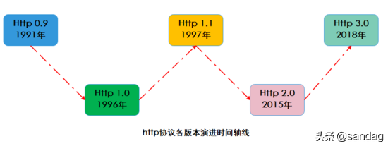
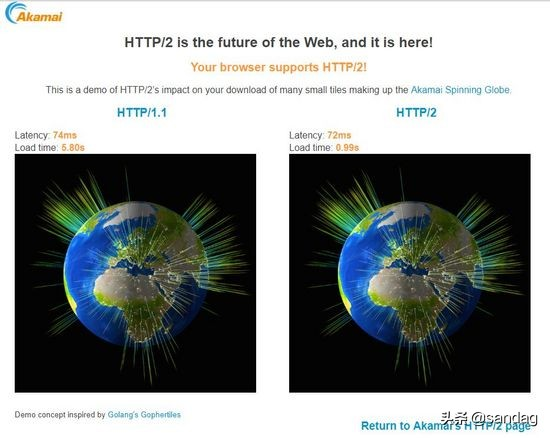
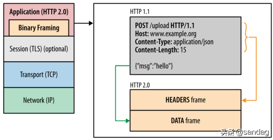
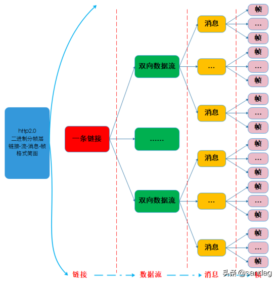
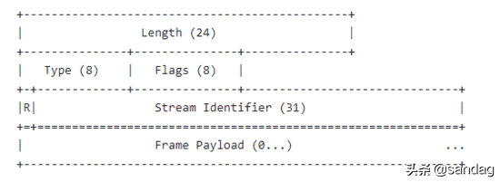
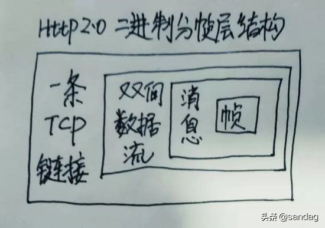
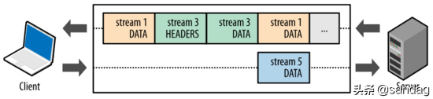
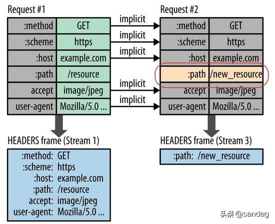
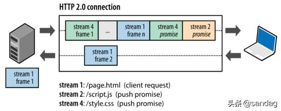

# HTTP2.0

## 前言

* Http协议各版本的对比和优缺点
* Http2.0协议相关的SPDY协议、二进制分帧协议、多路复用、首部压缩、服务推送等基本原理

##  Http协议各版本的对比

#### http各个版本的基本情况

http协议经过20多年的演进出现过 0.9、1.0、1.1、2.0、3.0 五个主要版本，笔者画了张图看下：

#### Http0.9版本

0.9是鼻祖版本，它的主要特点包括：

* 请求方法支持有限只支持GET请求方式，不支持其他请求方式 因此客户端向服务端传输信息的量非常有限，也就是现在常用的Post请求无法使用
* 不支持请求头header不能在请求中指定版本号，服务端只具有返回HTML字符串的能力
* 响应即关闭服务端相响应之后，立即关闭TCP连接

#### Http1.0版本

1.0版本主要是对0.9版本的强化，效果也比较明显，主要特性和缺点包括：

* 丰富请求方法请求方式新增了POST，DELETE，PUT，HEADER等方式，提高了客户端向服务端发送信息的量级
* 增加请求头和响应头增添了请求头和响应头的概念，可以在通信中指定了HTTP协议版本号，以及其他header信息，使得C/S交互更加灵活方便
* 丰富数据传输内容扩充了传输内容格式包括： 图片、音视频资源、二进制 等都可以进行传输，相比0.9的只能传输html内容让http的应用场景更多
* 链接复用性差1.0版本中每个TCP连接只能发送一个请求，数据发送完毕连接就关闭，如果还要请求其他资源，就必须重新建立连接。
TCP为了保证正确性和可靠性需要客户端和服务器三次握手和四次挥手，因此建立连接成本很高，基于拥塞控制开始时发送速率较慢，所以1.0版本的 性能并不理想 。
* 无状态无连接的弊端1.0版本是 无状态且无连接的，换句话说就是服务器不跟踪不记录请求过的状态，客户端每次请求都需要建立tcp连接不能复用，并且1.0规定在前一个请求响应到达之后下一个请求才能发送，如果前一个阻塞后面的请求就会被阻塞。 
丢包和乱序问题和高成本的链接过程让复用和队头阻塞产生很多问题，所以无连接无状态是1.0版本的一个弱肋 。

#### Http1.1版本

1.1版本在1.0版本发布后大约1年就推出了，是 对1.0版本的优化和完善 ，1.1版本的主要特点包括：

* 增加长连接新增Connection字段，可以设置keep-alive值保持连接不断开，即**TCP**连接默认不关闭，可以被多个请求复用，这也是1.1版本很重要的优化，但是在S端服务器只有处理完一个回应，才会进行下一个回应。
要是前面的回应特别慢，后面就会有许多请求排队等着，仍然存在队头阻塞问题。
* 管道化在长连接的基础上，管道化可以不等第一个请求响应继续发送后面的请求，但响应的顺序还是按照请求的顺序返回，即在同一个TCP连接中，客户端可以同时发送多个请求，进一步改进了HTTP协议的传输效率。
* 更多的请求方法增加了 PUT、PATCH、OPTIONS、DELETE 等请求方式。
* host字段Host字段用来指定服务器的域名，这样就可以将多种请求发往同一台服务器上的不同网站，提高了机器的复用，这个也是重要的优化

#### Http2.0版本

2.0版本是个里程碑式的版本，相比1.x版本有了非常多的优化去适应当前的网络场景，其中几个重要功能点包括：

* 二进制格式1.x是文本协议，然而2.0是以二进制帧为基本单位，可以说是一个二进制协议，将所有传输的信息分割为消息和帧，并采用二进制格式的编码，一帧中包含数据和标识符，使得网络传输变得高效而灵活。
* 多路复用这是一个非常重要的改进，1.x中建立多个连接的消耗以及效率都存在问题，2.0版本的多路复用多个请求共用一个连接，多个请求可以同时在一个TCP连接上并发，主要借助于二进制帧中的标识进行区分实现链路的复用。
* 头部压缩2.0版本使用使用HPACK算法对头部header数据进行压缩，从而减少请求的大小提高效率，这个非常好理解，之前每次发送都要带相同的header，显得很冗余，2.0版本对头部信息进行增量更新有效减少了头部数据的传输。
* 服务端推送这个功能有点意思，之前1.x版本服务端都是收到请求后被动执行，在2.0版本允许服务器主动向客户端发送资源，这样在客户端可以起到加速的作用。

## Http2.0 详解

前面对比了几个版本的演进和优化过程，接下来深入研究下2.0版本的一些特性及其基本实现原理。

从对比来看2.0版本并不是在1.1版本上的一些优化而是革新，因为2.0背负了更多的性能目标任务，1.1虽然增加了长连接和管道化，但是从根本上并没有实现真正的高性能。

2.0的设计目标是在 兼容1.x语义和操作的基础上，给用户带来更快捷、更简单、更安全的体验高效地利用当前的网络带宽，为此2.0做了很多调整主要包括： 二进制化分帧、多路复用、头部压缩等。

akamai做了http2.0和http1.1在加载过程中的对比效果( 实验中加载379个小片段 在笔者的电脑上的加载时间是0.99s VS 5.80s )：

    https://http2.akamai.com/demo

#### SPDY协议 

要说2.0版本标准和新特性就必须提谷歌的**SPDY**协议 ，看一下百度百科:

SPDY是Google开发的基于TCP的会话层协议，用以最小化网络延迟，提升网络速度，优化用户的网络使用体验。SPDY并不是一种用于替代HTTP的协议，而是对HTTP协议的增强。

新协议的功能包括 数据流的多路复用、请求优先级以及HTTP报头压缩 。谷歌表示引入SPDY协议后，在实验室测试中页面加载速度比原先快64%。

随后SPDY协议得到 Chrome、Firefox 等大型浏览器的支持，在一些大型网站和小型网站种部署，这个高效的协议引起了HTTP工作组的注意，在此基础上制定了官方Http2.0标准 。

之后几年SPDY和Http2.0继续演进相互促进，Http2.0让服务器、浏览器和网站开发者在新协议中获得更好的体验，很快被大众所认可。

#### 二进制分帧层

二进制分帧层 binary framing layer 在不修改请求方法和语义的基础上，重新设计了编码机制 ，如图为http2.0分层结构( 图片来自参考4 )：

二进制编码机制使得通信可以在 单个TCP连接 上进行，该连接在整个对话期间一直处于活跃状态。

二进制协议将通信 数据分解为更小的帧 ，数据帧充斥在C/S之间的双向数据流中，就像双向多车道的高速路，来往如织川流不息：

要理解二进制分帧层需要知道四个概念：

* 链接Link就是指一条C/S之间的TCP链接，这是个基础的链路数据的高速公路
* 数据流Stream已建立的TCP连接内的双向字节流，TCP链接中可以承载一条或多条消息
* 消息Message消息属于一个数据流，消息就是逻辑请求或响应消息对应的完整的一系列帧，也就是帧组成了消息
* 帧Frame帧是通信的最小单位，每个帧都包含帧头和消息体，标识出当前帧所属的数据流

四者是 一对多的 包含 关系，笔者画了一张图：

再来看一下HeadersFrame头部帧的结构：

再来看一下HeadersFrame头部帧的结构：从各个域可以看到长度、类型、标志位、 流标识符、 数据净荷等，感兴趣可以阅读rfc7540相关文档。

    https://httpwg.org/specs/rfc7540.html

总之 2.0版本将通信数据分解为二进制编码帧进行交换，每个帧对应着特定数据流中的特定消息，所有帧和流都在一个TCP连接内复用，二进制分帧协议是2.0其他功能和性能优化的重要基础。

#### 多路复用

1.1版本中存在队首阻塞问题 ，因此如果客户端要发起多个并行请求来提升性能，必须使用多个TCP连接 ，这样就要承受更大延时和建链拆链成本 ，不能有效利用TCP链接。

由于2.0版本中使用新的二进制分帧协议突破了1.0的诸多限制，从根本上实现了真正的请求和响应多路复用 。

客户端和服务器将交互数据分解为 相互独立的帧 ，互不影响地交错传输 ，最后再在对端根据帧头中的流标识符 把它们重新组装起来，从而实现了TCP链接的多路复用。

如图展示了2.0版本的基于帧的消息通信过程 ( 图片来自参考4 ) ：

#### 首部压缩

###### Header冗余传输
我们都知道http请求都有header部分，每个包都有并且相对于一条链接而言 大部分的包的header部分都是相同的，这样的话每次传输相同的部分确实非常浪费 。

现代网络中每个网页平均包含100多个http请求，每个请求头平均有300-500字节，总数据量达到几十KB以上，这样可能造成数据延时，尤其复杂的WiFi环境或者蜂窝网络 ，这样只能看到手机在转圈，但是这些请求头之间通常几乎没有变化，在本已经拥挤的链路中多次传输相同的数据部分确实不是高效做法。

基于TCP设计的拥塞控制具有线增积减AIMD特性 ，如果发生丢包那么传输速率将大幅度下降，这样在拥挤的网络环境中大的包头意味着只能加剧拥塞控制造成的低速率传输 。

###### Http压缩和犯罪攻击
在2.0版本的HPACK算法之前，http压缩使用gzip去压缩，后来提出的SPDY算法对Headers进行特殊设计，但是它依旧使用的是DEFLATE算法 。

在后面的一些实际应用中发现DEFLATE和SPDY都有被攻击的危险 ，因为DEFLATE算法使用后向 字符串匹配和动态Huffman编码 ，攻击者可以控制部分请求头部通过修改请求部分然后看压缩之后大小改变多少，如果变小了攻击者就知道注入的文本和请求中的某些内容有重复。

这个过程有点像俄罗斯方块的消除过程 ，这样经过一段时间的尝试数据内容就可能被全部搞清楚，由于这种风险的存在才研发出更安全的压缩算法。

###### HPACK算法
2.0版本中HPACK算法在C/S中使用 首部表 来存储之前发送的键值对，对于相同的数据通信期间几乎不会改变的通用键值对只需发送一次即可。

极端情况如果请求头每次没有变化，那么传输中则不包含首部，也就是首部开销就是零字节。如果首部键值对发生变化了，也只需要发送变化的数据，并且将新增或修改的首部帧会被追加到首部表 ，首部表在链接存活期始终存在, 并且由客户端和服务器共同更新和维护 。

简单说就是客户端和服务端共同维护了一个 key-value 的结构，发生变化时则更新传输，否则就不传输，这样相当于 首次全量传输之后增量更新传输 即可，这个思想在日常开发中也非常普遍，不用想的太复杂。

如图展示了首部表的更新过程 ( 图片来自参考4 ) ：

hpack算法的相关文档：

    https://tools.ietf.org/html/draft-ietf-httpbis-header-compression-12

#### 服务端推送

服务端推送是2.0版本新增的一个强大功能，和一般的 一问一答 式的C/S交互不同， 推送式交互中服务器可以对客户端的一个请求发送多个响应 ，除了对最初请求的响应外还向客户端推送额外资源，无需客户端明确地请求也可以推送。

举个栗子：

想象一下你去餐厅吃饭，服务好的快餐厅在你点好一份牛肉面之后，还会给你送上餐巾纸、筷子、勺子甚至调料等，这样主动式的服务，节约了客人的时间并且提高了用餐体验。

在实际的C/S交互中这种 主动推送额外资源 的方法很有效，因为几乎每个网络应用都会包含多种资源，客户端需要全部逐个获取它们，此时如果让服务器提前推送这些资源，从而可以 有效减少额外的延迟时 间 ，因为服务器可以知道客户端下一步要请求什么资源。

如图为服务端推送的简单过程 ( 图片来自参考4 ) ：

