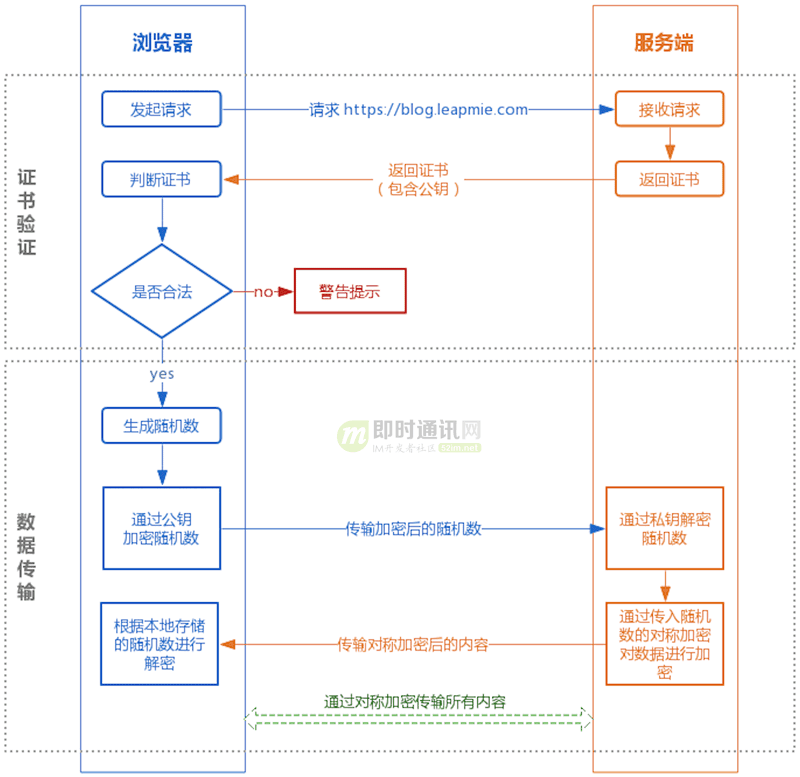
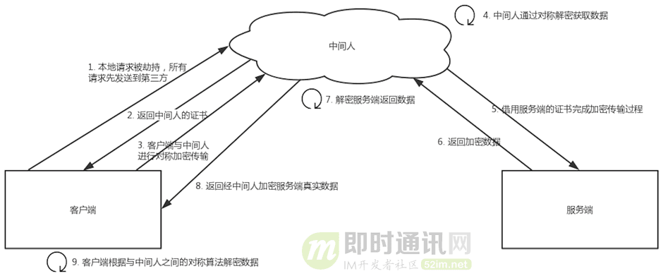
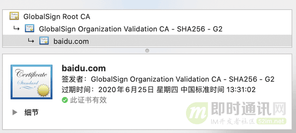

# tomcat 配置https

HTTPS

HTTPS（全称：Hyper Text Transfer Protocol over Secure Socket Layer 或 Hypertext Transfer Protocol Secure，超文本传输安全协议），是以安全为目标的HTTP通道，简单讲是HTTP的安全版。即HTTP下加入SSL层，HTTPS的安全基础是SSL，因此加密的详细内容就需要SSL。 它是一个URI scheme（抽象标识符体系），句法类同http:体系。用于安全的HTTP数据传输。https:URL表明它使用了HTTP，但HTTPS存在不同于HTTP的默认端口及一个加密/身份验证层（在HTTP与TCP之间）。这个系统的最初研发由网景公司(Netscape)进行，并内置于其浏览器Netscape Navigator中，提供了身份验证与加密通讯方法。现在它被广泛用于万维网上安全敏感的通讯，例如交易支付方面。

HTTPS和HTTP的区别

超文本传输协议HTTP协议被用于在Web浏览器和网站服务器之间传递信息。HTTP协议以明文方式发送内容，不提供任何方式的数据加密，如果攻击者截取了Web浏览器和网站服务器之间的传输报文，就可以直接读懂其中的信息，因此HTTP协议不适合传输一些敏感信息，比如信用卡号、密码等。

为了解决HTTP协议的这一缺陷，需要使用另一种协议：安全套接字层超文本传输协议HTTPS。为了数据传输的安全，HTTPS在HTTP的基础上加入了SSL协议，SSL依靠证书来验证服务器的身份，并为浏览器和服务器之间的通信加密。

HTTPS和HTTP的区别主要为以下四点：

一、https协议需要到ca申请证书，一般免费证书很少，需要交费。

二、http是超文本传输协议，信息是明文传输，https 则是具有安全性的ssl加密传输协议。

三、http和https使用的是完全不同的连接方式，用的端口也不一样，前者是80，后者是443。

四、http的连接很简单，是无状态的；HTTPS协议是由SSL+HTTP协议构建的可进行加密传输、身份认证的网络协议，比http协议安全。

注意：在微信小程序里面都限制只能有https协议、搜索引擎排名都对https优先收录

 

HTTPS信任主机的问题

采用https的服务器必须从CA （Certificate Authority）申请一个用于证明服务器用途类型的证书。该证书只有用于对应的服务器的时候，客户端才信任此主机。所以所有的银行系统网站，关键部分应用都是https 的。客户通过信任该证书，从而信任了该主机。其实这样做效率很低，但是银行更侧重安全。这一点对局域网对内提供服务处的服务器没有任何意义。局域网中的服务器，采用的证书不管是自己发布的还是从公众的地方发布的，其客户端都是自己人，所以该局域网中的客户端也就肯定信任该服务器。

HTTPS通讯过程中的数据的泄密和被篡改

1． 一般意义上的https，就是服务器有一个证书。

a) 主要目的是保证服务器就是他声称的服务器，这个跟第一点一样。

b)服务端和客户端之间的所有通讯，都是加密的。

i. 具体讲，是客户端产生一个对称的密钥，通过服务器的证书来交换密钥，即一般意义上的握手过程。

ii. 接下来所有的信息往来就都是加密的。第三方即使截获，也没有任何意义，因为他没有密钥，当然篡改也就没有什么意义了。

2． 少许对客户端有要求的情况下，会要求客户端也必须有一个证书。

a) 这里客户端证书，其实就类似表示个人信息的时候，除了用户名/密码，还有一个CA 认证过的身份。因为个人证书一般来说是别人无法模拟的，所有这样能够更深的确认自己的身份。

b) 目前大多数个人银行的专业版是这种做法，具体证书可能是拿U盘（即U盾）作为一个备份的载体。

HTTPS-ssl

SSL(Secure Sockets Layer 安全套接层),及其继任者传输层安全(Transport Layer Security，TLS)是为网络通信提供安全及数据完整性的一种安全协议。TLS与SSL在传输层对网络连接进行加密。

SSL (Secure Socket Layer)为Netscape所研发，用以保障在Internet上数据传输之安全，利用数据加密(Encryption)技术，可确保数据在网络上之传输过程中不会被截取及窃听。目前一般通用之规格为40 bit之安全标准，美国则已推出128 bit之更高安全标准，但限制出境。只要3.0版本以上之I.E.或Netscape浏览器即可支持SSL。

当前版本为3.0。它已被广泛地用于Web浏览器与服务器之间的身份认证和加密数据传输。

SSL协议位于TCP/IP协议与各种应用层协议之间，为数据通讯提供安全支持。SSL协议可分为两层：SSL记录协议（SSL Record Protocol）：它建立在可靠的传输协议（如TCP）之上，为高层协议提供数据封装、压缩、加密等基本功能的支持。SSL握手协议（SSL Handshake Protocol）：它建立在SSL记录协议之上，用于在实际的数据传输开始前，通讯双方进行身份认证、协商加密算法、交换加密密钥等。

HTTPS-SSL协议提供的服务主要有哪些

1）认证用户和服务器，确保数据发送到正确的客户机和服务器

2）加密数据以防止数据中途被窃取

3）维护数据的完整性，确保数据在传输过程中不被改变。

SSL协议的工作流程

服务器认证阶段：

1）客户端向服务器发送一个开始信息“Hello”以便开始一个新的会话连接；

2）服务器根据客户的信息确定是否需要生成新的主密钥，如需要则服务器在响应客户的“Hello”信息时将包含生成主密钥所需的信息；

3）客户根据收到的服务器响应信息，产生一个主密钥，并用服务器的公开密钥加密后传给服务器；

4）服务器恢复该主密钥，并返回给客户一个用主密钥认证的信息，以此让客户认证服务器。

HTTPS用户认证阶段

在此之前，服务器已经通过了客户认证，这一阶段主要完成对客户的认证。经认证的服务器发送一个提问给客户，客户则返回（数字）签名后的提问和其公开密钥，从而向服务器提供认证。

从SSL 协议所提供的服务及其工作流程可以看出，SSL协议运行的基础是商家对消费者信息保密的承诺，这就有利于商家而不利于消费者。在电子商务初级阶段，由于运作电子商务的企业大多是信誉较高的大公司，因此这问题还没有充分暴露出来。但随着电子商务的发展，各中小型公司也参与进来，这样在电子支付过程中的单一认证问题就越来越突出。虽然在SSL3.0中通过数字签名和数字证书可实现浏览器和Web服务器双方的身份验证，但是SSL协议仍存在一些问题，比如，只能提供交易中客户与服务器间的双方认证，在涉及多方的电子交易中，SSL协议并不能协调各方间的安全传输和信任关系。在这种情况下，Visa和MasterCard两大信用卡公组织制定了SET协议，为网上信用卡支付提供了全球性的标准。

#### 使用使用java自带keytool创建本地密钥库

创建本地密钥库命令:

    keytool -genkey -alias testkey -keyalg RSA -keystore "C:\Program Files\Java\Testkey"
    or
    keytool -genkey -alias caskeystore -keypass 123456 -keyalg RSA -keystore thekeystore
    
* -alias ： 这里的testkey是别名，根据个人自定义
* -keystore  ：这里是声明生成key的位置（稍后会用到）

输入上述命令后，会让你输入密钥库口令（记住密码）

## HTTPS用的是对称加密还是非对称加密？

#### HTTPS灵魂拷问

随着 HTTPS 建站的成本下降，现在大部分的网站都已经开始用上 HTTPS 协议。大家都知道 HTTPS 比 HTTP 安全，也听说过与 HTTPS 协议相关的概念有 SSL 、非对称加密、 CA证书等。

但对于以下灵魂三拷问可能就答不上了：

1）为什么用了 HTTPS 就是安全的？

2）HTTPS 的底层原理如何实现？

3）用了 HTTPS 就一定安全吗？

不用担心，本文将在解答“HTTPS到底用的是对称加密还是非对称加密？”的同时层层深入，从原理上把 HTTPS 的安全性讲透，您也将同时理解上述问题。

#### HTTPS 的实现原理

大家可能都听说过 HTTPS 协议之所以是安全的是因为 HTTPS 协议会对传输的数据进行加密，而加密过程是使用了非对称加密实现。但其实：HTTPS 在内容传输的加密上使用的是对称加密，非对称加密只作用在证书验证阶段。

HTTPS的整体过程分为证书验证和数据传输阶段，具体的交互过程如下：

* 证书验证阶段：

1. 浏览器发起 HTTPS 请求；
2. 服务端返回 HTTPS 证书；
3. 客户端验证证书是否合法，如果不合法则提示告警。

* 数据传输阶段：

1. 当证书验证合法后，在本地生成随机数；
2. 通过公钥加密随机数，并把加密后的随机数传输到服务端；
3. 服务端通过私钥对随机数进行解密；
4. 服务端通过客户端传入的随机数构造对称加密算法，对返回结果内容进行加密后传输。

#### 为什么数据传输是用对称加密？

首先：非对称加密的加解密效率是非常低的，而 http 的应用场景中通常端与端之间存在大量的交互，非对称加密的效率是无法接受的。

另外：在 HTTPS 的场景中只有服务端保存了私钥，一对公私钥只能实现单向的加解密，所以 HTTPS 中内容传输加密采取的是对称加密，而不是非对称加密。

#### 为什么需要 CA 认证机构颁发证书？

HTTP 协议被认为不安全是因为传输过程容易被监听者勾线监听、伪造服务器，而 HTTPS 协议主要解决的便是网络传输的安全性问题。

首先我们假设不存在认证机构，任何人都可以制作证书，这带来的安全风险便是经典的“中间人攻击”问题。

“中间人攻击”的具体过程如下：

如上图所以，过程原理如下：

1. 本地请求被劫持（如DNS劫持等），所有请求均发送到中间人的服务器；
2. 中间人服务器返回中间人自己的证书；
3. 客户端创建随机数，通过中间人证书的公钥对随机数加密后传送给中间人，然后凭随机数构造对称加密对传输内容进行加密传输；
4. 中间人因为拥有客户端的随机数，可以通过对称加密算法进行内容解密；
5. 中间人以客户端的请求内容再向正规网站发起请求；
6. 因为中间人与服务器的通信过程是合法的，正规网站通过建立的安全通道返回加密后的数据；
7. 中间人凭借与正规网站建立的对称加密算法对内容进行解密；
8. 中间人通过与客户端建立的对称加密算法对正规内容返回的数据进行加密传输；
9. 客户端通过与中间人建立的对称加密算法对返回结果数据进行解密。

由于缺少对证书的验证，所以客户端虽然发起的是 HTTPS 请求，但客户端完全不知道自己的网络已被拦截，传输内容被中间人全部窃取。

#### 浏览器是如何确保 CA 证书的合法性？

###### 证书包含什么信息？

1. 颁发机构信息；
2. 公钥；
3. 公司信息；
4. 域名；
5. 有效期；
6. 指纹；
7. ......

###### 证书的合法性依据是什么？

1. 首先：权威机构是要有认证的，不是随便一个机构都有资格颁发证书，不然也不叫做权威机构；
2. 另外：证书的可信性基于信任制，权威机构需要对其颁发的证书进行信用背书，只要是权威机构生成的证书，我们就认为是合法的。

所以权威机构会对申请者的信息进行审核，不同等级的权威机构对审核的要求也不一样，于是证书也分为免费的、便宜的和贵的。

###### 浏览器如何验证证书的合法性？

浏览器发起 HTTPS 请求时，服务器会返回网站的 SSL 证书，浏览器需要对证书做以下验证：

1. 验证域名、有效期等信息是否正确：证书上都有包含这些信息，比较容易完成验证；
2. 判断证书来源是否合法：每份签发证书都可以根据验证链查找到对应的根证书，操作系统、浏览器会在本地存储权威机构的根证书，利用本地根证书可以对对应机构签发证书完成来源验证（如下图所示）：

3. 判断证书是否被篡改：需要与 CA 服务器进行校验；
4. 判断证书是否已吊销：通过CRL（Certificate Revocation List 证书注销列表）和 OCSP（Online Certificate Status Protocol 在线证书状态协议）实现，其中 OCSP 可用于第3步中以减少与 CA 服务器的交互，提高验证效率。

以上任意一步都满足的情况下浏览器才认为证书是合法的。

** 这里插一个我想了很久的但其实答案很简单的问题**

> 既然证书是公开的，如果要发起中间人攻击，我在官网上下载一份证书作为我的服务器证书，那客户端肯定会认同这个证书是合法的，如何避免这种证书冒用的情况？

>其实这就是非加密对称中公私钥的用处，虽然中间人可以得到证书，但私钥是无法获取的，一份公钥是不可能推算出其对应的私钥，中间人即使拿到证书也无法伪装成合法服务端，因为无法对客户端传入的加密数据进行解密。

###### 只有认证机构可以生成证书吗？

如果需要浏览器不提示安全风险，那只能使用认证机构签发的证书。但浏览器通常只是提示安全风险，并不限制网站不能访问，所以从技术上谁都可以生成证书，只要有证书就可以完成网站的 HTTPS 传输。

例如早期的 12306 采用的便是手动安装私有证书的形式实现 HTTPS 访问：

#### 本地随机数被窃取怎么办？

证书验证是采用非对称加密实现，但是传输过程是采用对称加密，而其中对称加密算法中重要的随机数是由本地生成并且存储于本地的，HTTPS 如何保证随机数不会被窃取？

其实 HTTPS 并不包含对随机数的安全保证，HTTPS 保证的只是传输过程安全，而随机数存储于本地，本地的安全属于另一安全范畴，应对的措施有安装杀毒软件、反木马、浏览器升级修复漏洞等。

#### 用了 HTTPS 会被抓包吗？

HTTPS 的数据是加密的，常规下抓包工具代理请求后抓到的包内容是加密状态，无法直接查看。

但是，正如前文所说，浏览器只会提示安全风险，如果用户授权仍然可以继续访问网站，完成请求。因此，只要客户端是我们自己的终端，我们授权的情况下，便可以组建中间人网络，而抓包工具便是作为中间人的代理。通常 HTTPS 抓包工具的使用方法是会生成一个证书，用户需要手动把证书安装到客户端中，然后终端发起的所有请求通过该证书完成与抓包工具的交互，然后抓包工具再转发请求到服务器，最后把服务器返回的结果在控制台输出后再返回给终端，从而完成整个请求的闭环。

既然 HTTPS 不能防抓包，那 HTTPS 有什么意义？

> HTTPS 可以防止用户在不知情的情况下通信链路被监听，对于主动授信的抓包操作是不提供防护的，因为这个场景用户是已经对风险知情。要防止被抓包，需要采用应用级的安全防护，例如采用私有的对称加密，同时做好移动端的防反编译加固，防止本地算法被破解。
