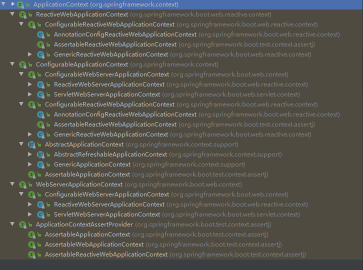
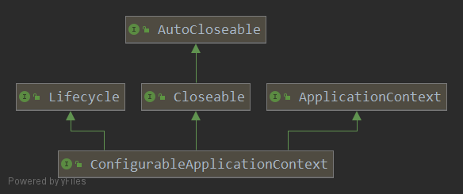
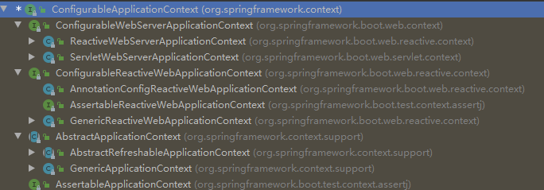
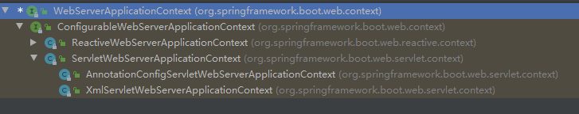

# ApplicationContext体系结构分析

上篇已经对IoC容器的设计进行了分析，本篇将对ApplicationContext经典的继承层次图进行详细的分析

    本节代码基于springboot 2.3.0

### 继承层次图概览

使用IDEA的继承层次工具生成如下的图（选中ApplicationContext --> Ctrl+H）：



从上图能很清楚的看出，ApplicationContext的子接口分为四个部分：

* ConfigurableApplicationContext：大部分的应用上下文都实现了该接口
* ReactiveWebApplicationContext: 在reactive方案容器的运行web的应用程序中使用
* WebServerApplicationContext：在servlet方案容器运行web的应用程序中使用
* ApplicationContextAssertProvider: 它另外支持AssertJ样式声明。可用于装饰现有的应用程序上下文或启动失败的应用程序上下文

### ConfigurableApplicationContext分析

从上面的类的继承层次图能看到，ConfigurableApplicationContext是比较上层的一个接口，该接口也是比较重要的一个接口，几乎所有的应用上下文都实现了该接口。
该接口在ApplicationContext的基础上提供了配置应用上下文的能力，此外提供了生命周期的控制能力。先看一下该接口的继承关系图（为了更加简洁，去掉了ApplicationContext继承的接口）：



**Closeable**接口用于关闭应用上下文，释放所有的资源和锁，这也包括摧毁所有缓存的单例的bean，常见的try-with-resources用法如下，执行完try体中的代码后会自动的调用close方法：

```java
try (ConfigurableApplicationContext cac = ...) {
    // 编写代码 
    ...
}
```

**Lifecycle**定义了启动/停止生命周期的控制的一些方法，其中的方法如下：

```java
void start(); // 启动组件
void stop(); // 停止组件
boolean isRunning(); // 组件是否正在运行
```

接下来看一下ConfigurableApplicationContext中的方法：

```java

	String CONFIG_LOCATION_DELIMITERS = ",; \t\n";

	String CONVERSION_SERVICE_BEAN_NAME = "conversionService";

	String LOAD_TIME_WEAVER_BEAN_NAME = "loadTimeWeaver";

	String ENVIRONMENT_BEAN_NAME = "environment";

	String SYSTEM_PROPERTIES_BEAN_NAME = "systemProperties";

	String SYSTEM_ENVIRONMENT_BEAN_NAME = "systemEnvironment";

	String SHUTDOWN_HOOK_THREAD_NAME = "SpringContextShutdownHook";

    // 设置应用上下文唯一的id
	void setId(String id);

    // 设置应用程序上下文的父级
	void setParent(@Nullable ApplicationContext parent);

    // 设置应用上下文的环境
	void setEnvironment(ConfigurableEnvironment environment);

	@Override
	ConfigurableEnvironment getEnvironment();

    // 添加一个新的BeanFactoryPostProcessor
	void addBeanFactoryPostProcessor(BeanFactoryPostProcessor postProcessor);

    // 添加应用程序监听器
	void addApplicationListener(ApplicationListener<?> listener);

    // 添加协议解析器，可能会覆盖默认的规则
	void addProtocolResolver(ProtocolResolver resolver);

    // 加载或者刷新配置
	void refresh() throws BeansException, IllegalStateException;

    // 向JVM runtime注册一个关闭钩子，JVM关闭时关闭这个上下文
	void registerShutdownHook();

	@Override
	void close();

    // 应用程序上下文是否是激活状态
	boolean isActive();

    // 获取应用上下文内部的bean factory
	ConfigurableListableBeanFactory getBeanFactory() throws IllegalStateException;

```

上面的这些方法基本上是提供了对某些特性的实现进行支撑的方法。

看了这么多方法，下面看一下ApplicationContext的抽象的实现。



##### AbstractApplicationContext

AbstractApplicationContext是ApplicationContext接口的抽象实现，这个抽象类仅仅是实现了公共的上下文特性。
这个抽象类使用了模板方法设计模式，需要具体的实现类去实现这些抽象的方法。对相关接口的实现如下：

* ApplicationContext接口的实现
* ConfigurableApplicationContext接口的实现
* BeanFactory接口的实现
* ListableBeanFactory接口的实现
* HierarchicalBeanFactory接口的实现
* MessageSource接口的实现
* ResourcePatternResolver的实现
* Lifecycle接口的实现

本文不会详细的讲解这个类中的具体的实现细节，后面会有更加的详细的介绍。下面看下里面的抽象方法：

```java
// 刷新BeanFactory，用于执行实际的配置加载，该方法在其他的初始化工作之前被refresh()方法调用
protected abstract void refreshBeanFactory() throws BeansException, IllegalStateException;
// 关闭BeanFactory，用于释放内部使用的BeanFactory·
protected abstract void closeBeanFactory();
// 获取内部使用的BeanFactory
public abstract ConfigurableListableBeanFactory getBeanFactory() throws IllegalStateException;
```
那么对需要实现的方法经过抽象后，只剩下少量的需要子类去实现的方法。

###### GenericApplicationContext

GenericApplicationContext继承自AbstractApplicationContext，是为通用目的设计的，它能加载各种配置文件，例如xml，properties等等。
它的内部持有一个DefaultListableBeanFactory的实例，实现了BeanDefinitionRegistry接口，以便允许向其应用任何bean的定义的读取器。
为了能够注册bean的定义，refresh()只允许调用一次。常见的使用如下：

```java
GenericApplicationContext ctx = new GenericApplicationContext();
XmlBeanDefinitionReader xmlReader = new XmlBeanDefinitionReader(ctx);
xmlReader.loadBeanDefinitions(new ClassPathResource("applicationContext.xml"));
PropertiesBeanDefinitionReader propReader = new PropertiesBeanDefinitionReader(ctx);
propReader.loadBeanDefinitions(new ClassPathResource("otherBeans.properties"));
ctx.refresh();

MyBean myBean = (MyBean) ctx.getBean("myBean");
..
```

这个类的实现没有太多需要注意的地方，需要注意的有两点：

* 内部使用的DefaultListableBeanFactory的实例，提供了一些方法来配置该实例，例如是否允许bean定义的覆盖、是否允许bean之间的循环应用等等。
* 该类实现了BeanDefinitionRegistry，bean的定义注册。以便能通过BeanDefinitionReader读取bean的配置，并注册。BeanDefinitionRegistry接口的实现是直接使用内部的DefaultListableBeanFactory的实例。

GenericApplicationContext有六个子类

* GenericXmlApplicationContext：内置了对XML的支持。它非常的方便和灵活，是ClassPathXmlApplicationContext和FileSystemXmlApplicationContext的一种替代品。可以发现，它的内部有一个XmlBeanDefinitionReader的实例，专门用于处理XML的配置。
* StaticApplicationContext：主要用于编程式的注入bean和消息，而不是从外部的配置源读取bean的定义。主要是在测试时非常有用。通过阅读源代码可以看到，它的内部有一个StaticMessageSource的实例，使用addMessage方法添加消息。每次在编程式的注入bean时，都会创建一个GenericBeanDefinition的实例。
* ResourceAdapterApplicationContext：是为JCA（J2EE Connector Architecture）的ResourceAdapter设计的，主要用于传递BootstrapContext的实例给实现了BootstrapContextAware接口且由spring管理的bean。覆盖了postProcessBeanFactory方法来实现此功能。
* GenericGroovyApplicationContext：实现了GroovyObject接口以便能够使用点的语法（.xx）取代getBean方法来获取bean。它主要用于Groovy bean的定义，与GenericXmlApplicationContext一样，它也能解析XML格式定义的bean。内部使用GroovyBeanDefinitionReader来完成groovy脚本和XML的解析。
* AnnotationConfigApplicationContext：提供了注解配置（例如：Configuration、Component、inject等）和类路径扫描（scan方法）的支持，可以使用register(Class<?>... annotatedClasses)来注册一个一个的进行注册。实现了AnnotationConfigRegistry接口，来完成对注册配置的支持，只有两个方法：register和scan。内部使用AnnotatedBeanDefinitionReader来完成注解配置的解析，使用ClassPathBeanDefinitionScanner来完成类路径下的bean定义的扫描。
* GenericReactiveWebApplicationContext：

### WebServerApplicationContext

该接口提供了在web应用中的配置，并提供如下接口

```java

    //返回由上下文创建的WebServer；如果尚未创建服务器，则返回null
	WebServer getWebServer();

    //返回Web服务器应用程序上下文的名称空间；如果未设置名称空间，则返回null。 当多个Web服务器在同一应用程序中运行时（例如，在不同端口上运行的管理上下文），用于消除歧义
	String getServerNamespace();

    //如果指定的上下文是具有匹配服务器名称空间的WebServerApplicationContext，则返回true。
	static boolean hasServerNamespace(ApplicationContext context, String serverNamespace) {
		return (context instanceof WebServerApplicationContext) && ObjectUtils
				.nullSafeEquals(((WebServerApplicationContext) context).getServerNamespace(), serverNamespace);
	}
```



#### ConfigurableWebServerApplicationContext 

ConfigurableWebApplicationContext继承自WebApplicationContext和ConfigurableApplicationContext,并额外添加一个接口

    void setServerNamespace(String serverNamespace);

###### ServletWebServerApplicationContext

**ServletWebServerApplicationContext**继承了**GenericWebApplicationContext**并实现了**ConfigurableWebServerApplicationContext**

## ApplicationContext容器的设计原理

以ClassPathXmlApplicationContext为例应用：

```java
// 根据配置文件创建spring容器
ApplicationContext context =
	new ClassPathXmlApplicationContext("applicationContext.xml");
// 从容器中获取Bean
ConferenceServiceImpl conferenceService = (ConferenceServiceImpl)context.getBean("conferenceService");
// 调用Bean方法
conferenceService.conference();
```
ClassPathXmlApplicationContext源码：

```java
package org.springframework.context.support;
import org.springframework.beans.BeansException;
import org.springframework.context.ApplicationContext;
import org.springframework.core.io.ClassPathResource;
import org.springframework.core.io.Resource;
import org.springframework.util.Assert;
 
public class ClassPathXmlApplicationContext extends AbstractXmlApplicationContext {
	private Resource[] configResources;
 
	public ClassPathXmlApplicationContext() {
	}
 
	public ClassPathXmlApplicationContext(ApplicationContext parent) {
		super(parent);
	}
 
	public ClassPathXmlApplicationContext(String configLocation) throws BeansException {
		this(new String[] {configLocation}, true, null);
	}
 
	public ClassPathXmlApplicationContext(String... configLocations) throws BeansException {
		this(configLocations, true, null);
	}
 
	public ClassPathXmlApplicationContext(String[] configLocations, ApplicationContext parent) throws BeansException {
		this(configLocations, true, parent);
	}
 
	public ClassPathXmlApplicationContext(String[] configLocations, boolean refresh) throws BeansException {
		this(configLocations, refresh, null);
	}
 
	public ClassPathXmlApplicationContext(String[] configLocations, boolean refresh, ApplicationContext parent)
			throws BeansException {
 
		super(parent);
		setConfigLocations(configLocations);
		if (refresh) {
			refresh();
		}
	}
	
	public ClassPathXmlApplicationContext(String path, Class<?> clazz) throws BeansException {
		this(new String[] {path}, clazz);
	}
	
	public ClassPathXmlApplicationContext(String[] paths, Class<?> clazz) throws BeansException {
		this(paths, clazz, null);
	}
	
	public ClassPathXmlApplicationContext(String[] paths, Class<?> clazz, ApplicationContext parent)
			throws BeansException {
 
		super(parent);
		Assert.notNull(paths, "Path array must not be null");
		Assert.notNull(clazz, "Class argument must not be null");
		this.configResources = new Resource[paths.length];
		for (int i = 0; i < paths.length; i++) {
			this.configResources[i] = new ClassPathResource(paths[i], clazz);
		}
		refresh();
	}
	
	@Override
	protected Resource[] getConfigResources() {
		return this.configResources;
	}
}
```

构造器传入XML最后会调用到如下构造器：
```java

public ClassPathXmlApplicationContext(String[] configLocations, boolean refresh, ApplicationContext parent)
			throws BeansException {
	super(parent);
	setConfigLocations(configLocations);
	if (refresh) {
	    refresh();
	}
}
```

最后会调用refresh()方法，这个方法就是IOC容器启动的入口，IOC容器里面进行了一序列复杂的操作，

这也是通往IOC容器核心实现原理的入口。
```java

```


```java

```

