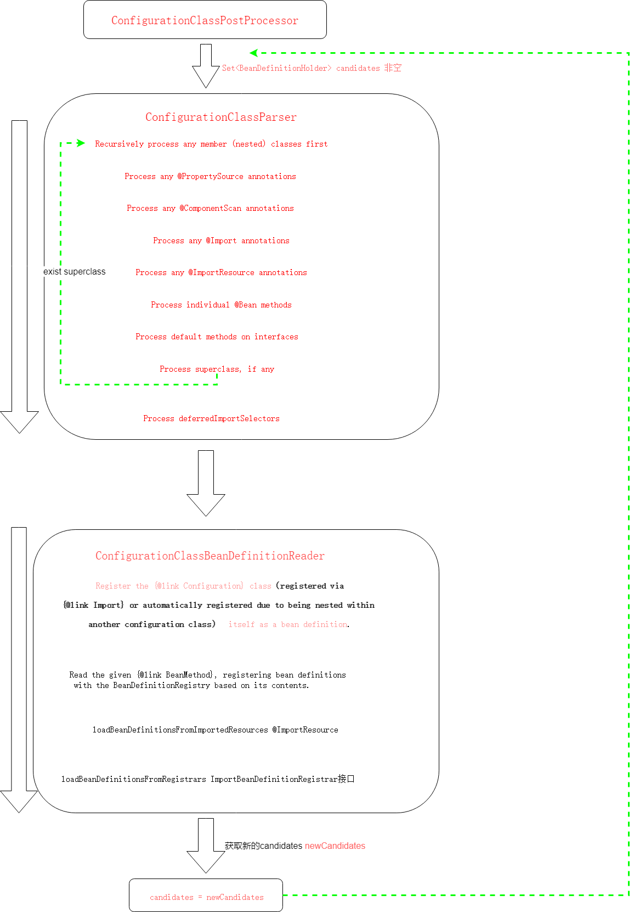

# Spring中最最最重要的后置处理器ConfigurationClassPostProcessor

     没有之一！
     
     本文源码为spring5.2.9版本

## 疑惑

在阅读本文之前，可以先思考一下以下几个问题。

1. @Configuration注解的作用是什么，Spring是如何解析加了@Configuration注解的类？
2. Spring在什么时候对@ComponentScan、@ComponentScans注解进行了解析？
3. Spring什么时候解析了@Import注解，如何解析的？
4. Spring什么时候解析了@Bean注解？


## 整体感官
     



## 代码追踪

这里是接上篇文章[AnnotationConfigApplicationContext(注解方式)初始化](AnnotationConfigApplicationContext.md)

里面的启动类为，后面会用到

``` java
new AnnotationConfigApplicationContext(Application.class);
```

ConfigurationClassPostProcessor 实现了 BeanDefinitionRegistryPostProcessor 接口，而 BeanDefinitionRegistryPostProcessor 接口继承了 BeanFactoryPostProcessor 接口，所以 ConfigurationClassPostProcessor 中需要重写 postProcessBeanDefinitionRegistry() 方法和 postProcessBeanFactory() 方法。
而ConfigurationClassPostProcessor类的作用就是通过这两个方法去实现的。

参考[BeanFactoryPostProcessor](BeanFactoryPostProcessor.md)

```java
	/**
	 * Derive further bean definitions from the configuration classes in the registry.
	 */
	@Override
	public void postProcessBeanDefinitionRegistry(BeanDefinitionRegistry registry) {
		int registryId = System.identityHashCode(registry);
		if (this.registriesPostProcessed.contains(registryId)) {
			throw new IllegalStateException(
					"postProcessBeanDefinitionRegistry already called on this post-processor against " + registry);
		}
		if (this.factoriesPostProcessed.contains(registryId)) {
			throw new IllegalStateException(
					"postProcessBeanFactory already called on this post-processor against " + registry);
		}
		this.registriesPostProcessed.add(registryId);

		processConfigBeanDefinitions(registry);
	}
```
进入 processConfigBeanDefinitions

```java
	public void processConfigBeanDefinitions(BeanDefinitionRegistry registry) {
      // configCandidates 配置类候选人
		List<BeanDefinitionHolder> configCandidates = new ArrayList<>();
		String[] candidateNames = registry.getBeanDefinitionNames();

		for (String beanName : candidateNames) {
			BeanDefinition beanDef = registry.getBeanDefinition(beanName);
			if (beanDef.getAttribute(ConfigurationClassUtils.CONFIGURATION_CLASS_ATTRIBUTE) != null) {
                   //已经处理过了及 以及设置configurationClass属性  不再处理
				if (logger.isDebugEnabled()) {
                    //  log 日志
					logger.debug("Bean definition has already been processed as a configuration class: " + beanDef);
				}
			}
           // checkConfigurationClassCandidate()会判断一个是否是一个配置类,并为BeanDefinition设置属性为lite或者full。
        // 在这儿为BeanDefinition设置lite和full属性值是为了后面在使用；lite和full均表示这个BeanDefinition对应的类是一个配置类
			else if (ConfigurationClassUtils.checkConfigurationClassCandidate(beanDef, this.metadataReaderFactory)) {
                  //只有有@Configuration注解且不是代理类的才会加入
				configCandidates.add(new BeanDefinitionHolder(beanDef, beanName));
			}
		}

		// Return immediately if no @Configuration classes were found
		if (configCandidates.isEmpty()) {
			return;
		}

		// Sort by previously determined @Order value, if applicable
		configCandidates.sort((bd1, bd2) -> {
			int i1 = ConfigurationClassUtils.getOrder(bd1.getBeanDefinition());
			int i2 = ConfigurationClassUtils.getOrder(bd2.getBeanDefinition());
			return Integer.compare(i1, i2);
		});

		// Detect any custom bean name generation strategy supplied through the enclosing application context
		SingletonBeanRegistry sbr = null;
		if (registry instanceof SingletonBeanRegistry) {
			sbr = (SingletonBeanRegistry) registry;
			if (!this.localBeanNameGeneratorSet) {
              // beanName的生成器，因为后面会扫描出所有加入到spring容器中calss类，然后把这些class解析成BeanDefinition类，此时需要利用BeanNameGenerator为这些BeanDefinition生成beanName
				BeanNameGenerator generator = (BeanNameGenerator) sbr.getSingleton(
						AnnotationConfigUtils.CONFIGURATION_BEAN_NAME_GENERATOR);
				if (generator != null) {
					this.componentScanBeanNameGenerator = generator;
					this.importBeanNameGenerator = generator;
				}
			}
		}

		if (this.environment == null) {
			this.environment = new StandardEnvironment();
		}

		// Parse each @Configuration class
// 定义一个解析器，解析所有加了@Configuration注解的类
		ConfigurationClassParser parser = new ConfigurationClassParser(
				this.metadataReaderFactory, this.problemReporter, this.environment,
				this.resourceLoader, this.componentScanBeanNameGenerator, registry);

		Set<BeanDefinitionHolder> candidates = new LinkedHashSet<>(configCandidates);
		Set<ConfigurationClass> alreadyParsed = new HashSet<>(configCandidates.size());
		do {
/ /解析配置类，在此处会解析配置类上的注解(ComponentScan扫描出的类，@Import注册的类，以及@Bean方法定义的类)
        // 注意：这一步只会将加了@Configuration注解以及通过@ComponentScan注解扫描的类才会加入到BeanDefinitionMap中
        // 通过其他注解(例如@Import、@Bean)的方式，在parse()方法这一步并不会将其解析为BeanDefinition放入到BeanDefinitionMap中，而是先解析成ConfigurationClass类
        // 真正放入到map中是在下面的this.reader.loadBeanDefinitions()方法中实现的
			parser.parse(candidates);
			parser.validate();

			Set<ConfigurationClass> configClasses = new LinkedHashSet<>(parser.getConfigurationClasses());
			configClasses.removeAll(alreadyParsed);

			// Read the model and create bean definitions based on its content
			if (this.reader == null) {
				this.reader = new ConfigurationClassBeanDefinitionReader(
						registry, this.sourceExtractor, this.resourceLoader, this.environment,
						this.importBeanNameGenerator, parser.getImportRegistry());
			}
// 将上一步parser解析出的ConfigurationClass类加载成BeanDefinition
		// 实际上经过上一步的parse()后，解析出来的bean已经放入到BeanDefinition中了，但是由于这些bean可能会引入新的bean，例如实现了ImportBeanDefinitionRegistrar或者ImportSelector接口的bean，或者bean中存在被@Bean注解的方法
		// 因此需要执行一次loadBeanDefinition()，这样就会执行ImportBeanDefinitionRegistrar或者ImportSelector接口的方法或者@Bean注释的方法
		
			this.reader.loadBeanDefinitions(configClasses);
			alreadyParsed.addAll(configClasses);

			candidates.clear();

	// 这里判断registry.getBeanDefinitionCount() > candidateNames.length的目的是为了知道reader.loadBeanDefinitions(configClasses)这一步有没有向BeanDefinitionMap中添加新的BeanDefinition
		// 实际上就是看配置类(例如AppConfig类会向BeanDefinitionMap中添加bean)
		// 如果有，registry.getBeanDefinitionCount()就会大于candidateNames.length
		// 这样就需要再次遍历新加入的BeanDefinition，并判断这些bean是否已经被解析过了，如果未解析，需要重新进行解析
		// 这里的AppConfig类向容器中添加的bean，实际上在parser.parse()这一步已经全部被解析了
		// 所以为什么还需要做这个判断，目前没看懂，似乎没有任何意义。
			if (registry.getBeanDefinitionCount() > candidateNames.length) {
				String[] newCandidateNames = registry.getBeanDefinitionNames();
				Set<String> oldCandidateNames = new HashSet<>(Arrays.asList(candidateNames));
				Set<String> alreadyParsedClasses = new HashSet<>();
				for (ConfigurationClass configurationClass : alreadyParsed) {
					alreadyParsedClasses.add(configurationClass.getMetadata().getClassName());
				}
                  // 如果有未解析的类，则将其添加到candidates中，这样candidates不为空，就会进入到下一次的while的循环中
				for (String candidateName : newCandidateNames) {
					if (!oldCandidateNames.contains(candidateName)) {
						BeanDefinition bd = registry.getBeanDefinition(candidateName);
						if (ConfigurationClassUtils.checkConfigurationClassCandidate(bd, this.metadataReaderFactory) &&
								!alreadyParsedClasses.contains(bd.getBeanClassName())) {
							candidates.add(new BeanDefinitionHolder(bd, candidateName));
						}
					}
				}
				candidateNames = newCandidateNames;
			}
		}
		while (!candidates.isEmpty());

		// Register the ImportRegistry as a bean in order to support ImportAware @Configuration classes
		if (sbr != null && !sbr.containsSingleton(IMPORT_REGISTRY_BEAN_NAME)) {
			sbr.registerSingleton(IMPORT_REGISTRY_BEAN_NAME, parser.getImportRegistry());
		}

		if (this.metadataReaderFactory instanceof CachingMetadataReaderFactory) {
			// Clear cache in externally provided MetadataReaderFactory; this is a no-op
			// for a shared cache since it'll be cleared by the ApplicationContext.
			((CachingMetadataReaderFactory) this.metadataReaderFactory).clearCache();
		}
	}
```

###### ConfigurationClassUtils#checkConfigurationClassCandidate

该方法是用来判断一个是否是一个配置类，并为BeanDefinition设置属性为lite或者full。

* 如果加了@Configuration，且proxyBeanMethods=false，那么对应的BeanDefinition为full。
* 如果加了@Configuration，且配置了@Bean，@Component，@ComponentScan，@Import，@ImportResource这些注解，则为lite

这两种情况都会被加入到configCandidates中；其它的不会加入到configCandidates中。

    @Configuration的proxyBeanMethods为flase 不会被代理，如果为true会被CGLIB代理，如果只是普通类的话建议设置为 flase ,这样能提升性能

```java
	/**
	 * Check whether the given bean definition is a candidate for a configuration class
	 * (or a nested component class declared within a configuration/component class,
	 * to be auto-registered as well), and mark it accordingly.
	 * @param beanDef the bean definition to check
	 * @param metadataReaderFactory the current factory in use by the caller
	 * @return whether the candidate qualifies as (any kind of) configuration class
	 */
	public static boolean checkConfigurationClassCandidate(
			BeanDefinition beanDef, MetadataReaderFactory metadataReaderFactory) {

		String className = beanDef.getBeanClassName();
		if (className == null || beanDef.getFactoryMethodName() != null) {
			return false;
		}

		AnnotationMetadata metadata;
		if (beanDef instanceof AnnotatedBeanDefinition &&
				className.equals(((AnnotatedBeanDefinition) beanDef).getMetadata().getClassName())) {
			// Can reuse the pre-parsed metadata from the given BeanDefinition...
			metadata = ((AnnotatedBeanDefinition) beanDef).getMetadata();
		}
		else if (beanDef instanceof AbstractBeanDefinition && ((AbstractBeanDefinition) beanDef).hasBeanClass()) {
			// Check already loaded Class if present...
			// since we possibly can't even load the class file for this Class.
			Class<?> beanClass = ((AbstractBeanDefinition) beanDef).getBeanClass();
			if (BeanFactoryPostProcessor.class.isAssignableFrom(beanClass) ||
					BeanPostProcessor.class.isAssignableFrom(beanClass) ||
					AopInfrastructureBean.class.isAssignableFrom(beanClass) ||
					EventListenerFactory.class.isAssignableFrom(beanClass)) {
				return false;
			}
			metadata = AnnotationMetadata.introspect(beanClass);
		}
		else {
			try {
				MetadataReader metadataReader = metadataReaderFactory.getMetadataReader(className);
				metadata = metadataReader.getAnnotationMetadata();
			}
			catch (IOException ex) {
				if (logger.isDebugEnabled()) {
					logger.debug("Could not find class file for introspecting configuration annotations: " +
							className, ex);
				}
				return false;
			}
		}

		Map<String, Object> config = metadata.getAnnotationAttributes(Configuration.class.getName());
		if (config != null && !Boolean.FALSE.equals(config.get("proxyBeanMethods"))) {
               // 含有@Configuration注解，且不为代理类 那么对应的BeanDefinition的configurationClass属性值设置为full
			beanDef.setAttribute(CONFIGURATION_CLASS_ATTRIBUTE, CONFIGURATION_CLASS_FULL);
		}
		else if (config != null || isConfigurationCandidate(metadata)) {
             // 含有@Bean,@Component,@ComponentScan,@Import,@ImportResource注解，configurationClass属性值设置为lite
			beanDef.setAttribute(CONFIGURATION_CLASS_ATTRIBUTE, CONFIGURATION_CLASS_LITE);
		}
		else {
			return false;
		}

		// It's a full or lite configuration candidate... Let's determine the order value, if any.
		Integer order = getOrder(metadata);
		if (order != null) {
			beanDef.setAttribute(ORDER_ATTRIBUTE, order);
		}

		return true;
	}
```


```java

```


#### ConfigurationClassParser#parse方法

parse()方法会解析配置类上的注解(ComponentScan扫描出的类，@Import注册的类，以及@Bean方法定义的类)，解析完以后(解析成ConfigurationClass类)，
会将解析出的结果放入到parser的configurationClasses这个属性中(这个属性是个Map)。parse会将@Import注解要注册的类解析为BeanDefinition，
但是不会把解析出来的BeanDefinition放入到BeanDefinitionMap中，真正放入到map中是在这一行代码实现的:
this.reader.loadBeanDefinitions(configClasses)

还记得前面提到的 new AnnotationConfigApplicationContext(Application.class);

在AnnotationConfigApplicationContext的构造方法中，我们传入了一个AppConfig类，那么candidates的大小为1，里面的元素为AppConfig类所对应的BeanDefinitionHolder(或者说是BeanDefinition,BeanDefinitionHolder只是将BeanDefinition封装了一下，可以简单的认为两者等价)。
AnnotationConfigApplicationContext构造方法可以传入多个类，对应的candidates的大小等于这里传入类的个数(这种说法其实不太严谨，因为AnnotationConfigApplicationContext.register()方法也能像容器中注册配置类)

```java
	public void parse(Set<BeanDefinitionHolder> configCandidates) {
		for (BeanDefinitionHolder holder : configCandidates) {
			BeanDefinition bd = holder.getBeanDefinition();

             //根据BeanDefinition类型的不同，调用parse()不同的重载方法， 实际上最终都是调用processConfigurationClass()方法
			try {
				if (bd instanceof AnnotatedBeanDefinition) {
					parse(((AnnotatedBeanDefinition) bd).getMetadata(), holder.getBeanName());
				}
				else if (bd instanceof AbstractBeanDefinition && ((AbstractBeanDefinition) bd).hasBeanClass()) {
					parse(((AbstractBeanDefinition) bd).getBeanClass(), holder.getBeanName());
				}
				else {
					parse(bd.getBeanClassName(), holder.getBeanName());
				}
			}
			catch (BeanDefinitionStoreException ex) {
				throw ex;
			}
			catch (Throwable ex) {
				throw new BeanDefinitionStoreException(
						"Failed to parse configuration class [" + bd.getBeanClassName() + "]", ex);
			}
		}
           // 处理延迟importSelector
		this.deferredImportSelectorHandler.process();
	}
```
继续进入 parse方法 至于走那个分值后面再补充，这里可任意进入一个，我选择了最后一个。

```java
	protected final void parse(@Nullable String className, String beanName) throws IOException {
		Assert.notNull(className, "No bean class name for configuration class bean definition");
		MetadataReader reader = this.metadataReaderFactory.getMetadataReader(className);
		processConfigurationClass(new ConfigurationClass(reader, beanName), DEFAULT_EXCLUSION_FILTER);
	}
```

processConfigurationClass方法
```java
	protected void processConfigurationClass(ConfigurationClass configClass, Predicate<String> filter) throws IOException {
		if (this.conditionEvaluator.shouldSkip(configClass.getMetadata(), ConfigurationPhase.PARSE_CONFIGURATION)) {
			return;
		}

		ConfigurationClass existingClass = this.configurationClasses.get(configClass);
		if (existingClass != null) {
			if (configClass.isImported()) {
				if (existingClass.isImported()) {
					existingClass.mergeImportedBy(configClass);
				}
				// Otherwise ignore new imported config class; existing non-imported class overrides it.
				return;
			}
			else {
				// Explicit bean definition found, probably replacing an import.
				// Let's remove the old one and go with the new one.
				this.configurationClasses.remove(configClass);
				this.knownSuperclasses.values().removeIf(configClass::equals);
			}
		}

		// Recursively process the configuration class and its superclass hierarchy.
	// 处理配置类，由于配置类可能存在父类(若父类的全类名是以java开头的，则除外)，所有需要将configClass变成sourceClass去解析，然后返回sourceClass的父类。
	// 如果此时父类为空，则不会进行while循环去解析，如果父类不为空，则会循环的去解析父类
	// SourceClass的意义：简单的包装类，目的是为了以统一的方式去处理带有注解的类，不管这些类是如何加载的
	// 如果无法理解，可以把它当做一个黑盒，不会影响看spring源码的主流程
		SourceClass sourceClass = asSourceClass(configClass, filter);
		do {
      // 核心处理逻辑
			sourceClass = doProcessConfigurationClass(configClass, sourceClass, filter);
		}
		while (sourceClass != null);
   // 将解析的配置类存储起来，这样回到parse()方法时，能取到值
		this.configurationClasses.put(configClass, configClass);
	}
```

###### 代码追踪到ConfigurationClassParser#doProcessConfigurationClass()

doProcessConfigurationClass()方法中，执行流程如下:

1. 处理内部类，如果内部类也是一个配置类(判断一个类是否是一个配置类，通过ConfigurationClassUtils.checkConfigurationClassCandidate()可以判断)，则递归处理。
2. 处理属性资源文件，加了@PropertySource注解。
3. 首先解析出类上的@ComponentScan和@ComponentScans注解，然后根据配置的扫描包路径，利用ASM技术(ASM技术是一种操作字节码的技术，有兴趣的朋友可以去网上了解下)扫描出所有需要交给Spring管理的类，由于扫描出的类中可能也被加了@ComponentScan和@ComponentScans注解，因此需要进行递归解析，直到所有加了这两个注解的类被解析完成。
4. 处理@Import注解。通过@Import注解，有三种方式可以将一个Bean注册到Spring容器中。
5. 处理@ImportResource注解，解析配置文件。
6. 处理加了@Bean注解的方法。
7. 通过processInterfaces()处理接口的默认方法，从JDK8开始，接口中的方法可以有自己的默认实现，因此，如果这个接口中的方法也加了@Bean注解，也需要被解析。(很少用)
8. 解析父类，如果被解析的配置类继承了某个类，那么配置类的父类也会被进行解析doProcessConfigurationClass()(父类是JDK内置的类例外，即全类名以java开头的)。

```java
	@Nullable
	protected final SourceClass doProcessConfigurationClass(
			ConfigurationClass configClass, SourceClass sourceClass, Predicate<String> filter)
			throws IOException {

		if (configClass.getMetadata().isAnnotated(Component.class.getName())) {
			// Recursively process any member (nested) classes first
              //首先递归处理任何成员（嵌套）类,如果也是配置类加入到candidates并执行processConfigurationClass方法
			processMemberClasses(configClass, sourceClass, filter);
		}

		// Process any @PropertySource annotations
         //处理属性资源文件，加了@PropertySource注解
		for (AnnotationAttributes propertySource : AnnotationConfigUtils.attributesForRepeatable(
				sourceClass.getMetadata(), PropertySources.class,
				org.springframework.context.annotation.PropertySource.class)) {
			if (this.environment instanceof ConfigurableEnvironment) {
				processPropertySource(propertySource);
			}
			else {
				logger.info("Ignoring @PropertySource annotation on [" + sourceClass.getMetadata().getClassName() +
						"]. Reason: Environment must implement ConfigurableEnvironment");
			}
		}

		// Process any @ComponentScan annotations
		Set<AnnotationAttributes> componentScans = AnnotationConfigUtils.attributesForRepeatable(
				sourceClass.getMetadata(), ComponentScans.class, ComponentScan.class);
		if (!componentScans.isEmpty() &&
				!this.conditionEvaluator.shouldSkip(sourceClass.getMetadata(), ConfigurationPhase.REGISTER_BEAN)) {
			for (AnnotationAttributes componentScan : componentScans) {
				// The config class is annotated with @ComponentScan -> perform the scan immediately
               //解析出类上的@ComponentScan和@ComponentScans注解
				Set<BeanDefinitionHolder> scannedBeanDefinitions =
						this.componentScanParser.parse(componentScan, sourceClass.getMetadata().getClassName());
				// Check the set of scanned definitions for any further config classes and parse recursively if needed
				for (BeanDefinitionHolder holder : scannedBeanDefinitions) {
					BeanDefinition bdCand = holder.getBeanDefinition().getOriginatingBeanDefinition();
					if (bdCand == null) {
						bdCand = holder.getBeanDefinition();
					}
					if (ConfigurationClassUtils.checkConfigurationClassCandidate(bdCand, this.metadataReaderFactory)) {
                                      //如果是配置类继续递归解析
						parse(bdCand.getBeanClassName(), holder.getBeanName());
					}
				}
			}
		}

		// Process any @Import annotations
      //处理Import注解注册的bean，这一步只会将import注册的bean变为ConfigurationClass,不会变成BeanDefinition， 而是在loadBeanDefinitions()方法中变成BeanDefinition，再放入到BeanDefinitionMap中
		processImports(configClass, sourceClass, getImports(sourceClass), filter, true);

		// Process any @ImportResource annotations
         //处理@ImportResource注解引入的配置文件
		AnnotationAttributes importResource =
				AnnotationConfigUtils.attributesFor(sourceClass.getMetadata(), ImportResource.class);
		if (importResource != null) {
			String[] resources = importResource.getStringArray("locations");
			Class<? extends BeanDefinitionReader> readerClass = importResource.getClass("reader");
			for (String resource : resources) {
				String resolvedResource = this.environment.resolveRequiredPlaceholders(resource);
				configClass.addImportedResource(resolvedResource, readerClass);
			}
		}

		// Process individual @Bean methods
     //// 处理加了@Bean注解的方法
		Set<MethodMetadata> beanMethods = retrieveBeanMethodMetadata(sourceClass);
		for (MethodMetadata methodMetadata : beanMethods) {
			configClass.addBeanMethod(new BeanMethod(methodMetadata, configClass));
		}

		// Process default methods on interfaces
		processInterfaces(configClass, sourceClass);

		// Process superclass, if any
		if (sourceClass.getMetadata().hasSuperClass()) {
			String superclass = sourceClass.getMetadata().getSuperClassName();
			if (superclass != null && !superclass.startsWith("java") &&
					!this.knownSuperclasses.containsKey(superclass)) {
				this.knownSuperclasses.put(superclass, configClass);
				// Superclass found, return its annotation metadata and recurse
				return sourceClass.getSuperClass();
			}
		}

		// No superclass -> processing is complete
		return null;
	}
```


#### this.reader.loadBeanDefinitions()

该方法实际上是将通过@Import、@Bean等注解方式注册的类解析成BeanDefinition，然后注册到BeanDefinitionMap中。

```java
	public void loadBeanDefinitions(Set<ConfigurationClass> configurationModel) {
		TrackedConditionEvaluator trackedConditionEvaluator = new TrackedConditionEvaluator();
		for (ConfigurationClass configClass : configurationModel) {
//循环调用loadBeanDefinitionsForConfigurationClass()
			loadBeanDefinitionsForConfigurationClass(configClass, trackedConditionEvaluator);
		}
	}
```


```java
	private void loadBeanDefinitionsForConfigurationClass(
			ConfigurationClass configClass, TrackedConditionEvaluator trackedConditionEvaluator) {

		if (trackedConditionEvaluator.shouldSkip(configClass)) {
			String beanName = configClass.getBeanName();
			if (StringUtils.hasLength(beanName) && this.registry.containsBeanDefinition(beanName)) {
				this.registry.removeBeanDefinition(beanName);
			}
			this.importRegistry.removeImportingClass(configClass.getMetadata().getClassName());
			return;
		}

		if (configClass.isImported()) {
	// 如果一个bean是通过@Import(ImportSelector)的方式添加到容器中的，那么此时configClass.isImported()返回的是true
	// 而且configClass的importedBy属性里面存储的是ConfigurationClass就是将bean导入的类
			registerBeanDefinitionForImportedConfigurationClass(configClass);
		}
		for (BeanMethod beanMethod : configClass.getBeanMethods()) {
// 判断当前的bean中是否含有@Bean注解的方法，如果有，需要把这些方法产生的bean放入到BeanDefinitionMap当中
			loadBeanDefinitionsForBeanMethod(beanMethod);
		}

		loadBeanDefinitionsFromImportedResources(configClass.getImportedResources());
// 如果bean上存在@Import注解，且import的是一个实现了ImportBeanDefinitionRegistrar接口,则执行ImportBeanDefinitionRegistrar的registerBeanDefinitions()方法
		loadBeanDefinitionsFromRegistrars(configClass.getImportBeanDefinitionRegistrars());
	}
```

## postProcessBeanFactory()


该方法是对BeanFactory进行处理，用来干预BeanFactory的创建过程。主要干了两件事，(1)对加了@Configuration注解的类进行CGLIB代理。(2)向Spring中添加一个后置处理器ImportAwareBeanPostProcessor。

```java
	@Override
	public void postProcessBeanFactory(ConfigurableListableBeanFactory beanFactory) {
		int factoryId = System.identityHashCode(beanFactory);
		if (this.factoriesPostProcessed.contains(factoryId)) {
			throw new IllegalStateException(
					"postProcessBeanFactory already called on this post-processor against " + beanFactory);
		}
		this.factoriesPostProcessed.add(factoryId);
//下面的if语句不会进入，因为在执行BeanFactoryPostProcessor时，会先执行BeanDefinitionRegistryPostProcessor的postProcessorBeanDefinitionRegistry()方法
  	// 而在执行postProcessorBeanDefinitionRegistry方法时，都会调用processConfigBeanDefinitions方法，这与postProcessorBeanFactory()方法的执行逻辑是一样的
  	// postProcessorBeanFactory()方法也会调用processConfigBeanDefinitions方法，为了避免重复执行，所以在执行方法之前会先生成一个id，将id放入到一个set当中，每次执行之前
  	// 先判断id是否存在，所以在此处，永远不会进入到if语句中
		if (!this.registriesPostProcessed.contains(factoryId)) {
			// BeanDefinitionRegistryPostProcessor hook apparently not supported...
			// Simply call processConfigurationClasses lazily at this point then.
// BeanDefinitionRegistryPostProcessor hook apparently not supported...
		// Simply call processConfigurationClasses lazily at this point then.
		// 该方法在这里不会被执行到
			processConfigBeanDefinitions((BeanDefinitionRegistry) beanFactory);
		}
	// 对加了@Configuration注解的配置类进行Cglib代理
		enhanceConfigurationClasses(beanFactory);
	// 添加一个BeanPostProcessor后置处理器
		beanFactory.addBeanPostProcessor(new ImportAwareBeanPostProcessor(beanFactory));
	}
```