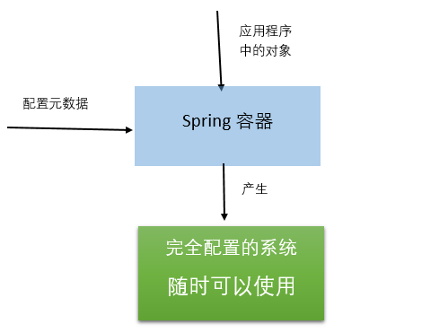
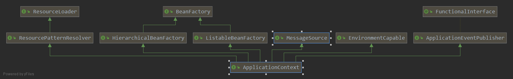

# IoC容器解析

    本节代码基于springboot 2.3.0
    
### Spring IoC容器

**org.springframework.context.ApplicationContext**接口代表Spring IoC容器，主要负责bean的实例化、配置、装配，简而言之，Spring IoC容器是管理这些bean的（这里所说的bean指的是组成你的应用程序中的对象，并且这些对象被Spring所管理）。
容器如何知道哪些对象要进行实例化、配置和装配的呢？是通过读取配置文件元数据来达到这个效果的，配置文件元数据是用xml配置、Java注解和Java代码配置来表示的。
这使得作为程序员的我们，只需要向Spring容器提供配置元数据，Spring容器就能在我们的应用中实例化、配置和装配这些对象。org.springframework.beans和org.springframework.context包是Spring IoC容器的基础。
Spring提供了很多Application接口的实现。在单独的应用中，创建ClassPathXmlApplicationContext和FileSystemXmlApplicationContext的实例是非常常用的做法。示例如下：

```java
    public static void main(String[] args) {

        SpringApplicationBuilder builder = new SpringApplicationBuilder()
                .listeners(new StartedListener())
                .sources(Application.class)
                .bannerMode(Banner.Mode.OFF);
        builder.build().setWebApplicationType(WebApplicationType.NONE);
        ConfigurableApplicationContext context = builder.run(args);

        Beginning beginning = context.getBean(Beginning.class);
        beginning.start();

    }
```

然而在大部分的应用场景中，不需要实例化一个或者多个Spring IoC容器的实例。
例如在web应用的场景下，只需要在web.xml中创建七行样板配置的代码如下：

```xml
<context-param>
	<param-name>contextConfigLocation</param-name>
	<param-value>/WEB-INF/applicationContext.xml</paramvalue>
</context-param>
<listener>
	<listener-class>org.springframework.web.context.ContextLoaderListener</listener-class>
</listener>

```

当然springBoot只需要进行如下设置

```java
 builder.build().setWebApplicationType(WebApplicationType.SERVLET);
```

下面这张图从更高的视角展示了Spring是怎样工作的。你的应用程序中的类是和配置元数据组合在一起，以便在ApplicationContext创建和初始化之后，你拥有了一个完全配置的、可执行的系统。




### ApplicationContext设计解析

为了方便对ApplicationContext接口的层次结构有一个大概的认识，下面使用IDEA来生成ApplicationContext的继承关系图。
（选中ApplicationContext接口->右键->Diagrams->Show Diagrams...）




从上图就能很清楚的看出ApplicationContext继承的接口分为五类：

* BeanFactory：提供了能够管理任何对象的高级配置机制，这个接口是Spring框架中比较重要的一个接口。
* ListableBeanFactory：从该接口的名字就能知道，该接口除了拥有BeanFactory的功能外，该接口还有能列出factory中所有bean的实例的能力。
* HierarchicalBeanFactory：该接口除了拥有BeanFactory的功能外，还提供了BeanFactory分层的机制，查找bean的时候，除了在自身BeanFactory查找外，如果没有查找到，还会在父级BeanFactory进行查找。
* MessageSource：消息资源的处理，用于国际化。
* ApplicationEventPublisher：用于处理事件发布机制。
* EnvironmentCapable：提供了Environment的访问能力。
* ResourceLoader：用于加载资源的策略接口（例如类路径下的资源、系统文件下的资源等等）。
* ResourcePatternResolver：用于将位置模式（例如Ant风格的路径模式）解析成资源对象的策略接口。classpath*:前缀能匹配所以类路径下的资源。


先看一下在ApplicationContext中定义的方法：

```java

	@Nullable
	String getId();  // 获取ApplicationContext的唯一id

	String getApplicationName();  // 该上下文所属的已经部署了的应用的名字，默认为""
	String getDisplayName();  // 友好的展示名字
	long getStartupDate();  //该上下文第一次加载的时间

	@Nullable
	ApplicationContext getParent(); //父级ApplicationContext

	/**
	 * Expose AutowireCapableBeanFactory functionality for this context.
	 * <p>This is not typically used by application code, except for the purpose of
	 * initializing bean instances that live outside of the application context,
	 * applying the Spring bean lifecycle (fully or partly) to them.
	 * <p>Alternatively, the internal BeanFactory exposed by the
	 * {@link ConfigurableApplicationContext} interface offers access to the
	 * {@link AutowireCapableBeanFactory} interface too. The present method mainly
	 * serves as a convenient, specific facility on the ApplicationContext interface.
	 * <p><b>NOTE: As of 4.2, this method will consistently throw IllegalStateException
	 * after the application context has been closed.</b> In current Spring Framework
	 * versions, only refreshable application contexts behave that way; as of 4.2,
	 * all application context implementations will be required to comply.
	 * @return the AutowireCapableBeanFactory for this context
	 * @throws IllegalStateException if the context does not support the
	 * {@link AutowireCapableBeanFactory} interface, or does not hold an
	 * autowire-capable bean factory yet (e.g. if {@code refresh()} has
	 * never been called), or if the context has been closed already
	 * @see ConfigurableApplicationContext#refresh()
	 * @see ConfigurableApplicationContext#getBeanFactory()
	 */
	AutowireCapableBeanFactory getAutowireCapableBeanFactory() throws IllegalStateException;

```

前四个方法用于获取该ApplicationContext的一些基本信息，getAutowireCapableBeanFactory()用于暴露AutowireCapableBeanFactory的功能，
这通常不是提供给用于代码使用的，除非你想要在应用上下文的外面初始化bean的实例，关于AutowireCapableBeanFactory后面会有更加详细的解析。

### BeanFactory

BeanFactory是Spring框架中比较重要的一个接口，下面列出了这个接口中的方法的定义：

```java
    String FACTORY_BEAN_PREFIX = "&";

    // 获取bean
    Object getBean(String var1) throws BeansException;
    <T> T getBean(String var1, Class<T> var2) throws BeansException;
    Object getBean(String var1, Object... var2) throws BeansException;
    <T> T getBean(Class<T> var1) throws BeansException;
    <T> T getBean(Class<T> var1, Object... var2) throws BeansException;

    // 获取bean的提供者（对象工厂）
    <T> ObjectProvider<T> getBeanProvider(Class<T> var1);
    <T> ObjectProvider<T> getBeanProvider(ResolvableType var1);

    boolean containsBean(String var1); // 是否包含指定名字的bean
    boolean isSingleton(String var1) throws NoSuchBeanDefinitionException;  // 是否为单例
    boolean isPrototype(String var1) throws NoSuchBeanDefinitionException;  // 是否为原型

    // 指定名字的bean是否和指定的类型匹配
    boolean isTypeMatch(String var1, ResolvableType var2) throws NoSuchBeanDefinitionException;
    boolean isTypeMatch(String var1, Class<?> var2) throws NoSuchBeanDefinitionException;

    @Nullable
    Class<?> getType(String var1) throws NoSuchBeanDefinitionException;  // 获取指定名字的bean的类型

    @Nullable
    Class<?> getType(String var1, boolean var2) throws NoSuchBeanDefinitionException;

    String[] getAliases(String var1);  // 获取指定名字的bean的所有别名
}
```

**这些方法大致可以分为三类：**

* getBean()方法用于获取匹配的bean的实例对象（有可能是Singleton或者Prototype的），如果没有找到匹配的bean则抛出BeansException子类的异常。
如果在当前的工厂实例中没有找到匹配的bean，会在父级的工厂中进行查找。带有args参数的getBean()方法，允许显式的去指定构造器或者工厂方法的参数，会覆盖了在bean的定义中定义的参数，这仅仅在创建一个新的实例的时候才起作用，而在获取一个已经存在的实例是不起作用的。
* getBeanProvider()方法用于获取指定bean的提供者，可以看到它返回的是一个ObjectProvider，其父级接口是ObjectFactory。首先来看一下ObjectFactory，它是一个对象的实例工厂，只有一个方法：

      T getObject() throws BeansException;
调用这个方法返回的是一个对象的实例。此接口通常用于封装一个泛型工厂，在每次调用的时候返回一些目标对象新的实例。ObjectFactory和FactoryBean是类似的，只不过FactoryBean通常被定义为BeanFactory中的服务提供者（SPI）实例，而ObjectFactory通常是以API的形式提供给其他的bean。简单的来说，ObjectFactory一般是提供给开发者使用的，FactoryBean一般是提供给BeanFactory使用的。

ObjectProvider继承ObjectFactory，特为注入点而设计，允许可选择性的编程和宽泛的非唯一性的处理。在Spring 5.1的时候，该接口从Iterable扩展，提供了对Stream的支持。
该接口的方法如下：

```java

    // 获取对象的实例，允许根据显式的指定构造器的参数去构造对象
    T getObject(Object... var1) throws BeansException;

    // 获取对象的实例，如果不可用，则返回null
    @Nullable
    T getIfAvailable() throws BeansException;
    default T getIfAvailable(Supplier<T> defaultSupplier) throws BeansException {}
    default void ifAvailable(Consumer<T> dependencyConsumer) throws BeansException {}
    
    // 获取对象的实例，如果不是唯一的或者没有首先的bean，则返回null
    @Nullable
    T getIfUnique() throws BeansException;
    default T getIfUnique(Supplier<T> defaultSupplier) throws BeansException {}
    default void ifUnique(Consumer<T> dependencyConsumer) throws BeansException {}

    // 获取多个对象的实例
    default Iterator<T> iterator() {}
    default Stream<T> stream() {}
    default Stream<T> orderedStream() {}
```

这些接口是分为两类
   
   1. 一类是获取单个对象，getIfAvailable()方法用于获取可用的bean（没有则返回null），getIfUnique()方法用于获取唯一的bean（如果bean不是唯一的或者没有首选的bean返回null）。getIfAvailable(Supplier<T> defaultSupplier)和getIfUnique(Supplier<T> defaultSupplier)，如果没有获取到bean，则返回defaultSupplier提供的默认值，ifAvailable(Consumer<T> dependencyConsumer)和ifUnique(Consumer<T> dependencyConsumer)提供了以函数式编程的方式去消费获取到的bean。
   2. 另一类是获取多个对象，stream()方法返回连续的Stream，不保证bean的顺序（通常是bean的注册顺序）。orderedStream()方法返回连续的Stream，预先会根据工厂的公共排序比较器进行排序，一般是根据org.springframework.core.Ordered的约定进行排序。
   
* 其他的是一些工具性的方法：
   * 通过名字判断是否包含指定bean的定义的containsBean(String name)方法
   * 判断是单例和原型的isSingleton(String name)和isPrototype(String name)方法
   * 判断给定bean的名字是否和类型匹配的isTypeMatch方法
   * 根据bean的名字来获取其类型的getType(String name)方法
   * 根据bean的名字来获取其别名的getAliases(String name)方法

或许你已经注意到了，有两个方法含有类型是ResolvableType的参数，那么ResolvableType是什么呢？假如说你要获取泛型类型的bean：MyBean<TheType>，根据Class来获取，肯定是满足不了要求的，泛型在编译时会被擦除。使用ResolvableType就能满足此需求，代码如下：

```java
ResolvableType type = ResolvableType.forClassWithGenerics(MyType.class, TheType.class);
ObjectProvider<MyType<TheType>> op = applicationContext.getBeanProvider(type);
MyType<TheType> bean = op.getIfAvailable()
```

简单的来说，ResolvableType是对Java java.lang.reflect.Type的封装，并且提供了一些访问该类型的其他信息的方法（例如父类， 泛型参数，该类）。从成员变量、方法参数、方法返回类型、类来构建ResolvableType的实例。

### ListableBeanFactory

ListableBeanFactory接口有能列出工厂中所有的bean的能力，下面给出该接口中的所有方法：

```java

	boolean containsBeanDefinition(String beanName); // 是否包含给定名字的bean的定义
	int getBeanDefinitionCount(); // 工厂中bean的定义的数量
	String[] getBeanDefinitionNames(); // 工厂中所有定义了的bean的名字

    // 获取指定类型的bean的名字
	String[] getBeanNamesForType(ResolvableType type);
	String[] getBeanNamesForType(ResolvableType type, boolean includeNonSingletons, boolean allowEagerInit);
	String[] getBeanNamesForType(@Nullable Class<?> type);
	String[] getBeanNamesForType(@Nullable Class<?> type, boolean includeNonSingletons, boolean allowEagerInit);

    // 获取所有使用提供的注解进行标注的bean的名字
	String[] getBeanNamesForAnnotation(Class<? extends Annotation> annotationType);

    // 查找指定bean中的所有指定的注解（会考虑接口和父类中的注解）
	@Nullable
	<A extends Annotation> A findAnnotationOnBean(String beanName, Class<A> annotationType)
			throws NoSuchBeanDefinitionException;

    // 根据指定的类型来获取所有的bean
	<T> Map<String, T> getBeansOfType(@Nullable Class<T> type) throws BeansException;
	<T> Map<String, T> getBeansOfType(@Nullable Class<T> type, boolean includeNonSingletons, boolean allowEagerInit)
			throws BeansException;    

    // 获取所有使用提供的注解进行标注了的bean
	Map<String, Object> getBeansWithAnnotation(Class<? extends Annotation> annotationType) throws BeansException;
    
```

上面的这些方法都不考虑祖先工厂中的bean，只会考虑在当前工厂中定义的bean。

* 前九个方法用于获取bean的一些信息
* 最后的三个方法用于获取所有满足条件的bean，返回结果Map中的键为bean的名字，值为bean的实例。这些方法都会考虑通过FactoryBean创建的bean，这也意味着FactoryBean会被初始化。为什么这里的三个方法不返回List？Map不光包含这些bean的实例，而且还包含bean的名字，而List只包含bean的实例。也就是说Map比List更加的通用。

### HierarchicalBeanFactory

HierarchicalBeanFactory接口定义了BeanFactory之间的分层结构，ConfigurableBeanFactory中的setParentBeanFactory方法能设置父级的BeanFactory，下面列出了HierarchicalBeanFactory中定义的方法：

```java

    // 获取父级的BeanFactory
	@Nullable
	BeanFactory getParentBeanFactory();

    // 本地的工厂是否包含指定名字的bean
	boolean containsLocalBean(String name);
```

这两个方法都比较直接明了，getParentBeanFactory方法用于获取父级BeanFactory。containsLocalBean

用于判断本地的工厂是否包含指定的bean，忽略在祖先工厂中定义的bean。

### MessageSource

MessageSource主要用于消息的国际化，下面是该接口中的方法定义：

```java

    // 获取消息
	@Nullable
	String getMessage(String code, @Nullable Object[] args, @Nullable String defaultMessage, Locale locale);
	String getMessage(String code, @Nullable Object[] args, Locale locale) throws NoSuchMessageException;
	String getMessage(MessageSourceResolvable resolvable, Locale locale) throws NoSuchMessageException;
```

以上的三个方法都是用于获取消息的，第一个方法提供了默认消息，第二个接口如果没有获取到指定的消息会抛出异常。第三个接口中的MessageSourceResolvable参数是对代码、参数值、默认值的一个封装。

### ApplicationEventPublisher

ApplicationEventPublisher接口封装了事件发布功能，提供Spring中事件的机制。接口中的方法定义如下：

```java
// 发布事件
	default void publishEvent(ApplicationEvent event) {
		publishEvent((Object) event);
	}

	void publishEvent(Object event);
```

第一个方法用于发布特定于应用程序事件。第二个方法能发布任意的事件，如果事件不是ApplicationEvent，那么会被包裹成PayloadApplicationEvent事件。

### EnvironmentCapable

EnvironmentCapable提供了访问Environment的能力，该接口只有一个方法：

    Environment getEnvironment();
    
Environment表示当前正在运行的应用的环境变量，它分为两个部分：profiles和properties。它的父级接口PropertyResolver提供了property的访问能力。

### ResourceLoader和ResourcePatternResolver

先来看一下ResourceLoader，该接口是用来加载资源（例如类路径或者文件系统中的资源）的策略接口。该接口中的方法如下：

```java

	/** Pseudo URL prefix for loading from the class path: "classpath:". */
	String CLASSPATH_URL_PREFIX = ResourceUtils.CLASSPATH_URL_PREFIX;

	Resource getResource(String location); // 根据指定的位置获取资源

	@Nullable
	ClassLoader getClassLoader(); // 获取该资源加载器所使用的类加载器
```

该接口只有简单明了的两个方法，一个是用来获取指定位置的资源，一个用于获取资源加载器所使用的类加载器。Resource是从实际类型的底层资源（例如文件、类路径资源）进行抽象的资源描述符。

先看下Resource中的方法：

```java
boolean exists(); // 资源实际上是否存在
boolean isReadable(); // 资源是否可读
boolean isOpen(); // 检查资源是否为打开的流
boolean isFile(); // 资源是否为文件系统上的一个文件

URL getURL() throws IOException; // 获取url
URI getURI() throws IOException; // 获取URI
File getFile() throws IOException; // 获取文件

     // 获取ReadableByteChannel
    default ReadableByteChannel readableChannel() throws IOException {
		return Channels.newChannel(getInputStream());
	}


	long contentLength() throws IOException; // 资源的内容的长度


	long lastModified() throws IOException; // 资源的最后修改时间

    // 相对于当前的资源创建一个新的资源
	Resource createRelative(String relativePath) throws IOException;

	@Nullable
	String getFilename(); // 获取资源的文件名

	String getDescription(); // 获取资源的描述信息
```
接下来在来看一下ResourcePatternResolver，该接口用于解析一个位置模式（例如Ant风格的路径模式），该接口只有一个方法，如下：

```java

	String CLASSPATH_ALL_URL_PREFIX = "classpath*:";

    // 将给定的位置模式解析成资源对象
	Resource[] getResources(String locationPattern) throws IOException;
```

### Spring IoC容器设计复盘

假如让你设计IoC容器，你该如何去做呢？首先你应该要明确你设计的容器的功能和特性，然后根据这些功能和特性设计出合理的接口。下面只是粗略的分析一下：

* IoC容器对bean的配置和管理，那么是不是需要设计一个接口来完成这些功能呢？（BeanFactory）
* 既然需要这些元数据的配置，那么是不是需要设计一个接口来完成对一些配置文件的读取。（ResourceLoader和Resource）
* 在IoC容器初始化、摧毁的时候，是不是可能要执行一些操作呢？那么是不是需要使用事件机制来完成呢？（ApplicationEventPublisher）
