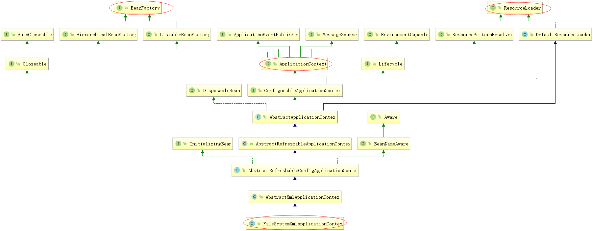
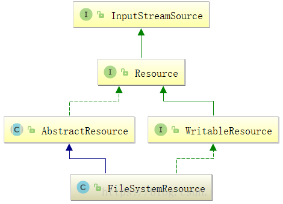
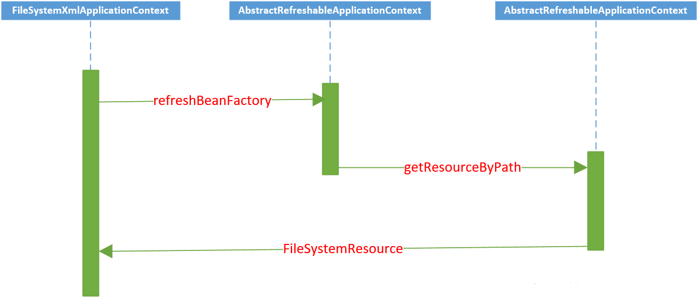
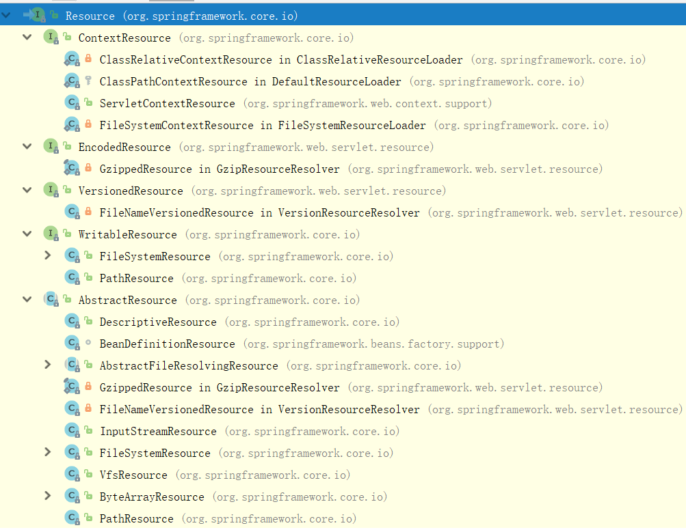

# BeanDefinition的Resource定位

## IOC容器初始化过程概述

IOC容器初始化是由上文提到的refresh()方法来启动的，这个方法标志着IOC容器正式启动。

IOC容器初始化过程分为三个过程：

1. BeanDefinition的Resource定位过程。
    
    这个Resource定位是指BeanDefinition资源定位，它由ResourceLoader通过统一的Resource接口完成。这个定位过程就是容器寻找数据的过程，就像水桶要装水首先需要找到水一样。
2. BeanDefinition的载入和解析过程。

   这个过程就是根据上一步定位的Resource资源文件，把用户定义好的Bean表示成IOC容器内部的BeanDefinition数据结构。BeanDefinition实际就是POJO对象在IOC容器中的抽象，通过BeanDefinition定义数据结构，使IOC容器能够方便地对POJO对象也就是Bean进行管理。
3. 向IOC容器注册BeanDefinition的过程。

   这个过程是通过调用BeanDefinitionRegistry接口的实现来完成的，把载入过程生成的BeanDefinition向IOC容器注册。最终在IOC容器内部将BeanDefinition注入到一个HashMap中，IOC容器就是通过这个HashMap来持有这些BeanDefinition数据的。


    注意： 这里需要注意的是，上面谈到的只是IOC容器的初始化过程，这个过程一般不包含Bean依赖注入的实现。Bean的定义和依赖注入是两个独立的过程。依赖注入一般发生在第一次getBean()向容器索要Bean的时候，但是如果配置了lazyinit，则初始化的时候这样的Bean已经触发了依赖注入。

这里先分析IOC容器的第一个过程，BeanDefinition的Resource定位过程。

## BeanDefinition的Resource定位过程

一般我们通常使用的IOC容器有FileSystemXmlApplicationContext、ClassPathXmlApplicationContext、XmlWebApplicationContext、WebApplicationContext、AnnotationConfigApplicationContext等。

注解方式AnnotationConfigApplicationContext前置读取资源跟Xml方式容器有区别，注解方式AnnotationConfigApplicationContext是读取指定扫描包下的.class，组装成元数据，然后解析每个类，判断是否有@Component注解（@Service含@Component注解）进行BeanDefinition数据结构读取，
Xml方式则是解析Spring配置的applicationContext.xml的文件，读取BeanDefinition数据结构，但是最后都走AbstractApplicationContext#refresh()模板方法，理解了Xml实现方式容器的核心，注解方式就比较好理解。


因为Xml实现方式理解IOC容器会更直观些，以Xml方式实现进行IOC容器源码解读。下面以FileSystemXmlApplicationContext为例，分析Resource的定位过程。

#### FileSystemXmlApplicationContext应用：

```java
// 根据配置文件创建IOC容器
ApplicationContext context =
     new FileSystemXmlApplicationContext("classpath:applicationContext.xml");
// 从容器中获取Bean
ConferenceServiceImpl conferenceService = (ConferenceServiceImpl)context.getBean("conferenceService");
// 调用Bean方法
conferenceService.conference();
```



"实线"代表extends，"虚线"代表implements。从类图可以看到继承了ApplicationContext，而ApplicationContext

又继承了BeanFactory，所以FileSystemXmlApplicationContext具备了IOC的基本规范和一些高级特性。

在类图的最右上方可以看到继承了ResourceLoader，用以读入以Resource定义的BeanDefinition的能力。

FileSystemXmlApplicationContext源码：
```java

package org.springframework.context.support;
import org.springframework.beans.BeansException;
import org.springframework.context.ApplicationContext;
import org.springframework.core.io.FileSystemResource;
import org.springframework.core.io.Resource;
 
public class FileSystemXmlApplicationContext extends AbstractXmlApplicationContext {
	public FileSystemXmlApplicationContext() {
	}
	public FileSystemXmlApplicationContext(ApplicationContext parent) {
		super(parent);
	}
	/**
	 * 根据用户定义的Bean XML文件路径，载入BeanDefinition，自动创建IOC容器
	 */
	public FileSystemXmlApplicationContext(String configLocation) throws BeansException {
		this(new String[] {configLocation}, true, null);
	}
	/**
	 * 根据用户定义的多个Bean XML文件路径，载入BeanDefinition，自动创建IOC容器
	 */
	public FileSystemXmlApplicationContext(String... configLocations) throws BeansException {
		this(configLocations, true, null);
	}
	/**
	 * 根据用户定义的多个Bean XML文件路径，载入BeanDefinition，自动创建IOC容器，允许指定自己的双亲IOC容器
	 */
	public FileSystemXmlApplicationContext(String[] configLocations, ApplicationContext parent) throws BeansException {
		this(configLocations, true, parent);
	}
	/**
	 * 是否允许自动刷新上下文
	 */
	public FileSystemXmlApplicationContext(String[] configLocations, boolean refresh) throws BeansException {
		this(configLocations, refresh, null);
	}
	/**
	 * 在对象初始化的过程中，调用refresh()方法启动载入BeanDefinition过程
	 */
	public FileSystemXmlApplicationContext(String[] configLocations, boolean refresh, ApplicationContext parent)
			throws BeansException {
		super(parent);
		setConfigLocations(configLocations);
		if (refresh) {
			refresh();
		}
	}
	/**
	 * 根据用户的xml构建Resource对象，这是一个模板方法，
	 * 在BeanDefinitionReader的loadBeanDefinition()方法中被调用。
	 */
	@Override
	protected Resource getResourceByPath(String path) {
		if (path != null && path.startsWith("/")) {
			path = path.substring(1);
		}
		return new FileSystemResource(path);
	}
}
```

FileSystemXmlApplicationContext中有很多构造函数，实现了对参数configLocation进行处理，以XML文件方式

存在的BeanDefinition能够得到有效处理。比如，实现了getResourceByPath()方法，这个是一个模板方法，是为

读取Resource服务的。在初始化FileSystemXmlApplicationContext的过程中，通过refresh()来启动整个调用，

进入AbstractApplicationContext的refresh()方法。

```java
@Override
public void refresh() throws BeansException, IllegalStateException {
	synchronized (this.startupShutdownMonitor) {
		// Prepare this context for refreshing.
		// 调用容器准备刷新的方法，设置容器的启动时间为当前时间，容器关闭状态为false，同时给容器设置同步标识
		prepareRefresh();
 
		// Tell the subclass to refresh the internal bean factory.
		// 告诉子类启动refreshBeanFactory()方法，
		// Bean定义资源文件的载入从子类的refreshBeanFactory()方法启动[***重点***]
		ConfigurableListableBeanFactory beanFactory = obtainFreshBeanFactory();
 
		// Prepare the bean factory for use in this context.
		// 为BeanFactory配置容器特性，例如类加载器、事件处理器等
		prepareBeanFactory(beanFactory);
 
		try {
			// Allows post-processing of the bean factory in context subclasses.
			// 为容器的某些子类指定特殊的BeanPost事件处理器，进行后置处理
			postProcessBeanFactory(beanFactory);
 
			// Invoke factory processors registered as beans in the context.
			// 调用BeanFactory的后置处理器，这些后置处理器是在Bean定义中向容器注册的
			invokeBeanFactoryPostProcessors(beanFactory);
 
			// Register bean processors that intercept bean creation.
			// 为BeanFactory注册BeanPost事件处理器，BeanPostProcessor是Bean后置处理器，用于监听容器触发的事件
			registerBeanPostProcessors(beanFactory);
 
			// Initialize message source for this context.
			// 初始化信息源，和国际化相关
			initMessageSource();
 
			// Initialize event multicaster for this context.
			// 初始化容器事件传播器
			initApplicationEventMulticaster();
 
			// Initialize other special beans in specific context subclasses.
			// 调用子类的某些特殊Bean初始化方法
			onRefresh();
 
			// Check for listener beans and register them.
			// 检查监听Bean并且将这些Bean向容器注册
			registerListeners();
 
			// Instantiate all remaining (non-lazy-init) singletons.
			// 初始化所有剩余的(non-lazy-init)单态Bean
			finishBeanFactoryInitialization(beanFactory);
 
			// Last step: publish corresponding event.
			// 初始化容器的生命周期事件处理器，并发布容器的生命周期事件，结束refresh过程
			finishRefresh();
		}
 
		catch (BeansException ex) {
			if (logger.isWarnEnabled()) {
				logger.warn("Exception encountered during context initialization - " +
						"cancelling refresh attempt: " + ex);
			}
 
			// Destroy already created singletons to avoid dangling resources.
			destroyBeans();
 
			// Reset 'active' flag.
			cancelRefresh(ex);
 
			// Propagate exception to caller.
			throw ex;
		}
 
		finally {
			// Reset common introspection caches in Spring's core, since we
			// might not ever need metadata for singleton beans anymore...
			resetCommonCaches();
		}
	}
}
```

上面refresh()方法的源码，是整个IOC容器初始化的过程。咱们这里讨论的是BeanDefinition的Resource资源的定位，

重点关注refresh()方法中的obtainFreshBeanFactory()方法，该方法也位于AbstractApplicationContext类中。

```java

	protected ConfigurableListableBeanFactory obtainFreshBeanFactory() {
		refreshBeanFactory();
         //getBeanFactory获取的bean工厂将在refreshBeanFactory初始话
		return getBeanFactory();
	}
```

在上面的obtainFreshBeanFactory()方法中可以看到refreshBeanFactory()方法，是AbstractApplicationContext中的一个抽象方法，委托给子类具体实现

方法的具体实现在AbstractRefreshableApplicationContext中。

```java
	@Override
	protected final void refreshBeanFactory() throws BeansException {
        // 判断如果已经建立了BeanFactory，则销毁并关闭BeanFactory
		if (hasBeanFactory()) {
			destroyBeans();
			closeBeanFactory();
		}
		try {
            // 创建IoC容器，这里使用的是DefaultListableBeanFactory
			DefaultListableBeanFactory beanFactory = createBeanFactory();
            // 对IoC容器进行定制化，如设置启动参数，开启注解的自动装配等
			beanFactory.setSerializationId(getId());
			customizeBeanFactory(beanFactory);
             /**
             		 * 启动对BeanDefinition的载入，这里使用了一个委派模式，
             		 * 在当前类中只定义了抽象的loadBeanDefinitions方法，具体的实现调用子类容器
             		 */
			loadBeanDefinitions(beanFactory);
            //这里就是getBeanFactory赋值的地方
			this.beanFactory = beanFactory;
		}
		catch (IOException ex) {
			throw new ApplicationContextException("I/O error parsing bean definition source for " + getDisplayName(), ex);
		}
	}
```

在refreshBeanFactory()方法中，可以看到loadBeanDefinitions()是AbstractRefreshableApplicationContext中的

一个抽象方法，委托给子类具体实现，方法签名如下：

```java
protected abstract void loadBeanDefinitions(DefaultListableBeanFactory beanFactory)
			throws BeansException, IOException;
```

oadBeanDefinitions()抽象方法有多个实现：

从FileSystemXmlApplicationContext类图，可以知道选择AbstractXmlApplicationContext中的实现，

因为另外三个与FileSystemXmlApplicationContext没有关系。


```java

@Override
protected void loadBeanDefinitions(DefaultListableBeanFactory beanFactory) throws BeansException, IOException {
	// Create a new XmlBeanDefinitionReader for the given BeanFactory.
	// 根据BeanFactory容器，创建XmlBeanDefinitionReader读取器
	XmlBeanDefinitionReader beanDefinitionReader = new XmlBeanDefinitionReader(beanFactory);
 
	// Configure the bean definition reader with this context's
	// resource loading environment.
	// 使用此上下文的资源加载环境配置Bean定义读取器
	beanDefinitionReader.setEnvironment(this.getEnvironment());
    //注意这里后面会用到
	beanDefinitionReader.setResourceLoader(this);
	beanDefinitionReader.setEntityResolver(new ResourceEntityResolver(this));
 
	// Allow a subclass to provide custom initialization of the reader,
	// then proceed with actually loading the bean definitions.
	// 允许子类提供读取器的自定义初始化，然后继续加载bean定义信息
	initBeanDefinitionReader(beanDefinitionReader);
	loadBeanDefinitions(beanDefinitionReader);
}
```
beanDefinitionReader.setResourceLoader(this);

设置一个ResourceLoader为本对象，根据继承关系可知
```java
AbstractXmlApplicationContext extends AbstractRefreshableConfigApplicationContext

AbstractRefreshableConfigApplicationContext extends AbstractRefreshableApplicationContext
		implements BeanNameAware, InitializingBean 
		
public abstract class AbstractRefreshableApplicationContext extends AbstractApplicationContext {

public abstract class AbstractApplicationContext extends DefaultResourceLoader
		implements ConfigurableApplicationContext {
```
这里的ResourceLoader是一个**DefaultResourceLoader**

继续调用loadBeanDefinitions()，咱们现在目标就是定位BeanDEfinition的Resource看下方法源码：

```java

protected void loadBeanDefinitions(XmlBeanDefinitionReader reader) 
	throws BeansException, IOException {
	// 以Resource的方式获得配置文件的资源位置
	Resource[] configResources = getConfigResources();
	if (configResources != null) {
		reader.loadBeanDefinitions(configResources);
	}
	// 以String的形式获得配置文件位置
	String[] configLocations = getConfigLocations();
	if (configLocations != null) {
		reader.loadBeanDefinitions(configLocations);
	}
}
```
对于ClassPathXmlApplicationContext追走第一个判断。
对于FileSystemXmlApplicationContext会走第二个if判断， 接着看源码。

```java

@Override
public int loadBeanDefinitions(String... locations) throws BeanDefinitionStoreException {
	// 如果locations为空，则停止Resource资源定位
	Assert.notNull(locations, "Location array must not be null");
	int counter = 0;
	for (String location : locations) {
		// 根据路径载入信息
		counter += loadBeanDefinitions(location);
	}
	return counter;
}
```

loadBeanDefinitions()方法继续深入：

```java

public int loadBeanDefinitions(String location, Set<Resource> actualResources) throws BeanDefinitionStoreException {
	// 这里得到当前定义的ResourceLoader,默认的使用DefaultResourceLoader（前面有注释）      
	ResourceLoader resourceLoader = getResourceLoader();
	if (resourceLoader == null) {
		throw new BeanDefinitionStoreException(
				"Cannot import bean definitions from location [" + location + "]: no ResourceLoader available");
	}
	/**
	  * 这里对Resource的路径模式进行解析，得到需要的Resource集合，
	  * 这些Resource集合指向了我们定义好的BeanDefinition的信息，可以是多个文件。
	  */
	if (resourceLoader instanceof ResourcePatternResolver) {
		// Resource pattern matching available.
		try {
			// 调用DefaultResourceLoader的getResources完成具体的Resource定位
			Resource[] resources = ((ResourcePatternResolver) resourceLoader).getResources(location);
			int loadCount = loadBeanDefinitions(resources);
			if (actualResources != null) {
				for (Resource resource : resources) {
					actualResources.add(resource);
				}
			}
			if (logger.isDebugEnabled()) {
				logger.debug("Loaded " + loadCount + " bean definitions from location pattern [" + location + "]");
			}
			return loadCount;
		}
		catch (IOException ex) {
			throw new BeanDefinitionStoreException(
					"Could not resolve bean definition resource pattern [" + location + "]", ex);
		}
	}
	else {
		// Can only load single resources by absolute URL.
		// 通过ResourceLoader来完成位置定位（找水）
		Resource resource = resourceLoader.getResource(location);
        //后面要说的载入、解析和注册（装水）
		int loadCount = loadBeanDefinitions(resource);
		if (actualResources != null) {
			actualResources.add(resource);
		}
		if (logger.isDebugEnabled()) {
			logger.debug("Loaded " + loadCount + " bean definitions from location [" + location + "]");
		}
		return loadCount;
	}
}
```

ResourceLoader是一个接口类，其getResource()方法具体实现在DefaultResourceLoader，对于取得Resource的具体过程，

我们可以看下DefaultResourceLoader中getResource()方法的实现。

```java

	@Override
	public Resource getResource(String location) {
		Assert.notNull(location, "Location must not be null");

		for (ProtocolResolver protocolResolver : getProtocolResolvers()) {
			Resource resource = protocolResolver.resolve(location, this);
			if (resource != null) {
				return resource;
			}
		}
        //处理所有/标识的Resource
		if (location.startsWith("/")) {
			return getResourceByPath(location);
		}
        // 处理所有带有classpath标识的Resource
		else if (location.startsWith(CLASSPATH_URL_PREFIX)) {
			return new ClassPathResource(location.substring(CLASSPATH_URL_PREFIX.length()), getClassLoader());
		}
		else {
			try {
				// 处理URL标识的Resource定位
				URL url = new URL(location);
				return (ResourceUtils.isFileURL(url) ? new FileUrlResource(url) : new UrlResource(url));
			}
			catch (MalformedURLException ex) {
				// No URL -> resolve as resource path.
				return getResourceByPath(location);
			}
		}
	}
```

在getResources()方法中，最显眼的是getResourceByPath()方法，在一开始的时候提到过，它是一个模板方法，
```java

protected Resource getResourceByPath(String path) {
	return new ClassPathContextResource(path, getClassLoader());
}
```

其中一个实现类就是FileSystemXmlApplicationContext，其方法签名如下：
```java

@Override
protected Resource getResourceByPath(String path) {
	if (path != null && path.startsWith("/")) {
		path = path.substring(1);
	}
	return new FileSystemResource(path);
}
``` 

通过该方法，返回一个FileSystemResource对象，该对象扩展自Resource，而Resource扩展自InputStreamSource。

```java
public FileSystemResource(String path) {
    Assert.notNull(path, "Path must not be null");
    this.file = new File(path);
    this.path = StringUtils.cleanPath(path);
}
```

FileSystemResource类图：




getResourceByPath方法调用过程：



通过FileSystemResource对象，Spring可以进行相关的I/O操作，完成BeanDefinition的Resource定位过程。

    这里只是分析了FileSystemXmlApplicationContext的容器下Resource定位过程，

如果是其他的ApplicationContext，那么对应生成其他的Resource，比如ClassPathResource、

ServletContextResource等。关于Spring中Resource的种类，继承关系如下：



这些接口对应不同的Resource实现代表着不同的一样。

以FileSystemXmlApplicationContext容器实现原理为例，上面只是分析了BeanDefinition的Resource定位过程，

这个时候可以通过Resource对象来进行BeanDefinition的载入了。这里完成了水桶装水找水的过程，下一篇分析一下

水桶装水的过程，也即BeanDefinition的载入和解析过程。


