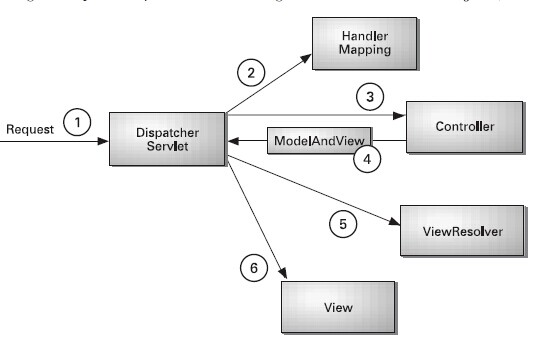

# SpringMVC源码分析

## DispatcherServlet

是否对下面的配置还有印象

```xml
<servlet>
    <servlet-name>SpringMVC</servlet-name>
    <servlet-class>org.SpringMVC.web.servlet.DispatcherServlet</servlet-class>
    <load-on-startup>1</load-on-startup>
</servlet>
```

上升到Springboot呢？

我们可以在spring-boot-autoconfigure包的spring.factories下找到

```
org.springframework.boot.autoconfigure.web.servlet.DispatcherServletAutoConfiguration,\
org.springframework.boot.autoconfigure.web.servlet.ServletWebServerFactoryAutoConfiguration,\
org.springframework.boot.autoconfigure.web.servlet.error.ErrorMvcAutoConfiguration,\
org.springframework.boot.autoconfigure.web.servlet.HttpEncodingAutoConfiguration,\
org.springframework.boot.autoconfigure.web.servlet.MultipartAutoConfiguration,\
org.springframework.boot.autoconfigure.web.servlet.WebMvcAutoConfiguration,\
```

springboot web类型加载的是**AnnotationConfigServletWebServerApplicationContext**容器

## SpringMVC请求处理流程

引用spring in action上的一张图来说明了SpringMVC的核心组件和请求处理流程:



1. DispatcherServlet是SpringMVC中的前端控制器(front controller)，负责接收request并将request转发给对应的处理组件。
2. HanlerMapping是SpringMVC中完成url到Controller映射的组件。DispatcherServlet接收request,然后从HandlerMapping查找处理request的controller.
3. Cntroller处理request，并返回ModelAndView对象，Controller是SpringMVC中负责处理request的组件(类似于struts2中的Action)，ModelAndView是封装结果视图的组件。

④ ⑤ ⑥：视图解析器解析ModelAndView对象并返回对应的视图给客户端。

```

```


```

```


```

```