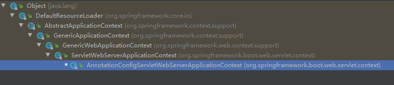
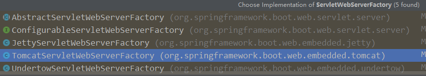

# SpringBoot中如何启动Tomcat流程

    本章代码基于springboot 2.2.2
    
SpringBoot项目之所以部署简单，其很大一部分原因就是因为不用自己折腾Tomcat相关配置，因为其本身内置了各种Servlet容器。
一直好奇： SpringBoot是怎么通过简单运行一个main函数，就能将容器启动起来，并将自身部署到其上 。此文想梳理清楚这个问题。

我们从SpringBoot的启动入口中分析：

##### Context 创建

    // Create, load, refresh and run the ApplicationContext
    context = createApplicationContext();

在SpringBoot 的 run 方法中，我们发现其中很重要的一步就是上面的一行代码。注释也写的很清楚：

##### 创建、加载、刷新、运行 ApplicationContext。

继续往里面走。

	/**
	 * Strategy method used to create the {@link ApplicationContext}. By default this
	 * method will respect any explicitly set application context or application context
	 * class before falling back to a suitable default.
	 * @return the application context (not yet refreshed)
	 * @see #setApplicationContextClass(Class)
	 */
	protected ConfigurableApplicationContext createApplicationContext() {
		Class<?> contextClass = this.applicationContextClass;
		if (contextClass == null) {
			try {
				switch (this.webApplicationType) {
				case SERVLET:
					contextClass = Class.forName(DEFAULT_SERVLET_WEB_CONTEXT_CLASS);
					break;
				case REACTIVE:
					contextClass = Class.forName(DEFAULT_REACTIVE_WEB_CONTEXT_CLASS);
					break;
				default:
					contextClass = Class.forName(DEFAULT_CONTEXT_CLASS);
				}
			}
			catch (ClassNotFoundException ex) {
				throw new IllegalStateException(
						"Unable create a default ApplicationContext, please specify an ApplicationContextClass", ex);
			}
		}
		return (ConfigurableApplicationContext) BeanUtils.instantiateClass(contextClass);
	}


逻辑很清楚：

先找到 context 类，然后利用工具方法将其实例化。

如果是 web 环境，则加载**DEFAULT_SERVLET_WEB_CONTEXT_CLASS**类。参看成员变量定义，其类名为： 

    AnnotationConfigServletWebServerApplicationContext
    
此类的继承结构如图：



直接继承**GenericWebApplicationContext**。关于该类前文已有介绍，只要记得它是专门为 web application提供context 的就好。

###### refresh

在经历过 Context 的创建以及Context的一系列初始化之后，调用 Context 的 refresh 方法，真正的好戏才开始上演。

SpringApplication

```java
	protected void refresh(ApplicationContext applicationContext) {
		Assert.isInstanceOf(AbstractApplicationContext.class, applicationContext);
		((AbstractApplicationContext) applicationContext).refresh();
	}
```

可以看到refresh直接调用的试 **AbstractApplicationContext** 的refresh()方法

而且查看 **AnnotationConfigServletWebServerApplicationContext** 本身没有实现refresh(), 找到其直接父类：**ServletWebServerApplicationContext**也是调用上级方法到 **AbstractApplicationContext**。

```java
@Override
	public final void refresh() throws BeansException, IllegalStateException {
		try {
			super.refresh();
		}
		catch (RuntimeException ex) {
			stopAndReleaseWebServer();
			throw ex;
		}
	}
```


AbstractApplicationContext
```java
	@Override
	public void refresh() throws BeansException, IllegalStateException {
		synchronized (this.startupShutdownMonitor) {
			// Prepare this context for refreshing.
			prepareRefresh();

			// Tell the subclass to refresh the internal bean factory.
			ConfigurableListableBeanFactory beanFactory = obtainFreshBeanFactory();

			// Prepare the bean factory for use in this context.
			prepareBeanFactory(beanFactory);

			try {
				// Allows post-processing of the bean factory in context subclasses.
				postProcessBeanFactory(beanFactory);

				// Invoke factory processors registered as beans in the context.
				invokeBeanFactoryPostProcessors(beanFactory);

				// Register bean processors that intercept bean creation.
				registerBeanPostProcessors(beanFactory);

				// Initialize message source for this context.
				initMessageSource();

				// Initialize event multicaster for this context.
				initApplicationEventMulticaster();

				// Initialize other special beans in specific context subclasses.
				onRefresh();

				// Check for listener beans and register them.
				registerListeners();

				// Instantiate all remaining (non-lazy-init) singletons.
				finishBeanFactoryInitialization(beanFactory);

				// Last step: publish corresponding event.
				finishRefresh();
			}

			catch (BeansException ex) {
				if (logger.isWarnEnabled()) {
					logger.warn("Exception encountered during context initialization - " +
							"cancelling refresh attempt: " + ex);
				}

				// Destroy already created singletons to avoid dangling resources.
				destroyBeans();

				// Reset 'active' flag.
				cancelRefresh(ex);

				// Propagate exception to caller.
				throw ex;
			}

			finally {
				// Reset common introspection caches in Spring's core, since we
				// might not ever need metadata for singleton beans anymore...
				resetCommonCaches();
			}
		}
	}
```

看11行 **onRefresh();**, **AbstractApplicationContext**本身onRefresh()没有实现任何东西;最后我们回归到它的实现类。
根据上面的类结构图我们找到 **ServletWebServerApplicationContext**

ServletWebServerApplicationContext
```java
    @Override
	protected void onRefresh() {
		super.onRefresh();
		try {
			createWebServer();
		}
		catch (Throwable ex) {
			throw new ApplicationContextException("Unable to start web server", ex);
		}
    }
```

我们重点看第3行。代码第3行createWebServer根据名字是要创建一个web服务，

```java
	private void createWebServer() {
		WebServer webServer = this.webServer;
		ServletContext servletContext = getServletContext();
		if (webServer == null && servletContext == null) {
			ServletWebServerFactory factory = getWebServerFactory();
			this.webServer = factory.getWebServer(getSelfInitializer());
		}
		else if (servletContext != null) {
			try {
				getSelfInitializer().onStartup(servletContext);
			}
			catch (ServletException ex) {
				throw new ApplicationContextException("Cannot initialize servlet context", ex);
			}
		}
		initPropertySources();
	}
```

根据逻辑和进入getServletContext()可知，这里webServer和servletContext应该都是null或者servletContext不为null

* 先看都是null的情况

获取到了一个**ServletWebServerFactory**，这是一个接口我们可以找到5个实现。不用想当然是要看**TomcatServletWebServerFactory**



TomcatServletWebServerFactory
```java
	@Override
	public WebServer getWebServer(ServletContextInitializer... initializers) {
		if (this.disableMBeanRegistry) {
			Registry.disableRegistry();
		}
		Tomcat tomcat = new Tomcat();
		File baseDir = (this.baseDirectory != null) ? this.baseDirectory : createTempDir("tomcat");
		tomcat.setBaseDir(baseDir.getAbsolutePath());
		Connector connector = new Connector(this.protocol);
		connector.setThrowOnFailure(true);
		tomcat.getService().addConnector(connector);
		customizeConnector(connector);
		tomcat.setConnector(connector);
		tomcat.getHost().setAutoDeploy(false);
		configureEngine(tomcat.getEngine());
		for (Connector additionalConnector : this.additionalTomcatConnectors) {
			tomcat.getService().addConnector(additionalConnector);
		}
		prepareContext(tomcat.getHost(), initializers);
		return getTomcatWebServer(tomcat);
	}
```

哈哈哈！看见Tomcat了。

从第7行 Connector connector = new Connector(this.protocol) 一直到第16行完成了tomcat的connector的添加。
tomcat中的connector主要负责用来处理http请求,具体原理可以参看Tomcat的源码，此处暂且不提。

**prepareContext**方法有点长，重点看其中的几行：

```java
		if (isRegisterDefaultServlet()) {
			addDefaultServlet(context);
		}
		if (shouldRegisterJspServlet()) {
			addJspServlet(context);
			addJasperInitializer(context);
		}
		context.addLifecycleListener(new StaticResourceConfigurer(context));
		ServletContextInitializer[] initializersToUse = mergeInitializers(initializers);
		host.addChild(context);
		configureContext(context, initializersToUse);
```

前面两个分支判断添加了默认的servlet类和与jsp 相关的 servlet 类。

对所有的**ServletContextInitializer**进行合并后，利用合并后的初始化类对context 进行配置。

返回**TomcatServletWebServerFactory**，顺着**getTomcatWebServer**方法一直往下走，开始正式启动Tomcat。

```java

	private void initialize() throws WebServerException {
		logger.info("Tomcat initialized with port(s): " + getPortsDescription(false));
		synchronized (this.monitor) {
			try {
				addInstanceIdToEngineName();

				Context context = findContext();
				context.addLifecycleListener((event) -> {
					if (context.equals(event.getSource()) && Lifecycle.START_EVENT.equals(event.getType())) {
						// Remove service connectors so that protocol binding doesn't
						// happen when the service is started.
						removeServiceConnectors();
					}
				});

				// Start the server to trigger initialization listeners
				this.tomcat.start();

				// We can re-throw failure exception directly in the main thread
				rethrowDeferredStartupExceptions();

				try {
					ContextBindings.bindClassLoader(context, context.getNamingToken(), getClass().getClassLoader());
				}
				catch (NamingException ex) {
					// Naming is not enabled. Continue
				}

				// Unlike Jetty, all Tomcat threads are daemon threads. We create a
				// blocking non-daemon to stop immediate shutdown
				startDaemonAwaitThread();
			}
			catch (Exception ex) {
				stopSilently();
				destroySilently();
				throw new WebServerException("Unable to start embedded Tomcat", ex);
			}
		}
	}

```

this.tomcat.start();正式启动 tomcat。


现在我们回过来看看之前的那个 **getSelfInitializer()**方法：

    是这里的 this.webServer = factory.getWebServer(getSelfInitializer());
    
```java
	/**
	 * Returns the {@link ServletContextInitializer} that will be used to complete the
	 * setup of this {@link WebApplicationContext}.
	 * @return the self initializer
	 * @see #prepareWebApplicationContext(ServletContext)
	 */
	private org.springframework.boot.web.servlet.ServletContextInitializer getSelfInitializer() {
		return this::selfInitialize;
	}

	private void selfInitialize(ServletContext servletContext) throws ServletException {
		prepareWebApplicationContext(servletContext);
		registerApplicationScope(servletContext);
		WebApplicationContextUtils.registerEnvironmentBeans(getBeanFactory(), servletContext);
		for (ServletContextInitializer beans : getServletContextInitializerBeans()) {
			beans.onStartup(servletContext);
		}
	}


```

prepareWebApplicationContext方法中主要是将ServletContext设置为rootContext。

registerApplicationScope允许用户存储自定义的scope。并且将web专用的scope注册到BeanFactory中，比如("request", "session", "globalSession", "application")。

WebApplicationContextUtils.registerEnvironmentBeans 注册web专用的environment bean（比如 ("contextParameters", "contextAttributes"））到给定的 BeanFactory 中。

beans.onStartup(servletContext)比较重要，主要用来配置 servlet、filters、listeners、context-param和一些初始化时的必要属性。

以其一个实现类ServletContextInitializer试举一例：

```java

	@Override
	public final void onStartup(ServletContext servletContext) throws ServletException {
		String description = getDescription();
		if (!isEnabled()) {
			logger.info(StringUtils.capitalize(description) + " was not registered (disabled)");
			return;
		}
		register(description, servletContext);
	}

```


