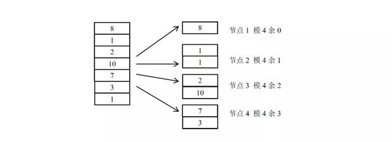
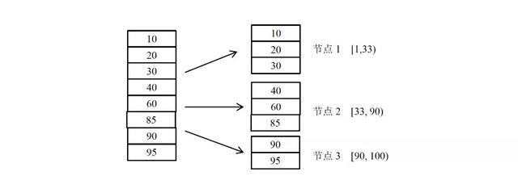
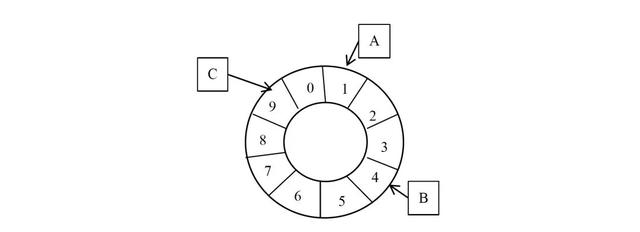
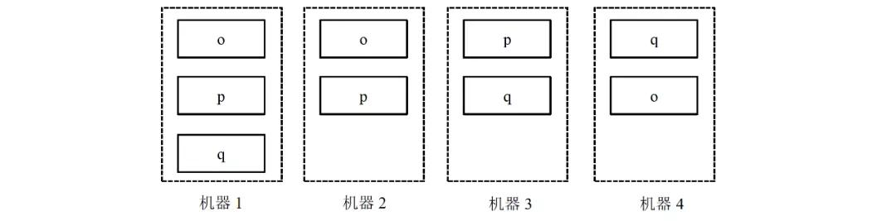
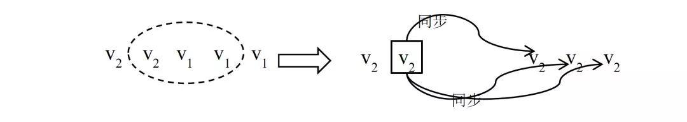
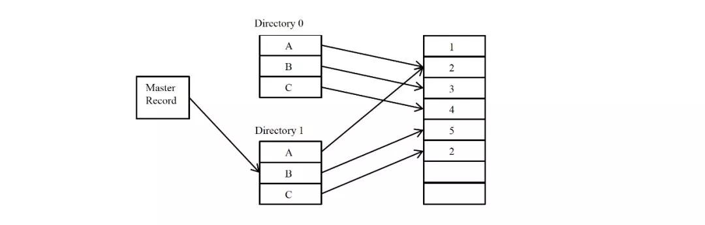
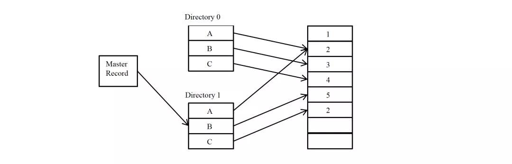

# 分布式系统原理

### 概念

##### 模型

###### 节点

在具体的工程项目中，一个节点往往是一个操作系统上的进程。在本文的模型中，认为节点是一个完整的、不可分的整体，如果某个程序进程实际上由若干相对独立部分构成，则在模型中可以将一个进程划分为多个节点。

###### 异常

1. 机器宕机：机器宕机是最常见的异常之一。在大型集群中每日宕机发生的概率为千分之一左右，在实践中，一台宕机的机器恢复的时间通常认为是24 小时，一般需要人工介入重启机器。
2. 网络异常：消息丢失，两片节点之间彼此完全无法通信，即出现了“网络分化”；
3. 消息乱序，有一定的概率不是按照发送时的顺序依次到达目的节点，考虑使用序列号等机制处理网络消息的乱序问题，使得无效的、过期的网络消息不影响系统的正确性；
4. 数据错误；不可靠的TCP，TCP 协议为应用层提供了可靠的、面向连接的传输服务，但在分布式系统的协议设计中不能认为所有网络通信都基于TCP 协议则通信就是可靠的。
5. TCP协议只能保证同一个TCP 链接内的网络消息不乱序，TCP 链接之间的网络消息顺序则无法保证。
6. 分布式三态：如果某个节点向另一个节点发起RPC(Remote procedure call)调用，即某个节点A 向另一个节点B 发送一个消息，节点B 根据收到的消息内容完成某些操作，并将操作的结果通过另一个消息返回给节点A，那么这个RPC 执行的结果有三种状态：“成功”、“失败”、“超时（未知）”，称之为分布式系统的三态。
7. 存储数据丢失:对于有状态节点来说，数据丢失意味着状态丢失，通常只能从其他节点读取、恢复存储的状态。
8. *异常处理原则*：被大量工程实践所检验过的异常处理黄金原则是：任何在设计阶段考虑到的异常情况一定会在系统实际运行中发生，但在系统实际运行遇到的异常却很有可能在设计时未能考虑，所以，除非需求指标允许，在系统设计时不能放过任何异常情况。

##### 副本

副本（replica/copy）指在分布式系统中为数据或服务提供的冗余。对于数据副本指在不同的节点上持久化同一份数据，当出现某一个节点的存储的数据丢失时，可以从副本上读到数据。

数据副本是分布式系统解决数据丢失异常的唯一手段。另一类副本是服务副本，指数个节点提供某种相同的服务，这种服务一般并不依赖于节点的本地存储，其所需数据一般来自其他节点。

副本协议是贯穿整个分布式系统的理论核心。

###### 副本一致性

分布式系统通过副本控制协议，使得从系统外部读取系统内部各个副本的数据在一定的约束条件下相同，称之为副本一致性(consistency)。副本一致性是针对分布式系统而言的，不是针对某一个副本而言。

1. 强一致性(strong consistency)：任何时刻任何用户或节点都可以读到最近一次成功更新的副本数据。强一致性是程度最高的一致性要求，也是实践中最难以实现的一致性。
2. 单调一致性(monotonic consistency)：任何时刻，任何用户一旦读到某个数据在某次更新后的值，这个用户不会再读到比这个值更旧的值。
   单调一致性是弱于强一致性却非常实用的一种一致性级别。因为通常来说，用户只关心从己方视角观察到的一致性，而不会关注其他用户的一致性情况。
3. 会话一致性(session consistency)：任何用户在某一次会话内一旦读到某个数据在某次更新后的值，这个用户在这次会话过程中不会再读到比这个值更旧的值。
   会话一致性通过引入会话的概念，在单调一致性的基础上进一步放松约束，会话一致性只保证单个用户单次会话内数据的单调修改，对于不同用户间的一致性和同一用户不同会话间的一致性没有保障。
   ，例如php 中的session 概念。
4. 最终一致性(eventual consistency)：最终一致性要求一旦更新成功，各个副本上的数据最终将达 到完全一致的状态，但达到完全一致状态所需要的时间不能保障。
   对于最终一致性系统而言，一个用户只要始终读取某一个副本的数据，则可以实现类似单调一致性的效果，但一旦用户更换读取的副本，则无法保障任何一致性。
5. 弱一致性(week consistency)：一旦某个更新成功，用户无法在一个确定时间内读到这次更新的值，且即使在某个副本上读到了新的值，也不能保证在其他副本上可以读到新的值。
   弱一致性系统一般很难在实际中使用，使用弱一致性系统需要应用方做更多的工作从而使得系统可用。

##### 衡量分布式系统的指标

1. 性能：系统的吞吐能力，指系统在某一时间可以处理的数据总量，通常可以用系统每秒处理的总的数据量来衡量；
   系统的响应延迟，指系统完成某一功能需要使用的时间；
   系统的并发能力，指系统可以同时完成某一功能的能力，通常也用QPS(query per second)来衡量。
   上述三个性能指标往往会相互制约，追求高吞吐的系统，往往很难做到低延迟；系统平均响应时间较长时，也很难提高QPS。
2. 可用性：系统的可用性(availability)指系统在面对各种异常时可以正确提供服务的能力。
   系统的可用性可以用系统停服务的时间与正常服务的时间的比例来衡量，也可以用某功能的失败次数与成功次数的比例来衡量。可用性是分布式的重要指标，衡量了系统的鲁棒性，是系统容错能力的体现。
3. 可扩展性：系统的可扩展性(scalability)指分布式系统通过扩展集群机器规模提高系统性能（吞吐、延迟、并发）、存储容量、计算能力的特性。好的分布式系统总在追求“线性扩展性”，也就是使得系统的某一指标可以随着集群中的机器数量线性增长。
4. 一致性：分布式系统为了提高可用性，总是不可避免的使用副本的机制，从而引发副本一致性的问题。越是强的一致的性模型，对于用户使用来说使用起来越简单。

### 分布式系统原理

##### 数据分布方式

所谓分布式系统顾名思义就是利用多台计算机协同解决单台计算机所不能解决的计算、存储等问题。

单机系统与分布式系统的最大的区别在于问题的规模，即计算、存储的数据量的区别。

将一个单机问题使用分布式解决，首先要解决的就是如何将问题拆解为可以使用多机分布式解决，使得分布式系统中的每台机器负责原问题的一个子集。由于无论是计算还是存储，其问题输入对象都是数据，所以如何拆解分布式系统的输入数据成为分布式系统的基本问题。

哈希分布数据的缺点同样明显，突出表现为可扩展性不高，一旦集群规模需要扩展，则几乎所有的数据需要被迁移并重新分布。工程中，扩展哈希分布数据的系统时，往往使得集群规模成倍扩展，按照数据重新计算哈希，这样原本一台机器上的数据只需迁移一半到另一台对应的机器上即可完成扩展。

针对哈希方式扩展性差的问题，一种思路是不再简单的将哈希值与机器做除法取模映射，而是将对应关系作为元数据由专门的元数据服务器管理.同时，哈希值取模个数往往大于机器个数，这样同一台机器上需要负责多个哈希取模的余数。但需要以较复杂的机制维护大量的元数据。哈希分布数据的另一个缺点是，一旦某数据特征值的数据严重不均，容易出现“数据倾斜”（data skew）问题。

哈希分布数据的另一个缺点是，一旦某数据特征值的数据严重不均，容易出现“数据倾斜”（data skew）问题

###### 按数据范围分布

按数据范围分布是另一个常见的数据分布式，将数据按特征值的值域范围划分为不同的区间，使得集群中每台（组）服务器处理不同区间的数据。

工程中，为了数据迁移等负载均衡操作的方便，往往利用动态划分区间的技术，使得每个区间中服务的数据量尽量的一样多。当某个区间的数据量较大时，通过将区间“分裂”的方式拆分为两个区间，使得每个数据区间中的数据量都尽量维持在一个较为固定的阈值之下。

一般的，往往需要使用专门的服务器在内存中维护数据分布信息，称这种数据的分布信息为一种元信息。甚至对于大规模的集群，由于元信息的规模非常庞大，单台 计算机无法独立维护，需要使用多台机器作为元信息服务器。

###### 按数据量分布

数据量分布数据与具体的数据特征无关，而是将数据视为一个顺序增长的文件，并将这个文件按照某一较为固定的大小划分为若干数据块（chunk），不同的数据块分布到不同的服务器上

与按数据范围分布数据的方式类似的是，按数据量分布数据也需要记录数据块的具体分布情况，并将该分布信息作为元数据使用元数据服务器管理。

由于与具体的数据内容无关，按数据量分布数据的方式一般没有数据倾斜的问题，数据总是被均匀切分并分布到集群中。

当集群需要重新负载均衡时，只需通过迁移数据块即可完成。集群扩容也没有太大的限制，只需将部分数据库迁移到新加入的机器上即可以完成扩容。

按数据量划分数据的缺点是需要管理较为复杂的元信息，与按范围分布数据的方式类似，当集群规模较大时，元信息的数据量也变得很大，高效的管理元信息成为新的课题。

###### 一致性哈希

一致性哈希（consistent hashing）是另一个种在工程中使用较为广泛的数据分布方式。一致性哈希最初在P2P 网络中作为分布式哈希表（DHT）的常用数据分布算法。

一致性哈希的基本方式是使用一个哈希函数计算数据或数据特征的哈希值，令该哈希函数的输出值域为一个封闭的环，即哈希函数输出的最大值是最小值的前序。将节点随机分布到这个环上，每个节点负责处理从自己开始顺时针至下一个节点的全部哈希值域上的数据。

使用一致性哈希的方式需要将节点在一致性哈希环上的位置作为元信息加以管理，这点比直接使用哈希分布数据的方式要复杂。然而，节点的位置信息只于集群中的机器规模相关，其元信息的量通常比按数据范围分布数据和按数据量分布数据的元信息量要小很多。

为此一种常见的改进算法是引入虚节点（virtual node）的概念，系统初始时就创建许多虚节点，虚节点的个数一般远大于未来集群中机器的个数，将虚节点均匀分布到一致性哈希值域环上，其功能与基本一致性哈希算法中的节点相同。为每个节点分配若干虚节点。

操作数据时，首先通过数据的哈希值在环上找到对应的虚节点，进而查找元数据找到对应的真实节点。使用虚节点改进有多个优点。

首先，一旦某个节点不可用，该节点将使得多个虚节点不可用，从而使得多个相邻的真实节点负载失效节点的压里。同理，一旦加入一个新节点，可以分配多个虚节点，从而使得新节点可以 负载多个原有节点的压力，从全局看，较容易实现扩容时的负载均衡。

###### 副本与数据分布

分布式系统容错、提高可用性的基本手段就是使用副本。对于数据副本的分布方式主要影响系统的可扩展性。一种基本的数据副本策略是以机器为单位，若干机器互为副本，副本机器之间的数据完全相同。这种策略适用于上述各种数据分布方式。其优点是非常简单，其缺点是恢复数据的效率不高、可扩展性也不高。

更合适的做法不是以机器作为副本单位，而是将数据拆为较合理的数据段，以数据段为单位作为副本。

实践中，常常使得每个数据段的大小尽量相等且控制在一定的大小以内。数据段有很多不同的称谓，segment，fragment，chunk，partition 等等。数据段的选择与数据分布方式直接相关。

对于哈希分数据的方式，每个哈希分桶后的余数可以作为一个数据段，为了控制数据段的大小，常常使得分桶个数大于集群规模。一旦将数据分为数据段，则可以以数据段为单位管理副本，从而副本与机器不再硬相关，每台机器都可以负责一定数据段的副本。

一旦副本分布与机器无关，数据丢失后的恢复效率将非常高。这是因为，一旦某台机器的数据丢失，其上数据段的副本将分布在整个集群的所有机器中，而不是仅在几个副本机器中，从而可以从整个集群同时拷贝恢复数据，而集群中每台数据源机器都可以以非常低的资源做拷贝。作为恢复数据源的机器即使都限速1MB/s，若有100 台机器参与恢复，恢复速度也能达到100MB/s。

再者，副本分布与机器无关也利于集群容错。如果出现机器宕机，由于宕机机器上的副本分散于整个集群，其压力也自然分散到整个集群。

最后，副本分布与机器无关也利于集群扩展。理论上，设集群规模 为N 台机器，当加入一台新的机器时，只需从各台机器上迁移1/N – 1/N+1 比例的数据段到新机器即实现了新的负载均衡。由于是从集群中各机器迁移数据，与数据恢复同理，效率也较高。

工程中，完全按照数据段建立副本会引起需要管理的元数据的开销增大，副本维护的难度也相应增大。一种折中的做法是将某些数据段组成一个数据段分组，按数据段分组为粒度进行副本管理。这样做可以将副本粒度控制在一个较为合适的范围内。

###### 本地化计算

在分布式系统中，数据的分布方式也深深影响着计算的分布方式。在分布式系统中计算节点和保存计算数据的存储节点可以在同一台物理机器上，也可以位于不同的物理机器。

如果计算节点和存储节点位于不同的物理机器则计算的数据需要通过网络传输，此种方式的开销很大，甚至网络带宽会成为系统的总体瓶颈。

另一种思路是，将计算尽量调度到与存储节点在同一台物理机器上的计算节点上进行，这称之为本地化计算。本地化计算是计算调度的一种重要优化，其体现了一种重要的分布式调度思想：“移动数据不如移动计算”。

###### 数据分布方式的选择

在实际工程实践中，可以根据需求及实施复杂度合理选择数据分布方式。另外，数据分布方式是可以灵活组合使用的，往往可以兼备各种方式的优点，收到较好的综合效果。

例：数据倾斜问题，在按哈希分数据的基础上引入按数据量分布数据的方式，解决该数据倾斜问题。按用户id 的哈希值分数据，当某个用户id 的数据量特别大时，该用户的数据始终落在某一台机器上。此时，引入按数据量分布数据的方式，统计用户的数据量，并按某一阈值将用户的数据切为多个均匀的数据段，将这些数据段分布到集群中去。由于大部分用户的数据量不会超过阈值，所以元数据中仅仅保存超过阈值的用户的数据段分布信息，从而可以控制元数据的规模。这种哈希分布数据方式与按数据量分布数据方式组合使用的方案，在某真实系统中使用，取得了较好的效果。

#####   基本副本协议

副本控制协议指按特定的协议流程控制副本数据的读写行为，使得副本满足一定的可用性和一致性要求的分布式协议。副本控制协议要具有一定的对抗异常状态的容错能力，从而使得系统具有一定的可用性，同时副本控制协议要能提供一定一致性级别。由CAP 原理（在2.9 节详细分析）可知，要设计一种满足强一致性，且在出现任何网络异常时都可用的副本协议是不可能的。为此，实际中的副本控制协议总是在可用性、一致性与性能等各要素之间按照具体需求折中。

副本控制协议可以分为两大类：“中心化(centralized)副本控制协议”和“去中心化(decentralized)副本控制协议”。

###### 中心化副本控制协议

中心化副本控制协议的基本思路是由一个中心节点协调副本数据的更新、维护副本之间的一致性。

图给出了中心化副本协议的通用架构。中心化副本控制协议的优点是协议相对较为简单，所有的副本相关的控制交由中心节点完成。并发控制将由中心节点完成，从而使得一个分布式并发控制问题，简化为一个单机并发控制问题。

所谓并发控制，即多个节点同时需要修改副本数据时，需要解决“写写”、“读写”等并发冲突。单机系统上常用加锁等方式进行并发控制。对于分布式并发控制，加锁也是一个常用的方法，但如果没有中心节点统一进行锁管理，就需要完全分布式化的锁系统，会使得协议非常复杂。

中心化副本控制协议的缺点是系统的可用性依赖于中心化节点，当中心节点异常或与中心节点通信中断时，系统将失去某些服务（通常至少失去更新服务），所以中心化副本控制协议的缺点正是存在一定的停服务时间。

###### primary-secondary 协议

在primary-secondary 类型的协议中，副本被分为两大类，其中有且仅有一个副本作为primary 副本，除primary 以外的副本都作为secondary 副本。维护primary 副本的节点作为中心节点，中心节点负责维护数据的更新、并发控制、协调副本的一致性。

Primary-secondary 类型的协议一般要解决四大类问题：数据更新流程、数据读取方式、Primary 副本的确定和切换、数据同步（reconcile）。

###### 数据更新基本流程

1. 数据更新都由primary 节点协调完成。
2. 外部节点将更新操作发给primary 节点
3. primary 节点进行并发控制即确定并发更新操作的先后顺序
4. primary 节点将更新操作发送给secondary 节点
5. primary 根据secondary 节点的完成情况决定更新是否成功并将结果返回外部节点

在工程实践中，如果由primary 直接同时发送给其他N 个副本发送数据，则每个 secondary 的更新吞吐受限于primary 总的出口网络带宽，最大为primary 网络出口带宽的1/N。

为了解决这个问题，有些系统（例如，GFS），使用接力的方式同步数据，即primary 将更新发送给第一 个secondary 副本，第一个secondary 副本发送给第二secondary 副本，依次类推。

###### 数据读取方式

数据读取方式也与一致性高度相关。如果只需要最终一致性，则读取任何副本都可以满足需求。

如果需要会话一致性，则可以为副本设置版本号，每次更新后递增版本号，用户读取副本时验证版本号，从而保证用户读到的数据在会话范围内单调递增。使用primary-secondary 比较困难的是实现强一致性。

由于数据的更新流程都是由primary 控制的，primary 副本上的数据一定是最新的，所以 如果始终只读primary 副本的数据，可以实现强一致性。如果只读primary 副本，则secondary 副本将不提供读服务。

实践中，如果副本不与机器绑定，而是按照数据段为单位维护副本，仅有primary 副本提供读服务在很多场景下并不会造出机器资源浪费。

将副本分散到集群中个，假设primary 也是随机的确定的，那么每台机器上都有一些数据的primary 副本，也有另一些数据段的secondary 副本。从而某台服务器实际都提供读写服务。

由primary 控制节点secondary 节点的可用性。当primary 更新某个secondary 副本不成功时，primary 将该secondary 副本标记为不可用，从而用户不再读取该不可用的副本。不可用的 secondary 副本可以继续尝试与primary 同步数据，当与primary 完成数据同步后，primary 可以副本标记为可用。

这种方式使得所有的可用的副本，无论是primary 还是secondary 都是可读的，且在一个确定的时间内，某secondary 副本要么更新到与primary 一致的最新状态，要么被标记为不可用，从而符合较高的一致性要求。这种方式依赖于一个中心元数据管理系统，用于记录哪些副本可用，哪些副本不可用。某种意义上，该方式通过降低系统的可用性来提高系统的一致性。

###### primary 副本的确定与切换

在primary-secondary 类型的协议中，另一个核心的问题是如何确定primary 副本，尤其是在原primary 副本所在机器出现宕机等异常时，需要有某种机制切换primary 副本，使得某个secondary 副本成为新的primary 副本。

通常的，在primary-secondary 类型的分布式系统中，哪个副本是primary 这一信息都属于元信息，由专门的元数据服务器维护。执行更新操作时，首先查询元数据服务器获取副本的primary 信息，从而进一步执行数据更新流程。

由于分布式系统中可靠的发现节点异常是需要一定的探测时间的，这样的探测时间通常是10 秒级别，这也意味着一旦primary 异常，最多需要10 秒级别的发现时间，系统才能开始primary 的切换，在这10 秒时间内，由于没有primary，系统不能提供更 新服务，如果系统只能读primary 副本，则这段时间内甚至不能提供读服务。从这里可以看到，primary-backup 类副本协议的最大缺点就是由于primary 切换带来的一定的停服务时间。

###### 数据同步

不一致的secondary 副本需要与primary 进行同步（reconcile）。

通常不一致的形式有三种：

一、由于网络分化等异常，secondary 上的数据落后于primary 上的数据。

二、在某些协议下，secondary 上的数据有可能是脏数据，需要被丢弃。所谓脏数据是由于primary 副本没有进行某一更新操作，而secondary 副本上反而进行的多余的修改操作，从而造成secondary 副本数据错误。

三、secondary 是一个新增加的副本，完全没有数据，需要从其他副本上拷贝数据。

对于第一种secondary 数据落后的情况，常见的同步方式是回放primary 上的操作日志（通常是redo 日志），从而追上primary 的更新进度。

对于脏数据的情况，较好的做法是设计的分布式协议不产生脏数据。如果协议一定有产生脏数据的可能，则也应该使得产生脏数据的概率降到非常低得情况，从而一旦发生脏数据的情况可以简单的直接丢弃有脏数据的副本，这样相当于副本没有数据。

另外，也可以设计一些基于undo 日志的方式从而可以删除脏数据。如果secondary 副本完全没有数据，则常见的做法是直接拷贝primary 副本的数据，这种方法往往比回放日志追更新进度的方法快很多。但拷贝数据时primary 副本需要能够继续提供更新服务，这就要求primary 副本支持快照(snapshot)功能。即对某一刻的副本数据形成快照，然后拷贝快照，拷贝完成后使用回放日志的方式追快照形成后的更新操作。

###### 去中心化副本控制协议

去中心化副本控制协议没有中心节点，协议中所有的节点都是完全对等的，节点之间通过平等协商达到一致。从而去中心化协议没有因为中心化节点异常而带来的停服务等问题。

去中心化协议的最大的缺点是协议过程通常比较复杂。尤其当去中心化协议需要实现强一致性时，协议流程变得复杂且不容易理解。由于流程的复杂，去中心化协议的效率或者性能一般也较中心化协议低。一个不恰当的比方就是，中心化副本控制协议类似专制制度，系统效率高但高度依赖于中心节点，一旦中心节点异常，系统受到的影响较大；去中心化副本控制协议类似民主制度，节点集体协商，效率低下，但个别节点的异常不会对系统总体造成太大影响。

##### Lease 机制

Lease 机制是最重要的分布式协议，广泛应用于各种实际的分布式系统中。

###### 基于lease 的分布式cache 系统

基本的问题背景如下：在一个分布式系统中，有一个中心服务器节点，中心服务器存储、维护着一些数据，这些数据是系统的元数据。系统中其他的节点通过访问中心服务器节点读取、修改其上的元数据。

由于系统中各种操作都依赖于元数据，如果每次读取元数据的操作都访问中心服务器 节点，那么中心服务器节点的性能成为系统的瓶颈。为此，设计一种元数据cache，在各个节点上 cache 元数据信息，从而减少对中心服务器节点的访问，提高性能。

另一方面，系统的正确运行严格依赖于元数据的正确，这就要求各个节点上cache 的数据始终与中心服务器上的数据一致，cache 中的数据不能是旧的脏数据。最后，设计的cache 系统要能最大可能的处理节点宕机、网络中断等异常，最大程度的提高系统的可用性。

为此，利用lease 机制设计一套cache 系统，其基本原理为如下。

中心服务器在向各节点发送数据时同时向节点颁发一个lease。每个lease 具有一个有效期，和信用卡上的有效期类似，lease 上的 有效期通常是一个明确的时间点，例如12:00:10，一旦真实时间超过这个时间点，则lease 过期失效。这样lease 的有效期与节点收到lease 的时间无关，节点可能收到lease 时该lease 就已经过期失效。这里首先假设中心服务器与各节点的时钟是同步的，在下节中讨论时钟不同步对lease 的影响。中心服务器发出的lease 的含义为：在lease 的有效期内，中心服务器保证不会修改对应数据的值。因此，节点收到数据和lease 后，将数据加入本地Cache，一旦对应的lease 超时，节点将对应的本地cache 数据删除。中心服务器在修改数据时，首先阻塞所有新的读请求，并等待之前为该数据发出的所有lease 超时过期，然后修改数据的值。

基于lease 的cache，客户端节点读取元数据

1. 判断元数据是否已经处于本地cache 且lease 处于有效期内1.1 是：直接返回cache 中的元数据1.2 否：向中心服务器节点请求读取元数据信息1.2.1 服务器收到读取请求后，返回元数据及一个对应的lease 1.2.2 客户端是否成功收到服务器返回的数据 1.2.2.1 失败或超时：退出流程，读取失败，可重试1.2.2.2 成功：将元数据与该元数据的lease 记录到内存中，返回元数据
2. 基于lease 的cache，客户端节点修改元数据流程2.1 节点向服务器发起修改元数据请求。2.2 服务器收到修改请求后，阻塞所有新的读数据请求，即接收读请求，但不返回数据。2.3 服务器等待所有与该元数据相关的lease 超时。2.4 服务器修改元数据并向客户端节点返回修改成功。

上述机制可以保证各个节点上的cache 与中心服务器上的中心始终一致。这是因为中心服务器节点在发送数据的同时授予了节点对应的lease，在lease 有效期内，服务器不会修改数据，从而客户端节点可以放心的在lease 有效期内cache 数据。上述lease 机制可以容错的关键是：服务器一旦 发出数据及lease，无论客户端是否收到，也无论后续客户端是否宕机，也无论后续网络是否正常，服务器只要等待lease 超时，就可以保证对应的客户端节点不会再继续cache 数据，从而可以放心的修改数据而不会破坏cache 的一致性。

上述基础流程有一些性能和可用性上的问题，但可以很容易就优化改性。优化点一：服务器在修改元数据时首先要阻塞所有新的读请求，造成没有读服务。这是为了防止发出新的lease 从而引起不断有新客户端节点持有lease 并缓存着数据，形成“活锁”。优化的方法很简单，服务器在进入修改数据流程后，一旦收到读请求则只返回数据但不颁发lease。从而造成在修改流程执行的过程中，客户端可以读到元数据，只是不能缓存元数据。进一步的优化是，当进入修改流程，服务器颁发的lease 有效期限选择为已发出的lease 的最大有效期限。这样做，客户端可以继续在服务器进入修改流程后继续缓存元数据，但服务器的等待所有lease 过期的时间也不会因为颁发新的lease 而不断延长。

最后，=cache 机制与多副本机制的区别。Cache 机制与多副本机制的相似之处都 是将一份数据保存在多个节点上。但Cache 机制却要简单许多，对于cache 的数据，可以随时删除丢弃，并命中cache 的后果仅仅是需要访问数据源读取数据；然而副本机制却不一样，副本是不能随意丢弃的，每失去一个副本，服务质量都在下降，一旦副本数下降到一定程度，则往往服务将不再可用。

###### lease 机制的分析

lease 的定义：Lease 是由颁发者授予的在某一有效期内的承诺。颁发者一旦发出lease，则无论接受方是否收到，也无论后续接收方处于何种状态，只要lease 不过期，颁发者一定严守承诺；另一方面，接收方在lease 的有效期内可以使用颁发者的承诺，但一旦lease 过期，接收方一定不能继续使用颁发者的承诺。

Lease 机制具有很高的容错能力。首先，通过引入有效期，Lease 机制能否非常好的容错网络异常。Lease 颁发过程只依赖于网络可以单向通信，即使接收方无法向颁发者发送消息，也不影响lease 的颁发。

由于lease 的有效期是一个确定的时间点，lease 的语义与发送lease 的具体时间无关，所以 同一个lease 可以被颁发者不断重复向接受方发送。即使颁发者偶尔发送lease 失败，颁发者也可以 简单的通过重发的办法解决。一旦lease 被接收方成功接受，后续lease 机制不再依赖于网络通信，即使网络完全中断lease 机制也不受影响。

再者，Lease 机制能较好的容错节点宕机。如果颁发者宕机，则宕机的颁发者通常无法改变之前的承诺，不会影响lease 的正确性。在颁发者机恢复后，如果颁发者恢复出了之前的lease 信息，颁发者可以继续遵守lease 的承诺。如果颁发者无法恢复lease 信息，则只需等待一个最大的lease 超时时间就可以使得所有的lease 都失效，从而不破坏lease机制。

例如上节中的cache 系统的例子中，一旦服务器宕机，肯定不会修改元数据，重新恢复后，只需等待一个最大的lease 超时时间，所有节点上的缓存信息都将被清空。

对于接受方宕机的情况，颁发者 不需要做更多的容错处理，只需等待lease 过期失效，就可以收回承诺，实践中也就是收回之前赋予的权限、身份等。最后，lease 机制不依赖于存储。颁发者可以持久化颁发过的lease 信息，从而在 宕机恢复后可以使得在有效期的lease 继续有效。但这对于lease 机制只是一个优化，如之前的分析，即使颁发者没有持久化lease 信息，也可以通过等待一个最大的lease 时间的方式使得之前所有颁发 的lease 失效，从而保证机制继续有效。

Lease 机制依赖于有效期，这就要求颁发者和接收者的时钟是同步的。一方面，如果颁发者的 时钟比接收者的时钟慢，则当接收者认为lease 已经过期的时候，颁发者依旧认为lease 有效。接收者可以用在lease 到期前申请新的lease 的方式解决这个问题。另一方面，如果颁发者的时钟比接收 者的时钟快，则当颁发者认为lease 已经过期的时候，接收者依旧认为lease 有效，颁发者可能将lease 颁发给其他节点，造成承诺失效，影响系统的正确性。对于这种时钟不同步，实践中的通常做法是将颁发者的有效期设置得比接收者的略大，只需大过时钟误差就可以避免对lease 的有效性的影响。

###### 基于lease 机制确定节点状态

分布式协议依赖于对节点状态认知的全局一致性，即一旦节点Q 认为某个节点 A 异常，则节点A 也必须认为自己异常，从而节点A 停止作为primary，避免“双主”问题的出现。

解决这种问题有两种思路，第一、设计的分布式协议可以容忍“双主”错误，即不依赖于对节点状 态的全局一致性认识，或者全局一致性状态是全体协商后的结果；

第二、利用lease 机制。对于第一 种思路即放弃使用中心化的设计，而改用去中心化设计，超过本节的讨论范畴。下面着重讨论利用 lease 机制确定节点状态。

由中心节点向其他节点发送lease，若某个节点持有有效的lease，则认为该节点正常可以提供服 务。用于例2.3.1 中，节点A、B、C 依然周期性的发送heart beat 报告自身状态，节点Q 收到heart beat 后发送一个lease，表示节点Q 确认了节点A、B、C 的状态，并允许节点在lease 有效期内正常工 作。节点Q 可以给primary 节点一个特殊的lease，表示节点可以作为primary 工作。一旦节点Q 希望切换新的primary，则只需等前一个primary 的lease 过期，则就可以安全的颁发新的lease 给新的 primary 节点，而不会出现“双主”问题。

在实际系统中，若用一个中心节点发送lease 也有很大的风险，一旦该中心节点宕机或网络异常，则所有的节点没有lease，从而造成系统高度不可用。为此，实际系统总是使用多个中心节点互为副本，成为一个小的集群，该小集群具有高可用性，对外提供颁发lease 的功能。chubby 和zookeeper 都是基于这样的设计。

###### lease 的有效期时间选择

工程中，常选择的lease 时长是10 秒级别，这是一个经过验证的经验值，实践中可以作为参考并综合选择合适的时长。

##### Quorum 机制

先做这样的约定：更新操作（write）是一系列顺序的过程，通过其他机制确定更新操作的顺序（例如primary-secondary 架构中由primary 决定顺序），每个更新操作记为wi， i 为更新操作单调递增的序号，每个wi 执行成功后副本数据都发生变化，称为不同的数据版本，记 作vi。假设每个副本都保存了历史上所有版本的数据。

###### write-all-read-one

Write-all-read-one（简称WARO）是一种最简单的副本控制规则，顾名思义即在更新时写所有的副本，只有在所有的副本上更新成功，才认为更新成功，从而保证所有的副本一致，这样在读取数据时可以读任一副本上的数据。

由于更新操作需要在所有的N 个副本上都成功，更新操作才能成 功，所以一旦有一个副本异常，更新操作失败，更新服务不可用。对于更新服务，虽然有N 个副本， 但系统无法容忍任何一个副本异常。另一方面，N 个副本中只要有一个副本正常，系统就可以提供读服务。对于读服务而言，当有N 个副本时，系统可以容忍N-1 个副本异常。从上述分析可以发现WARO 读服务的可用性较高，但更新服务的可用性不高，甚至虽然使用了副本，但更新服务的可用性等效于没有副本。

###### Quorum 定义

在Quorum 机制下，当某次更新操作wi 一旦在所有N 个副本中的W 个副本上都成功，则就称 该更新操作为“成功提交的更新操作”，称对应的数据为“成功提交的数据”。令R>N-W，由于更新 操作wi 仅在W 个副本上成功，所以在读取数据时，最多需要读取R 个副本则一定能读到wi 更新后 的数据vi 。如果某次更新wi 在W 个副本上成功，由于W+R>N，任意R 个副本组成的集合一定与 成功的W个副本组成的集合有交集，所以读取R 个副本一定能读到wi 更新后的数据vi。

如图 2-10， Quorum 机制的原理可以文森图表示。

某系统有5 个副本，W=3，R=3，最初5 个副本的数据一致，都是v1，某次更新操作 w2 在前3 副本上成功，副本情况变成（v2 v2 v2 v1 v1）。

此时，任意3 个副本组成的集合中一定包括 v2。在上述定义中，令W=N，R=1，就得到WARO，即WARO 是Quorum 机制的一种特例。与分析WARO 相似，分析Quorum 机制的可用性。限制Quorum 参数为W+R=N+1。由于更新 操作需要在W 个副本上都成功，更新操作才能成功，所以一旦N-W+1 个副本异常，更新操作始终无法在W 个副本上成功，更新服务不可用。

另一方面，一旦N-R+1 个副本异常，则无法保证一定可以读到与W 个副本有交集的副本集合，则读服务的一致性下降。

再次强调：仅仅依赖quorum 机制是无法保证强一致性的。因为仅有quorum 机制时无法确定最新已成功提交的版本号，除非将最新已提交的版本号作为元数据由特定的元数据服务器或元数据集群管理，否则很难确定最新成功提交的版本号。在下一节中，将讨论在哪些情况下，可以仅仅 通过quorum 机制来确定最新成功提交的版本号。

Quorum 机制的三个系统参数N、W、R 控制了系统的可用性，也是系统对用户的服务承诺：数据最多有N 个副本，但数据更新成功W 个副本即返回用户成功。对于一致性要求较高的Quorum 系统，系统还应该承诺任何时候不读取未成功提交的数据，即读取到的数据都是曾经在W 个副本上成功的数据。

###### 读取最新成功提交的数据

Quorum 机制只需成功更新N 个副本中的W 个，在读取R 个副本时，一定可以读到最新的成功提交的数据。但由于有不成功的更新情况存在，仅仅读取R 个副本却不一定能确定哪个版本的数据 是最新的已提交的数据。对于一个强一致性Quorum 系统，若存在个数据少于W 个，假设为X 个，则继续读取其他副本，直若成功读取到W 个 该版本的副本，则该数据为最新的成功提交的数据；如果在所有副本中该数据的个数肯定不满 足W 个，则R 中版本号第二大的为最新的成功提交的副本。

例：在读取到（v2 v1 v1）时，继续读取剩余的副本，若读到剩余两个副本 为（v2 v2）则v2 是最新的已提交的副本；若读到剩余的两个副本为（v2 v1）或（v1 v1）则v1 是最新成功提交的版本；若读取后续两个副本有任一超时或失败，则无法判断哪个版本是最新的成功提交的版本。

可以看出，在单纯使用Quorum 机制时，若要确定最新的成功提交的版本，最多需要读取R+ （W-R-1）=N 个副本，当出现任一副本异常时，读最新的成功提交的版本这一功能都有可能不可用。

实际工程中，应该尽量通过其他技术手段，回避通过Quorum 机制读取最新的成功提交的版本。例如，当quorum 机制与primary-secondary 控制协议结合使用时，可以通过读取primary 的方式读取到最新的已提交的数据。

###### 基于Quorum 机制选择primary副本

读取数据时依照一致性要求的不同可以有不同的做法：如果需要强一致性的立刻读取到最新的成功提交的数据，则可以简单的只读取primary 副本上的数据即可，也可以通过上节的方式读取；

如果需要会话一致性，则可以根据之前已经读到的数据版本号在各个副本上进行选择性读取；如果只需要弱一致性，则可以选择任意副本读取。

在primary-secondary 协议中，当primary 异常时，需要选择出一个新的primary，之后secondary 副本与primary 同步数据。

通常情况下，选择新的primary 的工作是由某一中心节点完成的，在引入 quorum 机制后，常用的primary 选择方式与读取数据的方式类似，即中心节点读取R 个副本，选择 R 个副本中版本号最高的副本作为新的primary。新primary 与至少W 个副本完成数据同步后作为新的primary 提供读写服务。

首先，R 个副本中版本号最高的副本一定蕴含了最新的成功提交的数据。再者，虽然不能确定最高版本号的数是一个成功提交的数据，但新的primary 在随后与secondary 同 步数据，使得该版本的副本个数达到W，从而使得该版本的数据成为成功提交的数据。

例：在N=5，W=3，R=3 的系统中，某时刻副本最大版本号为（v2 v2 v1 v1 v1），此时v1 是系统的最新的成功提交的数据，v2 是一个处于中间状态的未成功提交的数据。假设此刻原primary 副本异常，中心节点进行primary 切换工作。这类“中间态”数据究竟作为“脏数据”被删除，还是作为新的数据被同步后成为生效的数据，完全取决于这个数据能否参与新primary 的选举。下面分别分析这两种情况。

第一、如图 2-12，若中心节点与其中3 个副本通信成功，读取到的版本号为（v1 v1 v1），则任 选一个副本作为primary，新primary 以v1 作为最新的成功提交的版本并与其他副本同步，当与第1、第2 个副本同步数据时，由于第1、第2 个副本版本号大于primary，属于脏数据，可以按照2.2.2.4 节中介绍的处理脏数据的方式解决。

实践中，新primary 也有可能与后两个副本完成同步后就提供数据服务，随后自身版本号也更新到v2，如果系统不能保证之后的v2 与之前的v2 完全一样，则新 primary 在与第1、2 个副本同步数据时不但要比较数据版本号还需要比较更新操作的具体内容是否一样。

第二、若中心节点与其他3 个副本通信成功，读取到的版本号为（v2 v1 v1），则选取版本号为 v2 的副本作为新的primary，之后，一旦新primary 与其他2 个副本完成数据同步，则符合v2 的副 本个数达到W 个，成为最新的成功提交的副本，新primary 可以提供正常的读写服务。

##### 日志技术

日志技术是宕机恢复的主要技术之一。日志技术最初使用在数据库系统中。严格来说日志技术不是一种分布式系统的技术，但在分布式系统的实践中，却广泛使用了日志技术做宕机恢复，甚 至如BigTable 等系统将日志保存到一个分布式系统中进一步增强了系统容错能力。

###### Redo Log 与Check point

设计一个高速的单机查询系统，将数据全部存放在内存中以实现高速的数据查询，每次更新操作更新一小部分数据（例如 key-value 中的某一个key）。现在问题为利用日志技术实现该内存查询系统的宕机恢复。与数据库的事务不同的是，这个问题模型中的每个成功的更新操作都会生效。这也等效为数据库的每个事务只有一个更新操作，且每次更新操作都可以也必须立即提交（Auto commit）。

* Redo Log

   1. 将更新操作的结果（例如Set K1=1，则记录K1=1）以追加写（append）的方式写入磁盘的 日志文件
   2. 按更新操作修改内存中的数据
   3. 返回更新成功

从Redo Log 的流程可以看出，Redo 写入日志的是更新操作完成后的结果（虽然本文不讨论Undo Log，这点是与Undo Log 的区别之一），且由于是顺序追加写日志文件，在磁盘等对顺序写有力的 存储设备上效率较高。

用Redo Log 进行宕机恢复非常简单，只需要“回放”日志即可。

流程2.5.2：Redo Log 的宕机恢复

从头读取日志文件中的每次更新操作的结果，用这些结果修改内存中的数据。
从Redo Log 的宕机恢复流程也可以看出，只有写入日志文件的更新结果才能在宕机后恢复。这也是为什么在Redo Log 流程中需要先更新日志文件再更新内存中的数据的原因。

假如先更新内存中的数据，那么用户立刻就能读到更新后的数据，一旦在完成内存修改与写入日志之间发生宕机，那么最后一次更新操作无法恢复，但之前用户可能已经读取到了更新后的数据，从而引起不一致的问题。

* Check point

在简化的模型下，check point 技术的过程即将内存中的数据以某种易于重新加载的数据组织方式完整的dump 到磁盘，从而减少宕机恢复时需要回放的日志数据。

流程：check point

   1. 向日志文件中记录“Begin Check Point”
   1. 将内存中的数据以某种易于重新加载的数据组织方式dump 到磁盘上
   1. 向日志文件中记录“End Check Point” 在check point 流程中，数据可以继续按照流程2.5.1 被更新，这段过程中新更新的数据可以dump 到磁盘也可以不dump 到磁盘，具体取决于实现。例如，check point 开始时k1=v1，check point 过程 中某次更新为k1 = v2，那么dump 到磁盘上的k1 的值可以是v1 也可以是v2。

流程：基于check point 的宕机恢复流程

   1. 将dump 到磁盘的数据加载到内存。
   1. 从后向前扫描日志文件，寻找最后一个“End Check Point”日志。
   1. 从最后一个“End Check Point”日志向前找到最近的一个“Begin Check Point”日志，并回 放该日志之后的所有更新操作日志。
   
* No Undo/No Redo log

若数据维护在磁盘中，某批更新由若干个更新操作组成，这些更新操作需要原子生效，即要么同时生效，要么都不生效。

0/1 目录技术中有两个目录结构，称为目录0(Directory 0)和目录1(Directory 1)。另有一个结构称为主记录（Master record）记录当前正在使用的目录称为活动目录。主记录中要么记录使用目录0，要么记录使用目录1。目录0 或目录1 中记录了各个数据的在日志文件中的位置。0/1 目录的数据更新过程始终在非活动目录上进行，只是在数据生效前，将主记录中的0、1 值反转，从而切换主记录。

流程：0/1 目录数据更新流程

   1. 将活动目录完整拷贝到非活动目录。
   1. 对于每个更新操作，新建一个日志项纪录操作后的值，并在非活动目录中将相应数据的位置修改为新建的日志项的位置。
   1. 原子性修改主记录：反转主记录中的值，使得非活动目录生效。

0/1 目录的更新流程非常简单，通过0、1 目录的主记录切换使得一批修改的生效是原子的。0/1 目录将批量事务操作的原子性通过目录手段归结到主记录的原子切换。

由于多条记录的原子修改一般较难实现而单条记录的原子修改往往可以实现，从而降低了问题实现的难度。

在工程中0/1 目录的思想运用非常广泛，其形式也不局限在上述流程中，可以是内存中的两个数据结构来回切换，也可以是磁盘上的两个文件目录来回生效切换。

##### 两阶段提交协议

两阶段提交协议是一种经典的强一致性中心化副本控制协议。虽然在工程中该协议有较多的问题，但研究该协议能很好的理解分布式系统的几个典型问题。

###### 流程描述

两阶段提交协议是一种典型的“中心化副本控制”协议。在该协议中，参与的节点分为两类：一个中心化协调者节点（coordinator）和N 个参与者节点（participant）。每个参与者节点即上文背景介绍中的管理数据库副本的节点。

两阶段提交的思路比较简单，在第一阶段，协调者询问所有的参与者是否可以提交事务（请参与者投票），所有参与者向协调者投票。

在第二阶段，协调者根据所有参与者的投票结果做出是否事务可以全局提交的决定，并通知所有的参与者执行该决定。在一个两阶段提交流程中，参与者不能改变自己的投票结果。

两阶段提交协议的可以全局提交的前提是所有的参与者都同意提交事务，只要有一个参与者投票选择放弃(abort)事务，则事务必须被放弃。

流程：两阶段提交协调者流程

1. 写本地日志“begin_commit”，并进入WAIT 状态；
1. 向所有参与者发送“prepare 消息”；
1. 等待并接收参与者发送的对“prepare 消息”的响应；3.1 若收到任何一个参与者发送的“vote-abort 消息”；3.1.1 写本地“global-abort”日志，进入ABORT；3.1.2 向所有的参与者发送“global-abort 消息”；3.1.3 进入ABORT 状态；3.2 若收到所有参与者发送的“vote-commit”消息；3.2.1 写本地“global-commit”日志，进入COMMIT 状态；3.1.2 向所有的参与者发送“global-commit 消息”；
1. 等待并接收参与者发送的对“global-abort 消息”或“global-commit 消息”的确认响应消息，一旦收到所有参与者的确认消息，写本地“end_transaction” 日志流程结束。

流程：两阶段提交协调者流程

1. 写本地日志“init”记录，进入INIT 状态
1. 等待并接受协调者发送的“prepare 消息”，收到后 2.1 若参与者可以提交本次事务 2.1.1 写本地日志“ready”，进入READY 状态 2.1.2 向协调者发送“vote-commit”消息 2.1.4 等待协调者的消息2.1.4.1 若收到协调者的“global-abort”消息2.1.4.1.1 写本地日志“abort”，进入ABORT 状态2.1.4.1.2 向协调者发送对“global-abort”的确认消息 2.1.4.2 若收到协调者的“global-commit”消息2.1.4.1.1 写本地日志“commit”，进入COMMIT 状态 2.1.4.1.2 向协调者发送对“global-commit”的确认消息 2.2 若参与者无法提交本次事务 2.2.1 写本地日志“abort”，进入ABORT 状态 2.2.2 向协调者发送“vote-abort”消息 2.2.3 流程对该参与者结束 2.2.4 若后续收到协调者的“global-abort”消息可以响应
1. 即使流程结束，但任何时候收到协调者发送的“global-abort”消息或“global-commit”消息也都要发送一个对应的确认消息。

##### 异常处理

###### 宕机恢复

1. 协调者宕机恢复 协调者宕机恢复后，首先通过日志查找到宕机前的状态。如果日志中最后是“begin_commit”记录，说明宕机前协调者处于WAIT 状态，协调者可能已经发送过“prepare 消息”也可能还没发送，但协调者一定还没有发送过“global-commit 消息”或“global-abort 消息”，即事务的全局状态还没有确定。此时，协调者可以重新发送“prepare 消息” 继续两阶段提交流程，即使参与者已经发送过对“prepare 消息”的响应，也不过是再次重传之前的响应而不会影响协议的一致性。如果日志中最后是“global-commit”或“global-abort”记录，说明宕机前协调者处于COMMIT 或ABORT 状态。此时协调者只需重新向所有的参与者发送“global-commit 消息”或“global-abort 消息”就可以继续两阶段提交流程。
1. 参与者宕机恢复参与者宕机恢复后，首先通过日志查找宕机前的状态。如果日志中最后是“init”记录，说明参与者处于INIT 状态，还没有对本次事务做出投票选择，参与者可以继续流程等待协调者发送的“prepare 消息”。如果日志中最后是“ready”记录，说明参与者处于REDAY 状态，此时说明参与者已经就本次 事务做出了投票选择，但宕机前参与者是否已经向协调者发送“vote-commit”消息并不可知。所以此时参与者可以向协调者重发“vote-commit”，并继续协议流程。如果日志中最后是“commit”或“abort”记录，说明参与者已经收到过协调者的“global-commit 消息”（处于COMMIT 状态）或者“global-abort 消息”（处于ABORT 状态）。至于是否向协调者发 送过对“global-commit”或“global-abort”的确认消息则未知。但即使没有发送过确认消息，由于协调者会不断重发“global-commit”或“global-abort”，只需在收到这些消息时发送确认消息既可，不影响协议的全局一致性。

###### 协议分析

两阶段提交协议在工程实践中真正使用的较少，主要原因有以下几点：

1. 两阶段提交协议的容错能力较差。从上文的分析可以看出，两阶段提交协议在某些情况下存在流程无法执行下去的情况，且也无法判断流程状态。在工程中好的分布式协议往往总是可以在即使发生异常的情况下也能执行下去。例如，回忆Lease 机制（2.3 ），一旦lease 发出，无论出现任何异常，Lease 服务器节点总是可以通过时间判定出Lease 是否有效，也可以用等待Lease 超时的方法收回Lease 权限，整个Lease 协议的流程不存在任何流程被阻塞而无法执行下去的情况。与Lease 机制的简单有效相比，两阶段提交的协议显得较为复杂且容错能力差。
1. 两阶段提交协议的性能较差。一次成功的两阶段提交协议流程中，协调者与每个参与者 之间至少需要两轮交互4 个消息“prepare”、“vote-commit”、“global-commit”、“确认global-commit”。过多的交互次数会降低性能。另一方面，协调者需要等待所有的参与者的投票结果，一旦存在较慢的参与者，会影响全局流程执行速度。

虽然存在一些改进的两阶段提交协议可以提高容错能力和性能，然而这类协议依旧是在工程中使用较少的一类协议，其理论价值大于实践意义。

###### MVCC

MVCC(Multi-version Cocurrent Control，多版本并发控制)技术。MVCC 技术最初也是在数据库系统中被提出，但这种思想并不局限于单机的分布式系统，在分布式系统中同样有效。

MVCC 即多个不同版本的数据实现并发控制的技术，其基本思想是为每次事务生成 一个新版本的数据，在读数据时选择不同版本的数据即可以实现对事务结果的完整性读取。在使用MVCC 时，每个事务都是基于一个已生效的基础版本进行更新，事务可以并行进行，从而可以产生一种图状结构。

基础数据的版本为1，同时产生了两个事务：事务A 与事务B。这两个事务都各自对数据进行了一些本地修改（这些修改只有事务自己可见，不影响真正的数据），之后事务A 首先提交，生成数据版本2；基于数据版本2，又发起了事务C，事务C 继续提交，生成了数据版 本3；最后事务B 提交，此时事务B 的结果需要与事务C 的结果合并，如果数据没有冲突，即事务 B 没有修改事务A 与事务C 修改过的变量，那么事务B 可以提交，否则事务B 提交失败。MVCC 的流程过程非常类似于SVN 等版本控制系统的流程，或者说SVN 等版本控制系统就是 使用的MVCC 思想。事务在基于基础数据版本做本地修改时，为了不影响真正的数据，通常有两种做法，一是将基础数据版本中的数据完全拷贝出来再修改，SVN 即使用了这种方法，SVN check out 即是拷贝的过程；二是每个事务中只记录更新操作，而不记录完整的数据，读取数据时再将更新操作应用到用基础版本的数据从而计算出结果，这个过程也类似SVN 的增量提交。

##### Paxos协议

Paxos 协议是少数在工程实践中证实的强一致性、高可用的去中心化分布式协议。Paxos 协议的流程较为复杂，但其基本思想却不难理解，类似于人类社会的投票过程。Paxos 协议中，有一组完全对等的参与节点（称为accpetor），这组节点各自就某一事件做出决议，如果某个决议获得了超过半数节点的同意则生效。Paxos 协议中只要有超过一半的节点正常，就可以工作，能很好对抗宕机、网络分化等异常情况。

###### 角色

Proposer：提案者。Proposer 可以有多个，Proposer 提出议案（value）。所谓value，在工程中可以是任何操作，例如“修改某个变量的值为某个值”、“设置当前primary 为某个节点”等等。Paxos 协议中统一将这些操作抽象为value。不同的Proposer 可以提出不同的甚至矛盾的value，例如某个Proposer 提议“将变量X 设置为1”，另一个Proposer 提议“将变量X 设置为2”，但对同一轮Paxos 过程，最多只有一个value 被批准。Acceptor：批准者。Acceptor 有N 个，Proposer 提出的value 必须获得超过半数(N/2+1)的Acceptor 批准后才能通过。Acceptor 之间完全对等独立。Learner：学习者。Learner 学习被批准的value。所谓学习就是通过读取各个Proposer 对value 的选择结果，如果某个value 被超过半数Proposer 通过，则Learner 学习到了这个value。回忆（2.4 ） 不难理解，这里类似Quorum 机制，某个value 需要获得W=N/2 + 1 的Acceptor 批准，从而学习者需要至少读取N/2+1 个Accpetor，至多读取N 个Acceptor 的结果后，能学习到一个通过的value。上述三类角色只是逻辑上的划分，实践中一个节点可以同时充当这三类角色。

###### 流程

Paxos 协议一轮一轮的进行，每轮都有一个编号。每轮Paxos 协议可能会批准一个value，也可 能无法批准一个value。如果某一轮Paxos 协议批准了某个value，则以后各轮Paxos 只能批准这个 value。上述各轮协议流程组成了一个Paxos 协议实例，即一次Paxos 协议实例只能批准一个value，这也是Paxos 协议强一致性的重要体现。每轮Paxos 协议分为阶段，准备阶段和批准阶段，在这两个阶段Proposer 和Acceptor 有各自的处理流程。

流程：Proposer 的流程 （准备阶段）

1. 向所有的Acceptor 发送消息“Prepare(b)”；这里b 是Paxos 的轮数，每轮递增
1. 如果收到任何一个Acceptor 发送的消息“Reject(B)”，则对于这个Proposer 而言本轮Paxos 失败，将轮数b 设置为B+1 后重新步骤1；（批准阶段，根据收到的Acceptor 的消息作出不同选择）
1. 如果接收到的Acceptor 的“Promise(b, v_i)”消息达到N/2+1 个（N 为Acceptor 总数，除法取整， 下同）；v_i 表示Acceptor 最近一次在i 轮批准过value v。3.1 如果收到的“Promise(b, v)”消息中，v 都为空，Proposer 选择一个value v，向所有Acceptor 广播Accept(b, v)；3.2 否则，在所有收到的“Promise(b, v_i)”消息中，选择i 最大的value v，向所有Acceptor 广播消息Accept(b，v)；
1. 如果收到Nack(B)，将轮数b 设置为B+1 后重新步骤1；

流程：Accpetor 流程 （准备阶段）

1. 接受某个Propeser 的消息Prepare(b)。参数B 是该Acceptor 收到的最大Paxos 轮数编号；V 是Acceptor 批准的value，可以为空 1.1 如果b>B，回复Promise(b, V_B)，设置B=b; 表示保证不再接受编号小于b 的提案。1.2 否则，回复Reject(B) （批准阶段）
1. 接收Accept(b, v)， 2.1 如果b < B, 回复Nack(B)，暗示proposer 有一个更大编号的提案被这个Acceptor 接收了 2.2 否则设置V=v。表示这个Acceptor 批准的Value 是v。广播Accepted 消息。

###### 例子

基本例子里有5 个Acceptor，1 个Proposer，不存在任何网络、宕机异常。我们着重考察各个Accpetor 上变量B 和变量V 的变化，及Proposer 上变量b 的变化。

1. 初始状态
1. Proposer 向所有Accpetor 发送“Prepare(1)”，所有Acceptor 正确处理，并回复Promise(1, NULL
1. Proposer 收到5 个Promise(1, NULL)，满足多余半数的Promise 的value 为空，此时发送 Accept(1, v1)，其中v1 是Proposer 选择的Value。
1. 此时，v1 被超过半数的Acceptor 批准，v1 即是本次Paxos 协议实例批准的Value。如果Learner 学习value，学到的只能是v1

在同一个Paxos 实例中，批准的Value 是无法改变的，即使后续Proposer 以更高的序号发起Paxos 协议也无法改变value。Paxos 协议的核心就在于“批准的value 无法改变”，这也是整个协议正确性的基础。

Paxos 协议是被人为设计出来，其设计过程也是协议的推导过程。Paxos 协议利用了Quorom 机 制，选择的W=R=N/2+1。

简单而言，协议就是Proposer 更新Acceptor 的过程，一旦某个Acceptor 成功更新了超过半数的Acceptor，则更新成功。Learner 按Quorum 去读取Acceptor，一旦某个value 在超过半数的Proposer 上被成功读取，则说明这是一个被批准的value。协议通过引入轮次，使得高轮次的提议抢占低轮次的提议来避免死锁。协议设计关键点是如何满足“在一次Paxos 算法实例过程中只批准一个Value”这一约束条件。

##### CAP

CAP 理论的定义很简单，CAP 三个字母分别代表了分布式系统中三个相互矛盾的属性：

* Consistency (一致性)：CAP 理论中的副本一致性特指强一致性（1.3.4 ）；
* Availiablity(可用性)：指系统在出现异常时已经可以提供服务；
* Tolerance to the partition of network (分区容忍)：指系统可以对网络分区（1.1.4.2 ）这种异常情 况进行容错处理；

CAP 理论指出：无法设计一种分布式协议，使得同时完全具备CAP 三个属性，即1)该种协议下的副本始终是强一致性，2)服务始终是可用的，3)协议可以容忍任何网络分区异常；分布式系统协议只能在CAP 这三者间所有折中。

热力学第二定律说明了永动机是不可能存在的，不要去妄图设计永动机。与之类似，CAP 理论的意义就在于明确提出了不要去妄图设计一种对CAP 三大属性都完全拥有的完美系统，因为这种系统在理论上就已经被证明不存在。

* Lease 机制: Lease 机制牺牲了部分异常情况下的A，从而获得了完全的C 与很好的P。
* Quorum 机制: Quorum 机制，在CAP 三大因素中都各做了折中，有一定的C，有较好 的A，也有较好的P，是一种较为平衡的分布式协议。
* 两阶段提交协议: 两阶段提交系统具有完全的C，很糟糕的A，很糟糕的P。
* Paxos 协议：同样是强一致性协议，Paxos 在CAP 三方面较之两阶段提交协议要优秀得多。Paxos 协议具有 完全的C，较好的A，较好的P。Paxos 的A 与P 的属性与Quorum 机制类似，因为Paxos 的协议本 身就具有Quorum 机制的因素
