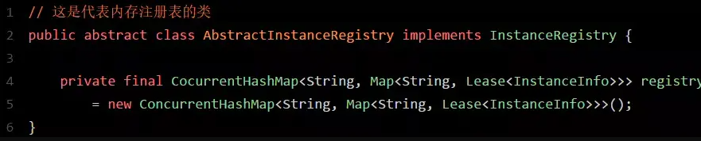
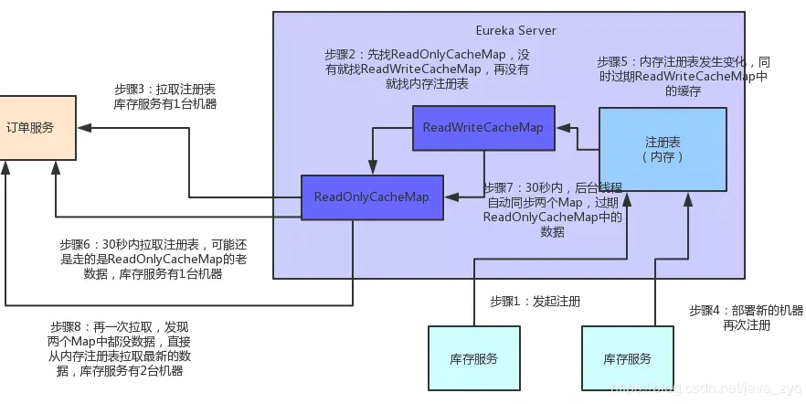

# 注册中心

## Eureka的一些概念：
在Eureka的服务治理中，会涉及到下面一些概念：

服务注册：Eureka Client会通过发送REST请求的方式向Eureka Server注册自己的服务，提供自身的元数据，比如ip地址、端口、运行状况指标的url、主页地址等信息。Eureka Server接收到注册请求后，就会把这些元数据信息存储在一个双层的Map中。

服务续约：在服务注册后，Eureka Client会维护一个心跳来持续通知Eureka Server，说明服务一直处于可用状态，防止被剔除。Eureka Client在默认的情况下会每隔30秒发送一次心跳来进行服务续约。

服务同步：Eureka Server之间会互相进行注册，构建Eureka Server集群，不同Eureka Server之间会进行服务同步，用来保证服务信息的一致性。

获取服务：服务消费者（Eureka Client）在启动的时候，会发送一个REST请求给Eureka Server，获取上面注册的服务清单，并且缓存在Eureka Client本地，默认缓存30秒。同时，为了性能考虑，Eureka Server也会维护一份只读的服务清单缓存，该缓存每隔30秒更新一次。

服务调用：服务消费者在获取到服务清单后，就可以根据清单中的服务列表信息，查找到其他服务的地址，从而进行远程调用。Eureka有Region和Zone的概念，一个Region可以包含多个Zone，在进行服务调用时，优先访问处于同一个Zone中的服务提供者。

服务下线：当Eureka Client需要关闭或重启时，就不希望在这个时间段内再有请求进来，所以，就需要提前先发送REST请求给Eureka Server，告诉Eureka Server自己要下线了，Eureka Server在收到请求后，就会把该服务状态置为下线（DOWN），并把该下线事件传播出去。

服务剔除：有时候，服务实例可能会因为网络故障等原因导致不能提供服务，而此时该实例也没有发送请求给Eureka Server来进行服务下线，所以，还需要有服务剔除的机制。Eureka Server在启动的时候会创建一个定时任务，每隔一段时间（默认60秒），从当前服务清单中把超时没有续约（默认90秒）的服务剔除。

自我保护：既然Eureka Server会定时剔除超时没有续约的服务，那就有可能出现一种场景，网络一段时间内发生了异常，所有的服务都没能够进行续约，Eureka Server就把所有的服务都剔除了，这样显然不太合理。所以，就有了自我保护机制，当短时间内，统计续约失败的比例，如果达到一定阈值，则会触发自我保护的机制，在该机制下，Eureka Server不会剔除任何的微服务，等到正常后，再退出自我保护机制。

从这些概念中，就可以知道大体的流程，Eureka Client向Eureka Server注册，并且维护心跳来进行续约，
如果长时间不续约，就会被剔除。
Eureka Server之间进行数据同步来形成集群，Eureka Client从Eureka Server获取服务列表，
用来进行服务调用，Eureka Client服务重启前调用Eureka Server的接口进行下线操作。
然后调用父类的register方法注册，注册完后，会调用replicateToPeers方法，
把这个节点的注册信息告诉其它Eureka Server节点。

信息同步：每个Eureka Server同时也是Eureka Client，多个Eureka Server之间通过P2P复制的方式完成服务注册表的同步。同步时，被同步信息不会同步出去。也就是说有3个Eureka Server，Server1有新的服务信息时，同步到Server2后，Server2和Server3同步时，Server2不会把从Server1那里同步到的信息同步给Server3，只能由Server1自己同步给Server3。

## Consul的流程

1、当 Producer 启动的时候，会向 Consul 发送一个 post 请求，告诉 Consul 自己的 IP 和 Port

2、Consul 接收到 Producer 的注册后，每隔10s（默认）会向 Producer 发送一个健康检查的请求，检验Producer是否健康

3、当 Consumer 发送 GET 方式请求 /api/address 到 Producer 时，会先从 Consul 中拿到一个存储服务 IP 和 Port 的临时表，从表中拿到 Producer 的 IP 和 Port 后再发送 GET 方式请求 /api/address

4、该临时表每隔10s会更新，只包含有通过了健康检查的 Producer

## 对比

###### Eureka VS ZooKeeper
Eureka是基于AP原则构建，而ZooKeeper是基于CP原则构建；ZooKeeper基于CP，不保证高可用，如果zookeeper正在选举或者Zookeeper集群中半数以上机器不可用，那么将无法获得数据。
Eureka基于AP，能保证高可用，即使所有机器都挂了，也能拿到本地缓存的数据
。作为注册中心，其实配置是不经常变动的，只有发版和机器出故障时会变。
对于不经常变动的配置来说，CP是不合适的，而AP在遇到问题时可以用牺牲一致性来保证可用性，既返回旧数据，缓存数据。
所以理论上Eureka是更适合作注册中心。
而现实环境中大部分项目可能会使用ZooKeeper，那是因为集群不够大，
并且基本不会遇到用做注册中心的机器一半以上都挂了的情况，所以实际上也没什么大问题。

#### 作为服务注册中心，Eureka比Zookeeper好在哪里
著名的CAP理论指出，一个分布式系统不可能同时满足C（一致性）A（可用性）P（分区容错性）。由于分区容错性P是分布式系统中必须要保证的，因此我们只能在A和C之间进行权衡。
因此
Zookeeper保证的是CP，
Eureka则是AP

###### Zookeeper保证CP
当向注册中心查询服务列表时，我们可用容忍注册中心返回的是几分钟以前的注册信息，但不能接受服务直接down掉不可用。也就是说，服务注册功能对可用性的要求要高于一致性。但是zk会出现这样一种情况，当master节点因为网络故障与其他节点时区联系时，剩余节点会重新进行leader选举。问题在于，选举leader的事件太长，30-120s，且选举期间整个zk集群都是不可用的，这就导师在选举期间注册服务瘫痪。在云部署的环境下，因网络问题使得zk集群时区master节点时较大概率会发生的事，虽然服务能够最终恢复，但是漫长的选举时间导师的注册长期不可用是不能容忍的。

###### Eureka保证AP
Eureka看明白了这一点，因此在设计时就优先保证可用性。Eureka各个节点都是平等的，几个节点挂掉不会影响正常节点的工作，剩余的节点依然可用提供注册和查询服务。而Eureka的客户端在向某个Eureka注册如果有时发生连接失败，则会自动切换至其它节点，只要有一台Eureka还在，救恩那个保证注册服务可用（保证可用性），只不过查到的信息可能不是最新的（不保证强一致性）。除此之外，Eureka还有一种自我保护机制，如果在15分钟内超过85%的节点都没有正常的心跳，那么Eureka就认为客户端与注册中心出现了网络故障，此时出现以下几种情况：

Eureka不再从注册列表中移除因为长时间没收到心跳而应该过期的服务
Eureka仍然能够接受新服务的注册和查询请求，但是不会被通过不到其他节点上（即保证当前节点依然可用）
当网络稳定，当前实例新的注册信息会被同步到其他节点中
因此，Eureka可以很好的应对因网络故障导致部分节点失去联系的情况，而不会像zookeeper那样使整个服务瘫痪。

###### Consul VS Eureka
Eureka 是一个服务发现工具。该体系结构主要是客户端/服务器，每个数据中心有一组 Eureka 服务器，通常每个可用区域一个。通常 Eureka 的客户使用嵌入式 SDK 来注册和发现服务。对于非本地集成的客户，官方提供的 Eureka 一些 REST 操作 API，其它语言可以使用这些 API 来实现对 Eureka Server 的操作从而实现一个非 jvm 语言的 Eureka Client。

Eureka 提供了一个弱一致的服务视图，尽可能的提供服务可用性。当客户端向服务器注册时，该服务器将尝试复制到其它服务器，但不提供保证复制完成。服务注册的生存时间（TTL）较短，要求客户端对服务器心跳检测。不健康的服务或节点停止心跳，导致它们超时并从注册表中删除。服务发现可以路由到注册的任何服务，由于心跳检测机制有时间间隔，可能会导致部分服务不可用。这个简化的模型允许简单的群集管理和高可扩展性。

Consul 提供了一些列特性，包括更丰富的健康检查，键值对存储以及多数据中心。Consul 需要每个数据中心都有一套服务，以及每个客户端的 agent，类似于使用像 Ribbon 这样的服务。Consul agent 允许大多数应用程序成为 Consul 不知情者，通过配置文件执行服务注册并通过 DNS 或负载平衡器 sidecars 发现。

Consul 提供强大的一致性保证，因为服务器使用 Raft 协议复制状态 。Consul 支持丰富的健康检查，包括 TCP，HTTP，Nagios / Sensu 兼容脚本或基于 Eureka 的 TTL。客户端节点参与基于 Gossip 协议的健康检查，该检查分发健康检查工作，而不像集中式心跳检测那样成为可扩展性挑战。发现请求被路由到选举出来的 leader，这使他们默认情况下强一致性。允许客户端过时读取取使任何服务器处理他们的请求，从而实现像 Eureka 这样的线性可伸缩性。

Consul 强烈的一致性意味着它可以作为领导选举和集群协调的锁定服务。Eureka 不提供类似的保证，并且通常需要为需要执行协调或具有更强一致性需求的服务运行 ZooKeeper。

Consul 提供了支持面向服务的体系结构所需的一系列功能。这包括服务发现，还包括丰富的运行状况检查，锁定，密钥/值，多数据中心联合，事件系统和 ACL。Consul 和 consul-template 和 envconsul 等工具生态系统都试图尽量减少集成所需的应用程序更改，以避免需要通过 SDK 进行本地集成。Eureka 是一个更大的 Netflix OSS 套件的一部分，该套件预计应用程序相对均匀且紧密集成。因此 Eureka 只解决了一小部分问题，可以和 ZooKeeper 等其它工具可以一起使用。

Consul 强一致性(C)带来的是：

服务注册相比 Eureka 会稍慢一些。因为 Consul 的 raft 协议要求必须过半数的节点都写入成功才认为注册成功 Leader 挂掉时，重新选举期间整个 Consul 不可用。保证了强一致性但牺牲了可用性。

Eureka 保证高可用(A)和最终一致性：

服务注册相对要快，因为不需要等注册信息 replicate 到其它节点，也不保证注册信息是否 replicate 成功 当数据出现不一致时，虽然 A, B 上的注册信息不完全相同，但每个 Eureka 节点依然能够正常对外提供服务，这会出现查询服务信息时如果请求 A 查不到，但请求 B 就能查到。如此保证了可用性但牺牲了一致性。

其它方面，eureka 就是个 servlet 程序，跑在 servlet 容器中; Consul 则是 go 编写而成。

## 自己的猜测

为什么consul是ac 而eureka是ap 因为consul支持k/v存储要保证数据的一直性所以
但是eureka之有服务注册。只有有服务就行。并不需要考虑一致性的问题

## eureka底层原理

如上图所示，图中的这个名字叫做registry的CocurrentHashMap，就是注册表的核心结构。

从代码中可以看到，Eureka Server的注册表直接基于纯内存，即在内存里维护了一个数据结构。

各个服务的注册、服务下线、服务故障，全部会在内存里维护和更新这个注册表。

各个服务每隔30秒拉取注册表的时候，Eureka Server就是直接提供内存里存储的有变化的注册表数据给他们就可以了。

同样，每隔30秒发起心跳时，也是在这个纯内存的Map数据结构里更新心跳时间。
一句话概括：维护注册表、拉取注册表、更新心跳时间，全部发生在内存里！这是Eureka Server非常核心的一个点。

Eureka Server端多级缓存机制
而且Eureka Server为了避免同时读写内存数据结构造成的并发冲突问题，还采用了多级缓存机制来进一步提升服务请求的响应速度。

在拉取注册表的时候：
首先从ReadOnlyCacheMap里查缓存的注册表。
若没有，就找ReadWriteCacheMap里缓存的注册表。
如果还没有，就从内存中获取实际的注册表数据。

在注册表发生变更的时候：
会在内存中更新变更的注册表数据，同时过期掉ReadWriteCacheMap。
此过程不会影响ReadOnlyCacheMap提供人家查询注册表。
一段时间内（默认30秒），各服务拉取注册表会直接读ReadOnlyCacheMap
30秒过后，Eureka Server的后台线程发现ReadWriteCacheMap已经清空了，也会清空ReadOnlyCacheMap中的缓存
下次有服务拉取注册表，又会从内存中获取最新的数据了，同时填充各个缓存。

多级缓存机制的优点是什么？
尽可能保证了内存注册表数据不会出现频繁的读写冲突问题。
并且进一步保证对Eureka Server的大量请求，都是快速从纯内存走，性能极高。
为方便大家更好的理解，同样来一张图，大家跟着图再来回顾一下这整个过程：

客户端的拉取
通过定时任务30秒拉取一次注册表,30秒发起一次心跳

