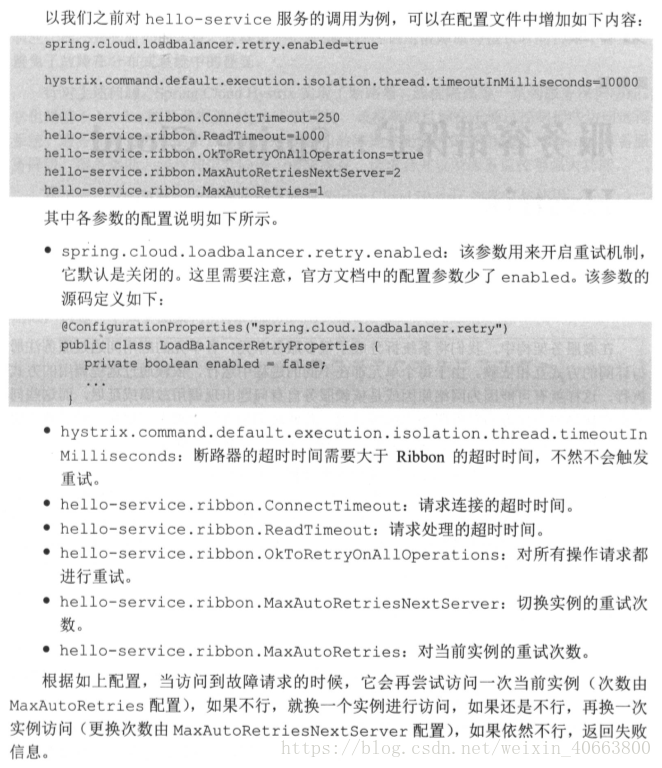

# Ribbon 详解

## Ribbon的负载均衡策略及原理

#### 负载均衡

Load Balance负载均衡是用于解决一台机器(一个进程)无法解决所有请求而产生的一种算法。像nginx可以使用负载均衡分配流量，ribbon为客户端提供负载均衡，dubbo服务调用里的负载均衡等等，很多地方都使用到了负载均衡。

使用负载均衡带来的好处很明显：

当集群里的1台或者多台服务器down的时候，剩余的没有down的服务器可以保证服务的继续使用使用了更多的机器保证了机器的良性使用，不会由于某一高峰时刻导致系统cpu急剧上升
负载均衡有好几种实现策略，常见的有：

* 随机 (Random)
* 轮询 (RoundRobin)
* 一致性哈希 (ConsistentHash)
* 哈希 (Hash)
* 加权（Weighted）

#### ILoadBalance 负载均衡器

ribbon是一个为客户端提供负载均衡功能的服务，它内部提供了一个叫做ILoadBalance的接口代表负载均衡器的操作，
比如有添加服务器操作、选择服务器操作、获取所有的服务器列表、获取可用的服务器列表等等。

负载均衡器是从EurekaClient（EurekaClient的实现类为DiscoveryClient）获取服务信息，根据IRule去路由，并且根据IPing判断服务的可用性。

负载均衡器多久一次去获取一次从Eureka Client获取注册信息呢？在BaseLoadBalancer类下，BaseLoadBalancer的构造函数，
该构造函数开启了一个PingTask任务setupPingTask();，代码如下：


```
    public BaseLoadBalancer() {
        this.name = DEFAULT_NAME;
        this.ping = null;
//配置默认的负载均衡规则 RoundRobinRule
        setRule(DEFAULT_RULE);
        setupPingTask();
        lbStats = new LoadBalancerStats(DEFAULT_NAME);
    }
```

setupPingTask()的具体代码逻辑，
它开启了ShutdownEnabledTimer执行PingTask任务，在默认情况下pingIntervalSeconds为10，即每10秒钟，向EurekaClient发送一次”ping”。

```
    void setupPingTask() {
        if (canSkipPing()) {
            return;
        }
        if (lbTimer != null) {
            lbTimer.cancel();
        }
        lbTimer = new ShutdownEnabledTimer("NFLoadBalancer-PingTimer-" + name,
                true);
        lbTimer.schedule(new PingTask(), 0, pingIntervalSeconds * 1000);
        forceQuickPing();
    }
```


PingTask源码，即new一个Pinger对象，并执行runPinger()方法。

```
    class PingTask extends TimerTask {
        public void run() {
            try {
            	new Pinger(pingStrategy).runPinger();
            } catch (Exception e) {
                logger.error("LoadBalancer [{}]: Error pinging", name, e);
            }
        }
    }
```

查看Pinger的runPinger()方法，最终根据 pingerStrategy.pingServers(ping, allServers)来获取服务的可用性，如果该返回结果和之前相同，则不去向EurekaClient获取注册列表
，如果不同则通知ServerStatusChangeListener或者changeListeners发生了改变，进行更新或者重新拉取。

```
        public void runPinger() throws Exception {
            if (!pingInProgress.compareAndSet(false, true)) { 
                return; // Ping in progress - nothing to do
            }
            
            // we are "in" - we get to Ping

            Server[] allServers = null;
            boolean[] results = null;

            Lock allLock = null;
            Lock upLock = null;

            try {
                /*
                 * The readLock should be free unless an addServer operation is
                 * going on...
                 */
                allLock = allServerLock.readLock();
                allLock.lock();
                allServers = allServerList.toArray(new Server[allServerList.size()]);
                allLock.unlock();

                int numCandidates = allServers.length;
                results = pingerStrategy.pingServers(ping, allServers);

                final List<Server> newUpList = new ArrayList<Server>();
                final List<Server> changedServers = new ArrayList<Server>();

                for (int i = 0; i < numCandidates; i++) {
                    boolean isAlive = results[i];
                    Server svr = allServers[i];
                    boolean oldIsAlive = svr.isAlive();

                    svr.setAlive(isAlive);

                    if (oldIsAlive != isAlive) {
                        changedServers.add(svr);
                        logger.debug("LoadBalancer [{}]:  Server [{}] status changed to {}", 
                    		name, svr.getId(), (isAlive ? "ALIVE" : "DEAD"));
                    }

                    if (isAlive) {
                        newUpList.add(svr);
                    }
                }
                upLock = upServerLock.writeLock();
                upLock.lock();
                upServerList = newUpList;
                upLock.unlock();

                notifyServerStatusChangeListener(changedServers);
            } finally {
                pingInProgress.set(false);
            }
        }
```


### 完整过程是：

LoadBalancerClient（RibbonLoadBalancerClient是实现类）在初始化的时候（execute方法），会通过ILoadBalance（BaseLoadBalancer是实现类）向Eureka注册中心获取服务注册列表，并且每10s一次向EurekaClient发送“ping”，来判断服务的可用性，如果服务的可用性发生了改变或者服务数量和之前的不一致，则从注册中心更新或者重新拉取。LoadBalancerClient有了这些服务注册列表，就可以根据具体的IRule来进行负载均衡。


## IRule 路由

IRule接口代表负载均衡策略：

* RandomRule： 表示随机策略；
* RoundRobinRule： 表示轮询策略；
* WeightedResponseTimeRule： 继承了RoundRobinRule表示加权策略;开始的时候还没有权重列表，采用父类的轮询方式，有一个默认每30秒更新一次权重列表的定时任务，该定时任务会根据实例的响应时间来更新权重列表，choose方法做的事情就是，用一个(0,1)的随机double数乘以最大的权重得到randomWeight，然后遍历权重列表，找出第一个比randomWeight大的实例下标，然后返回该实例，代码略。                              
* BestAvailableRule： 表示请求数最少策略等等;

#### RoundRobinRule


```
public class RoundRobinRule extends AbstractLoadBalancerRule {

    private AtomicInteger nextServerCyclicCounter;
    private static final boolean AVAILABLE_ONLY_SERVERS = true;
    private static final boolean ALL_SERVERS = false;

    private static Logger log = LoggerFactory.getLogger(RoundRobinRule.class);

    public RoundRobinRule() {
        nextServerCyclicCounter = new AtomicInteger(0);
    }
```

```
    public Server choose(ILoadBalancer lb, Object key) {
        if (lb == null) {
            log.warn("no load balancer");
            return null;
        }

        Server server = null;
        int count = 0;
        while (server == null && count++ < 10) {
            List<Server> reachableServers = lb.getReachableServers();
            List<Server> allServers = lb.getAllServers();
            int upCount = reachableServers.size();
            int serverCount = allServers.size();

            if ((upCount == 0) || (serverCount == 0)) {
                log.warn("No up servers available from load balancer: " + lb);
                return null;
            }

            int nextServerIndex = incrementAndGetModulo(serverCount);
            server = allServers.get(nextServerIndex);

            if (server == null) {
                /* Transient. */
                Thread.yield();
                continue;
            }

            if (server.isAlive() && (server.isReadyToServe())) {
                return (server);
            }

            // Next.
            server = null;
        }

        if (count >= 10) {
            log.warn("No available alive servers after 10 tries from load balancer: "
                    + lb);
        }
        return server;
    }
```


###### WeightedResponseTimeRule#choose

```
    public Server choose(ILoadBalancer lb, Object key) {
        if (lb == null) {
            return null;
        }
        Server server = null;

        while (server == null) {
            // get hold of the current reference in case it is changed from the other thread
            List<Double> currentWeights = accumulatedWeights;
            if (Thread.interrupted()) {
                return null;
            }
            List<Server> allList = lb.getAllServers();

            int serverCount = allList.size();

            if (serverCount == 0) {
                return null;
            }

            int serverIndex = 0;

            // last one in the list is the sum of all weights
            double maxTotalWeight = currentWeights.size() == 0 ? 0 : currentWeights.get(currentWeights.size() - 1); 
            // No server has been hit yet and total weight is not initialized
            // fallback to use round robin
            if (maxTotalWeight < 0.001d || serverCount != currentWeights.size()) {
                server =  super.choose(getLoadBalancer(), key);
                if(server == null) {
                    return server;
                }
            } else {
                // generate a random weight between 0 (inclusive) to maxTotalWeight (exclusive)
                double randomWeight = random.nextDouble() * maxTotalWeight;
                // pick the server index based on the randomIndex
                int n = 0;
                for (Double d : currentWeights) {
                    if (d >= randomWeight) {
                        serverIndex = n;
                        break;
                    } else {
                        n++;
                    }
                }

                server = allList.get(serverIndex);
            }

            if (server == null) {
                /* Transient. */
                Thread.yield();
                continue;
            }

            if (server.isAlive()) {
                return (server);
            }

            // Next.
            server = null;
        }
        return server;
    }
```

## 如何使用

创建具有负载均衡功能的RestTemplate实例

```

@Bean
@LoadBalanced
RestTemplate restTemplate() {
    return new RestTemplate();

```

使用RestTemplate进行rest操作的时候，会自动使用负载均衡策略，它内部会在RestTemplate中加入LoadBalancerInterceptor这个拦截器，这个拦截器的作用就是使用负载均衡。
默认情况下会采用轮询策略，如果希望采用其它策略，则指定IRule实现，如：

```

@Bean
public IRule ribbonRule() {
    return new BestAvailableRule();
}
```

这种方式对Feign也有效。


## Spring Cloud Ribbon配置详解

由于Ribbon中定义的每一个接口都有多种不同的策略，同时接口之间又有依赖关系，使得我们在用的时候不知道如何选择具体的实现策略已经组织他们的依赖关系。
Spring Cloud Ribbon的自动化配置恰好能解决这样的痛点，在引入Spring Cloud Ribbon的依赖之后，就能够自动化构建下面这些接口的实现。

* IClientConfig：Ribbon的客户端配置，默认采用com. netflix.client.config. DefaultCl ientConfigImpl实现。
* IRule: Ribbon 的负载均衡策略，默认采用com. netflix. loadbalancer.ZoneAvoidanceRule实现，该策略能够在多区域环境下选出最佳区域的实例进行访问。
* IPing: Ribbon的实例检查策略,默认采用com. netflix. loadbalancer .NoOpPing实现，该检查策略是-一个特殊的实现，实际上它并不会检查实例是否可用，而是始终返回true,默认认为所有服务实例都是可用的。
* ServerList<Server>:服务实例清单的维护机制，默认采用com. netflix.loadbalancer.ConfigurationBasedServerList实现。
* ServerListFilter<Server>:服务实例清单过滤机制，默认采用org.springframework. cloud.netflix. ribbon. ZonePre ferenceServerListFilter实现，该策略能够优先过滤出与请求调用方处于同区域的服务实例。
* ILoadBalancer :  负载均衡器，默认采用com. netflix. loadbalancer.ZoneAwareLoadBalancer实现，它具备了区域感知的能力。

上面这些自动化配置内容仅在没有引入SpringCloudEureka等服务治理框架时如此，在同时引入Eurcka和Ribbon依赖时，
自动化配置会有一些不同，后续我们会做详细的介绍。 

通过自动化配置的实现，我们可以轻松地实现客户端负载均衡。同时，针对一些个性化需求，我们也可以方便地替换上面的这些默认实现。
只需在Spring Boot应用中创建对应的实现实例就能覆盖这些默认的配置实现。
比如下面的配置内容，由于创建了PingUrl实例，所以默认的NoOpPing就不会被创建。

```
    @Bean
    public IPing ribbonPing(){
        return new PingUrl();
    }
```

改变负载均衡规则

```
 @Bean
    public IRule ribbonRule(){
        // 负载均衡规则改为随机
        return new RandomRule();
    }
```

另外，也可以通过使用@RibbonClient注解来实现更细粒度的客户端配置，
比如下面的代码实现了为helloService服务使用HelloConfig中的配置。

```
@RibbonClient(name = "helloService", configuration = HelloConfig.class)
public class RibbonConfig {
```

#### 参数配置

##### 文件配置方式

对于Ribbon的参数配置通常有两种方式:全局配置以及指定客户端配置。

配置的属性有：

NFLoadBalancerClassName : 配置ILoadBalancer的实现类

NFLoadBalancerRuleClassName : 配置IRule的实现类

NFLoadBalancerPingClassName : 配置IPing的实现类

NIWSServerListClassName: 配置ServerList的实现类

NIWSServerListFilterClassName: 配置ServerListtFilter的实现类

如配置life-base这个Ribbon Client的负载均衡规则，在yml文件中可以这样配置

```
life-base：
  ribbon：
    NFLoadBalancerRuleClassName：com.netflix.loadbalancer.RandomRule
```

###### 全局配置的方式

只需使用ribbon.<key>=<value>格式进行配置即可。其中，<key>代表了Ribbon 客户端配置的参数名，<value> 则代表了对应参数的值。
比如，我们可以像下面这样全局配置Ribbon创建连接的超时时间:

    ribbon.ConnectTimeout 250

全局配置可以作为默认值进行设置，当指定客户端配置了相应key的值时，将覆盖全局配置的内容。

###### 指定客户端的配置

方式采用<client>.ribbon.<key>=<value>的格式进行配置。其中，<key>和<value>的含义同全局配置相同，而<client>代表了客户端的名称，
如上文中我们在@RibbonClient 中指定的名称，也可以将它理解为是一-个服务名。为了方便理解这种配置方式，我们举一一个具体的例子:
 假设，有一个服务消费者通过RestTemplate来访问hello-service服务的/hello接口，
 这时我们会这样调用restTemplate.getForEntity ("http://hello-service/hello", String.class) .getBody();.
 如果没有服务治理框架的帮助，我们需要为该客户端指定具体的实例清单，可以指定服务名来做详细的配置，具体如下:
       

    hello-service.ribbon.listOfServers-localhost: 8001. localhost:8002, 1ocalhost:8003
    
对于Ribbon参数的key以及value类型的定义,可以通过查看com.netflix.client.config.CommonClientConfigKey类获得更为详细的配置内容


#### ribbon的重试机制

默认是开启的，需要添加超时与重试的策略配置，如下：

```
client-a:
  ribbon:
    ConnectTimeout: 250 # 连接超时时间（ms），默认值为250ms
    ReadTimeout: 2000 # 通信超时时间（ms），默认值为2000ms
    MaxAutoRetries: 1 #对第一次请求的服务的重试次数# 对同一实例重试的次数（单个集群节点服务重试的次数）
    MaxAutoRetriesNextServer: 1 #要重试的下一个服务的最大数量（不包括第一个服务）对同一服务不同实例重试次数（同一服务下集群个数的重试次数）
    OkToRetryOnAllOperations: true #是否对所有操作都进行重试 说明：这里配置的ConnectTimeout和ReadTimeout是当HTTP客户端使用的是HttpClient才生效，这个时间最终会被设置到HttpClient中。#在设置的时候需要结合hystrix的超时时间来综合考虑，针对使用的场景，设置太小会导致很多请求失败，设置太大会导致熔断控制变差。
    # 开启熔断机制，超过六秒即开启熔断机制，网关内的时间排序：zuul的通信时间 > hystrix熔断时间 > retry重试时间
```

#### 默认实现

|接口 |简述 | 默认实现|
|:---:|:---:|:---:|
|IClientConfig |定义ribbon中管理配置的接口 |DefaultClientConfigImpl |
| IRule|定义ribbon中负载均衡策略的接口 |ZoneAvoidanceRule |
|IPing | 定义定期ping服务，检查可用性的接口| DummyPing|
| ServerList<Server> |定义获取服务列表方法的接口 |ConfigurationBasedServerList|
|ServerListFilter<Server> |定义特定场景下，获取服务列表的方法接口 | ZonePreferenceServerListFilter|
| ILoadBalancer| 定义负载均衡选择服务的核心方法接口|ZoneAwareLoadBalancer |
| ServerListUpdater|为DynamicServerListLoadBalancer定义动态更新服务列表的接口 | PollingServerListUpdater|


#### 全局配置

```
hystrix:
  command: #用于控制HystrixCommand的行为
    default:
      execution:
        isolation:
          strategy: THREAD #控制HystrixCommand的隔离策略，THREAD->线程池隔离策略(默认)，SEMAPHORE->信号量隔离策略
          thread:
            timeoutInMilliseconds: 1000 #配置HystrixCommand执行的超时时间，执行超过该时间会进行服务降级处理
            interruptOnTimeout: true #配置HystrixCommand执行超时的时候是否要中断
            interruptOnCancel: true #配置HystrixCommand执行被取消的时候是否要中断
          timeout:
            enabled: true #配置HystrixCommand的执行是否启用超时时间
          semaphore:
            maxConcurrentRequests: 10 #当使用信号量隔离策略时，用来控制并发量的大小，超过该并发量的请求会被拒绝
      fallback:
        enabled: true #用于控制是否启用服务降级
      circuitBreaker: #用于控制HystrixCircuitBreaker的行为
        enabled: true #用于控制断路器是否跟踪健康状况以及熔断请求
        requestVolumeThreshold: 20 #超过该请求数的请求会被拒绝
        forceOpen: false #强制打开断路器，拒绝所有请求
        forceClosed: false #强制关闭断路器，接收所有请求
      requestCache:
        enabled: true #用于控制是否开启请求缓存
  collapser: #用于控制HystrixCollapser的执行行为
    default:
      maxRequestsInBatch: 100 #控制一次合并请求合并的最大请求数
      timerDelayinMilliseconds: 10 #控制多少毫秒内的请求会被合并成一个
      requestCache:
        enabled: true #控制合并请求是否开启缓存
  threadpool: #用于控制HystrixCommand执行所在线程池的行为
    default:
      coreSize: 10 #线程池的核心线程数
      maximumSize: 10 #线程池的最大线程数，超过该线程数的请求会被拒绝
      maxQueueSize: -1 #用于设置线程池的最大队列大小，-1采用SynchronousQueue，其他正数采用LinkedBlockingQueue
      queueSizeRejectionThreshold: 5 #用于设置线程池队列的拒绝阀值，由于LinkedBlockingQueue不能动态改版大小，使用时需要用该参数来控制线程数
```

> 实例配置只需要将全局配置中的default换成与之对应的key即可。

```
hystrix:
  command:
    HystrixComandKey: #将default换成HystrixComrnandKey
      execution:
        isolation:
          strategy: THREAD
  collapser:
    HystrixCollapserKey: #将default换成HystrixCollapserKey
      maxRequestsInBatch: 100
  threadpool:
    HystrixThreadPoolKey: #将default换成HystrixThreadPoolKey
      coreSize: 10
```

配置文件中相关key的说明

HystrixComandKey对应@HystrixCommand中的commandKey属性；

HystrixCollapserKey对应@HystrixCollapser注解中的collapserKey属性；

HystrixThreadPoolKey对应@HystrixCommand中的threadPoolKey属性。

#### 配置的优先级
  
> 配置文件的优先级 > java代码的配置方式 > netflix自定义的配置方式

## 与Eureka 整合



     
      