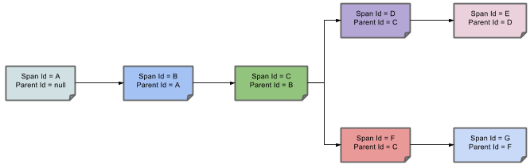

# Spring Cloud Sleuth
&emsp;&emsp;Spring Cloud Sleuth为Spring Cloud实现了分布式跟踪解决方案

###### 相关术语
Span(跨度): 工作的基本单位。例如，发送RPC是一个新的跨度，就像发送响应到RPC一样。
Span是由一个唯一的64位ID来标识的，而另一个64位ID用于跟踪。
span还具有其他数据，如描述、时间戳事件、键值标注(标记)、导致它们的span的ID和进程ID(通常是IP地址)

可以启动和停止跨度，并跟踪其时间信息。 创建跨度后，必须在将来的某个时刻停止它。

    启动跟踪的初始范围称为根跨度。 该范围的ID值等于跟踪ID。
    
Trace(痕迹):  一组span形成树状结构。 例如，如果运行分布式大数据存储，则可能由PUT请求形成跟踪

Annotation(注解): 用于及时记录存在的事件。常用的Annotation如下
* cs(client send)：客户已发送。客户提出了请求。此注释表示Span的开始
* sr(Server Received)：服务器收到;服务器端获得请求并开始处理它。从此时间戳中减去cs时间戳会显示网络延迟
* ss(server send)：服务器已发送;在完成请求处理时（当响应被发送回客户端时）注释。从此时间戳中减去sr时间戳会显示服务器端处理请求所需的时间
* cr(client received)：客户收到了;表示跨度的结束。客户端已成功收到服务器端的响应。从此时间戳中减去cs时间戳会显示客户端从服务器接收响应所需的全部时间。

下图显示了Span和Trace在系统中的外观以及Zipkin注释：


注释的每种颜色表示跨度（有七个跨度 - 从A到G）。 请考虑以下注释：

```
Trace Id = X
Span Id = D
Client Sent
```
此注释表示当前跨度的Trace Id设置为X，Span Id设置为D.此外，还发生了Client Sent事件。

下图显示了跨度的父子关系：




#### 为项目添加Sleuth
&emsp;&emsp;有两种模式第一种是只有Sleuth。另一种是with Zipkin via HTTP

######  Only Sleuth (log correlation)

```xml
<dependencyManagement>
      <dependencies>
          <dependency>
              <groupId>org.springframework.cloud</groupId>
              <artifactId>spring-cloud-dependencies</artifactId>
              <version>${release.train.version}</version>
              <type>pom</type>
              <scope>import</scope>
          </dependency>
      </dependencies>
</dependencyManagement>

<dependency>
    <groupId>org.springframework.cloud</groupId>
    <artifactId>spring-cloud-starter-sleuth</artifactId>
</dependency>
```
	
1. We recommend that you add the dependency management through the Spring BOM so that you need not manage versions yourself.
2. Add the dependency to spring-cloud-starter-sleuth.

######  Sleuth with Zipkin via HTTP

```xml
<dependencyManagement>
      <dependencies>
          <dependency>
              <groupId>org.springframework.cloud</groupId>
              <artifactId>spring-cloud-dependencies</artifactId>
              <version>${release.train.version}</version>
              <type>pom</type>
              <scope>import</scope>
          </dependency>
      </dependencies>
</dependencyManagement>

<dependency> 
    <groupId>org.springframework.cloud</groupId>
    <artifactId>spring-cloud-starter-zipkin</artifactId>
</dependency>
```

1. We recommend that you add the dependency management through the Spring BOM so that you need not manage versions yourself.

2. Add the dependency to spring-cloud-starter-zipkin.


