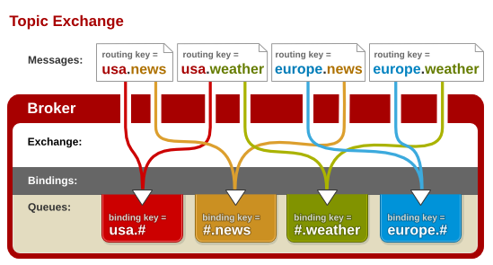

# Spring Cloud Stream

&emsp;&emsp;SpringCloud Stream是SpringCloud对于消息中间件的进一步封装，它简化了开发人员对于消息队列的操作。
目前仅支持RabbitMQ与Kafka。

###### 相关注释
* @input: 设置输入信道名称。不设置参数，通道名称就默认为方法名
* @output: 设置输出信道名称。不设置参数，通道名称就默认为方法名。
* @StreamListener: 设置监听信道，用于接受来自消息队列的消息
* @SendTo: 配合@StreamListener使用，在收到信息后发送反馈信息
* @EnableBinding: 注解用于绑定一个或者多个接口作为参数

###### 预设类

* Sink: stream中接受消息的接口;默认input通道
* Source: stream中输出消息的接口;默认output通道
* Processor: stream中绑定输入输出的接口，主要用来讲发布者和订阅者绑定到一起

###### 配置文件参数
```properties
#group 指的是queues中input.后面的.本来是随机生成.同一个组只会收到一份消息
spring.cloud.stream.bindings.<channelName>.group
#对于RabbitMQ，destination 对应的是exchange，默认是通道的名字，group对应的是queue（带有前缀）。
# 对于kafka，destination 对应的是Topic，group就是对应的消费group。
spring.cloud.stream.bindings.<channelName>.destination
```
&emsp;&emsp;配置中<channelName>值的是通道的名字;比如默认类*Sink*的通道名字是input

###### 通道配置

@Output对MessageChannel
@Input对应SubscribableChannel 


###### 默认属性
&emsp;&emsp;stream生成的exchang默认是topic模式。就是按照前缀匹配，发送消息给对应的队列。


```
* (星号): 可以（只能）匹配一个单词
# (井号): 可以匹配多个单词（或者零个）
fanout: 广播模式，发送到所有的队列
direct:直传。完全匹配routingKey的队列可以收到消息。
```

