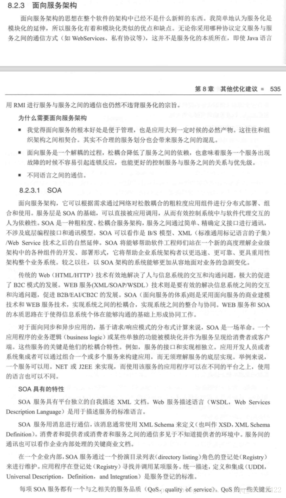
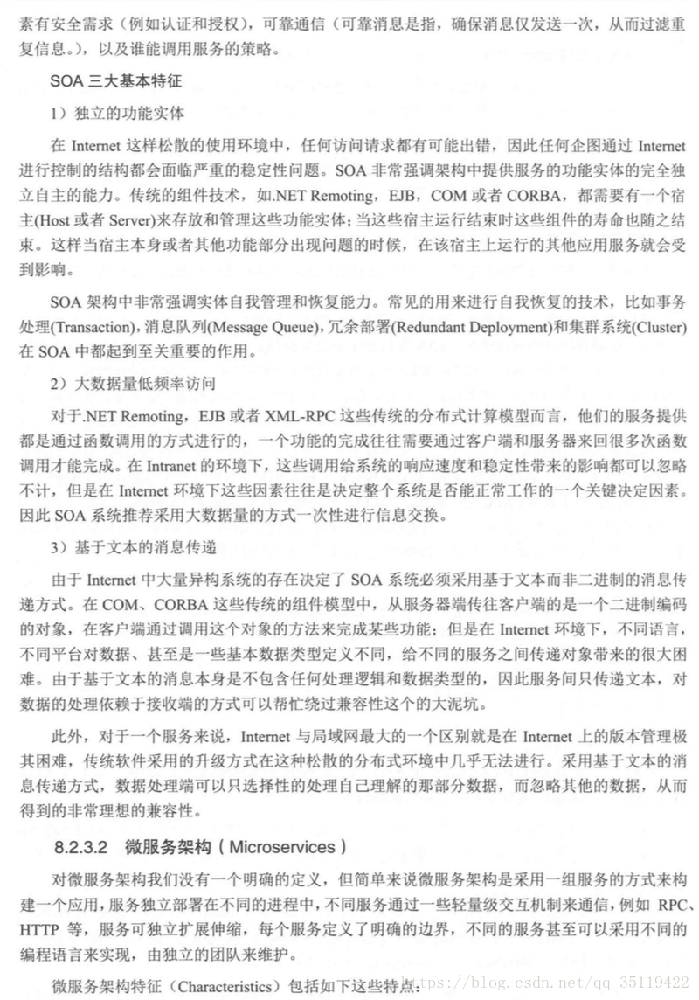
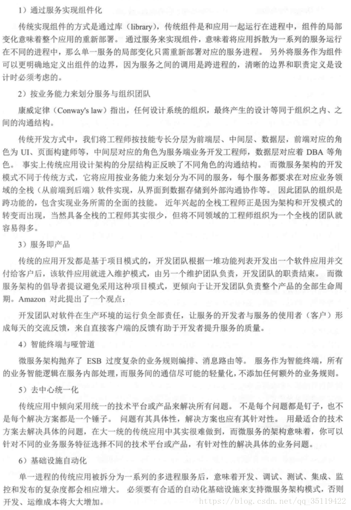
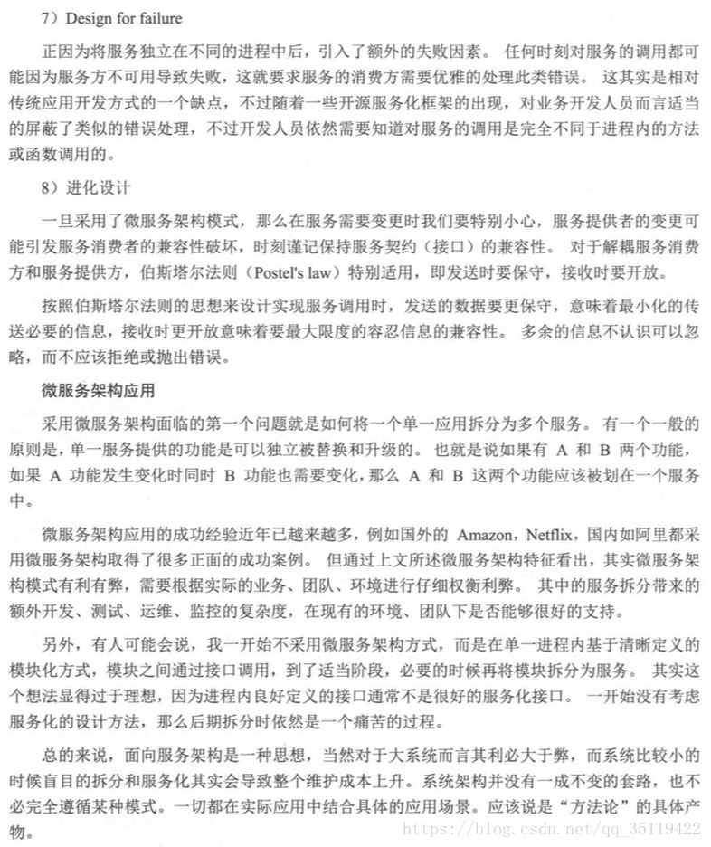

# 微服务与SOA区别

SOA（面向服务的架构）：面向服务的架构（SOA）是一个组件模型，它将应用程序的不同功能单元（称为服务）通过这些服务之间定义良好的接口和契约联系起来。接口是采用中立的方式进行定义的，它应该独立于实现服务的硬件平台、操作系统和编程语言。这使得构建在各种各样的系统中的服务可以以一种统一和通用的方式进行交互。

微服务：微服务架构是一种将单个应用程序作为一套小型服务开发的方法，每种应用程序都在自己的进程中运行，并与轻量级机制（通常是HTTP资源API）进行通信。这些服务是围绕业务功能构建的，可以通过全自动部署机制独立部署。这些服务的集中管理最少，可以用不同的编程语言编写，并使用不同的数据存储技术。

SOA和微服务的主要区别：

         微服务剔除SOA中复杂的ESB企业服务总线，所有的业务智能逻辑在服务内部处理，使用Http（Rest API）进行轻量化通讯
         SOA强调按水平架构划分为：前、后端、数据库、测试等，微服务强调按垂直架构划分，按业务能力划分，每个服务完成一种特定的功能，服务即产品
         SOA将组件以library的方式和应用部署在同一个进程中运行，微服务则是各个服务独立运行。
         传统应用倾向于使用统一的技术平台来解决所有问题，微服务可以针对不同业务特征选择不同技术平台，去中心统一化，发挥各种技术平台的特长。
         SOA架构强调的是异构系统之间的通信和解耦合；（一种粗粒度、松耦合的服务架构）
         微服务架构强调的是系统按业务边界做细粒度的拆分和部署。
微服务的具体特点：

（1）      独立部署，灵活扩展

      传统的单体架构是以整个系统为单位进行部署，而微服务则是以每一个独立组件（如用户服务、商品服务等）为单位进行部署。

（2）      资源的有效隔离

      微服务设计原则之一，就是每一个微服务拥有独立的数据源，假如微服务A想要读写微服务B的数据库，只能调用微服务B对外暴露的接口来完成。这样有效的避免了服务之间争用数据库和缓存资源所带来的问题。

同时，由于每一个微服务实例在Docker容器上运行，实现了服务器资源（内存、CPU资源等）的有效隔离。

（3）      团队组织架构的调整

       微服务设计的思想也改变了原有的企业研发团队组织架构。传统的研发组织架构是水平架构，前端、后端、DBA、测试分别有自己对应的团队，属于水平团队组织架构。而微服务的设计思想对团队的划分有着一定的影响，使得团队组织架构的划分更倾向于垂直架构，比如用户业务是一个团队来负责，支付业务是一个团队来负责。但实际上在企业中并不会把团队组织架构拆分得这么绝对，垂直架构只是一种理想的架构。

微服务架构的不足之处：

（1）      微服务把原有的项目拆分成多个独立工程，增加了开发、测试、运维、监控等的复杂度。

（2）      微服务架构需要保证不同服务之间的数据一致性，引入了分布式事务和异步补偿机制，为设计和开发带来一定挑战。

   所以微服务适用于复杂的大系统，小应用盲目的拆分只会增加其维护和开发成本...
   
   

