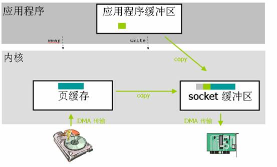
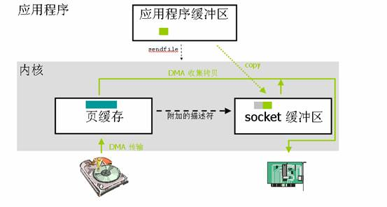
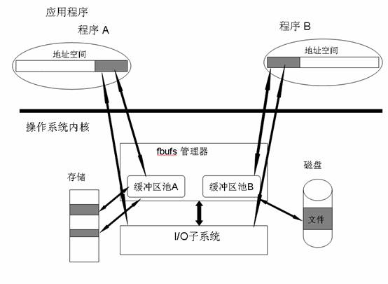

# Linux中的零拷贝技术

## 引言

传统的 Linux 操作系统的标准 I/O 接口是基于数据拷贝操作的，即 I/O 操作会导致数据在操作系统内核地址空间的缓冲区和应用程序地址空间定义的缓冲区之间进行传输。这样做最大的好处是可以减少磁盘 I/O 的操作，因为如果所请求的数据已经存放在操作系统的高速缓冲存储器中，那么就不需要再进行实际的物理磁盘 I/O 操作。但是数据传输过程中的数据拷贝操作却导致了极大的 CPU 开销，限制了操作系统有效进行数据传输操作的能力。

零拷贝（ zero-copy ）这种技术可以有效地改善数据传输的性能，在内核驱动程序（比如网络堆栈或者磁盘存储驱动程序）处理 I/O 数据的时候，零拷贝技术可以在某种程度上减少甚至完全避免不必要 CPU 数据拷贝操作。现代的 CPU 和存储体系结构提供了很多特征可以有效地实现零拷贝技术，但是因为存储体系结构非常复杂，而且网络协议栈有时需要对数据进行必要的处理，所以零拷贝技术有可能会产生很多负面的影响，甚至会导致零拷贝技术自身的优点完全丧失。

## 为什么需要零拷贝技术

如今，很多网络服务器都是基于客户端 - 服务器这一模型的。在这种模型中，客户端向服务器端请求数据或者服务；服务器端则需要响应客户端发出的请求，并为客户端提供它所需要的数据。随着网络服务的逐渐普及，video 这类应用程序发展迅速。当今的计算机系统已经具备足够的能力去处理 video 这类应用程序对客户端所造成的重负荷，但是对于服务器端来说，它应付由 video 这类应用程序引起的网络通信量就显得捉襟见肘了。而且，客户端的数量增长迅速，那么服务器端就更容易成为性能瓶颈。而对于负荷很重的服务器来说，操作系统通常都是引起性能瓶颈的罪魁祸首。举个例子来说，当数据“写”操作或者数据“发送”操作的系统调用发出时，操作系统通常都会将数据从应用程序地址空间的缓冲区拷贝到操作系统内核的缓冲区中去。操作系统这样做的好处是接口简单，但是却在很大程度上损失了系统性能，因为这种数据拷贝操作不单需要占用 CPU 时间片，同时也需要占用额外的内存带宽。

一般来说，客户端通过网络接口卡向服务器端发送请求，操作系统将这些客户端的请求传递给服务器端应用程序，服务器端应用程序会处理这些请求，请求处理完成以后，操作系统还需要将处理得到的结果通过网络适配器传递回去。

下边这一小节会跟读者简单介绍一下传统的服务器是如何进行数据传输的，以及这种数据传输的处理过程存在哪些问题有可能会造成服务器的性能损失。

## Linux中传统服务器进行数据传输的流程

Linux 　中传统的 I/O 操作是一种缓冲 I/O，I/O 过程中产生的数据传输通常需要在缓冲区中进行多次的拷贝操作。一般来说，在传输数据的时候，用户应用程序需要分配一块大小合适的缓冲区用来存放需要传输的数据。应用程序从文件中读取一块数据，然后把这块数据通过网络发送到接收端去。用户应用程序只是需要调用两个系统调用 read() 和 write() 就可以完成这个数据传输操作，应用程序并不知晓在这个数据传输的过程中操作系统所做的数据拷贝操作。对于 Linux 操作系统来说，基于数据排序或者校验等各方面因素的考虑，操作系统内核会在处理数据传输的过程中进行多次拷贝操作。在某些情况下，这些数据拷贝操作会极大地降低数据传输的性能。

当应用程序需要访问某块数据的时候，操作系统内核会先检查这块数据是不是因为前一次对相同文件的访问而已经被存放在操作系统内核地址空间的缓冲区内，如果在内核缓冲区中找不到这块数据，Linux 操作系统内核会先将这块数据从磁盘读出来放到操作系统内核的缓冲区里去。如果这个数据读取操作是由 DMA 完成的，那么在 DMA 进行数据读取的这一过程中，CPU 只是需要进行缓冲区管理，以及创建和处理 DMA ，除此之外，CPU 不需要再做更多的事情，DMA 执行完数据读取操作之后，会通知操作系统做进一步的处理。Linux 操作系统会根据 read() 系统调用指定的应用程序地址空间的地址，把这块数据存放到请求这块数据的应用程序的地址空间中去，在接下来的处理过程中，操作系统需要将数据再一次从用户应用程序地址空间的缓冲区拷贝到与网络堆栈相关的内核缓冲区中去，这个过程也是需要占用 CPU 的。数据拷贝操作结束以后，数据会被打包，然后发送到网络接口卡上去。在数据传输的过程中，应用程序可以先返回进而执行其他的操作。之后，在调用 write() 系统调用的时候，用户应用程序缓冲区中的数据内容可以被安全的丢弃或者更改，因为操作系统已经在内核缓冲区中保留了一份数据拷贝，当数据被成功传送到硬件上之后，这份数据拷贝就可以被丢弃。

从上面的描述可以看出，在这种传统的数据传输过程中，数据至少发生了四次拷贝操作，即便是使用了 DMA 来进行与硬件的通讯，CPU 仍然需要访问数据两次。在 read() 读数据的过程中，数据并不是直接来自于硬盘，而是必须先经过操作系统的文件系统层。在 write() 写数据的过程中，为了和要传输的数据包的大小相吻合，数据必须要先被分割成块，而且还要预先考虑包头，并且要进行数据校验和操作。


## 什么是零拷贝？

简单一点来说，零拷贝就是一种避免 CPU 将数据从一块存储拷贝到另外一块存储的技术。针对操作系统中的设备驱动程序、文件系统以及网络协议堆栈而出现的各种零拷贝技术极大地提升了特定应用程序的性能，并且使得这些应用程序可以更加有效地利用系统资源。这种性能的提升就是通过在数据拷贝进行的同时，允许 CPU 执行其他的任务来实现的。零拷贝技术可以减少数据拷贝和共享总线操作的次数，消除传输数据在存储器之间不必要的中间拷贝次数，从而有效地提高数据传输效率。而且，零拷贝技术减少了用户应用程序地址空间和操作系统内核地址空间之间因为上下文切换而带来的开销。进行大量的数据拷贝操作其实是一件简单的任务，从操作系统的角度来说，如果 CPU 一直被占用着去执行这项简单的任务，那么这将会是很浪费资源的；如果有其他比较简单的系统部件可以代劳这件事情，从而使得 CPU 解脱出来可以做别的事情，那么系统资源的利用则会更加有效。综上所述，零拷贝技术的目标可以概括如下：

#### 避免数据拷贝

* 避免操作系统内核缓冲区之间进行数据拷贝操作。
* 避免操作系统内核和用户应用程序地址空间这两者之间进行数据拷贝操作。
* 用户应用程序可以避开操作系统直接访问硬件存储。
* 数据传输尽量让 DMA 来做。

#### 将多种操作结合在一起

* 避免不必要的系统调用和上下文切换。
* 需要拷贝的数据可以先被缓存起来。
* 对数据进行处理尽量让硬件来做。

前文提到过，对于高速网络来说，零拷贝技术是非常重要的。这是因为高速网络的网络链接能力与 CPU 的处理能力接近，甚至会超过 CPU 的处理能力。如果是这样的话，那么 CPU 就有可能需要花费几乎所有的时间去拷贝要传输的数据，而没有能力再去做别的事情，这就产生了性能瓶颈，限制了通讯速率，从而降低了网络链接的能力。一般来说，一个 CPU 时钟周期可以处理一位的数据。举例来说，一个 1 GHz 的处理器可以对 1Gbit/s 的网络链接进行传统的数据拷贝操作，但是如果是 10 Gbit/s 的网络，那么对于相同的处理器来说，零拷贝技术就变得非常重要了。对于超过 1 Gbit/s 的网络链接来说，零拷贝技术在超级计算机集群以及大型的商业数据中心中都有所应用。然而，随着信息技术的发展，1 Gbit/s，10 Gbit/s 以及 100 Gbit/s 的网络会越来越普及，那么零拷贝技术也会变得越来越普及，这是因为网络链接的处理能力比 CPU 的处理能力的增长要快得多。传统的数据拷贝受限于传统的操作系统或者通信协议，这就限制了数据传输性能。零拷贝技术通过减少数据拷贝次数，简化协议处理的层次，在应用程序和网络之间提供更快的数据传输方法，从而可以有效地降低通信延迟，提高网络吞吐率。零拷贝技术是实现主机或者路由器等设备高速网络接口的主要技术之一。

现代的 CPU 和存储体系结构提供了很多相关的功能来减少或避免 I/O 操作过程中产生的不必要的 CPU 数据拷贝操作，但是，CPU 和存储体系结构的这种优势经常被过高估计。存储体系结构的复杂性以及网络协议中必需的数据传输可能会产生问题，有时甚至会导致零拷贝这种技术的优点完全丧失。在下一章中，我们会介绍几种 Linux 操作系统中出现的零拷贝技术，简单描述一下它们的实现方法，并对它们的弱点进行分析。

## 零拷贝技术分类

零拷贝技术的发展很多样化，现有的零拷贝技术种类也非常多，而当前并没有一个适合于所有场景的零拷贝技术的出现。对于 Linux 来说，现存的零拷贝技术也比较多，这些零拷贝技术大部分存在于不同的 Linux 内核版本，有些旧的技术在不同的 Linux 内核版本间得到了很大的发展或者已经渐渐被新的技术所代替。本文针对这些零拷贝技术所适用的不同场景对它们进行了划分。概括起来，Linux 中的零拷贝技术主要有下面这几种：

* 直接 I/O：对于这种数据传输方式来说，应用程序可以直接访问硬件存储，操作系统内核只是辅助数据传输：这类零拷贝技术针对的是操作系统内核并不需要对数据进行直接处理的情况，数据可以在应用程序地址空间的缓冲区和磁盘之间直接进行传输，完全不需要 Linux 操作系统内核提供的页缓存的支持。
* 在数据传输的过程中，避免数据在操作系统内核地址空间的缓冲区和用户应用程序地址空间的缓冲区之间进行拷贝。有的时候，应用程序在数据进行传输的过程中不需要对数据进行访问，那么，将数据从 Linux 的页缓存拷贝到用户进程的缓冲区中就可以完全避免，传输的数据在页缓存中就可以得到处理。在某些特殊的情况下，这种零拷贝技术可以获得较好的性能。Linux 中提供类似的系统调用主要有 mmap()，sendfile() 以及 splice()。
* 对数据在 Linux 的页缓存和用户进程的缓冲区之间的传输过程进行优化。该零拷贝技术侧重于灵活地处理数据在用户进程的缓冲区和操作系统的页缓存之间的拷贝操作。这种方法延续了传统的通信方式，但是更加灵活。在　 Linux 　中，该方法主要利用了写时复制技术。

前两类方法的目的主要是为了避免应用程序地址空间和操作系统内核地址空间这两者之间的缓冲区拷贝操作。这两类零拷贝技术通常适用在某些特殊的情况下，比如要传送的数据不需要经过操作系统内核的处理或者不需要经过应用程序的处理。第三类方法则继承了传统的应用程序地址空间和操作系统内核地址空间之间数据传输的概念，进而针对数据传输本身进行优化。我们知道，硬件和软件之间的数据传输可以通过使用 DMA 来进行，DMA 　进行数据传输的过程中几乎不需要　 CPU 　参与，这样就可以把 CPU 解放出来去做更多其他的事情，但是当数据需要在用户地址空间的缓冲区和　 Linux 　操作系统内核的页缓存之间进行传输的时候，并没有类似　 DMA 　这种工具可以使用，CPU 　需要全程参与到这种数据拷贝操作中，所以这第三类方法的目的是可以有效地改善数据在用户地址空间和操作系统内核地址空间之间传递的效率。

#### Linux 中的直接 I/O

如果应用程序可以直接访问网络接口存储，那么在应用程序访问数据之前存储总线就不需要被遍历，数据传输所引起的开销将会是最小的。应用程序或者运行在用户模式下的库函数可以直接访问硬件设备的存储，操作系统内核除了进行必要的虚拟存储配置工作之外，不参与数据传输过程中的其它任何事情。直接 I/O 使得数据可以直接在应用程序和外围设备之间进行传输，完全不需要操作系统内核页缓存的支持。关于直接 I/O 技术的具体实现细节可以参看 developerWorks 上的另一篇文章”Linux 中直接 I/O 机制的介绍” ，本文不做过多描述。


#### 针对数据传输不需要经过应用程序地址空间的零拷贝技术

###### 利用 mmap()

在 Linux 中，减少拷贝次数的一种方法是调用 mmap() 来代替调用 read，比如：

```
tmp_buf = mmap(file, len); 
write(socket, tmp_buf, len);
```

首先，应用程序调用了 mmap() 之后，数据会先通过 DMA 拷贝到操作系统内核的缓冲区中去。接着，应用程序跟操作系统共享这个缓冲区，这样，操作系统内核和应用程序存储空间就不需要再进行任何的数据拷贝操作。应用程序调用了 write() 之后，操作系统内核将数据从原来的内核缓冲区中拷贝到与 socket 相关的内核缓冲区中。接下来，数据从内核 socket 缓冲区拷贝到协议引擎中去，这是第三次数据拷贝操作。



通过使用 mmap() 来代替 read(), 已经可以减半操作系统需要进行数据拷贝的次数。当大量数据需要传输的时候，这样做就会有一个比较好的效率。但是，这种改进也是需要代价的，使用 mma()p 其实是存在潜在的问题的。当对文件进行了内存映射，然后调用 write() 系统调用，如果此时其他的进程截断了这个文件，那么 write() 系统调用将会被总线错误信号 SIGBUS 中断，因为此时正在执行的是一个错误的存储访问。这个信号将会导致进程被杀死，解决这个问题可以通过以下这两种方法：

* 为 SIGBUS 安装一个新的信号处理器，这样，write() 系统调用在它被中断之前就返回已经写入的字节数目，errno 会被设置成 success。但是这种方法也有其缺点，它不能反映出产生这个问题的根源所在，因为 BIGBUS 信号只是显示某进程发生了一些很严重的错误。
* 第二种方法是通过文件租借锁来解决这个问题的，这种方法相对来说更好一些。我们可以通过内核对文件加读或者写的租借锁，当另外一个进程尝试对用户正在进行传输的文件进行截断的时候，内核会发送给用户一个实时信号：RT_SIGNAL_LEASE 信号，这个信号会告诉用户内核破坏了用户加在那个文件上的写或者读租借锁，那么 write() 系统调用则会被中断，并且进程会被 SIGBUS 信号杀死，返回值则是中断前写的字节数，errno 也会被设置为 success。文件租借锁需要在对文件进行内存映射之前设置。

使用 mmap 是 POSIX 兼容的，但是使用 mmap 并不一定能获得理想的数据传输性能。数据传输的过程中仍然需要一次 CPU 拷贝操作，而且映射操作也是一个开销很大的虚拟存储操作，这种操作需要通过更改页表以及冲刷 TLB （使得 TLB 的内容无效）来维持存储的一致性。但是，因为映射通常适用于较大范围，所以对于相同长度的数据来说，映射所带来的开销远远低于 CPU 拷贝所带来的开销。


###### sendfile()

为了简化用户接口，同时还要继续保留 mmap()/write() 技术的优点：减少 CPU 的拷贝次数，Linux 在版本 2.1 中引入了 sendfile() 这个系统调用。

sendfile() 不仅减少了数据拷贝操作，它也减少了上下文切换。首先：sendfile() 系统调用利用 DMA 引擎将文件中的数据拷贝到操作系统内核缓冲区中，然后数据被拷贝到与 socket 相关的内核缓冲区中去。接下来，DMA 引擎将数据从内核 socket 缓冲区中拷贝到协议引擎中去。如果在用户调用 sendfile () 系统调用进行数据传输的过程中有其他进程截断了该文件，那么 sendfile () 系统调用会简单地返回给用户应用程序中断前所传输的字节数，errno 会被设置为 success。如果在调用 sendfile() 之前操作系统对文件加上了租借锁，那么 sendfile() 的操作和返回状态将会和 mmap()/write () 一样。


sendfile() 系统调用不需要将数据拷贝或者映射到应用程序地址空间中去，所以 sendfile() 只是适用于应用程序地址空间不需要对所访问数据进行处理的情况。相对于 mmap() 方法来说，因为 sendfile 传输的数据没有越过用户应用程序 / 操作系统内核的边界线，所以 sendfile () 也极大地减少了存储管理的开销。但是，sendfile () 也有很多局限性，如下所列：

* sendfile() 局限于基于文件服务的网络应用程序，比如 web 服务器。据说，在 Linux 内核中实现 sendfile() 只是为了在其他平台上使用 sendfile() 的 Apache 程序。
* 由于网络传输具有异步性，很难在 sendfile () 系统调用的接收端进行配对的实现方式，所以数据传输的接收端一般没有用到这种技术。
* 基于性能的考虑来说，sendfile () 仍然需要有一次从文件到 socket 缓冲区的 CPU 拷贝操作，这就导致页缓存有可能会被传输的数据所污染。

###### 带有 DMA 收集拷贝功能的 sendfile()

上小节介绍的 sendfile() 技术在进行数据传输仍然还需要一次多余的数据拷贝操作，通过引入一点硬件上的帮助，这仅有的一次数据拷贝操作也可以避免。为了避免操作系统内核造成的数据副本，需要用到一个支持收集操作的网络接口，这也就是说，待传输的数据可以分散在存储的不同位置上，而不需要在连续存储中存放。这样一来，从文件中读出的数据就根本不需要被拷贝到 socket 缓冲区中去，而只是需要将缓冲区描述符传到网络协议栈中去，之后其在缓冲区中建立起数据包的相关结构，然后通过 DMA 收集拷贝功能将所有的数据结合成一个网络数据包。网卡的 DMA 引擎会在一次操作中从多个位置读取包头和数据。Linux 2.4 版本中的 socket 缓冲区就可以满足这种条件，这也就是用于 Linux 中的众所周知的零拷贝技术，这种方法不但减少了因为多次上下文切换所带来开销，同时也减少了处理器造成的数据副本的个数。对于用户应用程序来说，代码没有任何改变。首先，sendfile() 系统调用利用 DMA 引擎将文件内容拷贝到内核缓冲区去；然后，将带有文件位置和长度信息的缓冲区描述符添加到 socket 缓冲区中去，此过程不需要将数据从操作系统内核缓冲区拷贝到 socket 缓冲区中，DMA 引擎会将数据直接从内核缓冲区拷贝到协议引擎中去，这样就避免了最后一次数据拷贝。



通过这种方法，CPU 在数据传输的过程中不但避免了数据拷贝操作，理论上，CPU 也永远不会跟传输的数据有任何关联，这对于 CPU 的性能来说起到了积极的作用：首先，高速缓冲存储器没有受到污染；其次，高速缓冲存储器的一致性不需要维护，高速缓冲存储器在 DMA 进行数据传输前或者传输后不需要被刷新。然而实际上，后者实现起来非常困难。源缓冲区有可能是页缓存的一部分，这也就是说一般的读操作可以访问它，而且该访问也可以是通过传统方式进行的。只要存储区域可以被 CPU 访问到，那么高速缓冲存储器的一致性就需要通过 DMA 传输之前冲刷新高速缓冲存储器来维护。而且，这种数据收集拷贝功能的实现是需要硬件以及设备驱动程序支持的。

###### splice()

splice() 是　 Linux 　中与 mmap() 和　 sendfile() 类似的一种方法。它也可以用于用户应用程序地址空间和操作系统地址空间之间的数据传输。splice() 适用于可以确定数据传输路径的用户应用程序，它不需要利用用户地址空间的缓冲区进行显式的数据传输操作。那么，当数据只是从一个地方传送到另一个地方，过程中所传输的数据不需要经过用户应用程序的处理的时候，spice() 就成为了一种比较好的选择。splice() 可以在操作系统地址空间中整块地移动数据，从而减少大多数数据拷贝操作。而且，splice() 进行数据传输可以通过异步的方式来进行，用户应用程序可以先从系统调用返回，而操作系统内核进程会控制数据传输过程继续进行下去。splice() 可以被看成是类似于基于流的管道的实现，管道可以使得两个文件描述符相互连接，splice 的调用者则可以控制两个设备（或者协议栈）在操作系统内核中的相互连接。

splice() 系统调用和 sendfile() 非常类似，用户应用程序必须拥有两个已经打开的文件描述符，一个用于表示输入设备，一个用于表示输出设备。与 sendfile() 不同的是，splice() 允许任意两个文件之间互相连接，而并不只是文件到 socket 进行数据传输。对于从一个文件描述符发送数据到 socket 这种特例来说，一直都是使用 sendfile() 这个系统调用，而 splice 一直以来就只是一种机制，它并不仅限于 sendfile() 的功能。也就是说，sendfile() 只是 splice() 的一个子集，在 Linux 2.6.23 中，sendfile() 这种机制的实现已经没有了，但是这个 API 以及相应的功能还存在，只不过 API 以及相应的功能是利用了 splice() 这种机制来实现的。

在数据传输的过程中，splice() 机制交替地发送相关的文件描述符的读写操作，并且可以将读缓冲区重新用于写操作。它也利用了一种简单的流控制，通过预先定义的水印（ watermark ）来阻塞写请求。有实验表明，利用这种方法将数据从一个磁盘传输到另一个磁盘会增加 30% 到 70% 的吞吐量，数据传输的过程中， CPU 的负载也会减少一半。

Linux 2.6.17 内核引入了 splice() 系统调用，但是，这个概念在此之前 ] 其实已经存在了很长一段时间了。1988 年，Larry McVoy 提出了这个概念，它被看成是一种改进服务器端系统的 I/O 性能的一种技术，尽管在之后的若干年中经常被提及，但是 splice 系统调用从来没有在主流的 Linux 操作系统内核中实现过，一直到 Linux 2.6.17 版本的出现。splice 系统调用需要用到四个参数，其中两个是文件描述符，一个表示文件长度，还有一个用于控制如何进行数据拷贝。splice 系统调用可以同步实现，也可以使用异步方式来实现。在使用异步方式的时候，用户应用程序会通过信号 SIGIO 来获知数据传输已经终止。splice() 系统调用的接口如下所示：

```
long splice(int fdin, int fdout, size_t len, unsigned int flags);
```

调用 splice() 系统调用会导致操作系统内核从数据源 fdin 移动最多 len 个字节的数据到 fdout 中去，这个数据的移动过程只是经过操作系统内核空间，需要最少的拷贝次数。使用 splice() 系统调用需要这两个文件描述符中的一个必须是用来表示一个管道设备的。不难看出，这种设计具有局限性，Linux 的后续版本针对这一问题将会有所改进。参数 flags 用于表示拷贝操作的执行方法，当前的 flags 有如下这些取值：

* SPLICE_F_NONBLOCK：splice 操作不会被阻塞。然而，如果文件描述符没有被设置为不可被阻塞方式的 I/O ，那么调用 splice 有可能仍然被阻塞。
* SPLICE_F_MORE：告知操作系统内核下一个 splice 系统调用将会有更多的数据传来。
* SPLICE_F_MOVE：如果输出是文件，这个值则会使得操作系统内核尝试从输入管道缓冲区直接将数据读入到输出地址空间，这个数据传输过程没有任何数据拷贝操作发生。

Splice() 系统调用利用了 Linux 提出的管道缓冲区（ pipe buffer ）机制，这就是为什么这个系统调用的两个文件描述符参数中至少有一个必须要指代管道设备的原因。为了支持 splice 这种机制，Linux 在用于设备和文件系统的 file_operations 结构中增加了下边这两个定义：

```
ssize_t (*splice_write)(struct inode *pipe, strucuct file *out, size_t len, unsigned int flags); 
ssize_t (*splice_read)(struct inode *in, strucuct file *pipe, size_t len, unsigned int flags);
```

这两个新的操作可以根据 flags 的设定在 pipe 和 in 或者 out 之间移动 len 个字节。Linux 文件系统已经实现了具有上述功能并且可以使用的操作，而且还实现了一个 generic_splice_sendpage() 函数用于和 socket 之间的接合。

#### 对应用程序地址空间和内核之间的数据传输进行优化的零拷贝技术

前面提到的几种零拷贝技术都是通过尽量避免用户应用程序和操作系统内核缓冲区之间的数据拷贝来实现的，使用上面那些零拷贝技术的应用程序通常都要局限于某些特殊的情况：要么不能在操作系统内核中处理数据，要么不能在用户地址空间中处理数据。而这一小节提出的零拷贝技术保留了传统在用户应用程序地址空间和操作系统内核地址空间之间传递数据的技术，但却在传输上进行优化。我们知道，数据在系统软件和硬件之间的传递可以通过 DMA 传输来提高效率，但是对于用户应用程序和操作系统之间进行数据传输这种情况来说，并没有类似的工具可以使用。本节介绍的技术就是针对这种情况提出来的。

###### 利用写时复制

在某些情况下，Linux 操作系统内核中的页缓存可能会被多个应用程序所共享，操作系统有可能会将用户应用程序地址空间缓冲区中的页面映射到操作系统内核地址空间中去。如果某个应用程序想要对这共享的数据调用　 write() 系统调用，那么它就可能破坏内核缓冲区中的共享数据，传统的 write() 系统调用并没有提供任何显示的加锁操作，Linux 中引入了写时复制这样一种技术用来保护数据。

**什么是写时复制**

写时复制是计算机编程中的一种优化策略，它的基本思想是这样的：如果有多个应用程序需要同时访问同一块数据，那么可以为这些应用程序分配指向这块数据的指针，在每一个应用程序看来，它们都拥有这块数据的一份数据拷贝，当其中一个应用程序需要对自己的这份数据拷贝进行修改的时候，就需要将数据真正地拷贝到该应用程序的地址空间中去，也就是说，该应用程序拥有了一份真正的私有数据拷贝，这样做是为了避免该应用程序对这块数据做的更改被其他应用程序看到。这个过程对于应用程序来说是透明的，如果应用程序永远不会对所访问的这块数据进行任何更改，那么就永远不需要将数据拷贝到应用程序自己的地址空间中去。这也是写时复制的最主要的优点。

写时复制的实现需要 MMU 的支持，MMU 需要知晓进程地址空间中哪些特殊的页面是只读的，当需要往这些页面中写数据的时候，MMU 就会发出一个异常给操作系统内核，操作系统内核就会分配新的物理存储空间，即将被写入数据的页面需要与新的物理存储位置相对应。

写时复制的最大好处就是可以节约内存。不过对于操作系统内核来说，写时复制增加了其处理过程的复杂性。    

**数据传输的实现及其局限性**

*数据发送端*

对于数据传输的发送端来说，实现相对来说是比较简单的，对与应用程序缓冲区相关的物理页面进行加锁，并将这些页面映射到操作系统内核的地址空间，并标识为“ write only ”。当系统调用返回的时候，用户应用程序和网络堆栈就都可以读取该缓冲区中的数据。在操作系统已经传送完所有的数据之后，应用程序就可以对这些数据进行写操作。如果应用程序尝试在数据传输完成之前对数据进行写操作，那么就会产生异常，这个时候操作系统就会将数据拷贝到应用程序自己的缓冲区中去，并且重置应用程序端的映射。数据传输完成之后，对加锁的页面进行解锁操作，并重置 COW 标识。

*数据接收端*

对于数据接收端来说，该技术的实现则需要处理复杂得多的情况。如果 read() 系统调用是在数据包到达之前发出的，并且应用程序是被阻塞的，那么 read() 系统调用就会告知操作系统接收到的数据包中的数据应该存放到什么地方去。在这种情况下，根本没有必要进行页面重映射，网络接口卡可以提供足够的支持让数据直接存入用户应用程序的缓冲区中去。如果数据接收是异步的，在 read() 系统调用发出之前，操作系统不知道该把数据写到哪里，因为它不知道用户应用程序缓冲区的位置，所以操作系统内核必须要先把数据存放到自己的缓冲区中去。

*局限性*

写时复制技术有可能会导致操作系统的处理开销很大．所有相关的缓冲区都必须要进行页对齐处理，并且使用的 MMU 页面一定要是整数个的。对于发送端来说，这不会造成什么问题。但是对于接收端来说，它需要有能力处理更加复杂的情况。首先，数据包的尺寸大小要合适，大小需要恰到好处能够覆盖一整页的数据，这就限制了那些 MTU 大小大于系统内存页的网络，比如 FDDI 和 ATM。其次，为了在没有任何中断的情况下将页面重映射到数据包的流，数据包中的数据部分必须占用整数个页面。对于异步接收数据的情况来说，为了将数据高效地移动到用户地址空间中去，可以使用这样一种方法：利用网络接口卡的支持，传来的数据包可以被分割成包头和数据两部分，数据被存放在一个单独的缓冲区内，虚拟存储系统然后就会将数据映射到用户地址空间缓冲区去。使用这种方法需要满足两个先决条件，也就是上面提到过的：一是应用程序缓冲区必须是页对齐的，并且在虚拟存储上是连续的；二是传来的数据有一页大小的时候才可以对数据包进行分割。事实上，这两个先决条件是很难满足的。如果应用程序缓冲区不是页对齐的，或者数据包的大小超过一个页，那么数据就需要被拷贝。对于数据发送端来说，就算数据在传输的过程中对于应用程序来说是写保护的，应用程序仍然需要避免使用这些忙缓冲区，这是因为写时拷贝操作所带来的开销是很大的。如果没有端到端这一级别的通知，那么应用程序很难会知道某缓冲区是否已经被释放还是仍然在被占用。

这种零拷贝技术比较适用于那种写时复制事件发生比较少的情况，因为写时复制事件所产生的开销要远远高于一次 CPU 拷贝所产生的开销。实际情况中，大多数应用程序通常都会多次重复使用相同的缓冲区，所以，一次使用完数据之后，不要从操作系统地址空间解除页面的映射，这样会提高效率。考虑到同样的页面可能会被再次访问，所以保留页面的映射可以节省管理开销，但是，这种映射保留不会减少由于页表往返移动和 TLB 冲刷所带来的开销，这是因为每次页面由于写时复制而进行加锁或者解锁的时候，页面的只读标志都要被更改。

###### 缓冲区共享

还有另外一种利用预先映射机制的共享缓冲区的方法也可以在应用程序地址空间和操作系统内核之间快速传输数据。采用缓冲区共享这种思想的架构最先在 Solaris 上实现，该架构使用了“ fbufs ”这个概念。这种方法需要修改 API。应用程序地址空间和操作系统内核地址空间之间的数据传递需要严格按照 fbufs 体系结构来实现，操作系统内核之间的通信也是严格按照 fbufs 体系结构来完成的。每一个应用程序都有一个缓冲区池，这个缓冲区池被同时映射到用户地址空间和内核地址空间，也可以在必要的时候才创建它们。通过完成一次虚拟存储操作来创建缓冲区，fbufs 可以有效地减少由存储一致性维护所引起的大多数性能问题。该技术在 Linux 中还停留在实验阶段。

**为什么要扩展 Linux I/O API**

传统的 Linux 输入输出接口，比如读和写系统调用，都是基于拷贝的，也就是说，数据需要在操作系统内核和应用程序定义的缓冲区之间进行拷贝。对于读系统调用来说，用户应用程序呈现给操作系统内核一个预先分配好的缓冲区，内核必须把读进来的数据放到这个缓冲区内。对于写系统调用来说，只要系统调用返回，用户应用程序就可以自由重新利用数据缓冲区。

为了支持上面这种机制，Linux 需要能够为每一个操作都进行建立和删除虚拟存储映射。这种页面重映射的机制依赖于机器配置、cache 体系结构、TLB 未命中处理所带来的开销以及处理器是单处理器还是多处理器等多种因素。如果能够避免处理 I/O 请求的时候虚拟存储 / TLB 操作所产生的开销，则会极大地提高 I/O 的性能。fbufs 就是这样一种机制。使用 fbufs 体系结构就可以避免虚拟存储操作。由数据显示，fbufs 这种结构在 DECStation™ 5000/200 这个单处理器工作站上会取得比上面提到的页面重映射方法好得多的性能。如果要使用 fbufs 这种体系结构，必须要扩展 Linux API，从而实现一种有效而且全面的零拷贝技术。

**快速缓冲区（ Fast Buffers ）原理介绍**

I/O 数据存放在一些被称作 fbufs 的缓冲区内，每一个这样的缓冲区都包含一个或者多个连续的虚拟存储页。应用程序访问 fbuf 是通过保护域来实现的，有如下这两种方式：

* 如果应用程序分配了 fbuf，那么应用程序就有访问该 fbuf 的权限
* 如果应用程序通过 IPC 接收到了 fbuf，那么应用程序对这个 fbuf 也有访问的权限

对于第一种情况来说，这个保护域被称作是 fbuf 的“ originator ”；对于后一种情况来说，这个保护域被称作是 fbuf 的“ receiver ”。

传统的 Linux I/O 接口支持数据在应用程序地址空间和操作系统内核之间交换，这种交换操作导致所有的数据都需要进行拷贝。如果采用 fbufs 这种方法，需要交换的是包含数据的缓冲区，这样就消除了多余的拷贝操作。应用程序将 fbuf 传递给操作系统内核，这样就能减少传统的 write 系统调用所产生的数据拷贝开销。同样的，应用程序通过 fbuf 来接收数据，这样也可以减少传统 read 系统调用所产生的数据拷贝开销。如下图所示：


I/O 子系统或者应用程序都可以通过 fbufs 管理器来分配 fbufs。一旦分配了 fbufs，这些 fbufs 就可以从程序传递到 I/O 子系统，或者从 I/O 子系统传递到程序。使用完后，这些 fbufs 会被释放回 fbufs 缓冲区池。

fbufs 在实现上有如下这些特性，如图 9 所示：

* fbuf 需要从 fbufs 缓冲区池里分配。每一个 fbuf 都存在一个所属对象，要么是应用程序，要么是操作系统内核。fbuf 可以在应用程序和操作系统之间进行传递，fbuf 使用完之后需要被释放回特定的 fbufs 缓冲区池，在 fbuf 传递的过程中它们需要携带关于 fbufs 缓冲区池的相关信息。
* 每一个 fbufs 缓冲区池都会和一个应用程序相关联，一个应用程序最多只能与一个 fbufs 缓冲区池相关联。应用程序只有资格访问它自己的缓冲区池。
* fbufs 不需要虚拟地址重映射，这是因为对于每个应用程序来说，它们可以重新使用相同的缓冲区集合。这样，虚拟存储转换的信息就可以被缓存起来，虚拟存储子系统方面的开销就可以消除。
* I/O 子系统（设备驱动程序，文件系统等）可以分配 fbufs，并将到达的数据直接放到这些 fbuf 里边。这样，缓冲区之间的拷贝操作就可以避免。



前面提到，这种方法需要修改 API，如果要使用 fbufs 体系结构，应用程序和 Linux 操作系统内核驱动程序都需要使用新的 API，如果应用程序要发送数据，那么它就要从缓冲区池里获取一个 fbuf，将数据填充进去，然后通过文件描述符将数据发送出去。接收到的 fbufs 可以被应用程序保留一段时间，之后，应用程序可以使用它继续发送其他的数据，或者还给缓冲区池。但是，在某些情况下，需要对数据包内的数据进行重新组装，那么通过 fbuf 接收到数据的应用程序就需要将数据拷贝到另外一个缓冲区内。再者，应用程序不能对当前正在被内核处理的数据进行修改，基于这一点，fbufs 体系结构引入了强制锁的概念以保证其实现。对于应用程序来说，如果 fbufs 已经被发送给操作系统内核，那么应用程序就不会再处理这些 fbufs。

**fbufs 存在的一些问题**

管理共享缓冲区池需要应用程序、网络软件、以及设备驱动程序之间的紧密合作。对于数据接收端来说，网络硬件必须要能够将到达的数据包利用 DMA 传输到由接收端分配的正确的存储缓冲区池中去。而且，应用程序稍微不注意就会更改之前发到共享存储中的数据的内容，从而导致数据被破坏，但是这种问题在应用程序端是很难调试的。同时，共享存储这种模型很难与其他类型的存储对象关联使用，但是应用程序、网络软件以及设备驱动程序之间的紧密合作是需要其他存储管理器的支持的。对于共享缓冲区这种技术来说，虽然这种技术看起来前景光明，但是这种技术不但需要对 API 进行更改，而且需要对驱动程序也进行更改，并且这种技术本身也存在一些未解决的问题，这就使得这种技术目前还只是出于试验阶段。在测试系统中，这种技术在性能上有很大的改进，不过这种新的架构的整体安装目前看起来还是不可行的。这种预先分配共享缓冲区的机制有时也因为粒度问题需要将数据拷贝到另外一个缓冲区中去。

## 总结

本系列文章介绍了 Linux 中的零拷贝技术，本文是其中的第二部分。本文对第一部分文章中提出的 Linux 操作系统上出现的几种零拷贝技术进行了更详细的介绍，主要描述了它们各自的优点，缺点以及适用场景。对于网络数据传输来说，零拷贝技术的应用受到了很多体系结构方面因素的阻碍，包括虚拟存储体系结构以及网络协议体系结构等。所以，零拷贝技术仍然只是在某些很特殊的情况中才可以应用，比如文件服务或者使用某种特殊的协议进行高带宽的通信等。但是，零拷贝技术在磁盘操作中的应用的可行性就高得多了，这很可能是因为磁盘操作具有同步的特点，以及数据传输单元是按照页的粒度来进行的。

针对 Linux 操作系统平台提出并实现了很多种零拷贝技术，但是并不是所有这些零拷贝技术都被广泛应用于现实中的操作系统中的。比如，fbufs 体系结构，它在很多方面看起来都很吸引人，但是使用它需要更改 API 以及驱动程序，它还存在其他一些实现上的困难，这就使得 fbufs 还只是停留在实验的阶段。动态地址重映射技术只是需要对操作系统做少量修改，虽然不需要修改用户软件，但是当前的虚拟存储体系结构并不能很好地支持频繁的虚拟地址重映射操作。而且为了保证存储的一致性，重映射之后还必须对 TLB 和一级缓存进行刷新。事实上，利用地址重映射实现的零拷贝技术适用的范围是很小的，这是因为虚拟存储操作所带来的开销往往要比 CPU 拷贝所产生的开销还要大。此外，为了完全消除 CPU 访问存储，通常都需要额外的硬件来支持，而这种硬件的支持并不是很普及，同时也是非常昂贵的。

本系列文章的目的是想帮助读者理清这些出现在 Linux 操作系统中的零拷贝技术都是从何种角度来帮助改善数据传输过程中遇到的性能问题的。关于各种零拷贝技术的具体实现细节，本系列文章没有做详细描述。同时，零拷贝技术一直是在不断地发展和完善当中的，本系列文章并没有涵盖 Linux 上出现的所有零拷贝技术。


## 相关主题
* Zero Copy I: User-Mode Perspective, Linux Journal (2003), http://www.linuxjournal.com/node/6345描述了几种 Linux 操作系统中存在的零拷贝技术。
* 在 http://www.ibm.com/developerworks/cn/aix/library/au-tcpsystemcalls/这篇文章中可以找到关于 TCP 系统调用序列的介绍。
* 关于 Linux 中直接 I/O 技术的设计与实现请参考 developerWorks 上的文章 ”Linux 中直接 I/O 机制的介绍”。
* http://lwn.net/Articles/28548/上可以找到 Linux 上零拷贝技术中关于用户地址空间访问技术的介绍。
* http://articles.techrepublic.com.com/5100-10878_11-1044112.html?tag=content;leftCol，这篇文章描述了如何利用 sendfile() 优化数据传输的介绍。
* 关于 splice() 系统调用的介绍，可以参考 http://lwn.net/Articles/178199/。
* http://en.scientificcommons.org/43480276这篇文章介绍了如何通过在操作系统内核中直接传输数据来提高 I/O 的性能以及 CPU 的可用性，并详细描述了 splice 系统调用如何在用户应用程序不参与的情况下进行异步数据传输。
* 在 Understanding the Linux Kernel(3rd Edition) 中，有关于 Linux 内核的实现。
* http://pages.cs.wisc.edu/~cao/cs736/slides/cs736-class18.ps这篇文章提出并详细介绍了 fbufs 这种用于 I/O 缓冲区管理的机制，以及基于共享存储的数据传输机制。
* http://www.cs.inf.ethz.ch/group/stricker/sada/archive/chihaia.pdf，这篇文章列举了一些 Linux 中出现的零拷贝技术，并在测试系统上实现了 fbufs 技术。