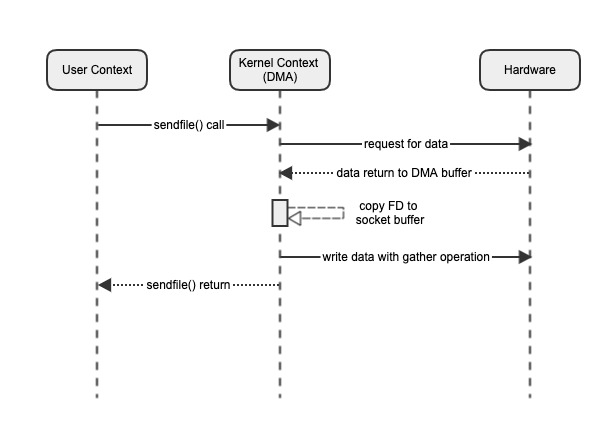
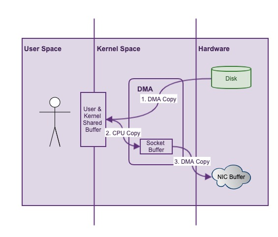

# 深入理解Linux, NIO和Netty中的零拷贝


## 零拷贝

Wikipedia上对零拷贝的解释如下：

> “Zero-copy” describes computer operations in which the CPU does not perform the task of copying data from one memory area to another. 
> This is frequently used to save CPU cycles and memory bandwidth when transmitting a file over a network.

> “零复制”描述了计算机操作，其中CPU不执行将数据从一个存储区域复制到另一个存储区域的任务。 通过网络传输文件时，通常用于节省CPU周期和内存带宽。

零拷贝防止了数据在内存中的复制，可以提升网络传输的性能。由此产生两个疑问：

1. 为什么会出现数据的复制？
2. 零拷贝真的是0次数据复制吗？

## Linux系统中的零拷贝

前篇文章[Linux中的零拷贝技术](../Chapter16/zerocopy.md)已经讲过Linux的零拷贝。这里复习下。

1. 内核空间：计算机内存被分为用户空间和内核空间。内核空间运行OS内核代码，并可以访问所有内存，机器指令和硬件资源，具有最高的权限。内核空间是属于操作系统的。不是cpu的硬件。
1. 用户空间：即内核以外的所有空间，用于正常用户进程运行。用户空间的进程无权访问内核空间，只能通过内核暴露的接口----系统调用(system calls)去访问内核的一小部分。如果用户进程请求执行系统调用，需要给内核发送系统中断(software interrupt)，内核会分派相应的中断处理器处理请求。
1. DMA：Direct Memory Access(DMA)是来应对CPU与硬盘之间速度量级不匹配的问题的，它允许某些硬件子系统访问独立于CPU的主内存。如果没有DMA，CPU进行IO操作的整个过程都是阻塞的，无法执行其他工作，这会使计算机陷入假死状态。
如果有DMA介入，IO过程变成这样：CPU启动DMA传输，期间它可以执行其他操作；DMA控制器(DMAC)在传输完成后，会给CPU发送中断信号，这时CPU便可以处理传输好的数据。

#### 传统的网络传输

网络IO的一个常见场景是，将文件从硬盘读取出来，并通过网卡发送至网络。以下是简单的伪代码：

```
// 从硬盘读取数据
File.read(fileDesc, buf, len);
// 发送数据到网络
Socket.write(socket, buf, len);
```

代码层面，这是一个非常简单的操作，但是深入到系统层面，我们来看看背后发生了什么：


由于用户空间无法直接访问文件系统，所以，这个场景涉及到了三个模块的交互：用户空间，内核空间和硬件。

1. 用户发起read()系统调用(syscall)，请求硬盘数据。此时，会发生一次上下文切换(context switch)。
2. DMA从硬盘读取文件，这时，产生一次复制：硬盘–>DMA缓冲区。
3. DMA将数据复制到用户空间，read()调用返回。此时，发生一次上下文切换以及一次数据复制：DMA缓冲区–>用户空间。
4. 用户发起write()系统调用，请求发送数据。此时发生一次上下文切换和一次数据复制：用户空间–>DMA缓冲区。
5. DMA将数据复制到网卡，以备网络发送。此时发生第四次数据复制：DMA缓冲区–>套接字缓冲区
6. write()调用返回，再次发生上下文切换。

数据流如下：


可以发现，其中共涉及到了4次上下文切换以及4次数据复制。对于单纯的网络文件发送，有很多不必要的开销。

#### sendfile传输

对于上述场景，我们发现从DMA缓冲到用户空间，和从用户空间到套接字缓冲的两次CPU复制是完全没必要的，零拷贝由此而生。针对这种情况，Linux内核提供了sendfile系统调用。
如果用sendfile()执行上述请求，系统流程可以简化如下：


sendfile()系统调用，可以实现数据在DMA内部的复制，而不需要将数据copy到用户空间。由此，上下文切换次数减为2次，数据复制次数减为3次。这已经实现了用户空间的零拷贝。

这里有一个问题：为什么DMA内部会出现一次复制(此次复制需要CPU参与)？这是因为，早期的网卡，要求被发送的数据在物理空间上是连续的，所以，需要有Socket Buffer。
但是如果网卡本身支持收集操作(scatter-gather)，即可以从不连续的内存地址聚集并发送数据，那么还可以进一步优化。

#### 网卡支持scatter-gather的sendfile传输

在Linux内核版本2.4之后对此做了优化，如果计算机网卡支持收集操作，sendfile()操作可以省去到Socket Buffer的数据复制，取而代之的是，直接将数据位置和长度的描述符(descriptors)，传递给Socket Buffer：



借由网卡的支持，上下文切换的次数为2次，数据复制的次数也降低为2次。而这两次的数据复制是必须的，也就是说，数据在内存中的复制已经完全避免。
对于从硬盘向网络发送文件的场景，如果网卡支持收集操作，那么sendfile()系统调用，真正意义上的做到了零拷贝

#### 内存映射(mmap)

对于“网络发送文件”的情况，用sendfile()系统调用可以极大地提高性能(据测试吞吐量可达传统方式的三倍)。但有一点不足的是，它只支持“读取->发送”这一“连贯操作”，所以，sendfile()一般用于处理一些静态网络资源，如果要对数据进行额外的操作，它无能为力。

内存映射(Memory mapping–mmap)对此提供了解决方案。mmap是一种内存映射文件的方法，它可以将一个文件映射到进程的地址空间，实现文件磁盘地址和进程虚拟地址空间中的虚拟地址的对应。如此一来，用户进程可以采用指针读写操作这一段内存，而内核空间对这段区域的修改也直接反映到用户空间。简而言之，mmap实现了用户空间和内核空间数据的共享。可以猜到，如果使用mmap系统调用，上文中所述场景的步骤如下：


用户发起mmap()系统调用，DMA直接将数据复制到用户空间和内核空间的共享虚拟内存，之后，用户便可以正常操作数据。期间进行了2次上下文切换，1次数据复制。接下来往网卡发送数据的流程，与前面一样采用write()系统调用。

数据流如下：



可以看到，相比于传统的方式，mmap省去了一次数据的复制，广义上也可以称之为零拷贝。与此同时，它还使得用户可以自定义地操作数据，这是相较于sendfile的优势所在。

不过，如果数据量很小(比如KB级别)，使用mmap的效率反而不如单纯的read系统调用高。这是因为mmap虽然避免了多余的复制，但是增加了OS维护此共享内存的成本。

## NIO中的零拷贝

从1.4版本开始，JDK引入了NIO，提供了对零拷贝的支持。由于JVM是运行在OS之上的，其功能只是对系统底层api的封装，如果OS本身不支持零拷贝(mmap/sendfile)，那JVM对此也无能为力。
JDK对零拷贝的封装，主要体现在FileChannel这个类上。

#### map()的签名如下：

```
public abstract class FileChannel
    extends AbstractInterruptibleChannel
    implements SeekableByteChannel, GatheringByteChannel, ScatteringByteChannel {

    public abstract MappedByteBuffer map(MapMode mode, long position, long size) throws IOException;
}
```

以下引自方法注释：

> Maps a region of this channel’s file directly into memory…For most operating systems, mapping a file into memory is more expensive than reading or writing a few tens of kilobytes of data via the usual read and write methods.
> From the standpoint of performance it is generally only worth mapping relatively large files into memory.

> 将此通道的文件区域直接映射到内存中...对于大多数操作系统，将文件映射到内存中比通过常规读写方法读取或写入几十KB数据要昂贵得多。 从性能的角度来看，通常仅需要将较大的文件映射到内存中。

map()方法可以直接将一个文件映射到内存中。来简单看看FileChannelImpl中方法的具体实现：

```
public class FileChannelImpl extends FileChannel {
    public MappedByteBuffer map(MapMode mode, long position, long size) throws IOException {
        ...
        synchronized (positionLock) {
             ...
            try {
                // 实际调用的是调用map0方法
                addr = map0(imode, mapPosition, mapSize);
            } catch (OutOfMemoryError x) {
                // An OutOfMemoryError may indicate that we've exhausted
                // memory so force gc and re-attempt map
                System.gc();
                ...
            }
        }
        ...
    }
    // Creates a new mapping
    private native long map0(int prot, long position, long length) throws IOException;
}

```

最终调用的是一个native的map0()方法。solaris版的方法的源码在FileChannelImpl.c中：

```
JNIEXPORT jlong JNICALL
Java_sun_nio_ch_FileChannelImpl_map0(JNIEnv *env, jobject this,
                                     jint prot, jlong off, jlong len)
{
    ...
    // 发现，内部果然是通过mmap系统调用来实现的
    mapAddress = mmap64(
        0,                    /* Let OS decide location */
        len,                  /* Number of bytes to map */
        protections,          /* File permissions */
        flags,                /* Changes are shared */
        fd,                   /* File descriptor of mapped file */
        off);                 /* Offset into file */

    if (mapAddress == MAP_FAILED) {
        if (errno == ENOMEM) {
            JNU_ThrowOutOfMemoryError(env, "Map failed");
            return IOS_THROWN;
        }
        return handle(env, -1, "Map failed");
    }

    return ((jlong) (unsigned long) mapAddress);
}

```

最终map()方法会返回一个MappedByteBuffer，熟悉NIO的同学估计对这个类不会陌生，大名鼎鼎的DirectByteBuffer便是它的子类。它引用了一块独立于JVM之外的内存，不受GC机制所管制，需要自己来管理创建与销毁的操作。

#### transferTo()方法

 mmap系统调用有了Java版的马甲，那sendfile呢？来看看FileChannel的transferTo()方法，签名如下：
 
```
public abstract class FileChannel
    extends AbstractInterruptibleChannel
    implements SeekableByteChannel, GatheringByteChannel, ScatteringByteChannel {

    public abstract long transferTo(long position, long count, WritableByteChannel target) throws IOException;
}

```

以下引自方法注释：

> Transfers bytes from this channel’s file to the given writable byte channel…
>  This method is potentially much more efficient than a simple loop that reads from this channel and writes to the target channel. 
> Many operating systems can transfer bytes directly from the filesystem cache to the target channel without actually copying them.

后半句其实隐式地说明了，如果操作系统支持“transfer without copying”，transferTo()方法就能做到相应的支持。来看看FileChannelImpl中方法的实现：

```
public long transferTo(long position, long count, WritableByteChannel target) throws IOException {
    ...
    // Attempt a direct transfer, if the kernel supports it
    // 如果内核支持，采用直接传送的方式
    if ((n = transferToDirectly(position, icount, target)) >= 0)
        return n;

    // Attempt a mapped transfer, but only to trusted channel types
    // 尝试使用mmap传送方式
    // 其实这里也用到了mmap，由于上面已经简要介绍过，故不再展开
    if ((n = transferToTrustedChannel(position, icount, target)) >= 0)
        return n;

    // Slow path for untrusted targets
    // 传统的传送方式
    return transferToArbitraryChannel(position, icount, target);
}

```

由注释可以看出来，sendfile()调用应该就发生在transferToDirectly()方法中，我们进去看看：

```
private long transferToDirectly(long position, int icount, WritableByteChannel target) throws IOException {
    if (!transferSupported)
        return IOStatus.UNSUPPORTED;
    // 一系列检查判断
    ...
    if (nd.transferToDirectlyNeedsPositionLock()) {
        synchronized (positionLock) {
            long pos = position();
            try {
                // 调用的是transferToDirectlyInternal()方法
                return transferToDirectlyInternal(position, icount, target, targetFD);
            } finally {
                position(pos);
            }
        }
    } else {
        // 调用的是transferToDirectlyInternal()方法
        return transferToDirectlyInternal(position, icount, target, targetFD);
    }
}

private long transferToDirectlyInternal(long position, int icount, WritableByteChannel target, FileDescriptor targetFD) throws IOException {
    try {
        begin();
        ti = threads.add();
        if (!isOpen())
            return -1;
        do {
            // 转到native方法transferTo0()
            n = transferTo0(fd, position, icount, targetFD);
        } while ((n == IOStatus.INTERRUPTED) && isOpen());
        ...
        return IOStatus.normalize(n);
    } finally {
        threads.remove(ti);
        end (n > -1);
    }
}

// Transfers from src to dst, or returns -2 if kernel can't do that
private native long transferTo0(FileDescriptor src, long position, long count, FileDescriptor dst);

```

可见，最终transferTo()方法还是需要委托给native的方法transferTo0()来完成调用，此方法的源码依然在FileChannelImpl.c中：

```
JNIEXPORT jlong JNICALL
Java_sun_nio_ch_FileChannelImpl_transferTo0(JNIEnv *env, jobject this,
                                            jobject srcFDO,
                                            jlong position, jlong count,
                                            jobject dstFDO)
{
    jint srcFD = fdval(env, srcFDO);
    jint dstFD = fdval(env, dstFDO);

#if defined(__linux__)
    off64_t offset = (off64_t)position;
    // 果然，内部确实是sendfile()系统调用
    jlong n = sendfile64(dstFD, srcFD, &offset, (size_t)count);
    ...
    return n;
#elif defined (__solaris__)
    sendfilevec64_t sfv;
    size_t numBytes = 0;
    jlong result;

    sfv.sfv_fd = srcFD;
    sfv.sfv_flag = 0;
    sfv.sfv_off = (off64_t)position;
    sfv.sfv_len = count;
    // 果然，内部确实是sendfile()系统调用
    result = sendfilev64(dstFD, &sfv, 1, &numBytes);

    /* Solaris sendfilev() will return -1 even if some bytes have been
     * transferred, so we check numBytes first.
     */
    ...
    return result;
...

```

果不其然，最终方法还是通过sendfile()系统调用来达到传输的目的。注意，由于sendfile()只适用于往Socket Buffer发送数据，所以，通过零拷贝技术来提升性能，只能用于网络发送数据的场景。
什么意思呢？如果单纯的用transferTo()把数据从硬盘上的一个文件写入到另一个文件中，是没有性能提升效果的，

#### SendFile and transferTo in Java

我正在使用CentOs内核版本2.6.32。我计划使用NIO在有和没有transferTo（sendFile）的情况下进行测试。我的测试是将1GB文件从一个目录复制到另一个目录。但是，由于使用transferTo（），我没有发现任何显着的性能改进。请让我知道文件到文件sendFile是否确实在Linux内核中有效或仅文件到套接字有效吗？我需要为sendFile启用任何功能吗？

```
 private static void doCopyNIO(String inFile, String outFile) {
        FileInputStream fis = null;
        FileOutputStream fos = null;
        FileChannel cis = null;
        FileChannel cos = null;

        long len = 0, pos = 0;

        try {
            fis = new FileInputStream(inFile);
            cis = fis.getChannel();
            fos = new FileOutputStream(outFile);
            cos = fos.getChannel();
            len = cis.size();
            /*while (pos < len) {
                pos += cis.transferTo(pos, (1024 * 1024 * 10), cos);    // 10M
            }*/
            cis.transferTo(0, len, cos);
            fos.flush();
        } catch (Exception e) {
            e.printStackTrace();
        } 
}
```
sendfile（）syscall将文件发送到套接字。splice（）syscall可以用于文件

#### Most efficient way to copy a file in Linux

我在与OS无关的文件管理器中工作，并且正在寻找为Linux复制文件的最有效方法。Windows有一个内置函数CopyFileEx（），但是据我所知，Linux没有这种标准函数。所以我想我必须实现自己的。
明显的方法是fopen / fread / fwrite，但是有没有更好（更快）的方法呢？我还必须有能力每隔一段时间停止一次，以便可以更新文件进度菜单的“到目前为止”。

不幸的是，您不能sendfile()在这里使用，因为目的地不是套接字。（名称sendfile()来自send()+“文件”）。

对于零复制，可以splice()按照@Dave的建议使用。（除非它不是零拷贝；它将是从源文件的页面缓存到目标文件的页面缓存的“一个副本”。）

但是...（a）splice()是特定于Linux的；（b）只要正确使用便携式接口，几乎可以肯定也可以做到。

简而言之，将open()+ read()+write()与一个小的临时缓冲区一起使用。我建议8K。因此，您的代码将如下所示：

```
int in_fd = open("source", O_RDONLY);
assert(in_fd >= 0);
int out_fd = open("dest", O_WRONLY);
assert(out_fd >= 0);
char buf[8192];

while (1) {
    ssize_t read_result = read(in_fd, &buf[0], sizeof(buf));
    if (!read_result) break;
    assert(read_result > 0);
    ssize_t write_result = write(out_fd, &buf[0], read_result);
    assert(write_result == read_result);
}
```

通过此循环，您将把8k从in_fd页面缓存复制到CPU L1缓存中，然后将其从L1缓存写入out_fd页面缓存中。然后，您将用文件中的下一个8K块覆盖L1缓存的该部分，依此类推。最终结果是，输入的数据buf根本不会真正存储在主存储器中（除非最后一次存储）。从系统RAM的角度来看，这与使用“ zero-copy”一样好splice()。另外，它非常适合任何POSIX系统。

请注意，此处的小缓冲区是关键。典型的现代CPU的L1数据缓存具有32K左右，因此，如果将缓冲区设置得太大，这种方法会比较慢。可能慢得多。因此，将缓冲区保持在“几千字节”范围内。

当然，除非您的磁盘子系统非常快，否则内存带宽可能不是您的限制因素。因此，我建议posix_fadvise让内核知道您要做什么：

```
posix_fadvise(in_fd, 0, 0, POSIX_FADV_SEQUENTIAL);
```

这将向Linux内核暗示其预读机制应该非常积极。

我还建议使用posix_fallocate来为目标文件预分配存储空间。这将提前告诉您是否会用完磁盘。对于具有现代文件系统（例如XFS）的现代内核，它将有助于减少目标文件中的碎片。

我最后建议的是mmap。由于TLB颠簸，它通常是最慢的方法。（非常新的具有“透明大页面”的内核可能会减轻这种情况；我最近没有尝试过。但是它过去肯定很糟糕。因此，mmap如果您有很多时间进行基准测试和使用新内核，那么我只会打扰测试。）

注释中存在一个问题，即splice从一个文件到另一个文件是否为零拷贝。Linux内核开发人员将此称为“页面窃取”。的手册页splice和内核源代码中的注释均表示该SPLICE_F_MOVE标志应提供此功能。

不幸的是，支持SPLICE_F_MOVE被猛拉在2.6.21（早在2007年），从来没有更换。（内核源代码中的注释从未更新。）如果您搜索内核源代码，您会发现SPLICE_F_MOVE实际上并没有在任何地方引用它。我可以找到的最后一条消息（来自2008年）说，它是“等待替换”。

底线是splice从一个文件到另一个调用memcpy以移动数据；它不是零拷贝。这并不比在使用小缓冲区read/的用户空间中做的更好write，所以您最好还是坚持使用标准的可移植接口。

如果曾经将“页面窃取”重新添加到Linux内核中，那么的好处splice将更大。（甚至在今天，当目的地是套接字时，您也会得到真正的零副本，从而splice更具吸引力。）但是，出于这个问题的目的，splice并不能为您带来多少好处。

## Netty中的零拷贝

分析完了Linux内核和JVM层面的零拷贝，再来看看Netty中的零拷贝又是怎么回事。

类似的，由于Netty是构建在NIO之上的一个高性能网络IO框架，它也支持系统层面的零拷贝。举一个简单的例子，DefaultFileRegion类可以进行高效的网络文件传输，因为它封装了NIO中FileChannel的transferTo()方法：

```
public class DefaultFileRegion extends AbstractReferenceCounted implements FileRegion {
    private FileChannel file;

    public long transferTo(WritableByteChannel target, long position) throws IOException {
        long count = this.count - position;
        if (count < 0 || position < 0) {
            throw new IllegalArgumentException(
                    "position out of range: " + position +
                    " (expected: 0 - " + (this.count - 1) + ')');
        }
        if (count == 0) {
            return 0L;
        }
        if (refCnt() == 0) {
            throw new IllegalReferenceCountException(0);
        }
        open();
        // 方法内部调用的是FileChannel的transferTo方法，
        // 可以得到系统层面零拷贝的支持
        long written = file.transferTo(this.position + position, count, target);
        if (written > 0) {
            transferred += written;
        }
        return written;
    }
}

```

那是不是Netty中所谓的零拷贝，完全依赖于系统支持呢？其实，零拷贝在Netty中还有另外一层意义：防止JVM中不必要的内存复制。

Netty in Action第5.1节是这么介绍ByteBuf API的：

    Transparent zero-copy is achieved by a built-in composite buffer type.
    
通过内置的composite buffer实现了透明的零拷贝，什么意思呢？Netty将物理上的多个Buffer组合成了一个逻辑上完整的CompositeByteBuf，它一般用在需要合成多个Buffer的场景。这在网络编程中很常见，如一个完整的http请求常常会被分散到多个Buffer中。用CompositeByteBuf很容易将多个分散的Buffer组装到一起，而无需额外的复制：

```
ByteBuf header = Unpooled.buffer();// 模拟http请求头
ByteBuf body = Unpooled.buffer();// 模拟http请求主体
CompositeByteBuf httpBuf = Unpooled.compositeBuffer();
// 这一步，不需要进行header和body的额外复制，httpBuf只是持有了header和body的引用
// 接下来就可以正常操作完整httpBuf了
httpBuf.addComponents(header, body);
```


反观JDK的实现ByteBuffer是如何完成这一需求的：

```
ByteBuffer header = ByteBuffer.allocate(1024);// 模拟http请求头
ByteBuffer body = ByteBuffer.allocate(1024);// 模拟http请求主体

// 需要创建一个新的ByteBuffer来存放合并后的buffer信息，这涉及到复制操作
ByteBuffer httpBuffer = ByteBuffer.allocate(header.remaining() + body.remaining());
// 将header和body放入新创建的Buffer中
httpBuffer.put(header);
httpBuffer.put(body);
httpBuffer.flip();

```

相比于JDK，Netty的实现更合理，省去了不必要的内存复制，可以称得上是JVM层面的零拷贝。除此之外，整个ByteBuf的API都贯穿了零拷贝的设计理念：
尽量避免Buffer复制带来的开销。比如关于派生缓冲区(Derived buffers)的操作，duplicate()(复制)，slice()(切分)，order()(排序)等，虽然都会返回一个新的ByteBuf实例，
但它们只是具有自己独立的读索引、写索引和标记索引而已，内部存储(Buffer数据)是共享的，也就是过程中并没有复制操作。由此带来的一个负面影响是，使用这些操作的时候需要注意：修改原对象会影响派生对象，
修改派生对象也会影响原对象。

## 总结

* 由于Linux系统中内核空间和用户空间的区别，数据的读取和发送需要有内存中的复制。mmap系统调采用内存映射的方式，让内核空间和用户控件共享同一块内存，省去了从内核空间往用户空间复制的开销。sendfile系统调用可以将文件直接从硬盘经由DMA传输到套接字缓冲区，而无需经过用户空间。如果网卡支持收集操作(scatter-gather)，那么可以做到真正意义上的零拷贝。
* NIO中FileChannel的map()和transferTo()方法封装了底层的mmap和sendfile系统调用，从而在Java语言上提供了系统层面零拷贝的支持。
* Netty通过封装，也可以支持系统级别的零拷贝。此外，Netty中的零拷贝有另一层应用层面的含义：设计良好的ByteBuf API，防止了JVM内部不必要的Buffer复制。