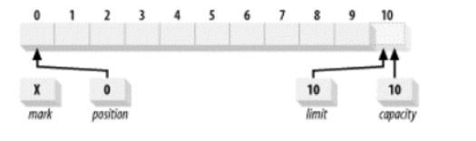
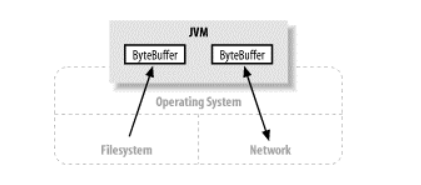
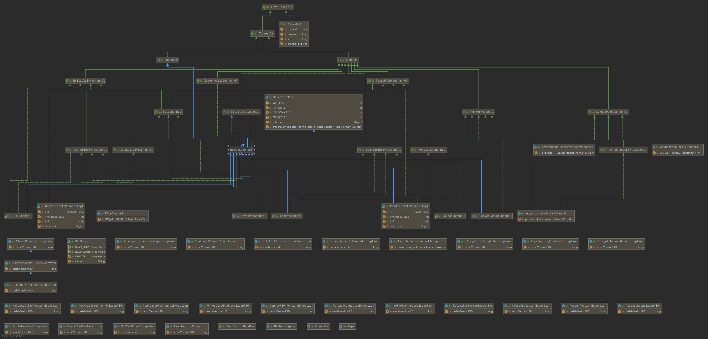

# NIO基础知识

## Buffer
#### 以下是Java NIO里关键的Buffer实现

* ByteBuffer
* CharBuffer
* DoubleBuffer
* FloatBuffer
* IntBuffer
* LongBuffer
* ShortBuffer
* MappedByteBuffer -> ByteBuffer

#### Buffer的属性

###### capacity 容量

缓冲区能够容纳的数据元素的最大数量;作为一个内存块，Buffer有一个固定的大小值，也叫“capacity”.你只能往里写capacity个byte、long，char等类型。
一旦Buffer满了，需要将其清空（通过读数据或者清除数据）才能继续写数据往里写数据。这一容量在缓冲区创建时被设定，并且永远不能被改变

###### position 位置

下一个要被读或写的元素的索引。位置会自动由相应的 get( )和 put( )函数更新。

当你写数据到Buffer中时，position表示当前的位置。初始的position值为0.当一个byte、long等数据写到Buffer后， position会向前移动到下一个可插入数据的Buffer单元。position最大可为capacity – 1.

当读取数据时，也是从某个特定位置读。当将Buffer从写模式切换到读模式，position会被重置为0. 当从Buffer的position处读取数据时，position向前移动到下一个可读的位置。

###### limit 上界

缓冲区的第一个不能被读或写的元素。或者说，缓冲区中现存元素的计数。

在写模式下，Buffer的limit表示你最多能往Buffer里写多少数据。 写模式下，limit等于Buffer的capacity。

当切换Buffer到读模式时， limit表示你最多能读到多少数据。因此，当切换Buffer到读模式时，limit会被设置成写模式下的position值。换句话说，你能读到之前写入的所有数据（limit被设置成已写数据的数量，这个值在写模式下就是position）

###### 三个属性的关系

position和limit的含义取决于Buffer处在读模式还是写模式。不管Buffer处在什么模式，capacity的含义总是一样的。

###### 新创建的 ByteBuffer

位置被设为 0，而且容量和上界被设为 10，刚好经过缓冲区能够容纳的最后一个字节。标记最初未定义。容量是固定的，但另外的三个属性可以在使用缓冲区时改变。

这里引出一个新的属性mark

###### mark 标记

一个备忘位置。调用 mark( )来设定 mark = postion。调用 reset( )设定 position =mark。标记在设定前是未定义的(undefined)。

这四个属性之间总是遵循以下关系：

    0 <= mark <= position <= limit <= capacity

## Channel 

通道（Channel）是 java.nio 的第二个主要创新。它们既不是一个扩展也不是一项增强，而是全新、极好的 Java I/O 示例，提供与 I/O 服务的直接连接。
Channel 用于在字节缓冲区和位于通道另一侧的实体（通常是一个文件或套接字）之间有效地传输数据。

多数情况下，通道与操作系统的文件描述符（File Descriptor）和文件句柄（File Handle）有着一对一的关系。虽然通道比文件描述符更广义，
但您将经常使用到的多数通道都是连接到开放的文件描述符的。Channel 类提供维持平台独立性所需的抽象过程，不过仍然会模拟现代操作系统本身的 I/O 性能。

通道是一种途径，借助该途径，可以用最小的总开销来访问操作系统本身的 I/O 服务。缓冲区则是通道内部用来发送和接收数据的端点。

#### Channel的实现

* FileChannel: 从文件中读写数据。
* DatagramChannel: 能通过UDP读写网络中的数据。
* SocketChannel: 能通过TCP读写网络中的数据。
* ServerSocketChannel: 可以监听新进来的TCP连接，像Web服务器那样。对每一个新进来的连接都会创建一个SocketChannel。

## Selector

#### 为什么使用Selector

从最基础的层面来看，选择器提供了询问通道是否已经准备好执行每个 I/0 操作的能力。例如，我们需要了解一个 SocketChannel 对象是否还有更多的字节需要读取，或者我们需要知道ServerSocketChannel 是否有需要准备接受的连接。

在与 SelectableChannel 联合使用时，选择器提供了这种服务，但这里面有更多的事情需要去了解。就绪选择的真正价值在于潜在的大量的通道可以同时进行就绪状态的检查。调用者可以轻松地决定多个通道中的哪一个准备好要运行。
有两种方式可以选择：被激发的线程可以处于休眠状态，直到一个或者多个注册到选择器的通道就绪，或者它也可以周期性地轮询选择器，看看从上次检查之后，是否有通道处于就绪状态。
如果您考虑一下需要管理大量并发的连接的网络服务器(webserver)的实现，就可以很容易地想到如何善加利用这些能力。

乍一看，好像只要非阻塞模式就可以模拟就绪检查功能，但实际上还不够。非阻塞模式同时还会执行您请求的任务，或指出它无法执行这项任务。这与检查它是否能够执行某种类型的操作是不同的。
举个例子，如果您试图执行非阻塞操作，并且也执行成功了，您将不仅仅发现 read( )是可以执行的，同时您也已经读入了一些数据。就下来您就需要处理这些数据了。

效率上的要求使得您不能将检查就绪的代码和处理数据的代码分离开来，至少这么做会很复杂。

即使简单地询问每个通道是否已经就绪的方法是可行的，在您的代码或一个类库的包里的某些代码需要遍历每一个候选的通道并按顺序进行检查的时候，仍然是有问题的。
这会使得在检查每个通道是否就绪时都至少进行一次系统调用，这种代价是十分昂贵的，但是主要的问题是，这种检查不是原子性的。
列表中的一个通道都有可能在它被检查之后就绪，但直到下一次轮询为止，您并不会觉察到这种情况。最糟糕的是，您除了不断地遍历列表之外将别无选择。您无法在某个您感兴趣的通道就绪时得到通知。

这就是为什么传统的监控多个 socket 的 Java 解决方案是为每个 socket 创建一个线程并使得线程可以在 read( )调用中阻塞，直到数据可用。这事实上将每个被阻塞的线程当作了 socket 监控器，并将 Java 虚拟机的线程调度当作了通知机制。
这两者本来都不是为了这种目的而设计的。程序员和 Java 虚拟机都为管理所有这些线程的复杂性和性能损耗付出了代价，这在线程数量的增长失控时表现得更为突出。

真正的就绪选择必须由操作系统来做。操作系统的一项最重要的功能就是处理 I/O 请求并通知各个线程它们的数据已经准备好了。选择器类提供了这种抽象，使得 Java 代码能够以可移植的方式，请求底层的操作系统提供就绪选择服务。

仅用单个线程来处理多个Channels的好处是，只需要更少的线程来处理通道。事实上，可以只用一个线程处理所有的通道。对于操作系统来说，线程之间上下文切换的开销很大，而且每个线程都要占用系统的一些资源（如内存）。因此，使用的线程越少越好。

但是，需要记住，现代的操作系统和CPU在多任务方面表现的越来越好，所以多线程的开销随着时间的推移，变得越来越小了。实际上，如果一个CPU有多个内核，不使用多任务可能是在浪费CPU能力。不管怎么说，关于那种设计的讨论应该放在另一篇不同的文章中。在这里，只要知道使用Selector能够处理多个通道就足够了。

#### 1

通道在被注册到一个选择器上之前，必须先设置为非阻塞模式（通过调用 configureBlocking(false)）。

调用可选择通道的 register( )方法会将它注册到一个选择器上。如果您试图注册一个处于阻塞状态的通道，register( )将抛出未检查的 IllegalBlockingModeException 异常。
此外，通道一旦被注册，就不能回到阻塞状态。试图这么做的话，将在调用 configureBlocking( )方法时将抛出IllegalBlockingModeException 异常。

    选择器才是提供管理功能的对象，而不是可选择通道对象。选择器对象对注册到它之上的通道执行就绪选择，并管理选择键。、
    
## Pipe

Java NIO 管道是2个线程之间的单向数据连接。Pipe有一个source通道和一个sink通道。数据会被写到sink通道，从source通道读取。

这里是Pipe原理的图示：

## Path

Path接口是java NIO2的一部分。首次在java 7中引入。Path接口在java.nio.file包下，所以全称是java.nio.file.Path。 java中的Path表示文件系统的路径。可以指向文件或文件夹。也有相对路径和绝对路径之分。绝对路径表示从文件系统的根路径到文件或是文件夹的路径。相对路径表示从特定路径下访问指定文件或文件夹的路径。相对路径的概念可能有点迷糊。不用担心，我将在本文的后面详细介绍相关细节。

不要将文件系统的path和操作系统的环境变量path搞混淆。java.nio.file.Path接口和操作系统的path环境变量没有任何关系。

在很多方面，java.nio.file.Path接口和java.io.File有相似性，但也有一些细微的差别。在很多情况下，可以用Path来代替File类。

## Files

java NIO Files类(java.nio.file.Files) 提供了操作文件的相关方法。本篇文章将会覆盖大多数常用的方法。Files类包含了很多方法，如果你需要的功能在文中没有提及，需要自己查阅JavaDoc文档确认，也许Files类提供了相应方法(译者注：但本文中没有涉及)

java.nio.file.Files类需要和java.nio.file.Path一起使用，在学习Files类前，你需要掌握Path类的相关用法。

