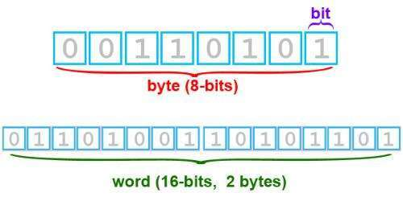

# 字、字符、字节

## 术语

* 位: (bit)数据存储的最小单位。每个二进制数字0或者1就是1个位;
* 字节: (byte)简写 B或b;8个位构成一个字节;即:1 byte (字节)= 8 bit(位);

     1 KB = 1024 B(字节)

* 字符: 2、a、A、中、+、*、の......等计算机中使用的字母、数字、字和符号都表示一个字符;

   * 一般 utf-8 编码下，一个汉字 字符 占用 3 个 字节；
   * 一般 gbk 编码下，一个汉字  字符  占用 2 个 字节；

## 图文

